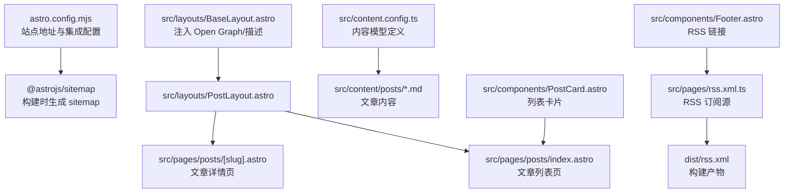
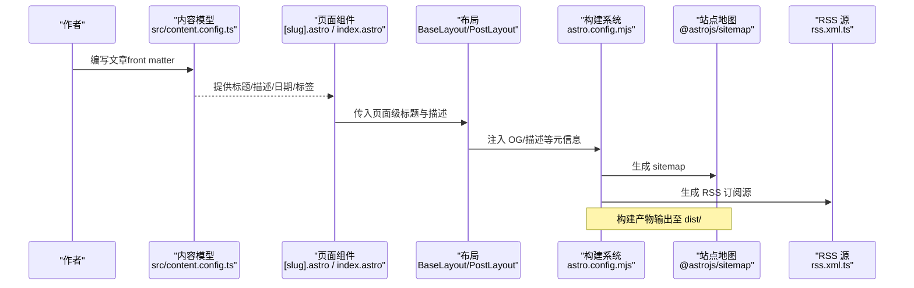
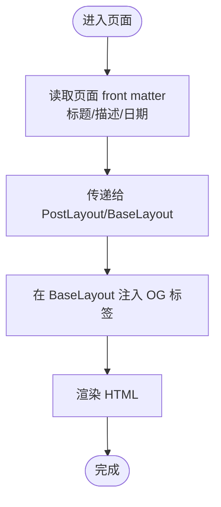
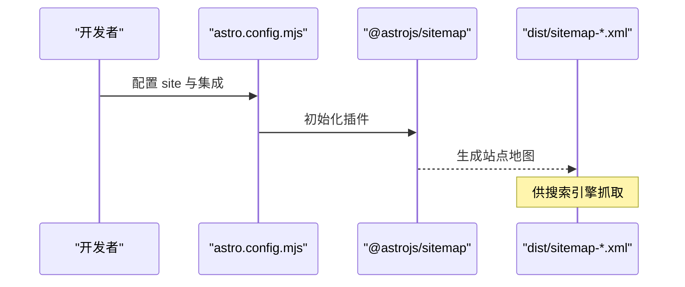
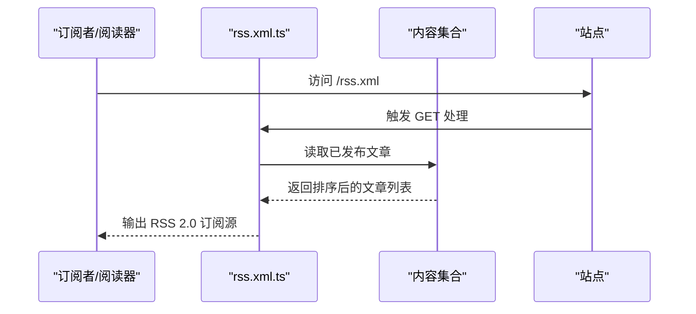
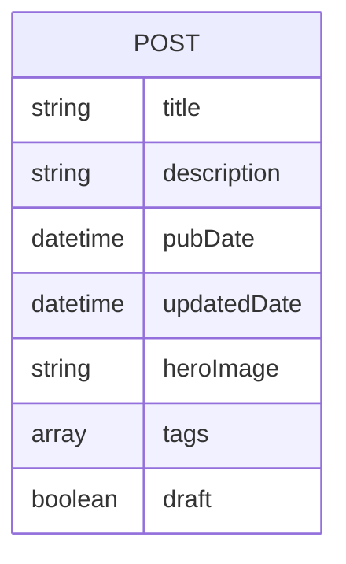
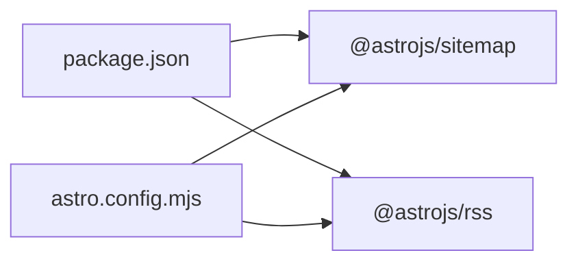

# SEO 优化

<cite>
**本文引用的文件**
- [astro.config.mjs](file://astro.config.mjs)
- [package.json](file://package.json)
- [src/layouts/BaseLayout.astro](file://src/layouts/BaseLayout.astro)
- [src/layouts/PostLayout.astro](file://src/layouts/PostLayout.astro)
- [src/pages/rss.xml.ts](file://src/pages/rss.xml.ts)
- [src/pages/posts/[slug].astro](file://src/pages/posts/[slug].astro)
- [src/pages/posts/index.astro](file://src/pages/posts/index.astro)
- [src/content.config.ts](file://src/content.config.ts)
- [src/content/posts/welcome.md](file://src/content/posts/welcome.md)
- [src/components/PostCard.astro](file://src/components/PostCard.astro)
- [src/components/Footer.astro](file://src/components/Footer.astro)
- [README.md](file://README.md)
</cite>

## 目录
1. [简介](#简介)
2. [项目结构](#项目结构)
3. [核心组件](#核心组件)
4. [架构总览](#架构总览)
5. [详细组件分析](#详细组件分析)
6. [依赖关系分析](#依赖关系分析)
7. [性能考量](#性能考量)
8. [故障排查指南](#故障排查指南)
9. [结论](#结论)
10. [附录](#附录)

## 简介
本文件面向内容创作者与运维人员，系统性梳理 chnanxu 博客的 SEO 优化现状与可扩展方向。当前实现覆盖基础元数据（Open Graph、描述）、自动生成站点地图、RSS 订阅源，以及内容模型对 SEO 友好字段的支持。本文在不直接展示代码的前提下，通过路径定位与图示帮助读者理解各模块职责、数据流与最佳实践。

## 项目结构
博客采用 Astro 静态站点生成器，内容以 Markdown 编写并通过内容集合进行管理；页面通过 Astro 组件组合，布局层负责注入通用 SEO 元信息；RSS 与站点地图由集成插件在构建阶段生成。

图表来源
- [astro.config.mjs:1-12](file://astro.config.mjs#L1-L12)
- [src/pages/rss.xml.ts:1-24](file://src/pages/rss.xml.ts#L1-L24)
- [src/content.config.ts:1-18](file://src/content.config.ts#L1-L18)
- [src/layouts/BaseLayout.astro:1-53](file://src/layouts/BaseLayout.astro#L1-L53)
- [src/layouts/PostLayout.astro:1-36](file://src/layouts/PostLayout.astro#L1-L36)
- [src/pages/posts/[slug].astro:1-116](file://src/pages/posts/[slug].astro#L1-L116)
- [src/pages/posts/index.astro:1-94](file://src/pages/posts/index.astro#L1-L94)
- [src/components/PostCard.astro:1-38](file://src/components/PostCard.astro#L1-L38)
- [src/components/Footer.astro:1-64](file://src/components/Footer.astro#L1-L64)

章节来源
- [astro.config.mjs:1-12](file://astro.config.mjs#L1-L12)
- [package.json:1-22](file://package.json#L1-L22)
- [README.md:1-59](file://README.md#L1-L59)

## 核心组件
- 基础布局与元信息：在基础布局中统一注入 Open Graph 标签与页面描述，确保所有页面具备一致的基础 SEO 元数据。
- 内容模型：内容集合对标题、描述、发布时间、更新时间、封面图、标签、草稿状态等字段进行约束，便于后续扩展结构化数据与社交分享。
- 列表与详情：文章列表与详情页分别传递标题与描述给布局，保证每页的 OG 标题与描述来自内容数据。
- RSS 订阅：通过 RSS 插件生成订阅源，支持聚合平台与阅读器接入。
- 站点地图：通过站点地图插件在构建阶段生成 sitemap，提升搜索引擎收录效率。

章节来源
- [src/layouts/BaseLayout.astro:1-53](file://src/layouts/BaseLayout.astro#L1-L53)
- [src/content.config.ts:1-18](file://src/content.config.ts#L1-L18)
- [src/pages/posts/[slug].astro:1-116](file://src/pages/posts/[slug].astro#L1-L116)
- [src/pages/posts/index.astro:1-94](file://src/pages/posts/index.astro#L1-L94)
- [src/pages/rss.xml.ts:1-24](file://src/pages/rss.xml.ts#L1-L24)
- [astro.config.mjs:1-12](file://astro.config.mjs#L1-L12)

## 架构总览
下图展示了从内容到页面再到搜索引擎与订阅源的整体流程。

图表来源
- [src/content.config.ts:1-18](file://src/content.config.ts#L1-L18)
- [src/pages/posts/[slug].astro:1-116](file://src/pages/posts/[slug].astro#L1-L116)
- [src/pages/posts/index.astro:1-94](file://src/pages/posts/index.astro#L1-L94)
- [src/layouts/BaseLayout.astro:1-53](file://src/layouts/BaseLayout.astro#L1-L53)
- [astro.config.mjs:1-12](file://astro.config.mjs#L1-L12)
- [src/pages/rss.xml.ts:1-24](file://src/pages/rss.xml.ts#L1-L24)

## 详细组件分析

### Open Graph 元数据配置与使用
- 基础布局注入：基础布局统一注入页面标题与描述，并设置网站类型等 OG 字段，确保所有页面具备一致的社交分享与索引元信息。
- 页面级覆盖：文章详情页与列表页分别将内容中的标题与描述传递给布局，使 OG 标题与描述随页面内容动态变化。
- 建议增强：可在详情页补充 og:image 与 article:published_time 等字段，进一步提升社交分享与新闻类索引体验。

图表来源
- [src/pages/posts/[slug].astro:1-116](file://src/pages/posts/[slug].astro#L1-L116)
- [src/pages/posts/index.astro:1-94](file://src/pages/posts/index.astro#L1-L94)
- [src/layouts/BaseLayout.astro:1-53](file://src/layouts/BaseLayout.astro#L1-L53)

章节来源
- [src/layouts/BaseLayout.astro:1-53](file://src/layouts/BaseLayout.astro#L1-L53)
- [src/pages/posts/[slug].astro:1-116](file://src/pages/posts/[slug].astro#L1-L116)
- [src/pages/posts/index.astro:1-94](file://src/pages/posts/index.astro#L1-L94)

### 自动站点地图生成
- 插件启用：在配置中启用站点地图插件，构建时自动生成 sitemap 并输出到 dist 目录。
- 站点地址：通过站点地址配置确保链接完整与规范。
- 使用建议：在生产环境部署后，向搜索引擎提交 sitemap，提高收录效率。

图表来源
- [astro.config.mjs:1-12](file://astro.config.mjs#L1-L12)

章节来源
- [astro.config.mjs:1-12](file://astro.config.mjs#L1-L12)
- [package.json:1-22](file://package.json#L1-L22)

### RSS 订阅源实现
- 数据来源：从内容集合中筛选已发布文章，按发布时间倒序生成条目。
- 输出格式：返回标准 RSS 2.0，包含语言等自定义数据。
- 访问入口：Footer 中提供 RSS 链接，便于用户订阅。

图表来源
- [src/pages/rss.xml.ts:1-24](file://src/pages/rss.xml.ts#L1-L24)
- [src/components/Footer.astro:1-64](file://src/components/Footer.astro#L1-L64)

章节来源
- [src/pages/rss.xml.ts:1-24](file://src/pages/rss.xml.ts#L1-L24)
- [src/components/Footer.astro:1-64](file://src/components/Footer.astro#L1-L64)

### 内容模型与 SEO 字段
- 字段覆盖：标题、描述、发布时间、更新时间、封面图、标签、草稿状态等字段均纳入内容模型，便于统一管理与扩展。
- 建议扩展：在详情页利用封面图与发布时间完善 OG 图片与 article:* 结构化数据，提升社交分享与搜索摘要质量。

图表来源
- [src/content.config.ts:1-18](file://src/content.config.ts#L1-L18)
- [.astro/collections/posts.schema.json](file://.astro/collections/posts.schema.json)

章节来源
- [src/content.config.ts:1-18](file://src/content.config.ts#L1-L18)
- [src/content/posts/welcome.md:1-53](file://src/content/posts/welcome.md#L1-L53)

### 社交媒体分享与外部链接
- Footer 提供 RSS 链接，便于订阅。
- OG 标签已在基础布局中注入，可配合具体页面的图片与时间戳进一步优化分享效果。
- 建议：在详情页补充 og:image 与 article:* 字段，提升社交平台预览质量。

章节来源
- [src/components/Footer.astro:1-64](file://src/components/Footer.astro#L1-L64)
- [src/layouts/BaseLayout.astro:1-53](file://src/layouts/BaseLayout.astro#L1-L53)

### 结构化数据与搜索引擎抓取优化
- 当前实现：基础 OG 标签与站点地图已满足基本需求。
- 建议增强：在文章详情页添加 JSON-LD 结构化数据（如 Article），包含主要实体（作者、发布日期、图片、关键词）以提升搜索摘要与富媒体展示机会。
- 抓取优化：确保站点地图可被搜索引擎发现，定期检查 robots.txt 与 meta robots 设置，避免误屏蔽重要页面。

章节来源
- [astro.config.mjs:1-12](file://astro.config.mjs#L1-L12)
- [src/layouts/BaseLayout.astro:1-53](file://src/layouts/BaseLayout.astro#L1-L53)

## 依赖关系分析
- 构建期依赖：站点地图与 RSS 插件在构建阶段工作，不引入运行时开销。
- 运行时依赖：基础布局在运行时注入元信息，无额外第三方脚本。
- 版本与生态：依赖版本稳定，建议关注 Astro 与插件的更新节奏，保持兼容性。

图表来源
- [package.json:1-22](file://package.json#L1-L22)
- [astro.config.mjs:1-12](file://astro.config.mjs#L1-L12)

章节来源
- [package.json:1-22](file://package.json#L1-L22)
- [astro.config.mjs:1-12](file://astro.config.mjs#L1-L12)

## 性能考量
- 零运行时 JS：基础布局仅注入少量内联脚本用于主题初始化，避免影响首屏渲染。
- 资源内联策略：构建配置中启用了样式内联策略，有助于减少请求数量。
- 建议：对图片进行压缩与懒加载；合理使用骨架屏或占位符提升感知性能。

章节来源
- [src/layouts/BaseLayout.astro:1-53](file://src/layouts/BaseLayout.astro#L1-L53)
- [astro.config.mjs:1-12](file://astro.config.mjs#L1-L12)

## 故障排查指南
- RSS 订阅源为空
  - 检查文章是否标记为草稿；草稿不会出现在 RSS 条目中。
  - 确认文章的发布时间与排序逻辑符合预期。
- 站点地图未生成
  - 确认站点地址配置正确且插件已启用。
  - 检查构建日志是否存在错误。
- OG 图片未显示
  - 在详情页补充 og:image 字段，并确保图片可公开访问。
  - 使用社交调试工具验证 OG 标签渲染。

章节来源
- [src/pages/rss.xml.ts:1-24](file://src/pages/rss.xml.ts#L1-L24)
- [astro.config.mjs:1-12](file://astro.config.mjs#L1-L12)
- [src/layouts/BaseLayout.astro:1-53](file://src/layouts/BaseLayout.astro#L1-L53)

## 结论
当前博客已具备完善的 SEO 基线能力：统一的 OG 元信息、站点地图与 RSS 订阅源。建议在文章详情页补充结构化数据与 OG 图片，持续优化内容质量与技术细节，以获得更佳的搜索引擎与社交平台表现。

## 附录

### SEO 最佳实践清单
- 内容层面
  - 标题与描述：简洁明确、包含关键词、避免堆砌。
  - 正文结构：使用语义化标题层级，段落清晰，内链合理。
  - 关键词密度：自然融入，避免过度优化。
- 技术层面
  - 加载速度：压缩图片、启用懒加载、减少第三方脚本。
  - 移动适配：响应式设计，触摸交互友好。
  - 结构化数据：补充 JSON-LD，提升摘要与富媒体展示。
- 发布与维护
  - 定期更新：保持内容新鲜度与权威性。
  - 监控反馈：关注搜索引擎控制台与分析工具报告。

### 写作指导（面向内容创作者）
- 文章模板字段：标题、描述、发布时间、更新时间、封面图、标签、草稿状态。
- 写作建议：围绕目标关键词组织内容；使用短句与小标题；在合适位置插入相关内链；结尾引导互动或订阅。

章节来源
- [README.md:34-47](file://README.md#L34-L47)
- [src/content.config.ts:1-18](file://src/content.config.ts#L1-L18)
- [src/content/posts/welcome.md:1-53](file://src/content/posts/welcome.md#L1-L53)