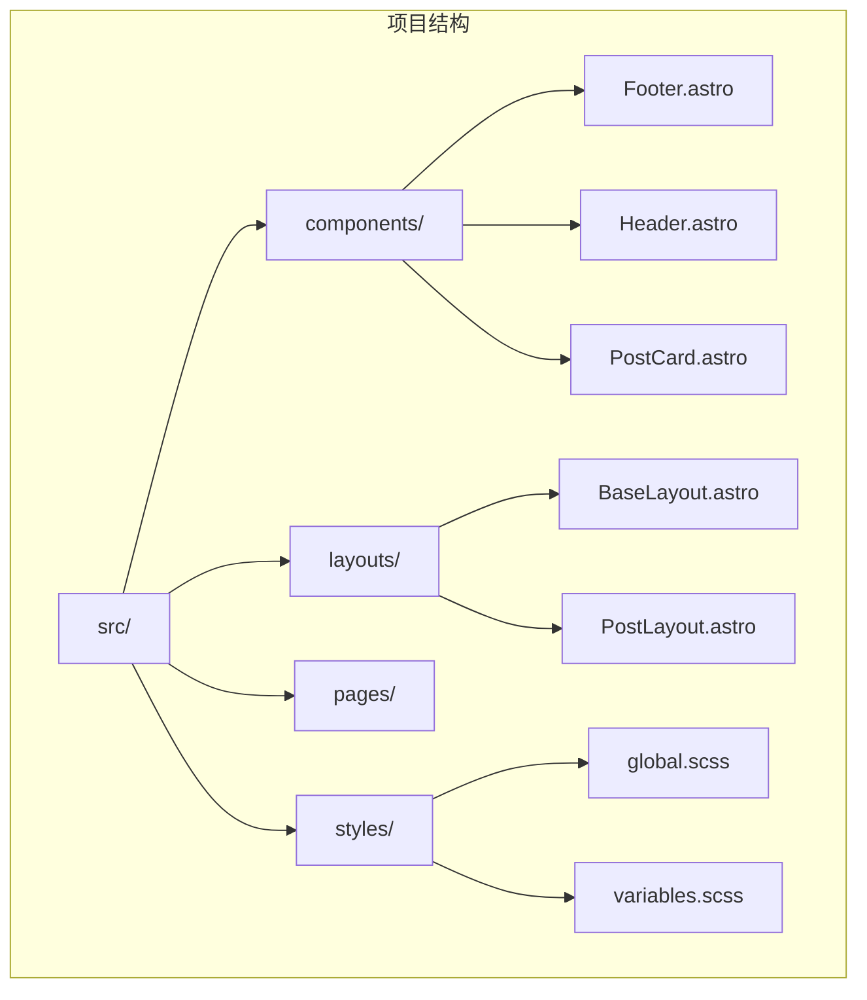
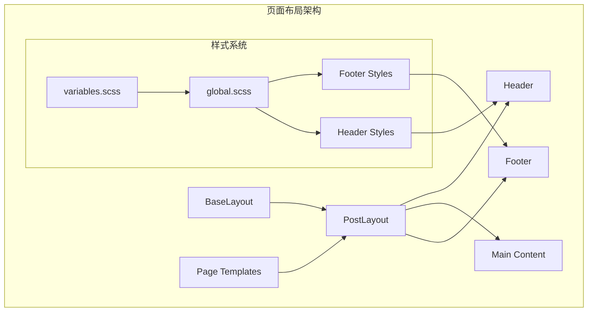
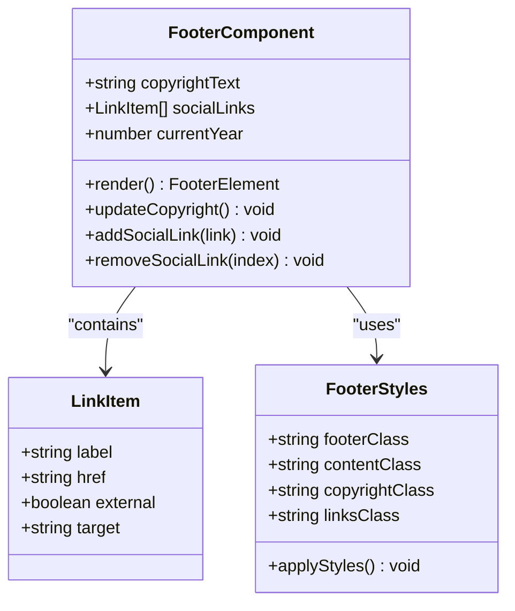
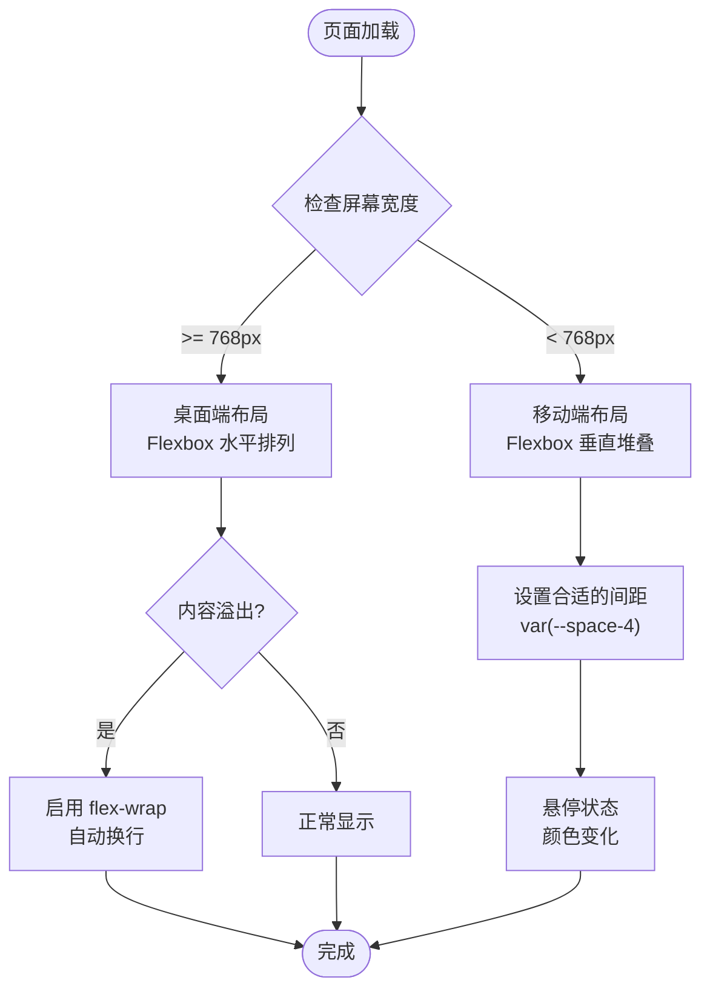
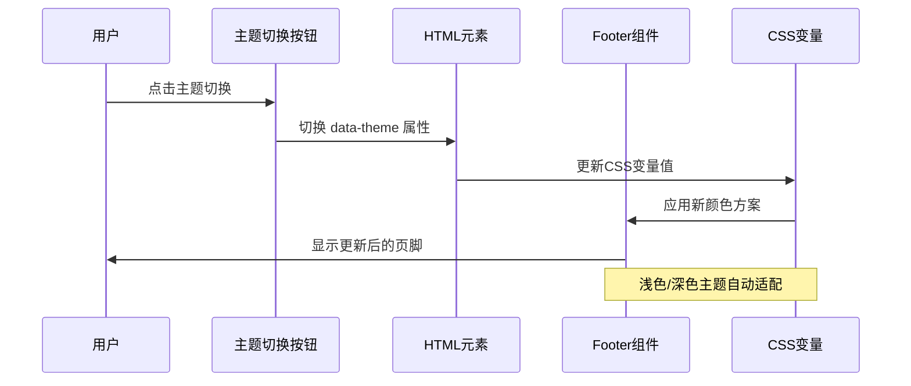
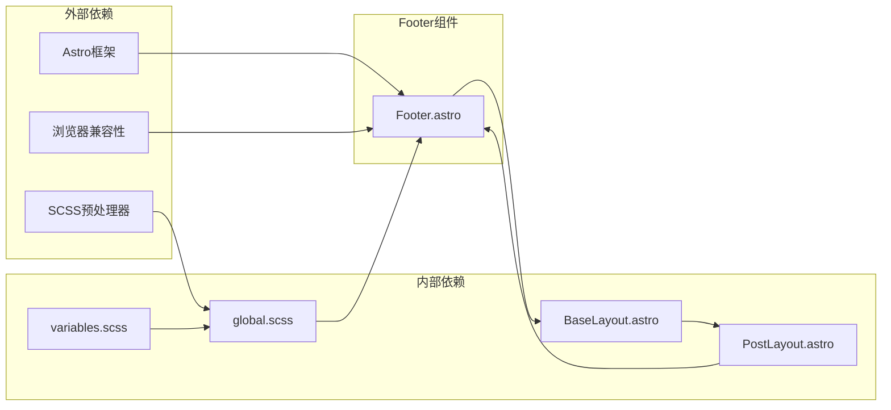

# Footer 页脚组件

<cite>
**本文档引用的文件**
- [Footer.astro](file://src/components/Footer.astro)
- [PostLayout.astro](file://src/layouts/PostLayout.astro)
- [BaseLayout.astro](file://src/layouts/BaseLayout.astro)
- [Header.astro](file://src/components/Header.astro)
- [global.scss](file://src/styles/global.scss)
- [variables.scss](file://src/styles/variables.scss)
- [index.astro](file://src/pages/index.astro)
- [about.astro](file://src/pages/about.astro)
- [package.json](file://package.json)
</cite>

## 目录
1. [简介](#简介)
2. [项目结构](#项目结构)
3. [核心组件](#核心组件)
4. [架构概览](#架构概览)
5. [详细组件分析](#详细组件分析)
6. [依赖关系分析](#依赖关系分析)
7. [性能考虑](#性能考虑)
8. [故障排除指南](#故障排除指南)
9. [结论](#结论)

## 简介

Footer 页脚组件是 chnanxu 博客网站的重要组成部分，负责展示版权信息、社交媒体链接和站点统计等元素。该组件采用 Astro 框架构建，具有响应式设计和主题适配能力，能够自动显示当前年份并提供美观的视觉效果。

## 项目结构

该项目采用基于功能模块的组织方式，Footer 组件位于 `src/components/` 目录下，与 Header 组件和 PostCard 组件并列。整个项目的布局系统由 BaseLayout 和 PostLayout 两个基础布局文件构成。

**图表来源**
- [Footer.astro:1-65](file://src/components/Footer.astro#L1-L65)
- [PostLayout.astro:1-35](file://src/layouts/PostLayout.astro#L1-L35)
- [BaseLayout.astro:1-53](file://src/layouts/BaseLayout.astro#L1-L53)

**章节来源**
- [Footer.astro:1-65](file://src/components/Footer.astro#L1-L65)
- [PostLayout.astro:1-35](file://src/layouts/PostLayout.astro#L1-L35)
- [BaseLayout.astro:1-53](file://src/layouts/BaseLayout.astro#L1-L53)

## 核心组件

Footer 组件的核心功能包括：
- **动态版权信息**：自动显示当前年份的版权声明
- **社交链接**：包含 GitHub 和 RSS 订阅链接
- **响应式布局**：适配不同屏幕尺寸的设备
- **主题适配**：支持浅色和深色主题切换
- **无障碍访问**：提供适当的语义化标记和可访问性属性

组件的主要结构包括：
- 页脚容器 `.footer` - 设置边框、内边距和外边距
- 内容容器 `.footer-content` - 使用 Flexbox 布局
- 版权信息 `.copyright` - 显示年份和版权声明
- 链接区域 `.footer-links` - 包含导航链接和分隔符

**章节来源**
- [Footer.astro:5-22](file://src/components/Footer.astro#L5-L22)
- [Footer.astro:24-64](file://src/components/Footer.astro#L24-L64)

## 架构概览

Footer 组件在整个网站架构中扮演着关键角色，它被集成在 PostLayout 布局中，确保所有页面都有一致的页脚体验。

**图表来源**
- [PostLayout.astro:14-22](file://src/layouts/PostLayout.astro#L14-L22)
- [Footer.astro:24-64](file://src/components/Footer.astro#L24-L64)
- [variables.scss:1-108](file://src/styles/variables.scss#L1-L108)

**章节来源**
- [PostLayout.astro:1-35](file://src/layouts/PostLayout.astro#L1-L35)
- [BaseLayout.astro:1-53](file://src/layouts/BaseLayout.astro#L1-L53)

## 详细组件分析

### 组件结构分析

Footer 组件采用了语义化的 HTML 结构，使用 `<footer>` 元素作为容器，内部包含内容容器和具体的布局元素。

**图表来源**
- [Footer.astro:1-65](file://src/components/Footer.astro#L1-L65)

### 样式系统分析

组件使用了 CSS 变量系统，确保与整体主题保持一致。主要样式特性包括：

- **Flexbox 布局**：`.footer-content` 使用 `display: flex` 实现水平排列
- **响应式设计**：`flex-wrap: wrap` 支持小屏幕设备
- **颜色系统**：使用 `var(--text-tertiary)` 和 `var(--border)` 变量
- **过渡动画**：`transition: color var(--transition-fast)` 提供平滑交互

### 响应式适配机制

**图表来源**
- [Footer.astro:31-37](file://src/components/Footer.astro#L31-L37)
- [Footer.astro:44-48](file://src/components/Footer.astro#L44-L48)

**章节来源**
- [Footer.astro:24-64](file://src/components/Footer.astro#L24-L64)
- [variables.scss:45-82](file://src/styles/variables.scss#L45-L82)

### 主题集成分析

Footer 组件与全局主题系统深度集成，支持动态主题切换：

**图表来源**
- [BaseLayout.astro:29-50](file://src/layouts/BaseLayout.astro#L29-L50)
- [Footer.astro:25-29](file://src/components/Footer.astro#L25-L29)

**章节来源**
- [BaseLayout.astro:29-50](file://src/layouts/BaseLayout.astro#L29-L50)
- [variables.scss:85-107](file://src/styles/variables.scss#L85-L107)

## 依赖关系分析

Footer 组件的依赖关系相对简单，主要依赖于全局样式系统和布局框架：

**图表来源**
- [Footer.astro:1-65](file://src/components/Footer.astro#L1-L65)
- [variables.scss:1-108](file://src/styles/variables.scss#L1-L108)
- [PostLayout.astro:1-35](file://src/layouts/PostLayout.astro#L1-L35)

**章节来源**
- [Footer.astro:1-65](file://src/components/Footer.astro#L1-L65)
- [PostLayout.astro:1-35](file://src/layouts/PostLayout.astro#L1-L35)
- [package.json:12-21](file://package.json#L12-L21)

## 性能考虑

Footer 组件在性能方面表现出色，主要体现在：

- **轻量级实现**：仅包含必要的 HTML 结构和 CSS 样式
- **无 JavaScript 依赖**：完全基于静态内容，无需运行时计算
- **CSS 变量优化**：使用 CSS 变量减少样式重绘
- **响应式性能**：Flexbox 布局在现代浏览器中渲染效率高

## 故障排除指南

### 常见问题及解决方案

**问题1：页脚不显示**
- 检查 PostLayout 是否正确导入 Footer 组件
- 确认 BaseLayout 中的 `<slot />` 标签存在
- 验证 CSS 文件是否正确加载

**问题2：样式不生效**
- 检查 CSS 变量定义是否正确
- 确认 SCSS 编译配置
- 验证浏览器兼容性

**问题3：主题切换异常**
- 检查 data-theme 属性设置
- 确认 CSS 变量覆盖规则
- 验证本地存储功能

**章节来源**
- [PostLayout.astro:14-22](file://src/layouts/PostLayout.astro#L14-L22)
- [BaseLayout.astro:29-50](file://src/layouts/BaseLayout.astro#L29-L50)

## 结论

Footer 页脚组件是一个设计精良、功能完整的组件，它成功地实现了以下目标：

1. **一致性**：与整个网站的设计语言保持高度一致
2. **响应式**：完美适配各种设备和屏幕尺寸
3. **可维护性**：简洁的代码结构便于后续维护和扩展
4. **性能**：高效的实现方式确保良好的用户体验

该组件为整个博客网站提供了稳固的基础，是用户界面设计中的重要组成部分。其模块化的设计使得未来添加新功能或进行样式定制变得非常容易。