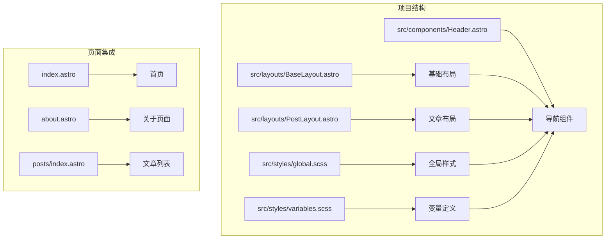
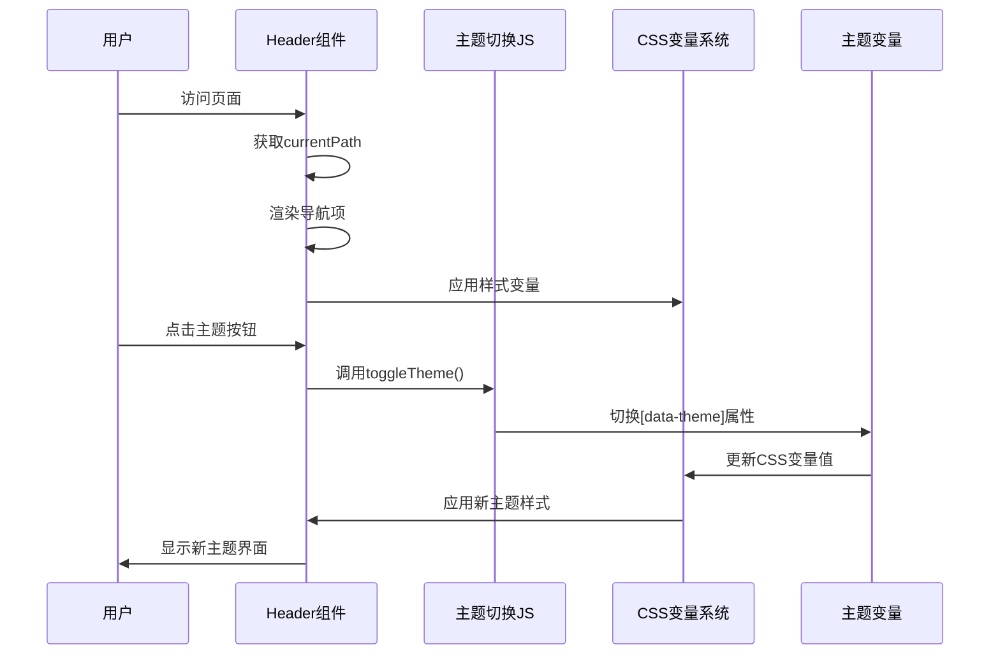
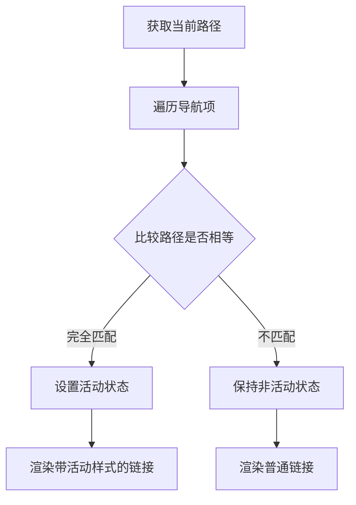
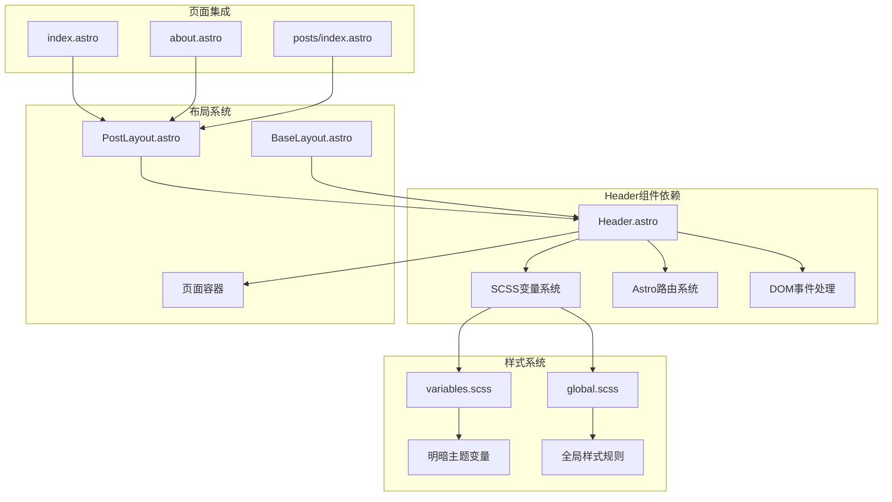

# Header 导航组件

<cite>
**本文档引用的文件**
- [Header.astro](file://src/components/Header.astro)
- [BaseLayout.astro](file://src/layouts/BaseLayout.astro)
- [PostLayout.astro](file://src/layouts/PostLayout.astro)
- [global.scss](file://src/styles/global.scss)
- [variables.scss](file://src/styles/variables.scss)
- [index.astro](file://src/pages/index.astro)
- [about.astro](file://src/pages/about.astro)
- [posts/index.astro](file://src/pages/posts/index.astro)
</cite>

## 目录
1. [简介](#简介)
2. [项目结构](#项目结构)
3. [核心组件](#核心组件)
4. [架构概览](#架构概览)
5. [详细组件分析](#详细组件分析)
6. [依赖关系分析](#依赖关系分析)
7. [性能考虑](#性能考虑)
8. [故障排除指南](#故障排除指南)
9. [结论](#结论)

## 简介

Header 导航组件是本项目中的核心界面元素，负责提供网站的主要导航功能和主题切换能力。该组件实现了动态导航菜单生成、当前页面高亮显示、主题切换按钮集成等关键功能，并采用现代化的设计系统和响应式布局。

组件基于 Astro 框架构建，使用 SCSS 变量系统实现主题化设计，支持明暗两种主题模式，并通过 CSS 自定义属性实现动态样式切换。

## 项目结构

Header 组件位于项目的组件目录中，与布局系统紧密集成：



**图表来源**
- [Header.astro:1-153](file://src/components/Header.astro#L1-L153)
- [BaseLayout.astro:1-53](file://src/layouts/BaseLayout.astro#L1-L53)
- [PostLayout.astro:1-36](file://src/layouts/PostLayout.astro#L1-L36)

**章节来源**
- [Header.astro:1-153](file://src/components/Header.astro#L1-L153)
- [PostLayout.astro:14-22](file://src/layouts/PostLayout.astro#L14-L22)

## 核心组件

Header 组件的核心功能包括：

### 导航菜单动态生成
组件通过静态数组定义导航项，使用 Astro 的模板语法进行动态渲染：

```javascript
const navItems = [
  { label: '首页', href: '/' },
  { label: '文章', href: '/posts' },
  { label: '关于', href: '/about' },
];
```

### 当前页面高亮显示
通过比较当前路径与导航项链接实现活动状态判断：

```javascript
const currentPath = Astro.url.pathname;
// 在渲染时使用条件类名
class:list={['nav-link', { active: currentPath === item.href }]}
```

### 主题切换按钮集成
集成了完整的主题切换功能，包括 SVG 图标和 JavaScript 逻辑：

```html
<button class="theme-toggle" onclick="toggleTheme()" aria-label="切换主题">
  <svg class="icon-sun">太阳图标</svg>
  <svg class="icon-moon">月亮图标</svg>
</button>
```

**章节来源**
- [Header.astro:2-6](file://src/components/Header.astro#L2-L6)
- [Header.astro:8](file://src/components/Header.astro#L8)
- [Header.astro:18-25](file://src/components/Header.astro#L18-L25)
- [Header.astro:28](file://src/components/Header.astro#L28)

## 架构概览

Header 组件在整个应用架构中的位置和交互关系：



**图表来源**
- [BaseLayout.astro:29-50](file://src/layouts/BaseLayout.astro#L29-L50)
- [Header.astro:47-152](file://src/components/Header.astro#L47-L152)

## 详细组件分析

### HTML 结构分析

Header 组件采用语义化的 HTML 结构：

```mermaid
flowchart TD
A[header.header] --> B[nav.nav.container]
B --> C[a.logo]
B --> D[div.nav-links]
B --> E[button.theme-toggle]
C --> F[a[href="/"] logo]
F --> G[span.logo-text]
D --> H[a.nav-link]*n
H --> I[活动状态判断]
E --> J[svg.icon-sun]
E --> K[svg.icon-moon]
```

**图表来源**
- [Header.astro:11-45](file://src/components/Header.astro#L11-L45)

### CSS 样式设计

组件使用了完整的 CSS 变量系统和现代设计原则：

#### 主题变量系统
- **品牌色彩**: `--primary`, `--primary-hover`, `--primary-soft`
- **文字层级**: `--text`, `--text-secondary`, `--text-tertiary`
- **背景层级**: `--bg`, `--bg-elevated`, `--bg-muted`
- **边框系统**: `--border`, `--border-muted`
- **圆角系统**: `--radius-sm` 到 `--radius-full`
- **间距系统**: `--space-1` 到 `--space-16`
- **字体系统**: `--font-xs` 到 `--font-4xl`
- **过渡动画**: `--transition-fast`, `--transition-normal`

#### 响应式设计
组件实现了移动端友好的响应式布局：

```scss
@media (max-width: 640px) {
  .nav-links {
    gap: var(--space-4);
  }
}
```

### 主题切换机制

#### SVG 图标实现
组件包含两个 SVG 图标，分别代表明暗主题：

**太阳图标 (icon-sun)**:
- 圆形太阳主体
- 八条辐射线
- 对称分布的线条

**月亮图标 (icon-moon)**:
- 新月形状路径
- 平滑的曲线设计

#### 主题切换逻辑
```mermaid
flowchart TD
A[用户点击主题按钮] --> B{检查当前主题}
B --> |当前为暗色| C[切换为明亮主题]
B --> |当前为明亮| D[切换为暗色主题]
C --> E[更新HTML属性data-theme="light"]
D --> F[更新HTML属性data-theme="dark"]
E --> G[保存到localStorage]
F --> G
G --> H[触发CSS变量更新]
H --> I[应用新主题样式]
```

**图表来源**
- [BaseLayout.astro:39-50](file://src/layouts/BaseLayout.astro#L39-L50)
- [Header.astro:138-145](file://src/components/Header.astro#L138-L145)

### 导航项数据结构

导航项采用简单而灵活的数据结构：

```javascript
{
  label: string,    // 显示文本
  href: string      // 链接地址
}
```

这种结构支持：
- 动态添加新导航项
- 灵活的路由配置
- 易于维护的配置管理

### 活动状态判断逻辑

组件使用精确的路径匹配来确定活动状态：



**图表来源**
- [Header.astro:8](file://src/components/Header.astro#L8)
- [Header.astro:21](file://src/components/Header.astro#L21)

**章节来源**
- [Header.astro:47-152](file://src/components/Header.astro#L47-L152)
- [variables.scss:5-107](file://src/styles/variables.scss#L5-L107)
- [BaseLayout.astro:29-50](file://src/layouts/BaseLayout.astro#L29-L50)

## 依赖关系分析

Header 组件与其他系统组件的依赖关系：



**图表来源**
- [Header.astro:1-153](file://src/components/Header.astro#L1-L153)
- [PostLayout.astro:14-22](file://src/layouts/PostLayout.astro#L14-L22)
- [BaseLayout.astro:29-50](file://src/layouts/BaseLayout.astro#L29-L50)

**章节来源**
- [PostLayout.astro:1-36](file://src/layouts/PostLayout.astro#L1-L36)
- [BaseLayout.astro:1-53](file://src/layouts/BaseLayout.astro#L1-L53)

## 性能考虑

### 渲染优化
- 使用静态导航项数组避免运行时计算
- 条件类名渲染减少不必要的 DOM 操作
- CSS 变量系统提供高效的样式切换

### 主题切换性能
- 本地存储缓存主题偏好
- CSS 变量切换比重绘更高效
- 避免闪烁的初始化脚本

### 响应式性能
- 移动端专用样式规则
- 合理的媒体查询使用
- 触发器尺寸优化

## 故障排除指南

### 导航项不显示
**问题**: 新添加的导航项没有出现在页面上
**解决方案**:
1. 检查导航项数组格式是否正确
2. 确认 href 属性值是否有效
3. 验证组件导入是否正确

### 活动状态不正确
**问题**: 当前页面没有正确高亮
**解决方案**:
1. 检查当前路径获取是否正确
2. 确认路径比较逻辑
3. 验证 CSS 类名拼写

### 主题切换失效
**问题**: 点击主题按钮无反应
**解决方案**:
1. 检查 toggleTheme 函数是否正确暴露到全局
2. 确认 data-theme 属性更新逻辑
3. 验证 localStorage 存储功能

**章节来源**
- [Header.astro:28](file://src/components/Header.astro#L28)
- [BaseLayout.astro:49](file://src/layouts/BaseLayout.astro#L49)

## 结论

Header 导航组件是一个设计精良、功能完整的界面组件，具有以下特点：

### 优势
- **模块化设计**: 清晰的组件边界和职责分离
- **主题友好**: 完整的明暗主题支持和优雅的切换效果
- **响应式布局**: 适配各种设备尺寸的布局设计
- **性能优化**: 高效的渲染和主题切换机制
- **可扩展性**: 灵活的配置接口和样式定制能力

### 最佳实践
- 使用统一的变量系统确保设计一致性
- 保持导航项配置的简洁性和可维护性
- 利用 CSS 变量实现主题化的样式设计
- 注重用户体验的细节优化

该组件为整个应用提供了稳定的基础导航体验，是现代静态站点开发的优秀范例。