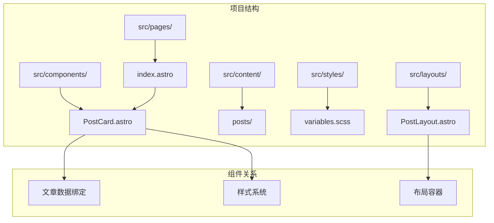
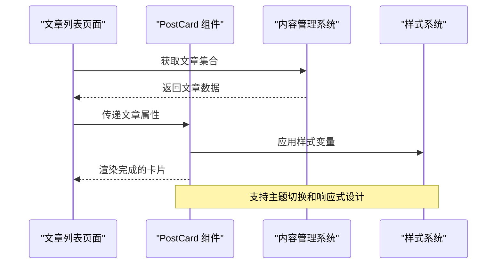
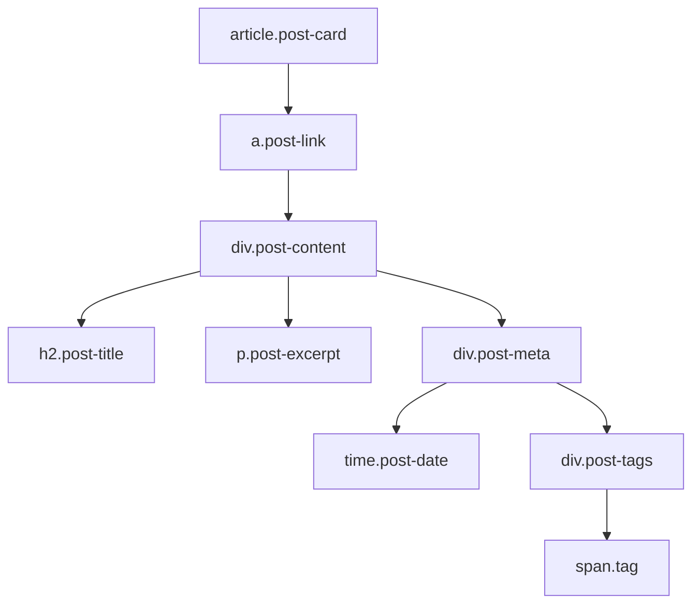
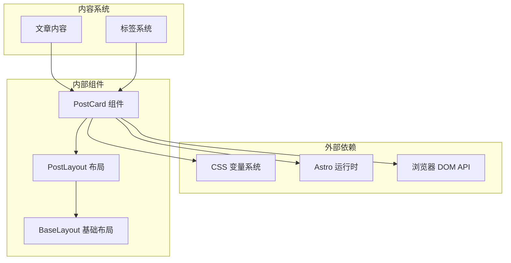

# PostCard 文章卡片组件

<cite>
**本文档引用的文件**
- [PostCard.astro](file://src/components/PostCard.astro)
- [index.astro](file://src/pages/posts/index.astro)
- [welcome.md](file://src/content/posts/welcome.md)
- [variables.scss](file://src/styles/variables.scss)
- [global.scss](file://src/styles/global.scss)
- [PostLayout.astro](file://src/layouts/PostLayout.astro)
- [BaseLayout.astro](file://src/layouts/BaseLayout.astro)
- [index.astro](file://src/pages/index.astro)
</cite>

## 目录
1. [简介](#简介)
2. [项目结构](#项目结构)
3. [核心组件](#核心组件)
4. [架构概览](#架构概览)
5. [详细组件分析](#详细组件分析)
6. [依赖关系分析](#依赖关系分析)
7. [性能考虑](#性能考虑)
8. [故障排除指南](#故障排除指南)
9. [结论](#结论)

## 简介

PostCard 是一个基于 Astro 架构的现代化文章卡片组件，专门用于展示博客文章的摘要信息。该组件提供了优雅的视觉设计，包括圆角边框、阴影效果、悬停动画以及响应式布局，能够完美适配各种设备尺寸。

组件支持完整的文章信息展示，包括标题、摘要、发布时间和标签系统，并且具备良好的可扩展性和可定制性。通过类型安全的接口设计，确保了开发时的类型安全和运行时的稳定性。

## 项目结构

PostCard 组件位于项目的组件目录中，采用 Astro 的单文件组件格式，集成了 TypeScript 接口定义、模板逻辑和样式代码。



**图表来源**
- [PostCard.astro:1-113](file://src/components/PostCard.astro#L1-L113)
- [index.astro:1-110](file://src/pages/index.astro#L1-L110)

**章节来源**
- [PostCard.astro:1-113](file://src/components/PostCard.astro#L1-L113)
- [index.astro:1-110](file://src/pages/index.astro#L1-L110)

## 核心组件

PostCard 组件的核心功能围绕文章信息的展示而设计，具有以下关键特性：

### 数据接口设计

组件通过 TypeScript 接口定义了严格的数据契约，确保了类型安全和开发体验：

```typescript
interface Props {
  title: string;
  description: string;
  pubDate: Date;
  slug: string;
  tags?: string[];
}
```

### 渲染结构

组件采用语义化的 HTML 结构，使用 article 元素作为容器，提供良好的可访问性支持：

- **文章容器**: `<article class="post-card">` - 主要的卡片容器
- **链接包装**: `<a href={`/posts/${slug}`} class="post-link">` - 整体点击区域
- **内容区域**: `<div class="post-content">` - 包含所有文章信息
- **标题**: `<h2 class="post-title">` - 文章标题
- **摘要**: `<p class="post-excerpt">` - 文章摘要，限制两行显示
- **元信息**: `<div class="post-meta">` - 发布时间和标签区域
- **日期**: `<time class="post-date">` - 发布时间
- **标签**: `<div class="post-tags">` - 标签容器

### 样式系统

组件使用 CSS 变量系统，实现了完整的主题支持和响应式设计：

- **圆角设计**: `border-radius: var(--radius-lg)` - 12px 圆角
- **阴影效果**: `box-shadow: var(--shadow-md)` - 中等阴影
- **过渡动画**: `transition: all var(--transition-fast)` - 150ms 缓动
- **悬停效果**: `transform: translateY(-2px)` - 向上轻微提升

**章节来源**
- [PostCard.astro:2-38](file://src/components/PostCard.astro#L2-L38)
- [PostCard.astro:40-112](file://src/components/PostCard.astro#L40-L112)

## 架构概览

PostCard 组件在整个应用架构中扮演着重要的角色，作为文章列表页面的核心展示组件。



**图表来源**
- [index.astro:6-43](file://src/pages/posts/index.astro#L6-L43)
- [PostCard.astro:10-38](file://src/components/PostCard.astro#L10-L38)

### 组件交互流程

PostCard 组件与外部系统的交互遵循以下流程：

1. **数据接收**: 通过 props 接收文章数据
2. **数据处理**: 格式化发布日期为本地化字符串
3. **渲染输出**: 生成完整的 HTML 结构
4. **样式应用**: 自动应用 CSS 变量和主题

**章节来源**
- [PostCard.astro:10-16](file://src/components/PostCard.astro#L10-L16)
- [index.astro:32-41](file://src/pages/posts/index.astro#L32-L41)

## 详细组件分析

### HTML 结构分析

PostCard 组件采用了语义化的 HTML 结构，每个元素都有明确的用途和语义化标记。

#### 主要结构层次



**图表来源**
- [PostCard.astro:19-38](file://src/components/PostCard.astro#L19-L38)

### CSS 样式系统

组件的样式系统基于 CSS 变量，实现了完整的主题支持和响应式设计。

#### 样式变量系统

组件使用了以下关键的 CSS 变量：

- **颜色系统**: `var(--primary)`, `var(--bg-elevated)`, `var(--text)`
- **圆角系统**: `var(--radius-lg) = 12px`
- **阴影系统**: `var(--shadow-md)`
- **间距系统**: `var(--space-4)`, `var(--space-5)`
- **字体系统**: `var(--font-sm)`, `var(--font-xl)`

#### 悬停效果实现

```mermaid
stateDiagram-v2
[*] --> Normal : 初始状态
Normal --> Hover : 鼠标悬停
Hover --> Normal : 移出鼠标
state Normal {
border : 1px solid var(--border)
background : var(--bg-elevated)
shadow : none
transform : none
}
state Hover {
border : 1px solid var(--primary-soft)
background : var(--bg-elevated)
shadow : var(--shadow-md)
transform : translateY(-2px)
}
```

**图表来源**
- [PostCard.astro:48-52](file://src/components/PostCard.astro#L48-L52)

### 数据绑定机制

PostCard 组件通过 Astro 的 props 系统实现数据绑定，支持类型安全的属性传递。

#### 属性解构

```typescript
const { title, description, pubDate, slug, tags = [] } = Astro.props;
```

#### 日期格式化

组件自动处理日期格式化，使用本地化设置显示友好的日期格式：

```javascript
const formattedDate = pubDate.toLocaleDateString('zh-CN', {
  year: 'numeric',
  month: 'long',
  day: 'numeric',
});
```

**章节来源**
- [PostCard.astro:10-16](file://src/components/PostCard.astro#L10-L16)
- [PostCard.astro:28-34](file://src/components/PostCard.astro#L28-L34)

### 标签系统实现

组件支持最多三个标签的显示，超出部分会被截断：

```mermaid
flowchart LR
A[文章标签数组] --> B[tags.slice(0, 3)]
B --> C[映射为标签元素]
C --> D[显示前三个标签]
```

**图表来源**
- [PostCard.astro:30-33](file://src/components/PostCard.astro#L30-L33)

**章节来源**
- [PostCard.astro:28-34](file://src/components/PostCard.astro#L28-L34)

## 依赖关系分析

PostCard 组件的依赖关系相对简单，主要依赖于样式变量系统和 Astro 的运行时环境。



**图表来源**
- [PostCard.astro:1-113](file://src/components/PostCard.astro#L1-L113)
- [variables.scss:1-108](file://src/styles/variables.scss#L1-L108)

### 样式依赖链

组件的样式依赖关系清晰明确：

1. **基础样式**: 继承自全局样式系统
2. **变量系统**: 使用 CSS 变量进行主题控制
3. **响应式设计**: 依赖容器和网格系统
4. **主题切换**: 支持暗色模式自动切换

**章节来源**
- [variables.scss:5-83](file://src/styles/variables.scss#L5-L83)
- [global.scss:1-222](file://src/styles/global.scss#L1-L222)

## 性能考虑

PostCard 组件在设计时充分考虑了性能优化，采用了多种策略来确保最佳的用户体验。

### 渲染性能优化

- **纯静态渲染**: 组件不包含任何客户端 JavaScript，完全由服务端渲染
- **最小化 DOM 结构**: 采用扁平化的 HTML 结构，减少 DOM 层级
- **高效的样式**: 使用 CSS 变量而非内联样式，提高样式计算效率

### 内容裁剪优化

组件对文章摘要进行了智能裁剪，限制为两行显示：

```css
-webkit-line-clamp: 2;
display: -webkit-box;
-webkit-box-orient: vertical;
overflow: hidden;
```

### 响应式性能

- **CSS Grid 布局**: 在首页使用 CSS Grid 实现高性能的响应式布局
- **媒体查询优化**: 仅在必要时使用媒体查询
- **图片优化**: 支持响应式图片加载

## 故障排除指南

### 常见问题及解决方案

#### 标签显示异常

**问题**: 标签数量超过三个时显示不完整
**解决方案**: 组件已内置标签截断逻辑，只显示前三个标签

#### 日期格式错误

**问题**: 发布日期显示格式不符合预期
**解决方案**: 组件使用本地化格式化，确保中文环境下正确显示

#### 样式不生效

**问题**: 组件样式未按预期显示
**解决方案**: 
1. 确认 CSS 变量系统正常工作
2. 检查主题切换是否正确
3. 验证容器宽度设置

#### 空值处理

**问题**: 当文章数据为空时组件显示异常
**解决方案**: 组件已内置空值保护，tags 属性默认为空数组

**章节来源**
- [PostCard.astro:28-34](file://src/components/PostCard.astro#L28-L34)
- [PostCard.astro:10](file://src/components/PostCard.astro#L10)

## 结论

PostCard 文章卡片组件是一个设计精良、功能完整的组件，具有以下突出特点：

### 设计优势

- **现代化视觉设计**: 圆角、阴影、悬停动画营造了优秀的视觉层次
- **响应式布局**: 完美适配各种设备尺寸，从移动设备到桌面端
- **主题兼容性**: 完整支持亮色和暗色主题自动切换
- **语义化结构**: 符合 Web 标准的 HTML 结构，具有良好可访问性

### 技术优势

- **类型安全**: 使用 TypeScript 接口确保编译时类型检查
- **性能优化**: 无客户端 JavaScript，纯静态渲染
- **可维护性**: 清晰的代码结构和模块化设计
- **扩展性**: 易于添加新功能和自定义样式

### 应用场景

PostCard 组件最适合用于：
- 博客文章列表页面
- 产品展示页面
- 新闻资讯列表
- 个人作品集展示

该组件为 Astro 生态系统提供了一个高质量的文章卡片解决方案，既满足了功能需求，又保持了优秀的性能表现和用户体验。