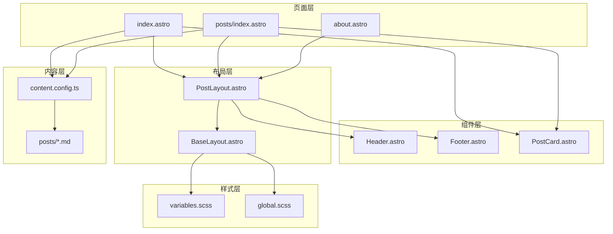
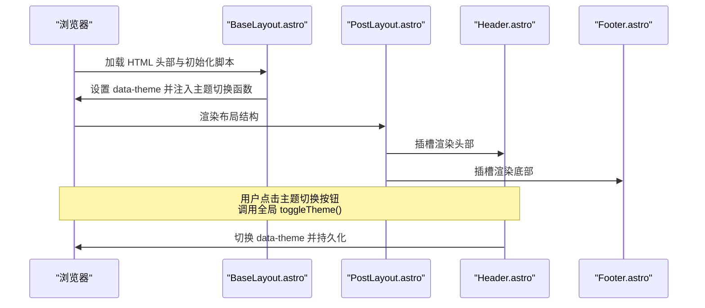
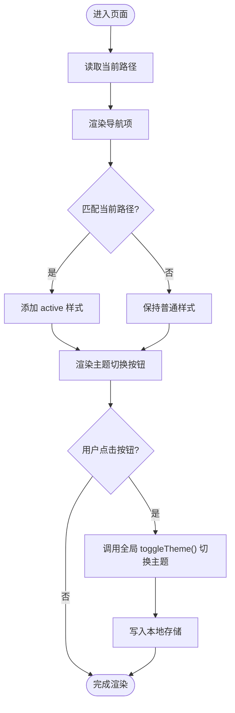
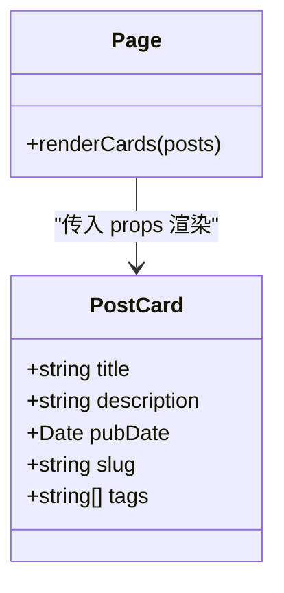
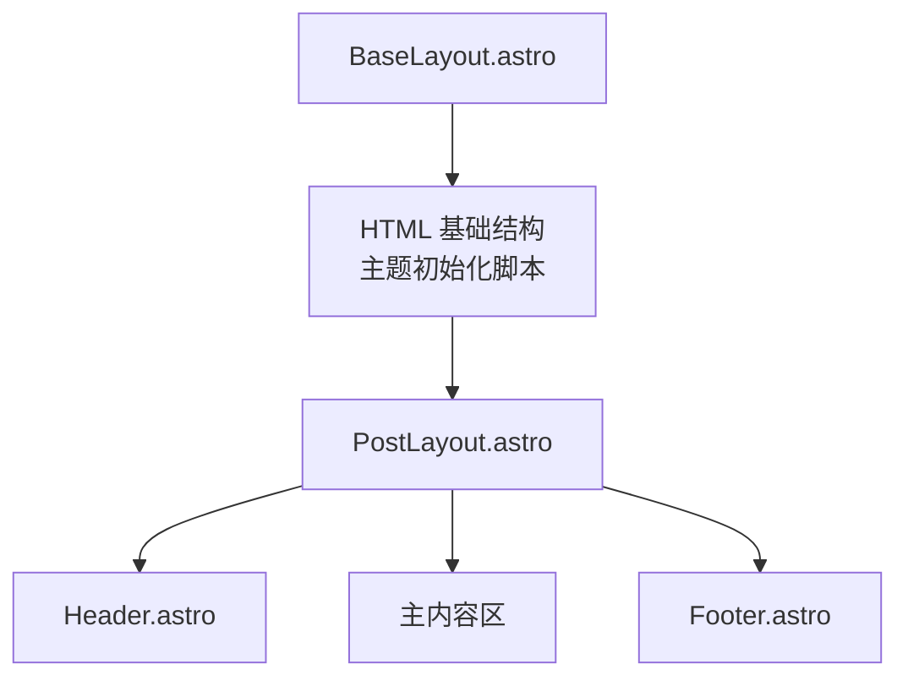
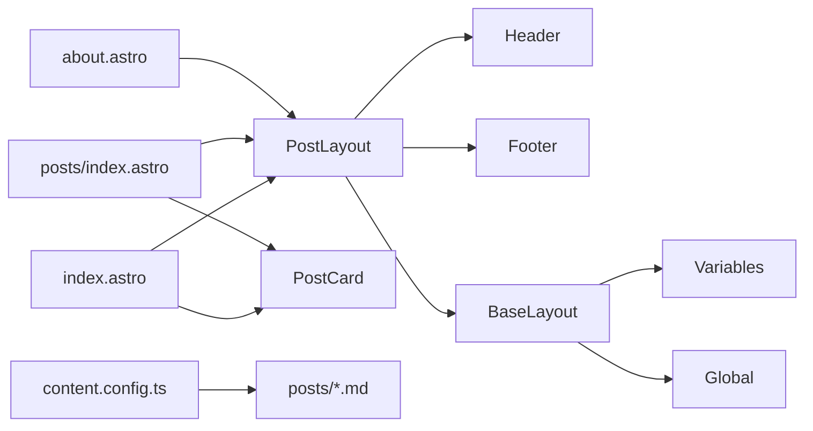

# UI 组件系统

<cite>
**本文引用的文件**
- [src/components/Header.astro](file://src/components/Header.astro)
- [src/components/Footer.astro](file://src/components/Footer.astro)
- [src/components/PostCard.astro](file://src/components/PostCard.astro)
- [src/layouts/BaseLayout.astro](file://src/layouts/BaseLayout.astro)
- [src/layouts/PostLayout.astro](file://src/layouts/PostLayout.astro)
- [src/styles/global.scss](file://src/styles/global.scss)
- [src/styles/variables.scss](file://src/styles/variables.scss)
- [src/pages/index.astro](file://src/pages/index.astro)
- [src/pages/posts/index.astro](file://src/pages/posts/index.astro)
- [src/pages/about.astro](file://src/pages/about.astro)
- [src/content.config.ts](file://src/content.config.ts)
- [package.json](file://package.json)
- [astro.config.mjs](file://astro.config.mjs)
</cite>

## 目录
1. [简介](#简介)
2. [项目结构](#项目结构)
3. [核心组件](#核心组件)
4. [架构总览](#架构总览)
5. [组件详细分析](#组件详细分析)
6. [依赖关系分析](#依赖关系分析)
7. [性能考量](#性能考量)
8. [故障排查指南](#故障排查指南)
9. [结论](#结论)
10. [附录](#附录)

## 简介
本文件系统性梳理 chnanxu 博客的 UI 组件化设计与实现，覆盖组件功能、属性、事件与使用方式；重点解析 Header 导航与主题切换、Footer 版权与链接、PostCard 文章卡片展示、以及布局组件对页面结构的组织。文档同时提供组件使用示例、自定义方法、组件间通信与数据传递机制、响应式设计与移动端适配策略，并为 UI 开发者提供扩展与定制指导。

## 项目结构
项目采用 Astro 静态站点框架，按“组件 + 布局 + 页面”的分层组织：
- 组件层：可复用 UI 片段，如 Header、Footer、PostCard
- 布局层：页面骨架与通用结构，如 BaseLayout、PostLayout
- 页面层：具体页面，如首页、文章列表页、关于页
- 样式层：全局样式与变量，统一主题与视觉规范
- 内容层：Markdown 内容集合，由 Astro 内容模块加载

图表来源
- [src/pages/index.astro](file://src/pages/index.astro)
- [src/pages/posts/index.astro](file://src/pages/posts/index.astro)
- [src/pages/about.astro](file://src/pages/about.astro)
- [src/layouts/PostLayout.astro](file://src/layouts/PostLayout.astro)
- [src/layouts/BaseLayout.astro](file://src/layouts/BaseLayout.astro)
- [src/components/Header.astro](file://src/components/Header.astro)
- [src/components/Footer.astro](file://src/components/Footer.astro)
- [src/components/PostCard.astro](file://src/components/PostCard.astro)
- [src/styles/variables.scss](file://src/styles/variables.scss)
- [src/styles/global.scss](file://src/styles/global.scss)
- [src/content.config.ts](file://src/content.config.ts)

章节来源
- [src/pages/index.astro](file://src/pages/index.astro)
- [src/pages/posts/index.astro](file://src/pages/posts/index.astro)
- [src/pages/about.astro](file://src/pages/about.astro)
- [src/layouts/PostLayout.astro](file://src/layouts/PostLayout.astro)
- [src/layouts/BaseLayout.astro](file://src/layouts/BaseLayout.astro)
- [src/styles/global.scss](file://src/styles/global.scss)
- [src/styles/variables.scss](file://src/styles/variables.scss)
- [src/content.config.ts](file://src/content.config.ts)

## 核心组件
- Header 组件：提供站点 Logo、主导航菜单与主题切换按钮，支持当前路径高亮与响应式布局
- Footer 组件：展示版权信息与外部链接（GitHub）、RSS 订阅入口
- PostCard 组件：以卡片形式展示文章标题、摘要、发布日期与标签，支持点击跳转详情
- 布局组件：BaseLayout 提供基础 HTML 结构与主题初始化脚本；PostLayout 组织 Header、主内容区与 Footer

章节来源
- [src/components/Header.astro](file://src/components/Header.astro)
- [src/components/Footer.astro](file://src/components/Footer.astro)
- [src/components/PostCard.astro](file://src/components/PostCard.astro)
- [src/layouts/BaseLayout.astro](file://src/layouts/BaseLayout.astro)
- [src/layouts/PostLayout.astro](file://src/layouts/PostLayout.astro)

## 架构总览
整体架构围绕“布局 + 组件 + 页面”展开，页面通过布局组合组件，组件之间通过 Astro 的 props 与 slot 实现数据传递与结构拼装。主题系统通过 data-theme 属性与本地存储协同工作，避免首屏闪烁。

图表来源
- [src/layouts/BaseLayout.astro](file://src/layouts/BaseLayout.astro)
- [src/layouts/PostLayout.astro](file://src/layouts/PostLayout.astro)
- [src/components/Header.astro](file://src/components/Header.astro)

## 组件详细分析

### Header 组件
- 功能
  - Logo 区域：指向站点首页
  - 导航菜单：包含“首页”“文章”“关于”，根据当前路径自动高亮
  - 主题切换按钮：支持明暗主题切换，图标随主题显示不同状态
- 属性
  - 无显式 props（导航项与当前路径在组件内计算）
- 事件
  - 主题切换：通过全局函数 toggleTheme 触发
- 使用方式
  - 在布局中直接引入组件，无需传入 props
- 响应式设计
  - 在窄屏下调整导航间距，保证可读性与可点触性

图表来源
- [src/components/Header.astro](file://src/components/Header.astro)
- [src/layouts/BaseLayout.astro](file://src/layouts/BaseLayout.astro)

章节来源
- [src/components/Header.astro](file://src/components/Header.astro)
- [src/layouts/BaseLayout.astro](file://src/layouts/BaseLayout.astro)

### Footer 组件
- 功能
  - 显示年份与版权信息
  - 提供 GitHub 外链与 RSS 链接
- 属性
  - 无显式 props（版权年份在组件内计算）
- 事件
  - 无交互事件
- 使用方式
  - 在布局中直接引入组件，无需传入 props
- 响应式设计
  - 内容区域支持换行与间距自适应

章节来源
- [src/components/Footer.astro](file://src/components/Footer.astro)

### PostCard 组件
- 功能
  - 展示文章标题、摘要、发布日期与标签
  - 点击卡片跳转至文章详情页
- 属性
  - title: 文章标题（字符串）
  - description: 文章摘要（字符串）
  - pubDate: 发布日期（Date）
  - slug: 文章标识（字符串，用于路由）
  - tags?: 标签数组（可选）
- 事件
  - 无交互事件（点击为导航行为）
- 使用方式
  - 在页面中通过 props 传入文章数据，渲染卡片列表
- 性能与可访问性
  - 使用 CSS 控制文本截断，避免长文本影响布局
  - 标签数量限制为前三个，提升列表密度

图表来源
- [src/components/PostCard.astro](file://src/components/PostCard.astro)
- [src/pages/index.astro](file://src/pages/index.astro)
- [src/pages/posts/index.astro](file://src/pages/posts/index.astro)

章节来源
- [src/components/PostCard.astro](file://src/components/PostCard.astro)
- [src/pages/index.astro](file://src/pages/index.astro)
- [src/pages/posts/index.astro](file://src/pages/posts/index.astro)

### 布局组件
- BaseLayout
  - 提供基础 HTML 结构、Open Graph 元信息、站点标题与描述
  - 内置主题初始化脚本，避免首屏闪烁
  - 注入全局 toggleTheme 函数，供 Header 组件调用
- PostLayout
  - 组织页面结构：Header、主内容区、Footer
  - 通过 slot 插槽承载页面内容
  - 提供容器与主内容区的样式基线

图表来源
- [src/layouts/BaseLayout.astro](file://src/layouts/BaseLayout.astro)
- [src/layouts/PostLayout.astro](file://src/layouts/PostLayout.astro)
- [src/components/Header.astro](file://src/components/Header.astro)
- [src/components/Footer.astro](file://src/components/Footer.astro)

章节来源
- [src/layouts/BaseLayout.astro](file://src/layouts/BaseLayout.astro)
- [src/layouts/PostLayout.astro](file://src/layouts/PostLayout.astro)

## 依赖关系分析
- 组件依赖
  - PostLayout 依赖 Header、Footer、BaseLayout
  - 页面依赖 PostLayout 与 PostCard
- 样式依赖
  - BaseLayout 引入全局样式与变量，确保主题系统生效
- 内容依赖
  - 页面通过 Astro 内容模块加载 Markdown 数据，传递给 PostCard

图表来源
- [src/pages/index.astro](file://src/pages/index.astro)
- [src/pages/posts/index.astro](file://src/pages/posts/index.astro)
- [src/pages/about.astro](file://src/pages/about.astro)
- [src/layouts/PostLayout.astro](file://src/layouts/PostLayout.astro)
- [src/layouts/BaseLayout.astro](file://src/layouts/BaseLayout.astro)
- [src/components/Header.astro](file://src/components/Header.astro)
- [src/components/Footer.astro](file://src/components/Footer.astro)
- [src/components/PostCard.astro](file://src/components/PostCard.astro)
- [src/styles/variables.scss](file://src/styles/variables.scss)
- [src/styles/global.scss](file://src/styles/global.scss)
- [src/content.config.ts](file://src/content.config.ts)

章节来源
- [src/pages/index.astro](file://src/pages/index.astro)
- [src/pages/posts/index.astro](file://src/pages/posts/index.astro)
- [src/pages/about.astro](file://src/pages/about.astro)
- [src/layouts/PostLayout.astro](file://src/layouts/PostLayout.astro)
- [src/layouts/BaseLayout.astro](file://src/layouts/BaseLayout.astro)
- [src/styles/variables.scss](file://src/styles/variables.scss)
- [src/styles/global.scss](file://src/styles/global.scss)
- [src/content.config.ts](file://src/content.config.ts)

## 性能考量
- 首屏主题避免闪烁：在 HTML 头部通过脚本检测系统偏好或本地存储，设置 data-theme 后再渲染页面
- 样式内联策略：构建配置开启内联样式策略，减少网络往返
- 组件渲染优化：PostCard 对标签数量进行限制，降低列表渲染成本
- 图片与排版：全局样式对图片与代码块进行尺寸与可读性优化，减少重排

章节来源
- [src/layouts/BaseLayout.astro](file://src/layouts/BaseLayout.astro)
- [astro.config.mjs](file://astro.config.mjs)
- [src/components/PostCard.astro](file://src/components/PostCard.astro)
- [src/styles/global.scss](file://src/styles/global.scss)

## 故障排查指南
- 主题切换无效
  - 检查是否正确调用全局 toggleTheme 函数
  - 确认 data-theme 属性已更新且写入本地存储
- 导航高亮不准确
  - 确认当前路径与导航项 href 是否一致
  - 检查是否有额外查询参数导致路径不匹配
- 文章卡片未显示
  - 确认内容集合加载成功且非草稿
  - 检查 slug 与路由规则是否一致
- 样式异常
  - 确认全局样式与变量已正确引入
  - 检查 data-theme 是否正确应用

章节来源
- [src/layouts/BaseLayout.astro](file://src/layouts/BaseLayout.astro)
- [src/components/Header.astro](file://src/components/Header.astro)
- [src/components/PostCard.astro](file://src/components/PostCard.astro)
- [src/pages/index.astro](file://src/pages/index.astro)
- [src/pages/posts/index.astro](file://src/pages/posts/index.astro)
- [src/styles/global.scss](file://src/styles/global.scss)
- [src/styles/variables.scss](file://src/styles/variables.scss)

## 结论
该 UI 组件系统以 Astro 为基础，采用清晰的分层结构与组件化设计，实现了可复用、可维护、可扩展的前端界面。Header、Footer、PostCard 三大组件职责明确，配合布局组件完成页面骨架组织；主题系统与响应式设计提升了用户体验；内容驱动的数据流使页面与内容解耦，便于后续扩展与定制。

## 附录

### 组件使用示例与自定义方法
- 在页面中引入 PostLayout 并传入标题与描述，即可获得完整的页面骨架
- 在需要展示文章列表的页面，通过内容模块加载数据后，逐条传入 PostCard 的 props
- 自定义 Header 导航：在 Header 组件中修改导航项数组，即可新增或调整导航
- 自定义 PostCard 样式：在组件内部样式基础上，结合全局变量进行主题化扩展
- 自定义 Footer 链接：在 Footer 组件中增加或调整链接项

章节来源
- [src/pages/index.astro](file://src/pages/index.astro)
- [src/pages/posts/index.astro](file://src/pages/posts/index.astro)
- [src/components/Header.astro](file://src/components/Header.astro)
- [src/components/Footer.astro](file://src/components/Footer.astro)
- [src/components/PostCard.astro](file://src/components/PostCard.astro)

### 组件间通信与数据传递
- 页面向组件传递数据：通过 props 将文章元数据（标题、描述、日期、slug、标签）传入 PostCard
- 布局向组件传递结构：PostLayout 通过 slot 插槽承载页面内容，Header 与 Footer 作为固定结构插入
- 主题切换通信：Header 调用全局 toggleTheme，BaseLayout 初始化并持久化主题状态

章节来源
- [src/pages/index.astro](file://src/pages/index.astro)
- [src/pages/posts/index.astro](file://src/pages/posts/index.astro)
- [src/layouts/PostLayout.astro](file://src/layouts/PostLayout.astro)
- [src/layouts/BaseLayout.astro](file://src/layouts/BaseLayout.astro)
- [src/components/Header.astro](file://src/components/Header.astro)

### 响应式设计与移动端适配
- Header 在窄屏下调整导航间距，保证可点击区域与可读性
- PostLayout 使用弹性布局与最小高度，确保 Footer 固定在底部
- 全局样式对图片、代码块与表格进行自适应处理，提升移动端阅读体验
- 变量系统统一管理断点与容器宽度，便于在组件中复用

章节来源
- [src/components/Header.astro](file://src/components/Header.astro)
- [src/layouts/PostLayout.astro](file://src/layouts/PostLayout.astro)
- [src/styles/global.scss](file://src/styles/global.scss)
- [src/styles/variables.scss](file://src/styles/variables.scss)

### 扩展与定制指导
- 新增页面：创建新页面文件，引入 PostLayout，使用内容模块加载数据，传入 PostCard
- 新增组件：遵循现有组件的 props 接口与样式命名规范，确保与全局变量体系兼容
- 主题扩展：在变量文件中新增或调整颜色、阴影、圆角等变量，BaseLayout 的主题切换逻辑会自动生效
- SEO 优化：在页面中设置标题与描述，BaseLayout 已内置 Open Graph 元信息

章节来源
- [src/pages/about.astro](file://src/pages/about.astro)
- [src/layouts/BaseLayout.astro](file://src/layouts/BaseLayout.astro)
- [src/styles/variables.scss](file://src/styles/variables.scss)
- [src/content.config.ts](file://src/content.config.ts)