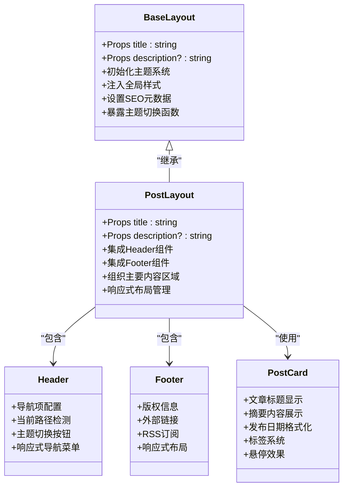
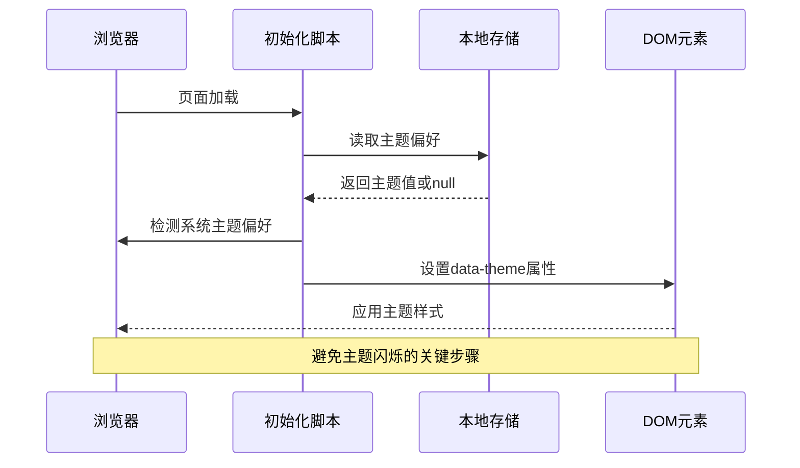
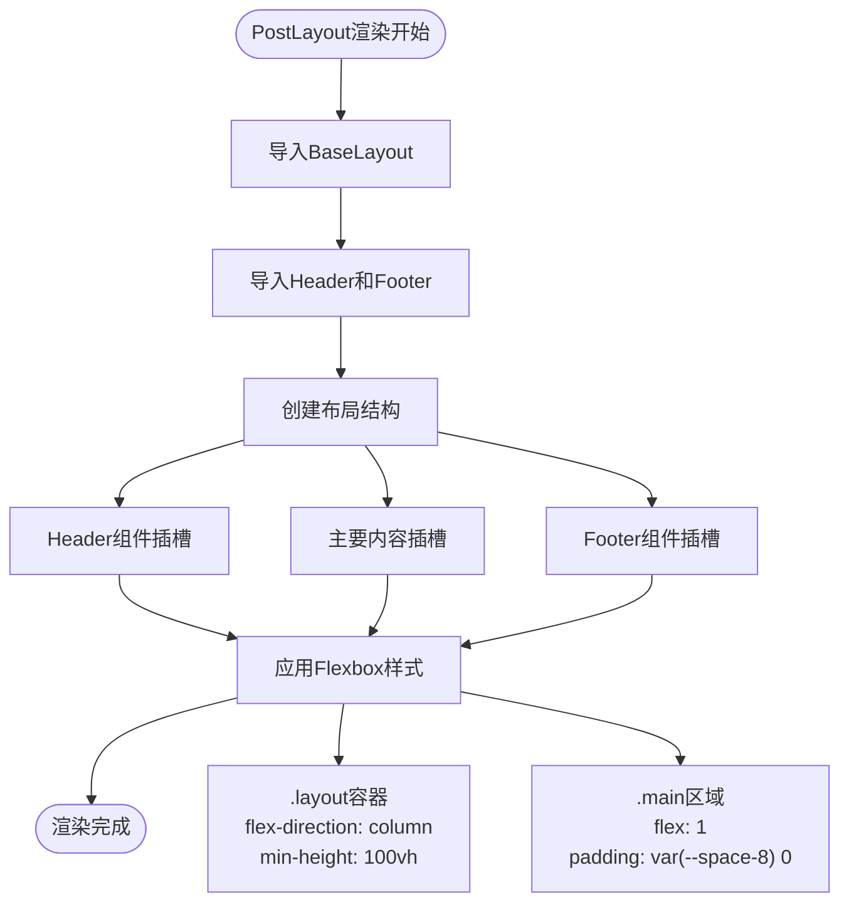
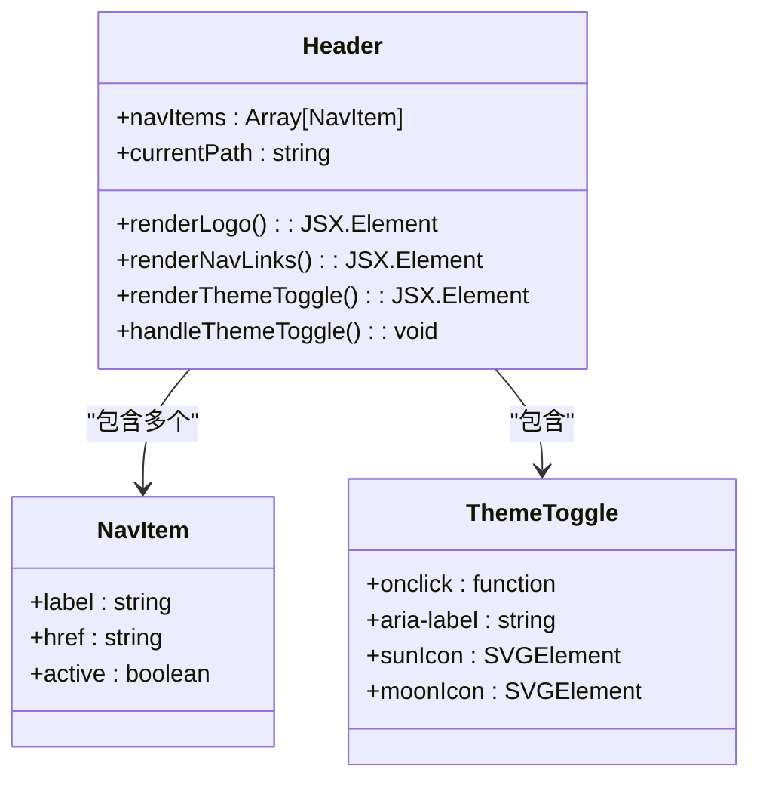
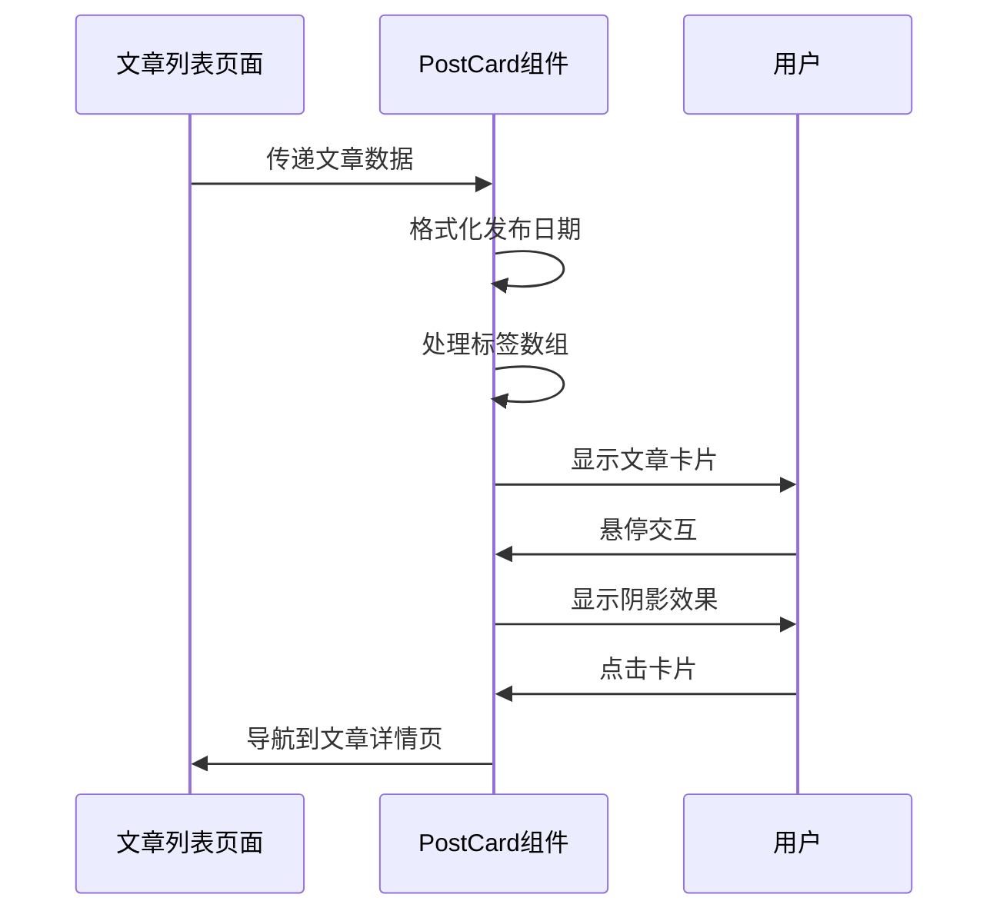
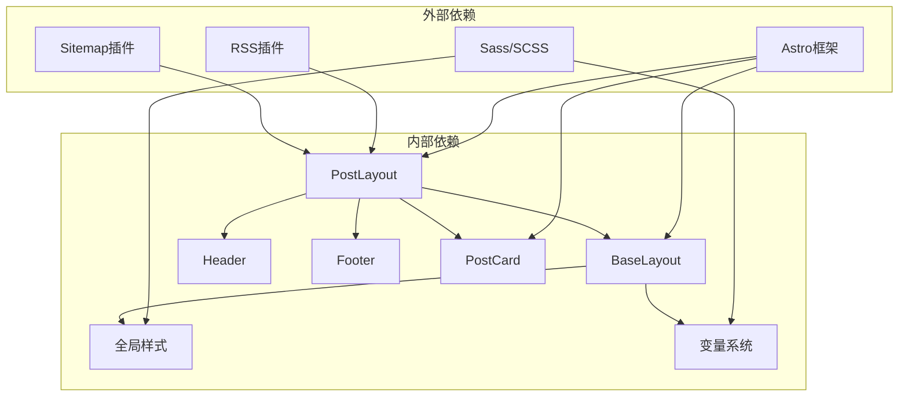

# 布局组件系统

<cite>
**本文档引用的文件**
- [BaseLayout.astro](file://src/layouts/BaseLayout.astro)
- [PostLayout.astro](file://src/layouts/PostLayout.astro)
- [Header.astro](file://src/components/Header.astro)
- [Footer.astro](file://src/components/Footer.astro)
- [PostCard.astro](file://src/components/PostCard.astro)
- [index.astro](file://src/pages/index.astro)
- [about.astro](file://src/pages/about.astro)
- [posts/index.astro](file://src/pages/posts/index.astro)
- [posts/[slug].astro](file://src/pages/posts/[slug].astro)
- [global.scss](file://src/styles/global.scss)
- [variables.scss](file://src/styles/variables.scss)
- [content.config.ts](file://src/content.config.ts)
- [package.json](file://package.json)
</cite>

## 目录
1. [简介](#简介)
2. [项目结构](#项目结构)
3. [核心组件](#核心组件)
4. [架构概览](#架构概览)
5. [详细组件分析](#详细组件分析)
6. [依赖关系分析](#依赖关系分析)
7. [性能考虑](#性能考虑)
8. [故障排除指南](#故障排除指南)
9. [结论](#结论)
10. [附录](#附录)

## 简介

这是一个基于 Astro 架构的现代化博客网站，采用组件化布局系统设计。该系统提供了灵活且可扩展的布局组件体系，支持主题切换、SEO 优化、响应式设计等现代 Web 开发需求。

布局组件系统的核心价值在于：
- **模块化设计**：通过 BaseLayout 和 PostLayout 实现布局复用
- **主题系统**：内置深浅主题切换，支持用户偏好记忆
- **SEO 优化**：自动注入元数据和 Open Graph 标签
- **内容集成**：与 Astro 内容集合无缝集成
- **响应式设计**：基于 CSS 变量的主题系统

## 项目结构

该项目采用清晰的分层架构，布局组件位于专门的目录中，便于维护和扩展。

```mermaid
graph TB
subgraph "布局层"
BL[BaseLayout.astro]
PL[PostLayout.astro]
end
subgraph "组件层"
HD[Header.astro]
FT[Footer.astro]
PC[PostCard.astro]
end
subgraph "页面层"
HP[index.astro]
AB[about.astro]
PI[posts/index.astro]
PS[posts/[slug].astro]
end
subgraph "样式层"
GS[global.scss]
VS[variables.scss]
end
BL --> GS
BL --> VS
PL --> BL
PL --> HD
PL --> FT
PI --> PL
PS --> PL
HP --> PL
AB --> PL
PC --> PI
```

**图表来源**
- [BaseLayout.astro:1-53](file://src/layouts/BaseLayout.astro#L1-L53)
- [PostLayout.astro:1-36](file://src/layouts/PostLayout.astro#L1-L36)
- [Header.astro:1-153](file://src/components/Header.astro#L1-L153)
- [Footer.astro:1-65](file://src/components/Footer.astro#L1-L65)

**章节来源**
- [BaseLayout.astro:1-53](file://src/layouts/BaseLayout.astro#L1-L53)
- [PostLayout.astro:1-36](file://src/layouts/PostLayout.astro#L1-L36)
- [global.scss:1-222](file://src/styles/global.scss#L1-L222)
- [variables.scss:1-108](file://src/styles/variables.scss#L1-L108)

## 核心组件

### BaseLayout 组件

BaseLayout 是整个布局系统的基础组件，负责提供全局框架和核心功能。

**主要功能特性：**
- **主题初始化**：避免主题切换时的闪烁问题
- **全局样式注入**：自动导入全局样式文件
- **SEO 元数据**：设置标题、描述、Open Graph 等 SEO 元数据
- **图标配置**：设置 favicon 和生成器信息

**核心实现要点：**
- 使用 Astro props 接收标题和描述参数
- 通过内联脚本实现主题初始化
- 自动注入 Open Graph 社交媒体标签
- 支持动态主题切换功能

**章节来源**
- [BaseLayout.astro:1-53](file://src/layouts/BaseLayout.astro#L1-L53)

### PostLayout 组件

PostLayout 是专门用于博客内容的布局组件，在 BaseLayout 基础上添加了导航和页脚。

**主要功能：**
- **Header 集成**：包含导航栏组件
- **Footer 集成**：包含页脚组件
- **主要内容区域**：提供灵活的内容插槽
- **响应式布局**：使用 Flexbox 实现自适应布局

**设计特点：**
- 采用 Flexbox 布局，确保页脚始终在底部
- 提供 `.layout` 和 `.main` 类名用于样式定制
- 支持完整的博客功能，包括文章列表和详情页

**章节来源**
- [PostLayout.astro:1-36](file://src/layouts/PostLayout.astro#L1-L36)

## 架构概览

布局系统采用分层架构设计，实现了高度的模块化和可扩展性。



**图表来源**
- [BaseLayout.astro:1-53](file://src/layouts/BaseLayout.astro#L1-L53)
- [PostLayout.astro:1-36](file://src/layouts/PostLayout.astro#L1-L36)
- [Header.astro:1-153](file://src/components/Header.astro#L1-L153)
- [Footer.astro:1-65](file://src/components/Footer.astro#L1-L65)
- [PostCard.astro:1-113](file://src/components/PostCard.astro#L1-L113)

## 详细组件分析

### BaseLayout 组件深度解析

BaseLayout 作为基础布局组件，实现了现代 Web 应用所需的核心功能。

#### 主题初始化机制



**图表来源**
- [BaseLayout.astro:28-33](file://src/layouts/BaseLayout.astro#L28-L33)

#### SEO 元数据管理

BaseLayout 自动处理所有重要的 SEO 元数据，确保搜索引擎优化：

- **基本元数据**：字符集、视口、描述、favicon
- **生成器信息**：标记使用 Astro 构建
- **Open Graph 标签**：社交媒体分享优化
- **动态标题**：根据页面内容动态设置

**章节来源**
- [BaseLayout.astro:14-26](file://src/layouts/BaseLayout.astro#L14-L26)

### PostLayout 组件详细分析

PostLayout 在 BaseLayout 的基础上，专门为博客内容设计了完整的页面框架。

#### 布局结构设计



**图表来源**
- [PostLayout.astro:14-35](file://src/layouts/PostLayout.astro#L14-L35)

#### 主要内容区域组织

PostLayout 提供了灵活的内容组织方式：

- **Header 区域**：固定顶部导航，支持主题切换
- **Main 区域**：弹性增长的主要内容区域
- **Footer 区域**：始终位于页面底部

这种设计确保了即使内容较少时，页脚也能保持在可视区域底部。

**章节来源**
- [PostLayout.astro:14-22](file://src/layouts/PostLayout.astro#L14-L22)

### Header 组件功能详解

Header 组件是导航系统的核心，实现了现代化的响应式导航体验。

#### 导航系统设计



**图表来源**
- [Header.astro:2-6](file://src/components/Header.astro#L2-L6)
- [Header.astro:28-43](file://src/components/Header.astro#L28-L43)

#### 主题切换机制

Header 中的按钮与 BaseLayout 中的主题切换功能协同工作：

- **双态图标**：太阳和月亮图标根据主题自动切换
- **无障碍支持**：提供适当的 ARIA 标签
- **平滑过渡**：CSS 过渡动画提供良好的用户体验

**章节来源**
- [Header.astro:28-43](file://src/components/Header.astro#L28-L43)

### Footer 组件设计

Footer 组件简洁而功能完整，提供了必要的版权和链接信息。

#### 版权和链接管理

Footer 包含以下关键元素：
- **动态版权年份**：自动显示当前年份
- **外部链接**：GitHub 个人主页链接
- **RSS 订阅**：站点订阅入口
- **响应式布局**：在小屏幕上自动调整排列

**章节来源**
- [Footer.astro:1-22](file://src/components/Footer.astro#L1-L22)

### PostCard 组件集成

PostCard 组件在文章列表页面中发挥重要作用，提供了美观的文章卡片展示。

#### 文章卡片功能



**图表来源**
- [PostCard.astro:10-16](file://src/components/PostCard.astro#L10-L16)

**章节来源**
- [PostCard.astro:19-38](file://src/components/PostCard.astro#L19-L38)

## 依赖关系分析

布局系统的依赖关系清晰明确，遵循了单一职责原则。



**图表来源**
- [package.json:12-20](file://package.json#L12-L20)
- [BaseLayout.astro:2](file://src/layouts/BaseLayout.astro#L2)
- [PostLayout.astro:2-4](file://src/layouts/PostLayout.astro#L2-L4)

**章节来源**
- [package.json:12-20](file://package.json#L12-L20)
- [content.config.ts:1-18](file://src/content.config.ts#L1-L18)

### 样式系统依赖

样式系统采用分层设计，确保主题的一致性和可维护性：

- **variables.scss**：定义 CSS 变量和主题色彩
- **global.scss**：应用全局样式和工具类
- **组件样式**：局部作用域的组件特定样式

**章节来源**
- [variables.scss:1-108](file://src/styles/variables.scss#L1-L108)
- [global.scss:1-222](file://src/styles/global.scss#L1-L222)

## 性能考虑

布局系统在设计时充分考虑了性能优化：

### 主题切换性能

- **避免 FOUC**：通过内联脚本在 DOM 加载前设置主题
- **本地存储缓存**：减少重复的主题检测开销
- **CSS 变量切换**：比 JavaScript 动态样式更高效

### 渲染优化

- **懒加载策略**：图片和内容按需加载
- **CSS 作用域**：避免样式冲突和重绘
- **响应式设计**：减少不必要的布局计算

### SEO 性能

- **预渲染支持**：静态生成优化搜索引擎抓取
- **元数据预设**：减少运行时计算开销
- **结构化数据**：提供丰富的语义信息

## 故障排除指南

### 常见问题及解决方案

#### 主题切换失效

**问题症状**：点击主题切换按钮无反应

**可能原因**：
- toggleTheme 函数未正确暴露到全局作用域
- localStorage 权限问题
- CSS 变量未正确更新

**解决步骤**：
1. 检查 BaseLayout 中的脚本是否正确执行
2. 验证 HTML 元素的 data-theme 属性变化
3. 确认 CSS 变量系统正常工作

#### SEO 元数据不显示

**问题症状**：页面缺少标题或描述信息

**可能原因**：
- Props 参数传递错误
- 模板字符串语法问题
- 编译时配置错误

**解决步骤**：
1. 验证页面组件中的 props 传递
2. 检查模板中的变量绑定
3. 确认构建配置正确

#### 响应式布局异常

**问题症状**：移动端显示效果不佳

**可能原因**：
- CSS 媒体查询配置错误
- 视口元标签缺失
- 移动端调试工具问题

**解决步骤**：
1. 检查视口配置
2. 验证媒体查询断点
3. 使用浏览器开发者工具测试

**章节来源**
- [BaseLayout.astro:28-50](file://src/layouts/BaseLayout.astro#L28-L50)
- [Header.astro:147-151](file://src/components/Header.astro#L147-L151)

## 结论

布局组件系统展现了现代前端开发的最佳实践：

### 设计优势

- **模块化架构**：清晰的层次结构便于维护
- **主题系统**：完整的深浅主题支持
- **SEO 优化**：内置的搜索引擎友好特性
- **响应式设计**：适配各种设备尺寸
- **可扩展性**：易于添加新功能和组件

### 技术亮点

- **Astro 集成**：充分利用 Astro 的静态生成能力
- **TypeScript 支持**：提供类型安全的开发体验
- **Sass 预处理器**：强大的样式管理和主题系统
- **组件化设计**：可复用的 UI 组件

### 发展建议

1. **性能监控**：添加性能指标监控
2. **国际化支持**：扩展多语言功能
3. **无障碍增强**：提升无障碍访问体验
4. **测试覆盖**：增加自动化测试

## 附录

### 使用示例

#### 在页面中使用 PostLayout

```javascript
// 基本用法
<PostLayout title="页面标题" description="页面描述">
  <div class="content">
    <!-- 页面内容 -->
  </div>
</PostLayout>
```

#### 自定义布局选项

```javascript
// 扩展 BaseLayout
<BaseLayout 
  title={title} 
  description={description}
  keywords={keywords}
  author={author}
>
  <slot />
</BaseLayout>
```

### 扩展方法

#### 添加新的布局变体

1. 创建新的布局组件
2. 继承现有布局功能
3. 添加特定的样式和逻辑
4. 在页面中选择使用

#### 自定义主题系统

1. 扩展 CSS 变量定义
2. 添加新的颜色方案
3. 更新主题切换逻辑
4. 测试不同设备上的显示效果

### 最佳实践

- **保持单一职责**：每个组件专注于特定功能
- **遵循命名约定**：使用一致的组件和变量命名
- **文档化变更**：及时更新相关文档
- **版本控制**：使用语义化版本管理组件更新