# CSS 变量系统

<cite>
**本文档引用的文件**
- [variables.scss](file://src/styles/variables.scss)
- [global.scss](file://src/styles/global.scss)
- [Header.astro](file://src/components/Header.astro)
- [Footer.astro](file://src/components/Footer.astro)
- [PostCard.astro](file://src/components/PostCard.astro)
- [BaseLayout.astro](file://src/layouts/BaseLayout.astro)
- [package.json](file://package.json)
- [README.md](file://README.md)
</cite>

## 目录
1. [简介](#简介)
2. [项目结构](#项目结构)
3. [核心组件](#核心组件)
4. [架构概览](#架构概览)
5. [详细组件分析](#详细组件分析)
6. [依赖关系分析](#依赖关系分析)
7. [性能考虑](#性能考虑)
8. [故障排除指南](#故障排除指南)
9. [结论](#结论)

## 简介

chnanxu 博客采用现代化的 CSS 变量系统，通过 SCSS 变量和原生 CSS 自定义属性相结合的方式，实现了统一的主题管理和响应式设计。该系统支持明暗主题切换，具有清晰的命名规范和分类体系，为整个博客提供了可维护、可扩展的样式基础。

## 项目结构

该项目采用模块化的样式架构，主要包含以下关键文件：

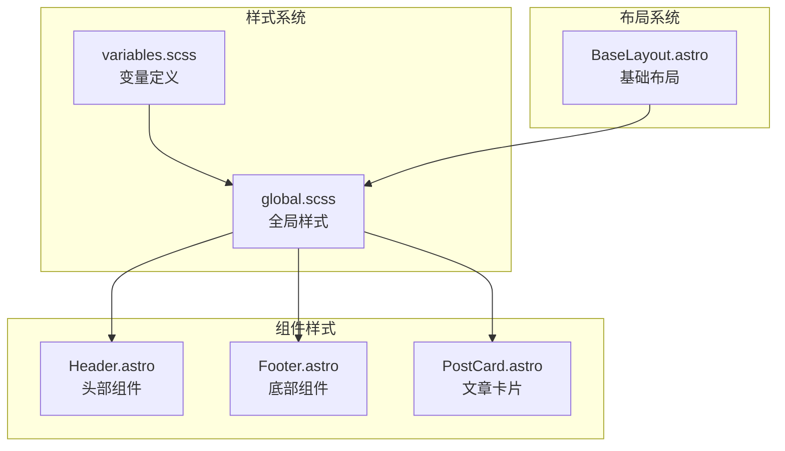

**图表来源**
- [variables.scss:1-108](file://src/styles/variables.scss#L1-L108)
- [global.scss:1-222](file://src/styles/global.scss#L1-L222)
- [Header.astro:1-153](file://src/components/Header.astro#L1-L153)
- [Footer.astro:1-65](file://src/components/Footer.astro#L1-L65)
- [PostCard.astro:1-113](file://src/components/PostCard.astro#L1-L113)
- [BaseLayout.astro:1-53](file://src/layouts/BaseLayout.astro#L1-L53)

**章节来源**
- [variables.scss:1-108](file://src/styles/variables.scss#L1-L108)
- [global.scss:1-222](file://src/styles/global.scss#L1-L222)
- [package.json:1-22](file://package.json#L1-L22)

## 核心组件

### CSS 变量系统架构

CSS 变量系统采用分层设计，通过 SCSS 变量导入机制实现变量的统一管理：

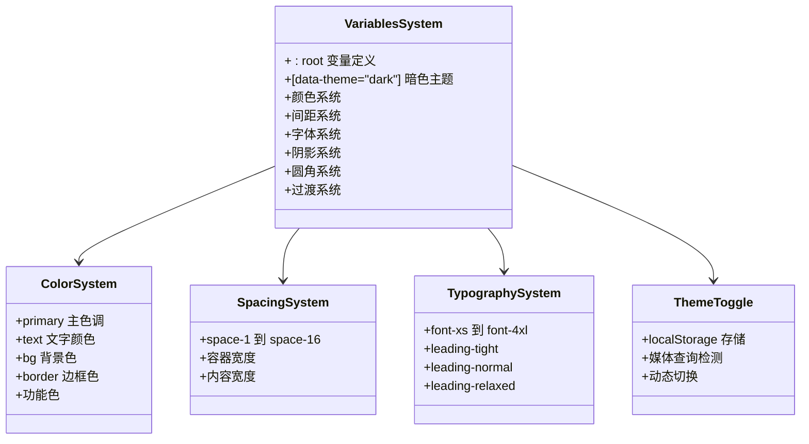

**图表来源**
- [variables.scss:5-107](file://src/styles/variables.scss#L5-L107)
- [BaseLayout.astro:28-50](file://src/layouts/BaseLayout.astro#L28-L50)

### 变量命名规范

系统采用统一的命名约定，确保变量的可读性和一致性：

| 分类 | 命名模式 | 示例 |
|------|----------|------|
| 品牌主色 | `--primary[-variant]` | `--primary`, `--primary-hover` |
| 文字层级 | `--text[-level]` | `--text`, `--text-secondary` |
| 背景层级 | `--bg[-level]` | `--bg`, `--bg-elevated` |
| 边框 | `--border[-variant]` | `--border`, `--border-muted` |
| 功能色 | `--success`, `--warning`, `--danger`, `--info` | `--success`, `--warning` |
| 阴影 | `--shadow-[size]` | `--shadow-sm`, `--shadow-md` |
| 圆角 | `--radius-[size]` | `--radius-sm`, `--radius-md` |
| 间距 | `--space-[n]` | `--space-1`, `--space-4` |
| 字号 | `--font-[size]` | `--font-xs`, `--font-base` |
| 行高 | `--leading-[style]` | `--leading-tight`, `--leading-normal` |
| 过渡 | `--transition-[speed]` | `--transition-fast`, `--transition-normal` |

**章节来源**
- [variables.scss:6-82](file://src/styles/variables.scss#L6-L82)

## 架构概览

### 主题切换机制

系统实现了智能的主题切换机制，支持用户偏好设置和手动切换：

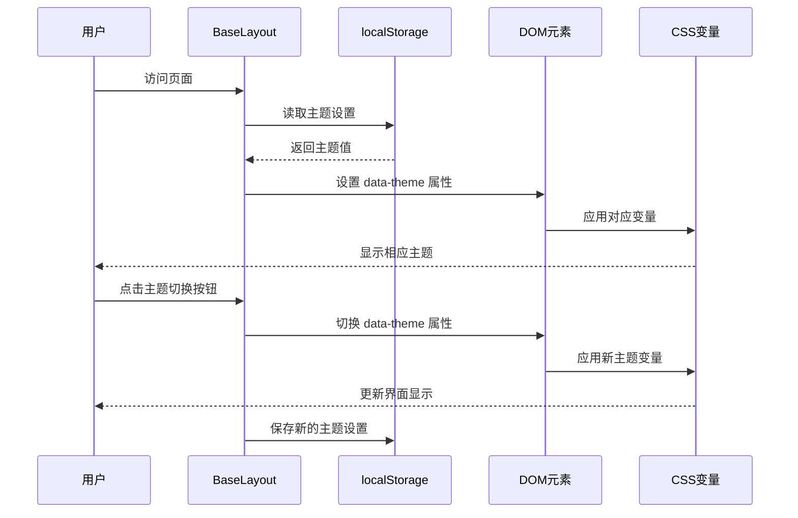

**图表来源**
- [BaseLayout.astro:28-50](file://src/layouts/BaseLayout.astro#L28-L50)
- [Header.astro:28-43](file://src/components/Header.astro#L28-L43)

### 变量作用域分析

CSS 变量的作用域遵循层级继承原则：

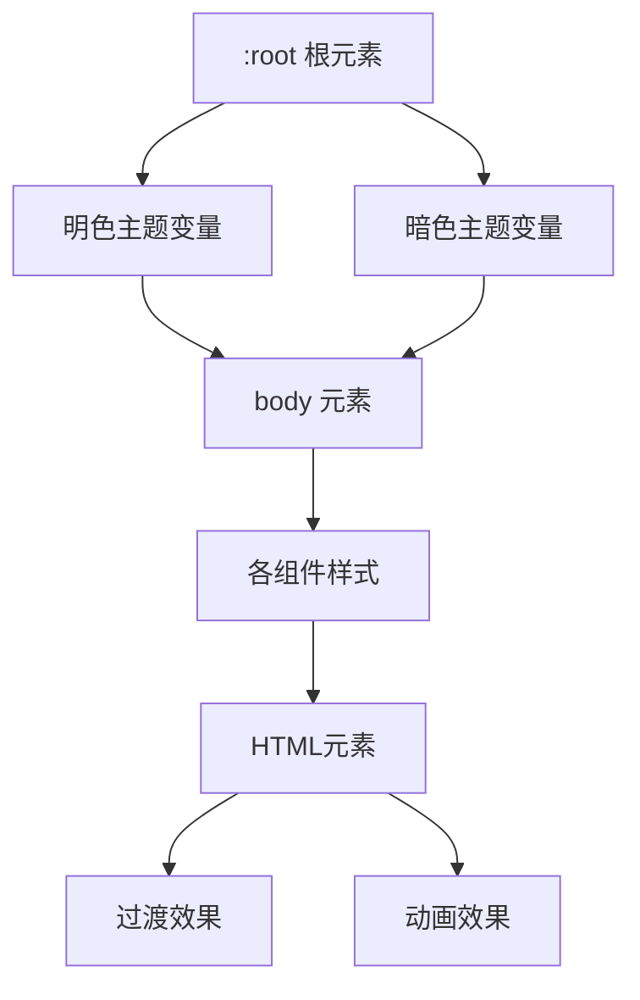

**图表来源**
- [variables.scss:5-107](file://src/styles/variables.scss#L5-L107)
- [global.scss:22-29](file://src/styles/global.scss#L22-L29)

**章节来源**
- [BaseLayout.astro:28-50](file://src/layouts/BaseLayout.astro#L28-L50)
- [variables.scss:5-107](file://src/styles/variables.scss#L5-L107)

## 详细组件分析

### 品牌主色系统

品牌主色系统采用层次化设计，确保在不同主题下的视觉一致性：

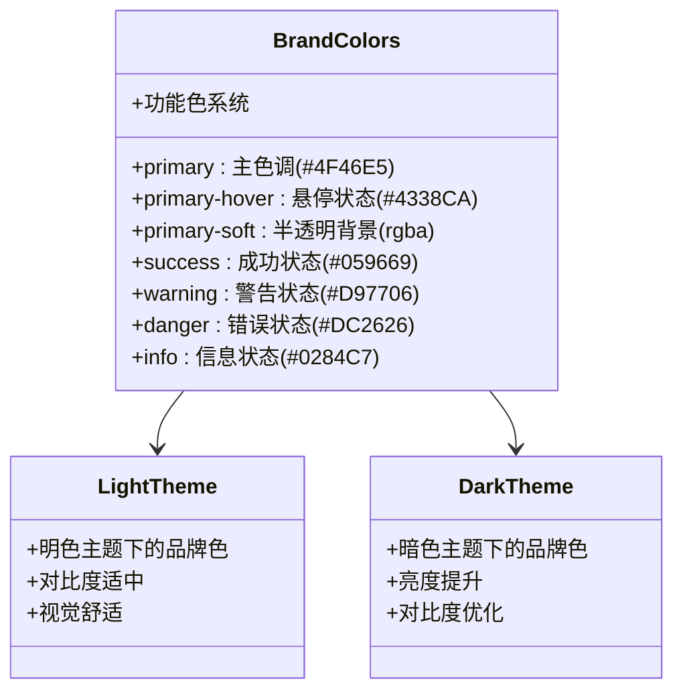

**图表来源**
- [variables.scss:7-31](file://src/styles/variables.scss#L7-L31)
- [variables.scss:87-89](file://src/styles/variables.scss#L87-L89)

#### 明暗主题对比

| 颜色类别 | 明色主题 | 暗色主题 | 设计考量 |
|----------|----------|----------|----------|
| primary | #4F46E5 | #818CF8 | 提升暗色对比度 |
| primary-hover | #4338CA | #A5B4FC | 保持交互一致性 |
| text | #111827 | #F9FAFB | 文字可读性优先 |
| bg | #F9FAFB | #030712 | 背景色层次分明 |
| border | #E5E7EB | rgba(255,255,255,0.1) | 边框可见性平衡 |

**章节来源**
- [variables.scss:7-31](file://src/styles/variables.scss#L7-L31)
- [variables.scss:87-106](file://src/styles/variables.scss#L87-L106)

### 文字层级系统

文字层级系统采用渐进式设计，确保内容的层次结构清晰：

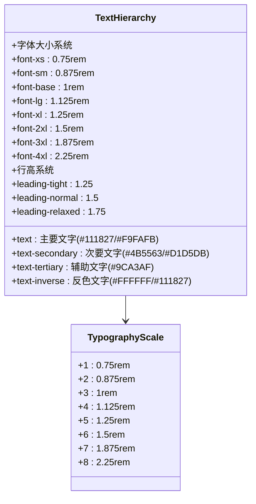

**图表来源**
- [variables.scss:12-70](file://src/styles/variables.scss#L12-L70)

**章节来源**
- [variables.scss:12-70](file://src/styles/variables.scss#L12-L70)
- [global.scss:53-75](file://src/styles/global.scss#L53-L75)

### 背景层级系统

背景层级系统提供多层背景色，支持卡片式设计和内容分组：

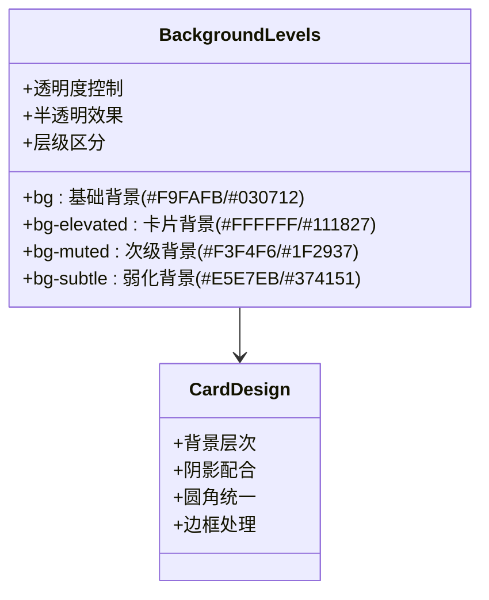

**图表来源**
- [variables.scss:18-21](file://src/styles/variables.scss#L18-L21)
- [variables.scss:96-99](file://src/styles/variables.scss#L96-L99)

**章节来源**
- [variables.scss:18-21](file://src/styles/variables.scss#L18-L21)
- [variables.scss:96-99](file://src/styles/variables.scss#L96-L99)

### 边框系统

边框系统采用统一的边框变量，确保界面元素的一致性：

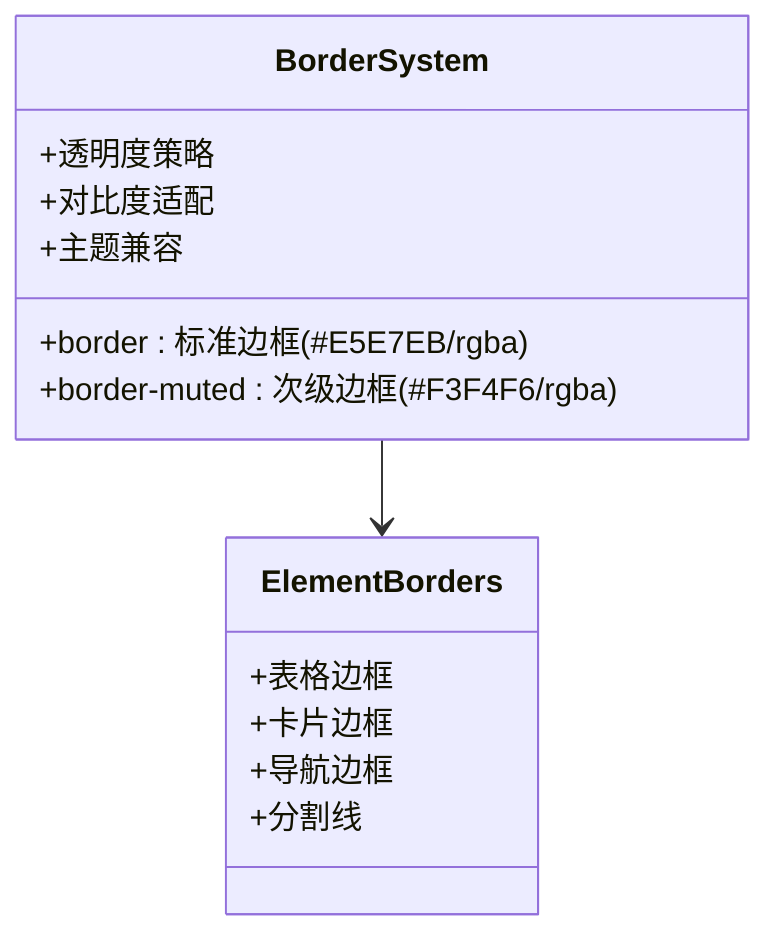

**图表来源**
- [variables.scss:24-25](file://src/styles/variables.scss#L24-L25)
- [variables.scss:101-102](file://src/styles/variables.scss#L101-L102)

**章节来源**
- [variables.scss:24-25](file://src/styles/variables.scss#L24-L25)
- [variables.scss:101-102](file://src/styles/variables.scss#L101-L102)

### 阴影系统

阴影系统提供多层次的阴影效果，增强界面的立体感：

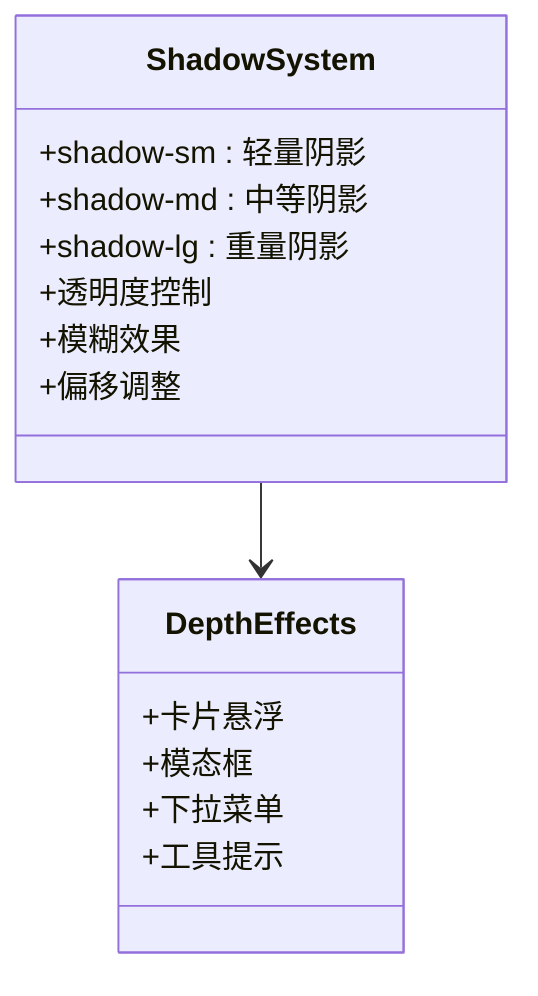

**图表来源**
- [variables.scss:34-36](file://src/styles/variables.scss#L34-L36)
- [variables.scss:104-106](file://src/styles/variables.scss#L104-L106)

**章节来源**
- [variables.scss:34-36](file://src/styles/variables.scss#L34-L36)
- [variables.scss:104-106](file://src/styles/variables.scss#L104-L106)

### 圆角系统

圆角系统提供统一的圆角尺寸，确保界面元素的视觉一致性：

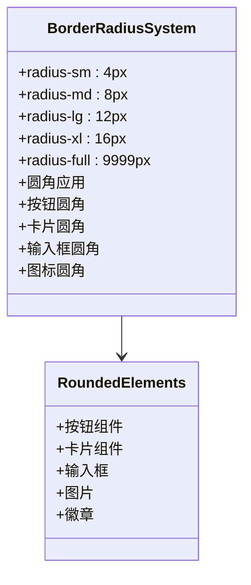

**图表来源**
- [variables.scss:39-43](file://src/styles/variables.scss#L39-L43)

**章节来源**
- [variables.scss:39-43](file://src/styles/variables.scss#L39-L43)

### 间距系统

间距系统采用网格化的设计，提供一致的空间感：

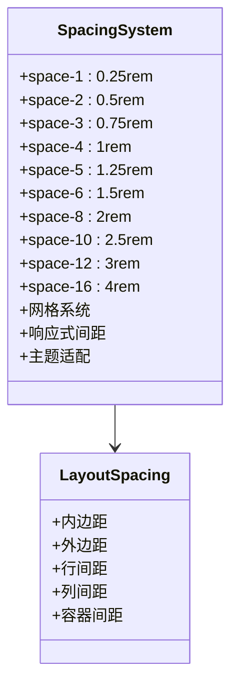

**图表来源**
- [variables.scss:46-55](file://src/styles/variables.scss#L46-L55)

**章节来源**
- [variables.scss:46-55](file://src/styles/variables.scss#L46-L55)

### 过渡系统

过渡系统提供流畅的动画效果，增强用户体验：

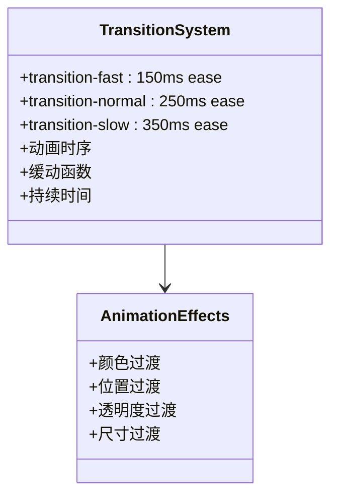

**图表来源**
- [variables.scss:73-75](file://src/styles/variables.scss#L73-L75)

**章节来源**
- [variables.scss:73-75](file://src/styles/variables.scss#L73-L75)

### 容器系统

容器系统提供响应式的布局约束：

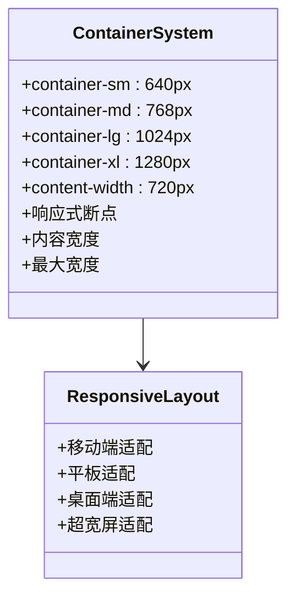

**图表来源**
- [variables.scss:78-82](file://src/styles/variables.scss#L78-L82)

**章节来源**
- [variables.scss:78-82](file://src/styles/variables.scss#L78-L82)

## 依赖关系分析

### 组件间依赖关系

CSS 变量系统在组件间的依赖关系呈现单向数据流：

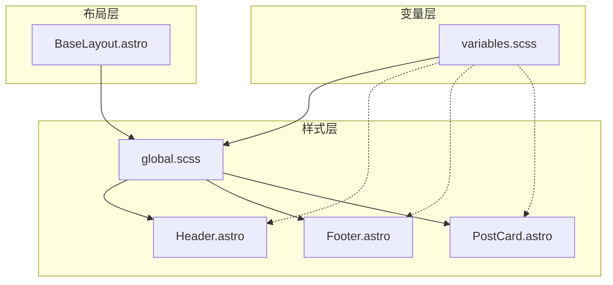

**图表来源**
- [variables.scss:1](file://src/styles/variables.scss#L1)
- [global.scss:1](file://src/styles/global.scss#L1)
- [Header.astro:1](file://src/components/Header.astro#L1)
- [Footer.astro:1](file://src/components/Footer.astro#L1)
- [PostCard.astro:1](file://src/components/PostCard.astro#L1)
- [BaseLayout.astro:2](file://src/layouts/BaseLayout.astro#L2)

### 变量使用统计

系统中变量的使用分布如下：

| 组件 | 变量使用数量 | 主要用途 |
|------|-------------|----------|
| Header.astro | 15+ | 导航栏、按钮、图标 |
| Footer.astro | 8+ | 底部信息、链接 |
| PostCard.astro | 20+ | 卡片组件、标签 |
| global.scss | 30+ | 全局样式、排版 |
| BaseLayout.astro | 5+ | 布局基础 |

**章节来源**
- [Header.astro:47-152](file://src/components/Header.astro#L47-L152)
- [Footer.astro:24-64](file://src/components/Footer.astro#L24-L64)
- [PostCard.astro:40-112](file://src/components/PostCard.astro#L40-L112)
- [global.scss:1-222](file://src/styles/global.scss#L1-L222)

## 性能考虑

### CSS 变量性能特性

CSS 变量系统具有以下性能优势：

1. **运行时计算**：变量在渲染时计算，避免编译时复杂度
2. **内存效率**：单一变量定义，多处复用
3. **主题切换**：无需重新编译，即时生效
4. **选择器优化**：避免深层选择器嵌套

### 最佳实践建议

1. **变量分组**：按功能分组组织变量，便于维护
2. **命名一致性**：遵循统一的命名约定
3. **主题隔离**：将主题相关变量集中管理
4. **性能监控**：定期检查变量使用频率

## 故障排除指南

### 常见问题及解决方案

#### 主题切换失效

**问题症状**：点击主题切换按钮无反应

**可能原因**：
1. JavaScript 脚本未正确加载
2. localStorage 权限问题
3. CSS 变量未正确应用

**解决方案**：
1. 检查 `toggleTheme` 函数是否正确暴露到全局
2. 验证 `data-theme` 属性的设置逻辑
3. 确认 CSS 变量的优先级设置

#### 变量未生效

**问题症状**：组件中使用变量但显示异常

**可能原因**：
1. 变量定义顺序问题
2. 作用域错误
3. 编译器配置问题

**解决方案**：
1. 确保变量文件在样式文件之前导入
2. 检查变量的作用域范围
3. 验证 SCSS 编译配置

#### 响应式问题

**问题症状**：在不同设备上显示不一致

**可能原因**：
1. 断点设置不当
2. 变量值不匹配
3. 媒体查询冲突

**解决方案**：
1. 检查容器变量的断点设置
2. 验证响应式变量的值
3. 简化媒体查询逻辑

**章节来源**
- [BaseLayout.astro:28-50](file://src/layouts/BaseLayout.astro#L28-L50)
- [Header.astro:28-43](file://src/components/Header.astro#L28-L43)

## 结论

chnanxu 博客的 CSS 变量系统展现了现代前端开发的最佳实践。通过精心设计的变量分类、清晰的命名规范和完善的主题切换机制，系统实现了高度的可维护性和可扩展性。

### 系统优势

1. **统一性**：所有组件共享同一套变量系统
2. **可维护性**：模块化的变量组织结构
3. **可扩展性**：灵活的主题定制能力
4. **性能友好**：高效的变量计算和应用机制

### 改进建议

1. **文档完善**：增加变量使用示例和最佳实践
2. **测试覆盖**：建立变量变更的自动化测试
3. **性能监控**：添加变量使用频率的分析工具
4. **团队协作**：制定变量变更的审批流程

该系统为个人博客项目提供了一个优秀的样式管理范例，值得在类似项目中借鉴和参考。