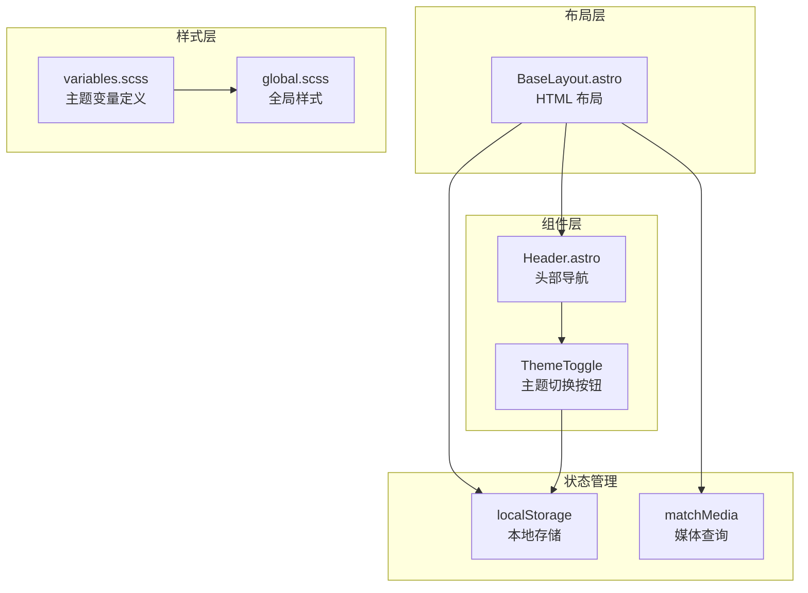
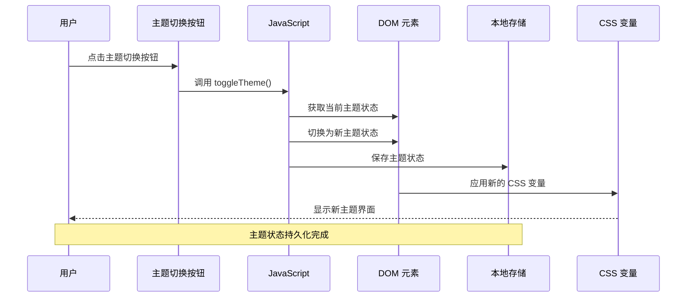
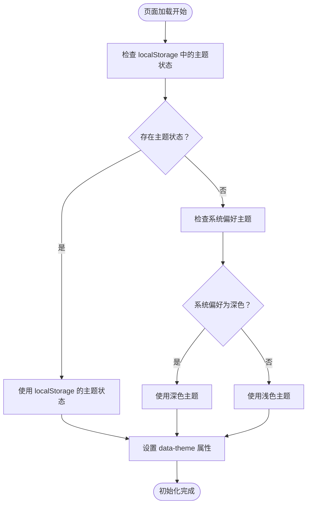
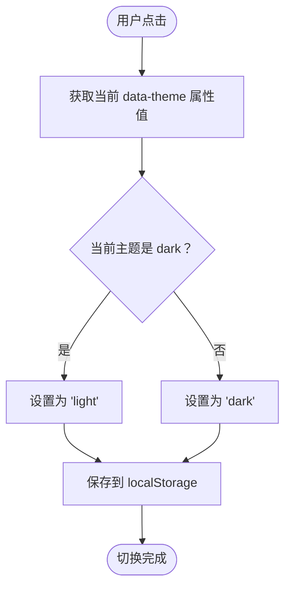
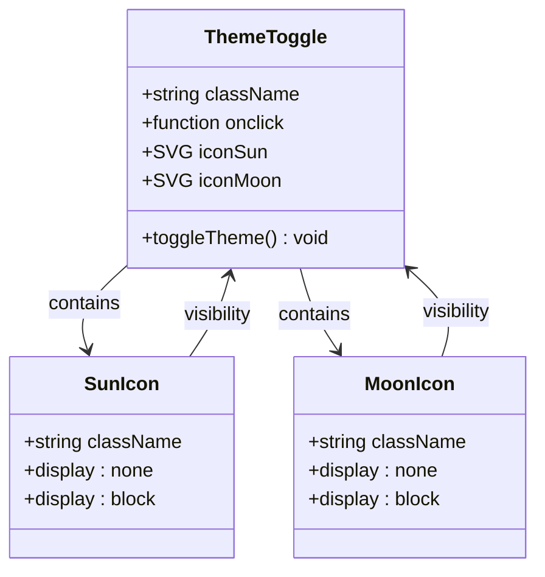
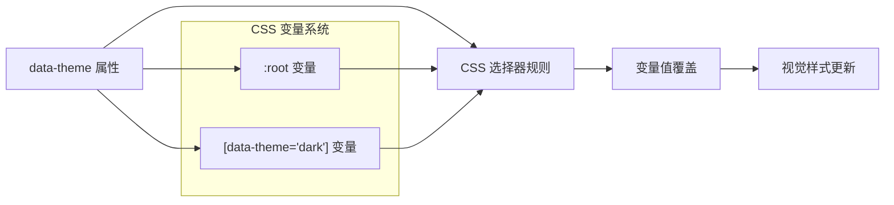
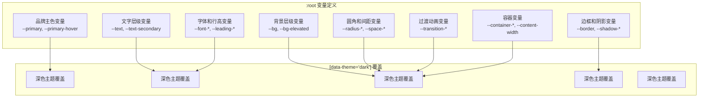
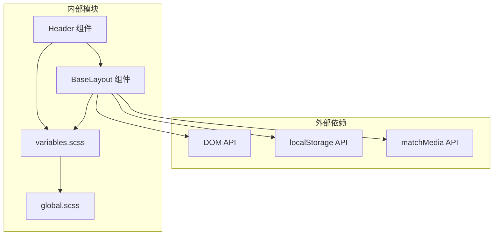

# 主题切换机制

<cite>
**本文档引用的文件**
- [BaseLayout.astro](file://src/layouts/BaseLayout.astro)
- [Header.astro](file://src/components/Header.astro)
- [variables.scss](file://src/styles/variables.scss)
- [global.scss](file://src/styles/global.scss)
- [package.json](file://package.json)
</cite>

## 目录
1. [简介](#简介)
2. [项目结构](#项目结构)
3. [核心组件](#核心组件)
4. [架构概览](#架构概览)
5. [详细组件分析](#详细组件分析)
6. [依赖关系分析](#依赖关系分析)
7. [性能考虑](#性能考虑)
8. [故障排除指南](#故障排除指南)
9. [结论](#结论)

## 简介

本项目实现了一个基于 CSS 变量的主题切换系统，支持明暗主题模式的无缝切换。该系统采用现代 Web 技术栈，通过 CSS 自定义属性实现主题变量管理，并结合 JavaScript 实现用户交互和状态持久化。

系统的核心特性包括：
- 基于 CSS 变量的主题系统
- 本地存储持久化
- 系统主题检测
- 无障碍访问支持
- 性能优化的初始化流程

## 项目结构

主题切换机制涉及以下关键文件和组件：

**图表来源**
- [BaseLayout.astro:1-53](file://src/layouts/BaseLayout.astro#L1-L53)
- [Header.astro:1-153](file://src/components/Header.astro#L1-L153)
- [variables.scss:1-108](file://src/styles/variables.scss#L1-L108)

**章节来源**
- [BaseLayout.astro:1-53](file://src/layouts/BaseLayout.astro#L1-L53)
- [Header.astro:1-153](file://src/components/Header.astro#L1-L153)
- [variables.scss:1-108](file://src/styles/variables.scss#L1-L108)

## 核心组件

### 主题切换函数

toggleTheme() 函数是整个主题切换系统的核心，负责执行主题状态的切换操作。

**函数工作原理：**
1. 获取 HTML 根元素的当前主题状态
2. 切换主题状态（dark ↔ light）
3. 更新 DOM 属性
4. 持久化到本地存储

**章节来源**
- [BaseLayout.astro:39-50](file://src/layouts/BaseLayout.astro#L39-L50)

### 主题变量系统

系统使用 CSS 自定义属性实现主题变量管理，通过在根元素上设置 data-theme 属性来控制主题状态。

**变量定义结构：**
- 品牌主色变量
- 文字层级变量
- 背景层级变量
- 边框和阴影变量
- 圆角和间距变量

**章节来源**
- [variables.scss:5-107](file://src/styles/variables.scss#L5-L107)

### 主题切换按钮

Header 组件中的主题切换按钮提供了用户交互入口，支持图标切换和无障碍访问。

**功能特性：**
- SVG 图标切换（太阳/月亮）
- 悬停效果
- 无障碍标签
- 响应式设计

**章节来源**
- [Header.astro:28-44](file://src/components/Header.astro#L28-L44)

## 架构概览

主题切换系统的整体架构采用分层设计，确保各组件职责清晰且松耦合。

**图表来源**
- [BaseLayout.astro:39-50](file://src/layouts/BaseLayout.astro#L39-L50)
- [Header.astro:28](file://src/components/Header.astro#L28)

## 详细组件分析

### BaseLayout 组件分析

BaseLayout 是主题切换系统的核心布局组件，负责初始化主题状态和提供切换功能。

#### 初始化流程

系统采用无闪烁初始化策略，在页面加载时立即确定正确的主题状态：

**图表来源**
- [BaseLayout.astro:29-33](file://src/layouts/BaseLayout.astro#L29-L33)

#### 主题切换逻辑

toggleTheme() 函数实现了简洁而高效的切换逻辑：

**图表来源**
- [BaseLayout.astro:40-46](file://src/layouts/BaseLayout.astro#L40-L46)

**章节来源**
- [BaseLayout.astro:29-50](file://src/layouts/BaseLayout.astro#L29-L50)

### Header 组件分析

Header 组件中的主题切换按钮提供了直观的用户界面。

#### 图标切换机制

按钮使用两个 SVG 图标实现切换效果：

**图表来源**
- [Header.astro:28-44](file://src/components/Header.astro#L28-L44)

#### CSS 变量应用

主题切换通过 CSS 变量实现动态样式更新：

**图表来源**
- [variables.scss:85-107](file://src/styles/variables.scss#L85-L107)

**章节来源**
- [Header.astro:115-145](file://src/components/Header.astro#L115-L145)

### CSS 变量系统分析

系统采用 CSS 自定义属性实现主题变量管理，提供了一种高效且可维护的主题切换方案。

#### 变量组织结构

**图表来源**
- [variables.scss:5-107](file://src/styles/variables.scss#L5-L107)

**章节来源**
- [variables.scss:1-108](file://src/styles/variables.scss#L1-L108)

## 依赖关系分析

主题切换系统的依赖关系相对简单，主要涉及以下模块间的交互：

**图表来源**
- [BaseLayout.astro:29-50](file://src/layouts/BaseLayout.astro#L29-L50)
- [Header.astro:28](file://src/components/Header.astro#L28)

**章节来源**
- [BaseLayout.astro:29-50](file://src/layouts/BaseLayout.astro#L29-L50)
- [Header.astro:28-44](file://src/components/Header.astro#L28-L44)

## 性能考虑

系统在设计时充分考虑了性能优化，采用了多种策略确保最佳的用户体验：

### 无闪烁初始化

通过内联脚本在 DOM 解析阶段就确定主题状态，避免了主题闪烁问题。

### 本地存储优化

使用 localStorage 进行状态持久化，避免每次页面加载时的重复计算。

### CSS 变量优势

相比传统 CSS 覆盖方案，CSS 变量具有更好的性能表现和更少的重绘开销。

### 响应式设计

组件支持响应式布局，确保在不同设备上的良好体验。

## 故障排除指南

### 常见问题及解决方案

**问题：主题切换后样式不更新**
- 检查 data-theme 属性是否正确设置
- 确认 CSS 变量覆盖规则是否生效
- 验证浏览器对 CSS 变量的支持情况

**问题：主题状态未持久化**
- 检查 localStorage 是否可用
- 确认浏览器隐私设置允许使用 localStorage
- 验证 toggleTheme 函数是否正常执行

**问题：系统主题检测失效**
- 检查 matchMedia API 的支持情况
- 确认媒体查询语法正确
- 验证系统主题设置是否正确

**章节来源**
- [BaseLayout.astro:29-50](file://src/layouts/BaseLayout.astro#L29-L50)

## 结论

本主题切换机制通过精心设计的架构实现了高效、可靠的明暗主题切换功能。系统的主要优势包括：

1. **简洁高效的实现**：通过 CSS 变量和简单的 JavaScript 逻辑实现主题切换
2. **良好的用户体验**：无闪烁初始化和即时反馈
3. **完善的持久化**：使用 localStorage 确保用户偏好的持续性
4. **无障碍支持**：提供适当的语义化标记和键盘导航支持
5. **性能优化**：采用 CSS 变量减少重绘和重排

该系统为类似项目提供了优秀的参考实现，展示了如何在现代 Web 开发中优雅地处理主题切换需求。