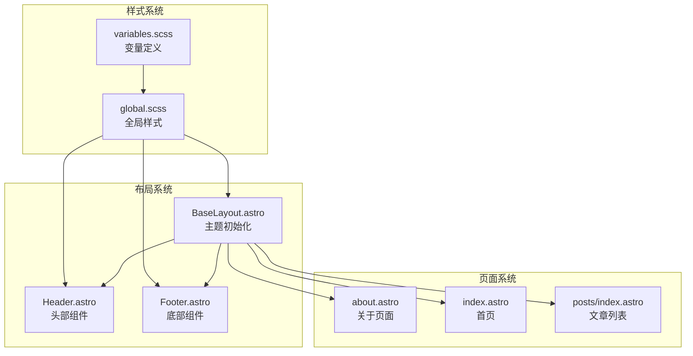
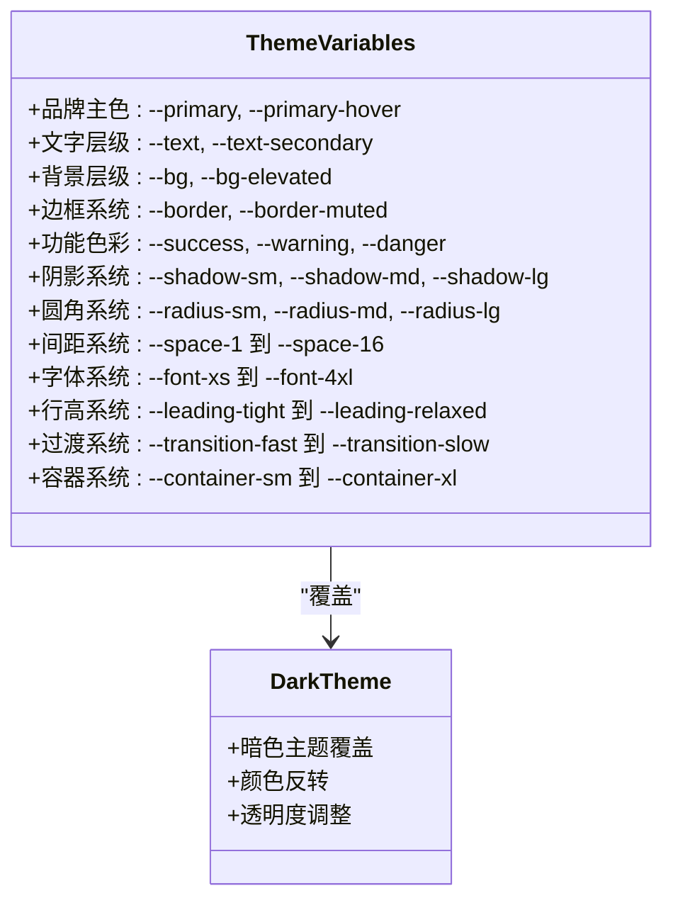
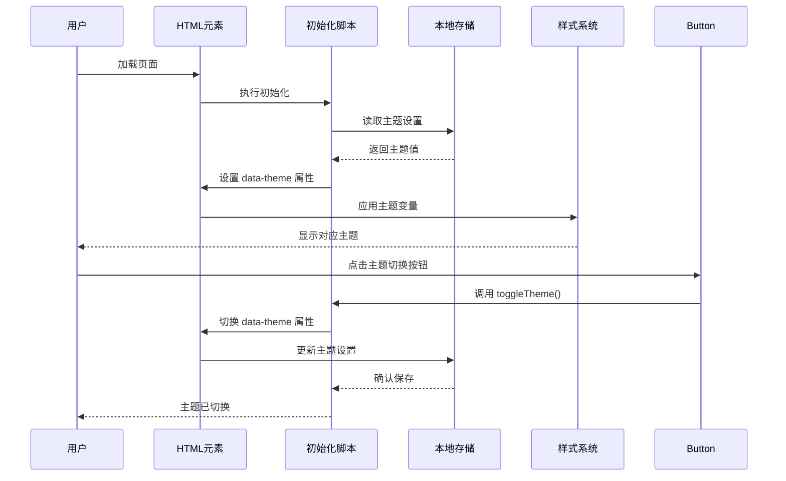
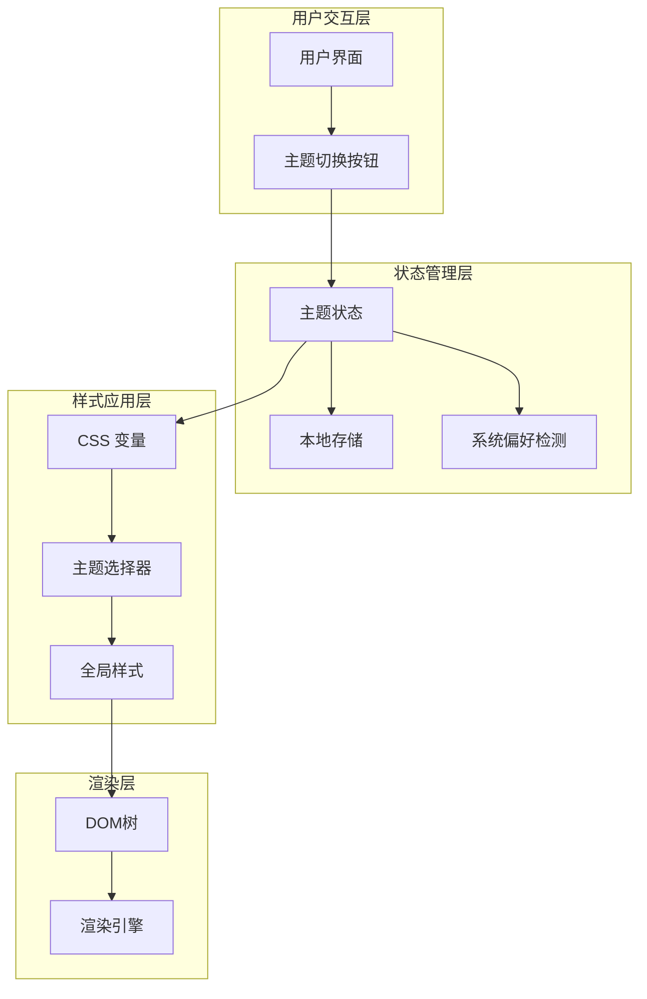
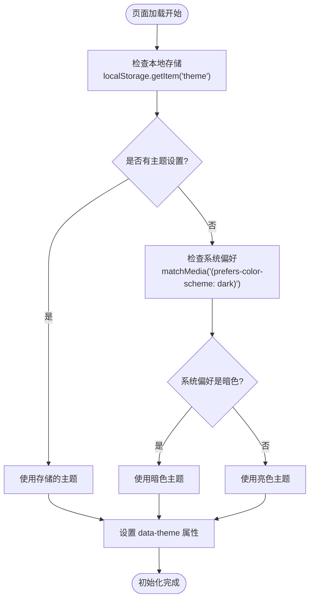
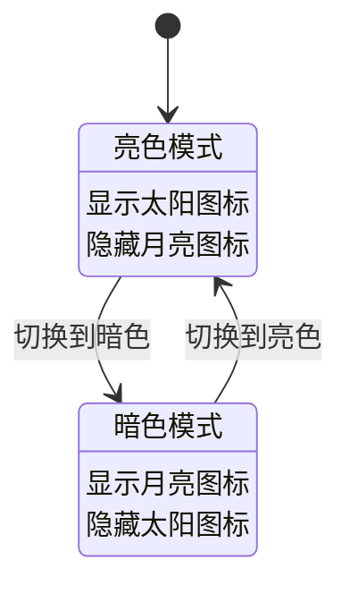
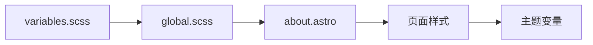
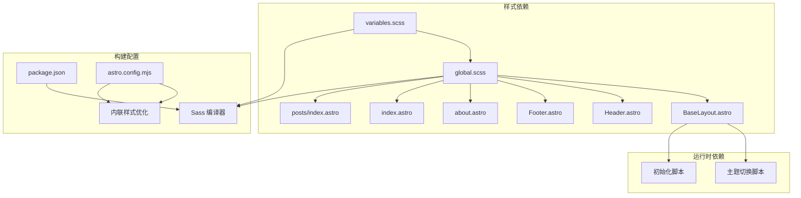
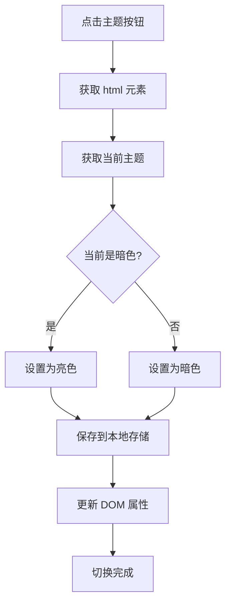
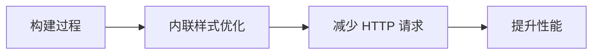

# 主题样式实现

<cite>
**本文档引用的文件**
- [variables.scss](file://src/styles/variables.scss)
- [global.scss](file://src/styles/global.scss)
- [BaseLayout.astro](file://src/layouts/BaseLayout.astro)
- [Header.astro](file://src/components/Header.astro)
- [Footer.astro](file://src/components/Footer.astro)
- [about.astro](file://src/pages/about.astro)
- [index.astro](file://src/pages/index.astro)
- [posts/index.astro](file://src/pages/posts/index.astro)
- [package.json](file://package.json)
- [astro.config.mjs](file://astro.config.mjs)
</cite>

## 目录
1. [简介](#简介)
2. [项目结构](#项目结构)
3. [核心组件](#核心组件)
4. [架构概览](#架构概览)
5. [详细组件分析](#详细组件分析)
6. [依赖关系分析](#依赖关系分析)
7. [性能考虑](#性能考虑)
8. [故障排除指南](#故障排除指南)
9. [结论](#结论)

## 简介

本项目采用基于 CSS 变量的主题系统，实现了灵活且高效的暗色/亮色主题切换功能。通过全局 CSS 变量定义和 Astro 组件的组合，构建了一个可扩展的主题样式体系。该系统支持用户偏好检测、本地存储持久化、无闪烁初始化以及响应式设计适配。

## 项目结构

项目采用模块化的样式组织结构，主要包含以下关键文件：



**图表来源**
- [variables.scss:1-108](file://src/styles/variables.scss#L1-L108)
- [global.scss:1-222](file://src/styles/global.scss#L1-L222)
- [BaseLayout.astro:1-53](file://src/layouts/BaseLayout.astro#L1-L53)

**章节来源**
- [variables.scss:1-108](file://src/styles/variables.scss#L1-L108)
- [global.scss:1-222](file://src/styles/global.scss#L1-L222)
- [BaseLayout.astro:1-53](file://src/layouts/BaseLayout.astro#L1-L53)

## 核心组件

### CSS 变量系统

项目的核心是基于 CSS 自定义属性的变量系统，提供了完整的主题色彩和设计令牌：

#### 变量分类结构



**图表来源**
- [variables.scss:5-107](file://src/styles/variables.scss#L5-L107)

#### 变量作用域和优先级

CSS 变量在项目中的作用域遵循以下层次结构：

1. **全局根节点** (`:root`) - 默认值定义
2. **主题选择器** (`[data-theme="dark"]`) - 主题覆盖
3. **组件局部样式** - 特定组件的变量重定义

**章节来源**
- [variables.scss:5-107](file://src/styles/variables.scss#L5-L107)

### 主题切换机制



**图表来源**
- [BaseLayout.astro:28-50](file://src/layouts/BaseLayout.astro#L28-L50)

**章节来源**
- [BaseLayout.astro:28-50](file://src/layouts/BaseLayout.astro#L28-L50)

## 架构概览

### 主题系统整体架构



**图表来源**
- [BaseLayout.astro:28-50](file://src/layouts/BaseLayout.astro#L28-L50)
- [variables.scss:5-107](file://src/styles/variables.scss#L5-L107)
- [global.scss:1-222](file://src/styles/global.scss#L1-L222)

### 样式继承机制

项目采用多层次的样式继承机制：

1. **基础继承**：所有组件继承自全局样式定义
2. **主题继承**：通过 CSS 变量实现主题级别的样式继承
3. **组件继承**：特定组件可以重写或扩展样式变量

**章节来源**
- [global.scss:1-222](file://src/styles/global.scss#L1-L222)
- [variables.scss:5-107](file://src/styles/variables.scss#L5-L107)

## 详细组件分析

### BaseLayout 主题初始化

BaseLayout 是整个主题系统的核心入口，负责初始化主题状态并确保无闪烁的用户体验。

#### 初始化流程分析



**图表来源**
- [BaseLayout.astro:28-33](file://src/layouts/BaseLayout.astro#L28-L33)

#### 关键特性

1. **无闪烁初始化**：通过内联脚本避免首次渲染时的颜色闪烁
2. **智能回退**：优先使用用户设置，其次使用系统偏好
3. **属性驱动**：使用 `data-theme` 属性而非 CSS 类名

**章节来源**
- [BaseLayout.astro:28-33](file://src/layouts/BaseLayout.astro#L28-L33)

### Header 组件主题适配

Header 组件展示了如何在导航组件中实现主题适配：

#### 图标切换机制



**图表来源**
- [Header.astro:138-145](file://src/components/Header.astro#L138-L145)

#### 样式变量应用

Header 组件广泛使用 CSS 变量来实现主题适配：

- **背景色**：`var(--bg)` - 支持主题切换
- **边框色**：`var(--border)` - 支持主题切换  
- **文本色**：`var(--text-secondary)` - 支持主题切换
- **悬停效果**：`var(--bg-subtle)` - 支持主题切换

**章节来源**
- [Header.astro:47-152](file://src/components/Header.astro#L47-L152)

### Footer 组件主题适配

Footer 组件展示了简洁的主题适配实现：

#### 样式特点

- **边框分隔线**：使用 `var(--border)` 实现主题适配
- **文本颜色**：使用 `var(--text-tertiary)` 实现次级文本主题适配
- **链接颜色**：使用 `var(--text-tertiary)` 和 `var(--text-secondary)` 实现悬停效果

**章节来源**
- [Footer.astro:24-65](file://src/components/Footer.astro#L24-L65)

### 页面级样式集成

#### About 页面

About 页面展示了如何在页面级别使用主题变量：



**图表来源**
- [about.astro:42-48](file://src/pages/about.astro#L42-L48)

#### 首页样式

首页使用了多种主题变量来实现一致的视觉体验：

- **内容宽度**：`var(--content-width)` - 控制内容最大宽度
- **间距系统**：`var(--space-8)` 到 `var(--space-16)` - 统一间距规范
- **字体系统**：`var(--font-4xl)` 到 `var(--font-lg)` - 渐进式字体大小

**章节来源**
- [about.astro:42-48](file://src/pages/about.astro#L42-L48)
- [index.astro:48-109](file://src/pages/index.astro#L48-L109)

## 依赖关系分析

### 样式依赖链



**图表来源**
- [variables.scss:1](file://src/styles/variables.scss#L1)
- [global.scss:1](file://src/styles/global.scss#L1)
- [BaseLayout.astro:2](file://src/layouts/BaseLayout.astro#L2)
- [package.json:17-19](file://package.json#L17-L19)
- [astro.config.mjs:8-10](file://astro.config.mjs#L8-L10)

### 主题切换脚本分析



**图表来源**
- [BaseLayout.astro:39-50](file://src/layouts/BaseLayout.astro#L39-L50)

**章节来源**
- [BaseLayout.astro:39-50](file://src/layouts/BaseLayout.astro#L39-L50)

## 性能考虑

### 内联样式优化

项目配置启用了内联样式优化，这有助于减少网络请求并提高首屏渲染性能：



**图表来源**
- [astro.config.mjs:8-10](file://astro.config.mjs#L8-L10)

### CSS 变量性能优势

1. **运行时计算**：CSS 变量在渲染时计算，避免 JavaScript 计算开销
2. **内存效率**：单个变量定义可被多个组件复用
3. **编译时优化**：构建时可进行变量替换和优化

### 响应式性能优化

- **媒体查询**：使用 `max-width: 640px` 等断点优化移动端体验
- **渐进增强**：从基础样式开始，逐步增强复杂功能
- **懒加载**：图片和资源按需加载

**章节来源**
- [astro.config.mjs:8-10](file://astro.config.mjs#L8-L10)
- [Header.astro:147-151](file://src/components/Header.astro#L147-L151)

## 故障排除指南

### 常见问题诊断

#### 主题切换无效

**可能原因**：
1. JavaScript 被禁用
2. 本地存储权限问题
3. CSS 变量未正确加载

**解决方案**：
1. 检查浏览器控制台错误
2. 验证 `toggleTheme()` 函数是否可用
3. 确认 CSS 变量定义完整

#### 无闪烁初始化失败

**可能原因**：
1. 内联脚本执行顺序问题
2. 服务器端渲染差异
3. 缓存问题

**解决方案**：
1. 检查初始化脚本位置
2. 清除浏览器缓存
3. 验证 `data-theme` 属性设置

#### 样式不生效

**可能原因**：
1. CSS 优先级问题
2. 变量名拼写错误
3. 样式导入顺序

**解决方案**：
1. 使用浏览器开发者工具检查样式来源
2. 验证变量名一致性
3. 检查样式文件导入顺序

### 调试技巧

#### CSS 变量调试

```javascript
// 在浏览器控制台检查变量值
console.log(getComputedStyle(document.documentElement).getPropertyValue('--bg'));
console.log(getComputedStyle(document.documentElement).getPropertyValue('--text'));

// 检查主题属性
console.log(document.documentElement.getAttribute('data-theme'));
```

#### 主题切换测试

1. **手动测试**：直接调用 `toggleTheme()` 函数
2. **断点测试**：在媒体查询断点处测试响应式行为
3. **跨浏览器测试**：验证不同浏览器的兼容性

**章节来源**
- [BaseLayout.astro:28-50](file://src/layouts/BaseLayout.astro#L28-L50)

## 结论

本项目的主题样式实现展现了现代前端开发的最佳实践：

### 核心优势

1. **简洁高效**：基于 CSS 变量的轻量级实现
2. **用户体验**：无闪烁初始化和智能主题检测
3. **可维护性**：模块化的变量定义和组件化样式
4. **性能优化**：内联样式和构建时优化

### 扩展建议

1. **主题扩展**：可以轻松添加新的主题变体
2. **变量管理**：建立更完善的变量命名规范
3. **测试覆盖**：增加自动化主题测试
4. **文档完善**：补充详细的变量使用文档

该主题系统为类似项目提供了优秀的参考实现，既保证了功能完整性，又保持了代码的简洁性和可维护性。