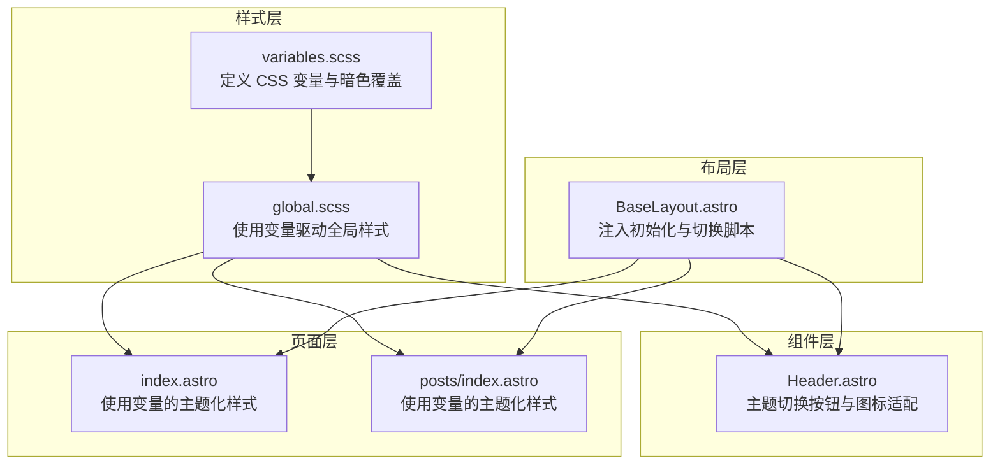
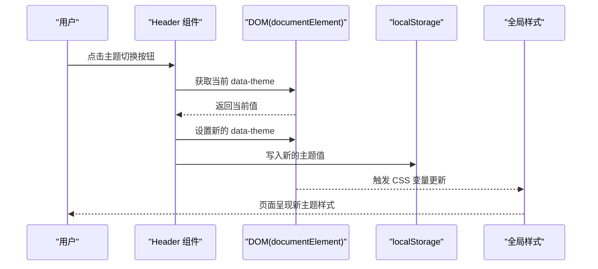
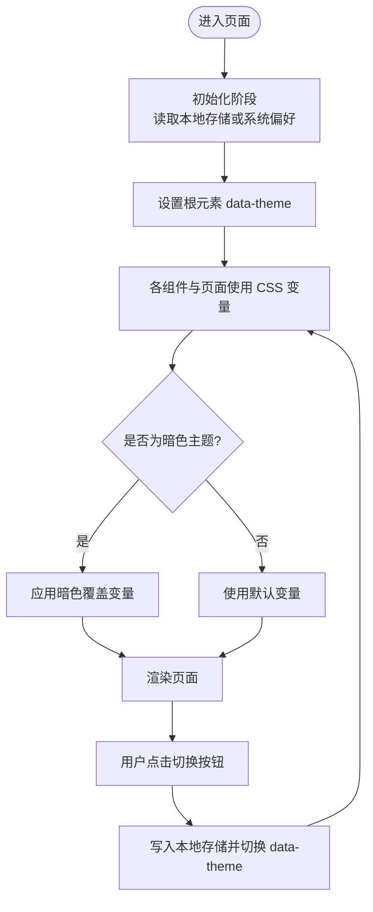
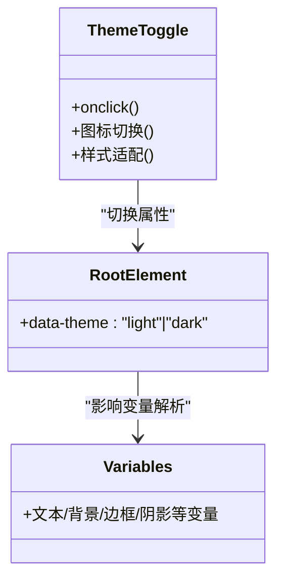
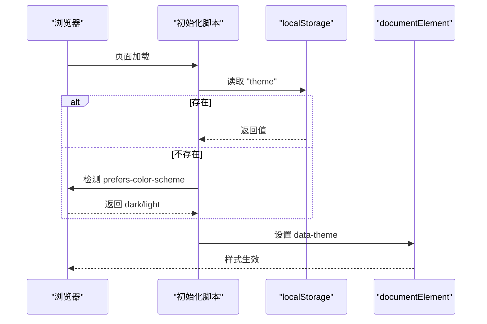
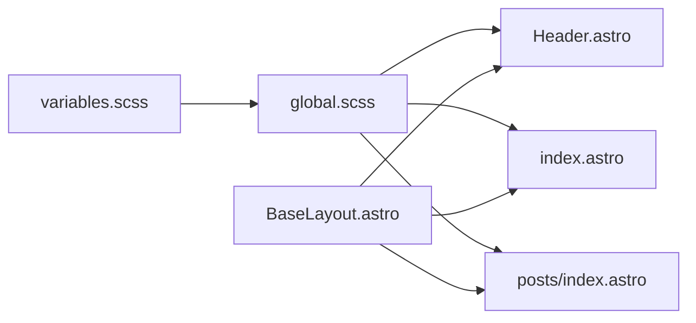

# 主题系统

<cite>
**本文引用的文件**
- [variables.scss](file://src/styles/variables.scss)
- [global.scss](file://src/styles/global.scss)
- [Header.astro](file://src/components/Header.astro)
- [BaseLayout.astro](file://src/layouts/BaseLayout.astro)
- [index.astro](file://src/pages/index.astro)
- [posts/index.astro](file://src/pages/posts/index.astro)
- [package.json](file://package.json)
- [astro.config.mjs](file://astro.config.mjs)
</cite>

## 目录
1. [简介](#简介)
2. [项目结构](#项目结构)
3. [核心组件](#核心组件)
4. [架构总览](#架构总览)
5. [详细组件分析](#详细组件分析)
6. [依赖关系分析](#依赖关系分析)
7. [性能考量](#性能考量)
8. [故障排查指南](#故障排查指南)
9. [结论](#结论)
10. [附录：自定义与最佳实践](#附录自定义与最佳实践)

## 简介
本主题系统基于 CSS 自定义属性（CSS 变量）实现，采用 Astro 渐进增强的静态站点生成框架，通过在根元素上设置 data-theme 属性来驱动明/暗两套主题。系统包含以下特性：
- 明亮主题与暗黑主题的完整变量覆盖
- 无闪烁初始化（避免 SSR 到 CSR 切换时的视觉跳变）
- 本地存储持久化用户选择
- 基于系统偏好自动检测
- 响应式设计下的主题适配
- 可扩展的变量体系与主题定制指南

## 项目结构
主题系统涉及的关键文件与职责如下：
- 样式层
  - 变量定义：集中于变量文件，定义基础变量与暗色主题覆盖
  - 全局样式：使用变量驱动页面主体、排版、工具类与主题切换按钮
- 布局层
  - 基础布局：在 head 中注入初始化脚本，在 body 注入切换脚本
- 组件层
  - 头部组件：提供主题切换按钮，并根据当前主题显示不同图标
- 页面层
  - 首页与文章列表页等页面样式均使用变量进行主题化

图表来源
- [variables.scss:1-108](file://src/styles/variables.scss#L1-L108)
- [global.scss:1-222](file://src/styles/global.scss#L1-L222)
- [BaseLayout.astro:28-50](file://src/layouts/BaseLayout.astro#L28-L50)
- [Header.astro:28-43](file://src/components/Header.astro#L28-L43)
- [index.astro:48-109](file://src/pages/index.astro#L48-L109)
- [posts/index.astro:45-93](file://src/pages/posts/index.astro#L45-L93)

章节来源
- [variables.scss:1-108](file://src/styles/variables.scss#L1-L108)
- [global.scss:1-222](file://src/styles/global.scss#L1-L222)
- [BaseLayout.astro:28-50](file://src/layouts/BaseLayout.astro#L28-L50)
- [Header.astro:28-43](file://src/components/Header.astro#L28-L43)
- [index.astro:48-109](file://src/pages/index.astro#L48-L109)
- [posts/index.astro:45-93](file://src/pages/posts/index.astro#L45-L93)

## 核心组件
- CSS 变量与作用域
  - 在根元素上定义大量语义化变量，涵盖品牌色、文字、背景、边框、阴影、圆角、间距、字号、行高、过渡与容器宽度等
  - 暗色主题通过在根元素上添加 data-theme="dark" 的选择器对关键变量进行覆盖
- 初始化与切换逻辑
  - 在 head 中内联脚本读取本地存储或系统偏好，设置根元素的 data-theme，避免闪烁
  - 在 body 中注入切换函数，点击按钮切换 data-theme 并持久化到本地存储
- 主题切换按钮
  - 使用两个 SVG 图标，分别代表日/夜模式；通过根元素上的主题选择器控制图标显示
- 响应式适配
  - 在多个组件中使用变量控制间距、字号与布局，确保在小屏设备上保持一致的主题观感

章节来源
- [variables.scss:5-83](file://src/styles/variables.scss#L5-L83)
- [variables.scss:85-107](file://src/styles/variables.scss#L85-L107)
- [BaseLayout.astro:28-50](file://src/layouts/BaseLayout.astro#L28-L50)
- [Header.astro:28-43](file://src/components/Header.astro#L28-L43)
- [Header.astro:138-145](file://src/components/Header.astro#L138-L145)
- [global.scss:22-29](file://src/styles/global.scss#L22-L29)

## 架构总览
主题系统的核心流程如下：
- 页面加载时，初始化脚本根据本地存储或系统偏好设置 data-theme
- 用户点击主题切换按钮，切换 data-theme 并写入本地存储
- 全局样式与组件样式通过 CSS 变量自动响应主题变化
- 暗色主题通过根元素选择器覆盖关键变量，实现整体风格切换

图表来源
- [BaseLayout.astro:39-50](file://src/layouts/BaseLayout.astro#L39-L50)
- [Header.astro:28](file://src/components/Header.astro#L28)
- [global.scss:22-29](file://src/styles/global.scss#L22-L29)

## 详细组件分析

### CSS 变量与作用域
- 设计理念
  - 采用“语义化变量名 + 分层变量”的组织方式，便于维护与扩展
  - 将品牌主色、文字层级、背景层级、边框、阴影、圆角、间距、字号、行高、过渡与容器宽度统一管理
- 变量覆盖策略
  - 在根元素上定义默认变量
  - 通过 [data-theme="dark"] 选择器对关键变量进行覆盖，形成暗色主题
- 作用域与继承
  - 变量在根元素生效，子元素通过 var() 引用，实现全局一致的主题控制

图表来源
- [BaseLayout.astro:28-33](file://src/layouts/BaseLayout.astro#L28-L33)
- [BaseLayout.astro:39-50](file://src/layouts/BaseLayout.astro#L39-L50)
- [variables.scss:5-83](file://src/styles/variables.scss#L5-L83)
- [variables.scss:85-107](file://src/styles/variables.scss#L85-L107)

章节来源
- [variables.scss:5-83](file://src/styles/variables.scss#L5-L83)
- [variables.scss:85-107](file://src/styles/variables.scss#L85-L107)

### 主题切换按钮与图标适配
- 按钮行为
  - 点击触发切换函数，切换 data-theme 并持久化
- 图标适配
  - 默认隐藏月亮图标，当处于暗色主题时显示月亮图标，否则显示太阳图标
- 样式细节
  - 使用变量控制尺寸、背景、颜色与过渡，保证与整体主题一致

图表来源
- [Header.astro:28-43](file://src/components/Header.astro#L28-L43)
- [Header.astro:138-145](file://src/components/Header.astro#L138-L145)
- [variables.scss:5-83](file://src/styles/variables.scss#L5-L83)

章节来源
- [Header.astro:28-43](file://src/components/Header.astro#L28-L43)
- [Header.astro:138-145](file://src/components/Header.astro#L138-L145)

### 初始化与本地存储持久化
- 无闪烁初始化
  - 在 head 中内联脚本，优先读取本地存储，其次检测系统偏好，最后设置根元素 data-theme
- 切换与持久化
  - 切换函数读取当前主题，计算下一个主题，设置根元素属性并写入本地存储
- 全局一致性
  - 由于所有样式依赖 CSS 变量，切换后全局样式自动更新

图表来源
- [BaseLayout.astro:28-33](file://src/layouts/BaseLayout.astro#L28-L33)
- [BaseLayout.astro:39-50](file://src/layouts/BaseLayout.astro#L39-L50)

章节来源
- [BaseLayout.astro:28-33](file://src/layouts/BaseLayout.astro#L28-L33)
- [BaseLayout.astro:39-50](file://src/layouts/BaseLayout.astro#L39-L50)

### 响应式设计中的主题适配
- 变量驱动的响应式
  - 多个组件与页面使用变量控制字号、间距、圆角与布局，确保在小屏设备上主题观感一致
- 媒体查询与变量结合
  - 在头部组件中使用媒体查询调整导航间距，配合变量实现一致的主题体验

章节来源
- [global.scss:177-182](file://src/styles/global.scss#L177-L182)
- [Header.astro:147-151](file://src/components/Header.astro#L147-L151)
- [index.astro:48-109](file://src/pages/index.astro#L48-L109)
- [posts/index.astro:45-93](file://src/pages/posts/index.astro#L45-L93)

## 依赖关系分析
- 样式依赖
  - 全局样式依赖变量文件提供的变量
  - 主题切换按钮样式依赖变量与根元素的主题选择器
- 布局依赖
  - 基础布局负责注入初始化与切换脚本，供组件与页面使用
- 页面依赖
  - 页面样式同样依赖变量，确保主题一致性

图表来源
- [variables.scss:1](file://src/styles/variables.scss#L1)
- [global.scss:1](file://src/styles/global.scss#L1)
- [BaseLayout.astro:2](file://src/layouts/BaseLayout.astro#L2)
- [Header.astro:11](file://src/components/Header.astro#L11)
- [index.astro:1](file://src/pages/index.astro#L1)
- [posts/index.astro:1](file://src/pages/posts/index.astro#L1)

章节来源
- [variables.scss:1-108](file://src/styles/variables.scss#L1-L108)
- [global.scss:1-222](file://src/styles/global.scss#L1-L222)
- [BaseLayout.astro:28-50](file://src/layouts/BaseLayout.astro#L28-L50)
- [Header.astro:28-43](file://src/components/Header.astro#L28-L43)
- [index.astro:48-109](file://src/pages/index.astro#L48-L109)
- [posts/index.astro:45-93](file://src/pages/posts/index.astro#L45-L93)

## 性能考量
- 无闪烁初始化
  - 通过在 head 中内联脚本避免 SSR 到 CSR 的主题闪烁
- 样式内联策略
  - 构建配置开启自动内联样式，减少网络往返，提升首屏渲染性能
- 变量驱动的样式更新
  - 仅需更改根元素的 data-theme，即可触发全站样式更新，无需重载页面或重新编译

章节来源
- [BaseLayout.astro:28-33](file://src/layouts/BaseLayout.astro#L28-L33)
- [astro.config.mjs:8-10](file://astro.config.mjs#L8-L10)

## 故障排查指南
- 主题未生效
  - 检查根元素是否正确设置了 data-theme 属性
  - 确认变量文件已被全局样式正确导入
- 切换无效
  - 检查切换函数是否被正确暴露到全局作用域
  - 确认本地存储权限正常，且未被浏览器隐私模式限制
- 图标不显示
  - 检查根元素的主题选择器是否正确匹配
  - 确认 SVG 图标在对应状态下被正确显示/隐藏

章节来源
- [BaseLayout.astro:39-50](file://src/layouts/BaseLayout.astro#L39-L50)
- [Header.astro:138-145](file://src/components/Header.astro#L138-L145)

## 结论
该主题系统通过 CSS 变量与根元素属性的组合，实现了简洁、高效且可扩展的主题切换机制。其优点包括：
- 无闪烁初始化与本地存储持久化
- 暗色主题覆盖清晰、易于维护
- 响应式设计与变量驱动的样式组织
- 低耦合、高内聚的组件与布局分离

## 附录：自定义与最佳实践

### 自定义主题的方法
- 修改变量文件
  - 在变量文件中调整基础变量值，以改变整体风格
  - 在暗色主题选择器中覆盖关键变量，实现暗色主题差异化
- 新增变量
  - 在变量文件中新增语义化变量，用于特定组件或页面
  - 在组件与页面样式中使用新增变量，保持一致性

章节来源
- [variables.scss:5-83](file://src/styles/variables.scss#L5-L83)
- [variables.scss:85-107](file://src/styles/variables.scss#L85-L107)

### 样式变量的修改指南
- 建议遵循的命名规范
  - 使用语义化名称，如文本、背景、边框、阴影等
  - 采用分层命名，如文本层级、背景层级等
- 变量覆盖顺序
  - 先定义默认变量，再在暗色主题选择器中覆盖关键变量
- 组件与页面使用
  - 在组件与页面样式中统一使用变量，避免硬编码颜色与尺寸

章节来源
- [variables.scss:5-83](file://src/styles/variables.scss#L5-L83)
- [variables.scss:85-107](file://src/styles/variables.scss#L85-L107)
- [global.scss:22-29](file://src/styles/global.scss#L22-L29)

### 响应式设计中的主题适配
- 使用变量控制断点与间距
  - 在媒体查询中结合变量，确保在不同屏幕尺寸下主题观感一致
- 图标与交互状态
  - 通过根元素选择器控制图标显示，保证在不同主题下交互一致

章节来源
- [Header.astro:147-151](file://src/components/Header.astro#L147-L151)
- [Header.astro:138-145](file://src/components/Header.astro#L138-L145)

### 最佳实践
- 保持变量集中管理，避免散落的硬编码颜色
- 在组件中优先使用变量，减少重复定义
- 使用媒体查询与变量结合的方式实现响应式主题
- 通过内联初始化脚本避免主题闪烁
- 利用构建配置优化样式加载性能

章节来源
- [BaseLayout.astro:28-33](file://src/layouts/BaseLayout.astro#L28-L33)
- [astro.config.mjs:8-10](file://astro.config.mjs#L8-L10)