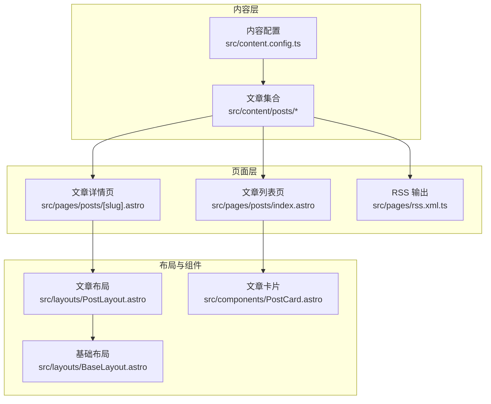
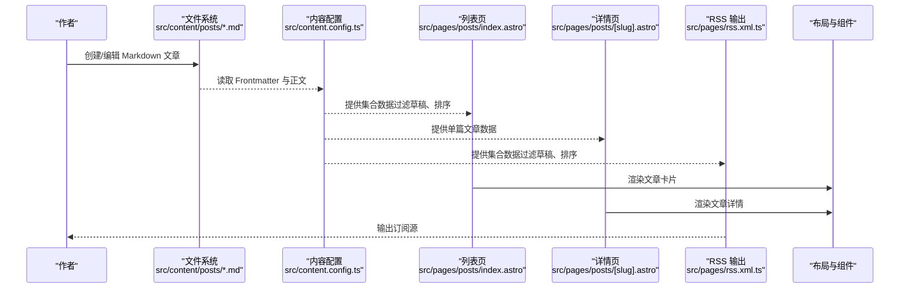
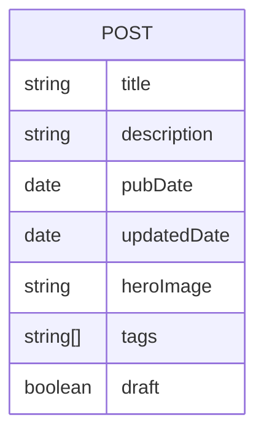
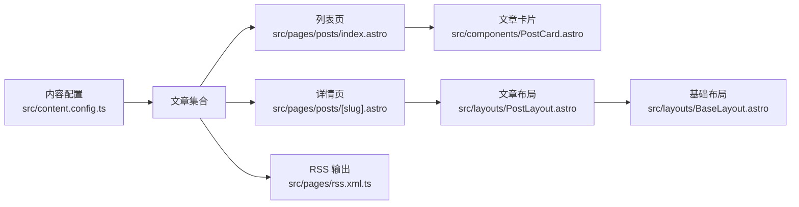

# Markdown 写作指南

<cite>
**本文引用的文件**
- [README.md](file://README.md)
- [src/content.config.ts](file://src/content.config.ts)
- [src/content/posts/welcome.md](file://src/content/posts/welcome.md)
- [src/pages/posts/index.astro](file://src/pages/posts/index.astro)
- [src/pages/posts/[slug].astro](file://src/pages/posts/[slug].astro)
- [src/pages/rss.xml.ts](file://src/pages/rss.xml.ts)
- [src/layouts/BaseLayout.astro](file://src/layouts/BaseLayout.astro)
- [src/layouts/PostLayout.astro](file://src/layouts/PostLayout.astro)
- [src/components/PostCard.astro](file://src/components/PostCard.astro)
- [astro.config.mjs](file://astro.config.mjs)
- [package.json](file://package.json)
</cite>

## 目录
1. [简介](#简介)
2. [项目结构](#项目结构)
3. [核心组件](#核心组件)
4. [架构总览](#架构总览)
5. [详细组件分析](#详细组件分析)
6. [依赖关系分析](#依赖关系分析)
7. [性能考虑](#性能考虑)
8. [故障排除指南](#故障排除指南)
9. [结论](#结论)
10. [附录](#附录)

## 简介
本指南面向使用 Astro 构建的博客作者，系统讲解 Markdown 文章的写作规范与最佳实践，涵盖：
- 标题层级、段落、列表、代码块、链接、图片等基础 Markdown 语法
- 前置数据（Frontmatter）字段的正确格式与用途
- 日期格式、标签系统、草稿状态管理
- 不同类型文章的写作示例与排版建议
- 常见错误与规避方法

## 项目结构
该博客采用 Astro 的内容集合（Content Collections）机制组织文章，核心目录与职责如下：
- src/content/posts：存放 Markdown 文章，按需可扩展为多级目录
- src/content.config.ts：定义内容集合与字段校验规则
- src/pages/posts：文章列表页与文章详情页
- src/layouts：页面布局（基础布局与文章布局）
- src/components：通用组件（如文章卡片）
- src/pages/rss.xml.ts：RSS 输出
- astro.config.mjs：站点配置（如站点地址、集成）



图表来源
- [src/content.config.ts:1-18](file://src/content.config.ts#L1-L18)
- [src/pages/posts/index.astro:1-94](file://src/pages/posts/index.astro#L1-L94)
- [src/pages/posts/[slug].astro:1-116](file://src/pages/posts/[slug].astro#L1-L116)
- [src/pages/rss.xml.ts:1-24](file://src/pages/rss.xml.ts#L1-L24)
- [src/layouts/BaseLayout.astro:1-53](file://src/layouts/BaseLayout.astro#L1-L53)
- [src/layouts/PostLayout.astro:1-36](file://src/layouts/PostLayout.astro#L1-L36)
- [src/components/PostCard.astro:1-113](file://src/components/PostCard.astro#L1-L113)

章节来源
- [README.md:21-32](file://README.md#L21-L32)
- [astro.config.mjs:1-12](file://astro.config.mjs#L1-L12)

## 核心组件
- 内容集合与字段校验：通过内容配置定义文章字段类型、默认值与可选性，确保数据一致性
- 列表页：过滤草稿、按发布时间倒序、聚合标签
- 详情页：渲染文章内容、展示元信息（标题、日期、标签）、返回列表导航
- RSS：输出站点文章的 RSS 订阅源
- 布局与组件：统一 SEO 元信息、主题切换、文章卡片展示

章节来源
- [src/content.config.ts:4-15](file://src/content.config.ts#L4-L15)
- [src/pages/posts/index.astro:6-11](file://src/pages/posts/index.astro#L6-L11)
- [src/pages/posts/[slug].astro:13-21](file://src/pages/posts/[slug].astro#L13-L21)
- [src/pages/rss.xml.ts:5-23](file://src/pages/rss.xml.ts#L5-L23)
- [src/layouts/BaseLayout.astro:14-26](file://src/layouts/BaseLayout.astro#L14-L26)
- [src/components/PostCard.astro:19-38](file://src/components/PostCard.astro#L19-L38)

## 架构总览
从内容到页面的典型流程：
- 内容加载：Astro 读取 src/content/posts 下的 Markdown 文件
- 字段校验：依据内容配置进行类型与默认值处理
- 页面渲染：列表页与详情页分别消费集合数据
- 输出：RSS 订阅、SEO 元信息注入



图表来源
- [src/content.config.ts:4-15](file://src/content.config.ts#L4-L15)
- [src/pages/posts/index.astro:6-11](file://src/pages/posts/index.astro#L6-L11)
- [src/pages/posts/[slug].astro:13-21](file://src/pages/posts/[slug].astro#L13-L21)
- [src/pages/rss.xml.ts:5-23](file://src/pages/rss.xml.ts#L5-L23)

## 详细组件分析

### Markdown 基础语法规范
- 标题层级：建议使用 # 至 ###，配合页面布局与样式保持一致
- 段落：每段之间空一行；长段落建议分句换行以提升可读性
- 列表：有序与无序列表混用时注意缩进与层级
- 代码块：使用三反引号包裹，指定语言以便高亮；避免在代码块内使用过多特殊字符
- 链接：使用标准 Markdown 链接语法；外链添加提示或新窗口打开
- 图片：优先使用相对路径；若需要富媒体能力，可结合 Astro Image 组件（项目已引入）

章节来源
- [src/content/posts/welcome.md:8-53](file://src/content/posts/welcome.md#L8-L53)

### 前置数据（Frontmatter）字段规范
- 字段定义与默认值由内容配置决定，支持类型校验与可选性控制
- 关键字段说明
  - title：字符串，必填
  - description：字符串，必填
  - pubDate：日期类型，必填（支持多种可解析格式）
  - updatedDate：日期类型，可选
  - heroImage：字符串，可选（用于封面图）
  - tags：字符串数组，默认为空数组
  - draft：布尔值，默认 false（草稿不参与列表与 RSS）



图表来源
- [src/content.config.ts:6-14](file://src/content.config.ts#L6-L14)

章节来源
- [src/content.config.ts:4-15](file://src/content.config.ts#L4-L15)
- [src/content/posts/welcome.md:1-6](file://src/content/posts/welcome.md#L1-L6)

### 日期格式要求
- 推荐使用 ISO 8601 风格（例如：YYYY-MM-DD），便于排序与解析
- 列表页与详情页均使用本地化日期格式展示，确保中文显示友好

章节来源
- [src/pages/posts/index.astro:11](file://src/pages/posts/index.astro#L11)
- [src/pages/posts/[slug].astro:16-20](file://src/pages/posts/[slug].astro#L16-L20)
- [src/components/PostCard.astro:12-16](file://src/components/PostCard.astro#L12-L16)

### 标签系统使用
- tags 为字符串数组，默认空数组
- 列表页会聚合所有标签并展示，详情页与卡片组件按需展示
- 建议标签数量适中，避免过长或重复

章节来源
- [src/content.config.ts:12](file://src/content.config.ts#L12)
- [src/pages/posts/index.astro:10-11](file://src/pages/posts/index.astro#L10-L11)
- [src/pages/posts/[slug].astro:31-37](file://src/pages/posts/[slug].astro#L31-L37)
- [src/components/PostCard.astro:28-34](file://src/components/PostCard.astro#L28-L34)

### 草稿状态管理
- draft 字段默认 false；为 true 时在列表页与 RSS 中会被过滤掉
- 发布前可临时设置为草稿，完成后再改为发布状态

章节来源
- [src/content.config.ts:13](file://src/content.config.ts#L13)
- [src/pages/posts/index.astro:7](file://src/pages/posts/index.astro#L7)
- [src/pages/rss.xml.ts:8](file://src/pages/rss.xml.ts#L8)

### 写作示例与模板
- 示例文章位于 src/content/posts/welcome.md，可作为写作模板参考
- 建议遵循“标题层级 + 段落 + 列表 + 代码块 + 引用”的结构顺序
- 使用合适的标签组织文章主题

章节来源
- [src/content/posts/welcome.md:1-53](file://src/content/posts/welcome.md#L1-L53)

### SEO 与元信息
- 基础布局自动注入页面标题、描述、Open Graph 元信息
- 列表页与详情页通过布局传递 title 与 description

章节来源
- [src/layouts/BaseLayout.astro:14-26](file://src/layouts/BaseLayout.astro#L14-L26)
- [src/pages/posts/index.astro:14](file://src/pages/posts/index.astro#L14)
- [src/pages/posts/[slug].astro:23](file://src/pages/posts/[slug].astro#L23)

### RSS 订阅
- RSS 输出会过滤草稿并按发布时间倒序排列
- 输出包含标题、描述、发布时间与链接

章节来源
- [src/pages/rss.xml.ts:5-23](file://src/pages/rss.xml.ts#L5-L23)

## 依赖关系分析
- 内容配置驱动内容集合的数据结构与校验
- 页面层依赖内容集合进行数据消费
- 布局层负责 SEO 与主题注入
- RSS 依赖内容集合与站点配置



图表来源
- [src/content.config.ts:4-15](file://src/content.config.ts#L4-L15)
- [src/pages/posts/index.astro:1-94](file://src/pages/posts/index.astro#L1-L94)
- [src/pages/posts/[slug].astro:1-116](file://src/pages/posts/[slug].astro#L1-L116)
- [src/pages/rss.xml.ts:1-24](file://src/pages/rss.xml.ts#L1-L24)
- [src/layouts/BaseLayout.astro:1-53](file://src/layouts/BaseLayout.astro#L1-L53)
- [src/layouts/PostLayout.astro:1-36](file://src/layouts/PostLayout.astro#L1-L36)
- [src/components/PostCard.astro:1-113](file://src/components/PostCard.astro#L1-L113)

章节来源
- [astro.config.mjs:5-7](file://astro.config.mjs#L5-L7)
- [package.json:12-21](file://package.json#L12-L21)

## 性能考虑
- 列表页按发布时间倒序，减少前端排序开销
- 草稿过滤在服务端完成，降低客户端渲染负担
- 使用 Astro 的静态生成与内联样式策略，提升首屏性能

## 故障排除指南
- Frontmatter 字段缺失或类型不符
  - 现象：构建失败或运行时报错
  - 处理：对照内容配置补齐字段并修正类型
- 日期格式不一致导致排序异常
  - 现象：文章排序不符合预期
  - 处理：统一使用 ISO 8601 风格日期
- 草稿未发布但出现在列表中
  - 现象：草稿被显示
  - 处理：将 draft 设置为 true 并重新构建
- 标签未显示
  - 现象：标签为空或不显示
  - 处理：确认 tags 为字符串数组且非空

章节来源
- [src/content.config.ts:6-14](file://src/content.config.ts#L6-L14)
- [src/pages/posts/index.astro:6-11](file://src/pages/posts/index.astro#L6-L11)
- [src/pages/posts/[slug].astro:16-20](file://src/pages/posts/[slug].astro#L16-L20)

## 结论
本指南总结了 Astro 博客中 Markdown 文章的写作规范与最佳实践，围绕内容配置、页面渲染与订阅输出形成闭环。遵循本文档可确保文章结构清晰、元信息完整、标签与草稿管理规范，并获得良好的 SEO 与阅读体验。

## 附录

### Markdown 语法要点速查
- 标题：# 一级、## 二级、### 三级
- 段落：空行分隔
- 列表：- 无序；数字. 有序
- 强调：**粗体**、*斜体*
- 代码：行内代码 `code`；代码块 ```language
- 链接：[文本](URL)
- 图片：
- 引用：> 引用文本

章节来源
- [src/content/posts/welcome.md:8-53](file://src/content/posts/welcome.md#L8-L53)

### Frontmatter 字段清单
- title：文章标题（字符串，必填）
- description：文章描述（字符串，必填）
- pubDate：发布日期（日期，必填）
- updatedDate：更新日期（日期，可选）
- heroImage：封面图（字符串，可选）
- tags：标签数组（字符串数组，默认空数组）
- draft：草稿标记（布尔，默认 false）

章节来源
- [src/content.config.ts:6-14](file://src/content.config.ts#L6-L14)
- [src/content/posts/welcome.md:1-6](file://src/content/posts/welcome.md#L1-L6)