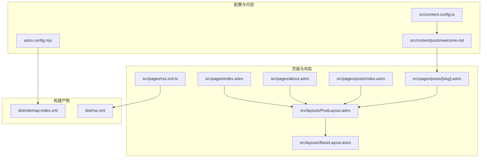
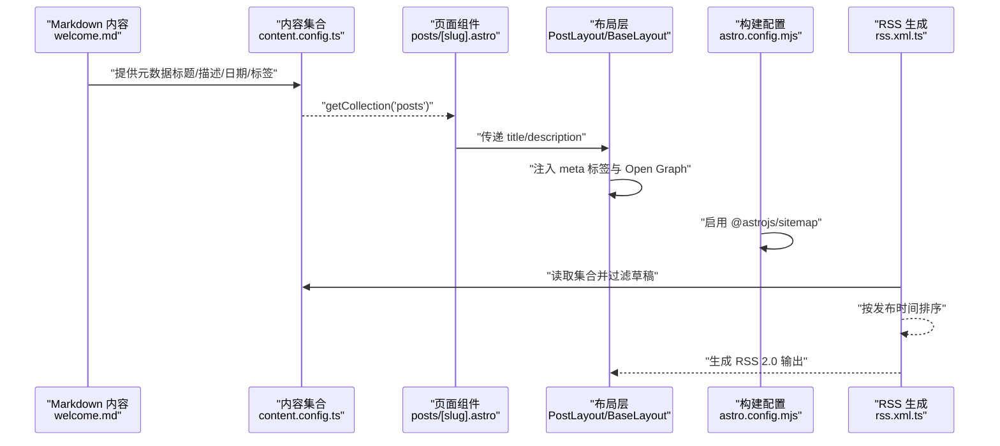
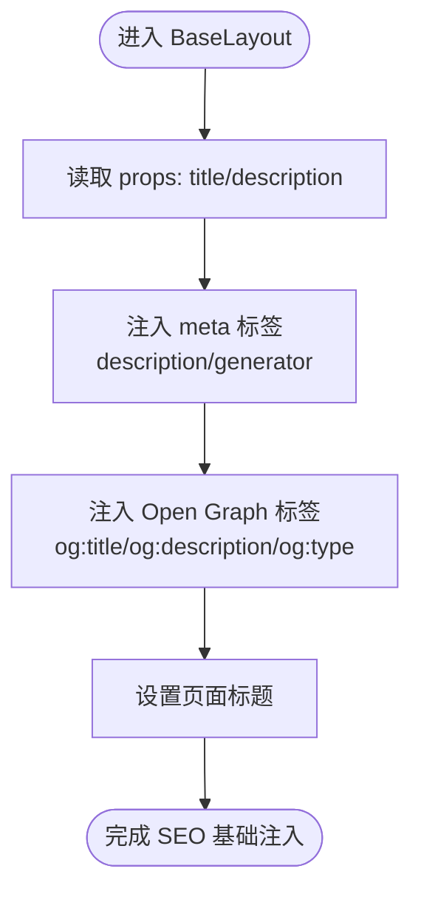
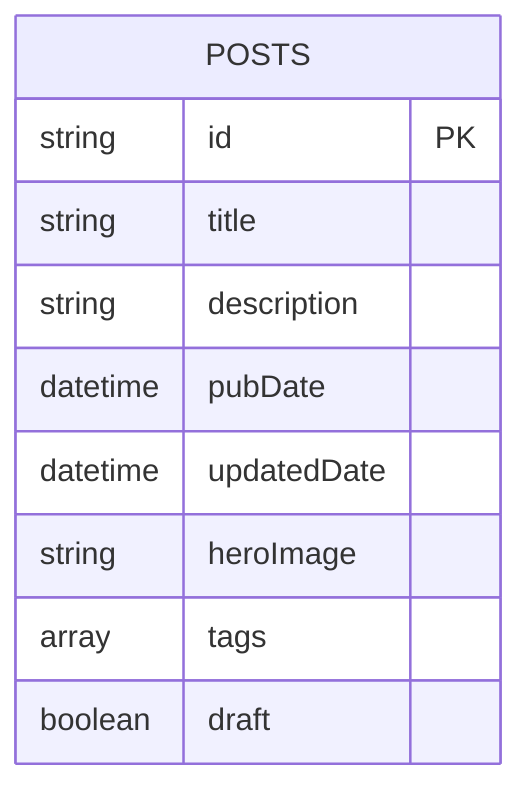
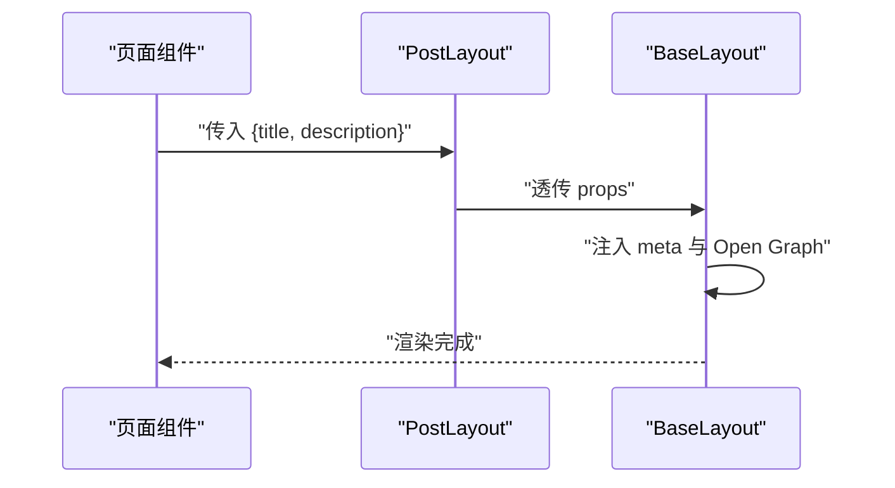
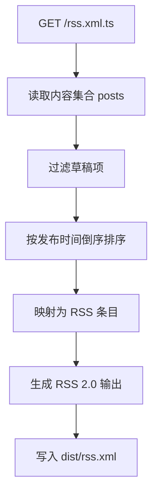
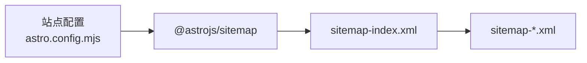
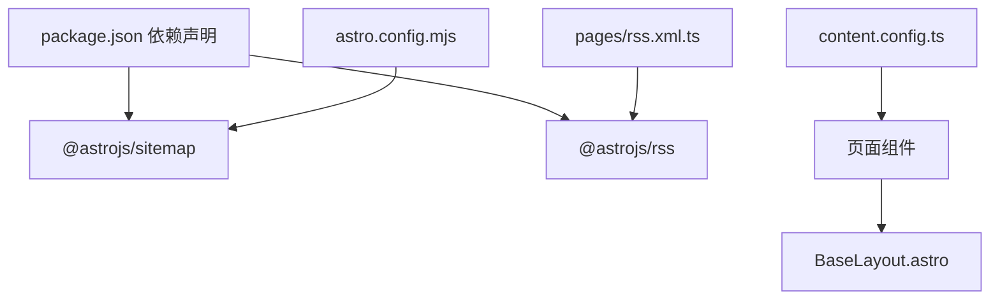

# SEO 内容优化

<cite>
**本文档引用的文件**
- [astro.config.mjs](file://astro.config.mjs)
- [package.json](file://package.json)
- [src/content.config.ts](file://src/content.config.ts)
- [src/layouts/BaseLayout.astro](file://src/layouts/BaseLayout.astro)
- [src/layouts/PostLayout.astro](file://src/layouts/PostLayout.astro)
- [src/pages/rss.xml.ts](file://src/pages/rss.xml.ts)
- [src/pages/index.astro](file://src/pages/index.astro)
- [src/pages/about.astro](file://src/pages/about.astro)
- [src/pages/posts/[slug].astro](file://src/pages/posts/[slug].astro)
- [src/pages/posts/index.astro](file://src/pages/posts/index.astro)
- [src/content/posts/welcome.md](file://src/content/posts/welcome.md)
- [dist/rss.xml](file://dist/rss.xml)
- [dist/sitemap-index.xml](file://dist/sitemap-index.xml)
</cite>

## 目录
1. [简介](#简介)
2. [项目结构](#项目结构)
3. [核心组件](#核心组件)
4. [架构总览](#架构总览)
5. [详细组件分析](#详细组件分析)
6. [依赖关系分析](#依赖关系分析)
7. [性能考虑](#性能考虑)
8. [故障排除指南](#故障排除指南)
9. [结论](#结论)
10. [附录](#附录)

## 简介
本项目基于 Astro Content Collections 提供的静态站点生成能力，实现了基础的 SEO 内容优化功能。通过内容元数据驱动，系统能够自动生成页面标题、描述、Open Graph 标签，并结合站点地图与 RSS 订阅源提升搜索引擎可见性与内容分发效率。本文档将深入解析各组件如何协同工作，以及如何进一步扩展 AMP 支持、结构化数据与 robots.txt 等高级 SEO 能力。

## 项目结构
项目采用 Astro 的典型目录组织：内容集合定义于 src/content.config.ts，页面与布局位于 src/pages 与 src/layouts，构建配置在 astro.config.mjs 中启用站点地图；RSS 订阅源通过 src/pages/rss.xml.ts 实现；内容条目位于 src/content/posts 下的 Markdown 文件。

**图表来源**
- [astro.config.mjs:1-12](file://astro.config.mjs#L1-L12)
- [src/content.config.ts:1-18](file://src/content.config.ts#L1-L18)
- [src/pages/index.astro:1-110](file://src/pages/index.astro#L1-L110)
- [src/pages/about.astro:1-49](file://src/pages/about.astro#L1-L49)
- [src/pages/posts/index.astro:1-94](file://src/pages/posts/index.astro#L1-L94)
- [src/pages/posts/[slug].astro:1-116](file://src/pages/posts/[slug].astro#L1-L116)
- [src/pages/rss.xml.ts:1-24](file://src/pages/rss.xml.ts#L1-L24)
- [src/layouts/BaseLayout.astro:1-53](file://src/layouts/BaseLayout.astro#L1-L53)
- [src/layouts/PostLayout.astro:1-36](file://src/layouts/PostLayout.astro#L1-L36)
- [dist/sitemap-index.xml:1-1](file://dist/sitemap-index.xml#L1-L1)
- [dist/rss.xml:1-1](file://dist/rss.xml#L1-L1)

**章节来源**
- [astro.config.mjs:1-12](file://astro.config.mjs#L1-L12)
- [src/content.config.ts:1-18](file://src/content.config.ts#L1-L18)
- [src/pages/rss.xml.ts:1-24](file://src/pages/rss.xml.ts#L1-L24)

## 核心组件
- 内容集合与元数据：通过 src/content.config.ts 定义 posts 集合，约束每篇文章的元数据字段（标题、描述、发布时间、更新时间、标签、草稿状态等），确保 SEO 所需信息的完整性。
- 布局层 SEO 注入：BaseLayout.astro 在 head 中注入标准 meta 标签（如 description、generator）与 Open Graph 标签（og:title、og:description、og:type），并设置页面 title，形成统一的 SEO 基线。
- 页面层数据传递：各页面（如首页、关于页、文章列表页、文章详情页）通过 PostLayout 向 BaseLayout 传入 title 与 description，保证每个页面的标题与描述可定制且与内容一致。
- 站点地图：通过 astro.config.mjs 启用 @astrojs/sitemap，在构建时自动生成 sitemap 索引与分片文件，便于搜索引擎抓取。
- RSS 订阅源：通过 src/pages/rss.xml.ts 使用 @astrojs/rss 读取内容集合，过滤草稿并按发布时间排序，生成符合规范的 RSS 2.0 输出。

**章节来源**
- [src/content.config.ts:4-15](file://src/content.config.ts#L4-L15)
- [src/layouts/BaseLayout.astro:14-26](file://src/layouts/BaseLayout.astro#L14-L26)
- [src/layouts/PostLayout.astro:14-22](file://src/layouts/PostLayout.astro#L14-L22)
- [src/pages/index.astro:11](file://src/pages/index.astro#L11)
- [src/pages/about.astro:5](file://src/pages/about.astro#L5)
- [src/pages/posts/index.astro:14](file://src/pages/posts/index.astro#L14)
- [src/pages/posts/[slug].astro:23](file://src/pages/posts/[slug].astro#L23)
- [astro.config.mjs:2-11](file://astro.config.mjs#L2-L11)
- [src/pages/rss.xml.ts:5-23](file://src/pages/rss.xml.ts#L5-L23)

## 架构总览
下图展示了从内容到页面再到 SEO 输出的整体流程：内容集合提供元数据，页面层负责渲染与传递 SEO 参数，布局层注入标准与 Open Graph 标签，构建阶段生成站点地图与 RSS。

**图表来源**
- [src/content/posts/welcome.md:1-6](file://src/content/posts/welcome.md#L1-L6)
- [src/content.config.ts:4-15](file://src/content.config.ts#L4-L15)
- [src/pages/posts/[slug].astro:13-14](file://src/pages/posts/[slug].astro#L13-L14)
- [src/layouts/PostLayout.astro:14-22](file://src/layouts/PostLayout.astro#L14-L22)
- [src/layouts/BaseLayout.astro:17-26](file://src/layouts/BaseLayout.astro#L17-L26)
- [astro.config.mjs:7](file://astro.config.mjs#L7)
- [src/pages/rss.xml.ts:6-22](file://src/pages/rss.xml.ts#L6-L22)

## 详细组件分析

### BaseLayout 布局中的 SEO 配置
- 页面标题设置：通过 title 属性注入 HTML 的 <title> 标签，确保每个页面拥有明确的页面标题。
- 描述生成：通过 description 属性注入 <meta name="description">，用于搜索引擎摘要与社交分享预览。
- Open Graph 标签：注入 og:title、og:description、og:type，提升在社交媒体平台（如微信、微博、Facebook）上的分享质量。
- 生成器标识：注入 <meta name="generator">，标注使用 Astro，便于识别与调试。
- 主题初始化：内联脚本根据本地存储或系统偏好设置主题，避免首屏闪烁，间接提升用户体验与 SEO 友好度。

**图表来源**
- [src/layouts/BaseLayout.astro:9-26](file://src/layouts/BaseLayout.astro#L9-L26)

**章节来源**
- [src/layouts/BaseLayout.astro:14-33](file://src/layouts/BaseLayout.astro#L14-L33)

### 内容集合与元数据提取
- 集合定义：通过 defineCollection 与 zod schema 约束，确保每篇文章具备必需字段（标题、描述、发布时间等）与可选字段（更新时间、封面图、标签、草稿标记）。
- 数据来源：Markdown 头部 YAML 提供元数据，Astro 在构建时解析并注入到页面组件中，供页面与布局使用。

**图表来源**
- [src/content.config.ts:6-14](file://src/content.config.ts#L6-L14)
- [src/content/posts/welcome.md:1-6](file://src/content/posts/welcome.md#L1-L6)

**章节来源**
- [src/content.config.ts:4-15](file://src/content.config.ts#L4-L15)
- [src/content/posts/welcome.md:1-6](file://src/content/posts/welcome.md#L1-L6)

### 页面层 SEO 参数传递
- 首页与关于页：直接在页面组件中通过 PostLayout 传入 title 与 description，确保首页与单页的 SEO 参数明确。
- 文章列表与详情页：文章详情页通过 getCollection('posts') 获取当前文章的元数据，并将其传递给 PostLayout，从而在 BaseLayout 中注入对应的 SEO 标签。

**图表来源**
- [src/pages/index.astro:11](file://src/pages/index.astro#L11)
- [src/pages/about.astro:5](file://src/pages/about.astro#L5)
- [src/pages/posts/[slug].astro:23](file://src/pages/posts/[slug].astro#L23)
- [src/layouts/PostLayout.astro:14-22](file://src/layouts/PostLayout.astro#L14-L22)
- [src/layouts/BaseLayout.astro:17-26](file://src/layouts/BaseLayout.astro#L17-L26)

**章节来源**
- [src/pages/index.astro:11](file://src/pages/index.astro#L11)
- [src/pages/about.astro:5](file://src/pages/about.astro#L5)
- [src/pages/posts/[slug].astro:23](file://src/pages/posts/[slug].astro#L23)
- [src/layouts/PostLayout.astro:14-22](file://src/layouts/PostLayout.astro#L14-L22)

### RSS 订阅源自动生成机制
- 数据来源：通过 getCollection('posts') 获取所有文章，过滤 draft 字段为 true 的条目，按 pubDate 降序排列。
- 输出格式：使用 @astrojs/rss 生成 RSS 2.0，包含标题、描述、站点链接、语言与每个条目的标题、链接、发布日期与描述。
- 构建集成：在构建阶段自动生成 RSS XML 文件，供订阅者使用。

**图表来源**
- [src/pages/rss.xml.ts:6-22](file://src/pages/rss.xml.ts#L6-L22)
- [dist/rss.xml:1-1](file://dist/rss.xml#L1-L1)

**章节来源**
- [src/pages/rss.xml.ts:5-23](file://src/pages/rss.xml.ts#L5-L23)
- [dist/rss.xml:1-1](file://dist/rss.xml#L1-L1)

### 站点地图生成与 robots.txt 配置
- 站点地图：通过 @astrojs/sitemap 集成，在构建时生成 sitemap 索引与分片文件，提升搜索引擎抓取效率。
- robots.txt：当前未在仓库中提供 robots.txt，建议在 public 目录添加 robots.txt 并指向生成的 sitemap 索引地址，以指导爬虫抓取策略。

**图表来源**
- [astro.config.mjs:7](file://astro.config.mjs#L7)
- [dist/sitemap-index.xml:1-1](file://dist/sitemap-index.xml#L1-L1)

**章节来源**
- [astro.config.mjs:7](file://astro.config.mjs#L7)
- [dist/sitemap-index.xml:1-1](file://dist/sitemap-index.xml#L1-L1)

### AMP 支持（高级 SEO 功能）
- 当前项目未实现 AMP 页面。若需支持，可在 pages 目录新增 AMP 版本页面，遵循 AMP HTML 规范，并在 BaseLayout 中注入必要的 AMP 标签与资源链接，同时保持与现有 SEO 标签兼容。

[本节为概念性说明，不直接分析具体文件，故无“章节来源”]

## 依赖关系分析
- 构建配置依赖：@astrojs/sitemap 由 astro.config.mjs 启用，用于生成站点地图。
- RSS 依赖：@astrojs/rss 由 rss.xml.ts 引入，用于生成 RSS 订阅源。
- 内容依赖：content.config.ts 定义内容集合与 schema，为页面与 RSS 提供统一的数据模型。

**图表来源**
- [package.json:13-14](file://package.json#L13-L14)
- [astro.config.mjs:7](file://astro.config.mjs#L7)
- [src/pages/rss.xml.ts:1](file://src/pages/rss.xml.ts#L1)
- [src/content.config.ts:4-15](file://src/content.config.ts#L4-L15)

**章节来源**
- [package.json:12-21](file://package.json#L12-L21)
- [astro.config.mjs:5-11](file://astro.config.mjs#L5-L11)
- [src/pages/rss.xml.ts:1](file://src/pages/rss.xml.ts#L1)

## 性能考虑
- 内联样式：构建配置中启用了内联样式策略，有助于减少请求次数，提升首屏渲染性能，间接改善 SEO 加载体验。
- 静态生成：Astro 的静态生成模式使页面无需运行时计算，有利于搜索引擎抓取与缓存。
- 资源优化：建议在 public 目录提供 favicon、manifest 等资源，完善 PWA 与 SEO 基础设施。

**章节来源**
- [astro.config.mjs:8-10](file://astro.config.mjs#L8-L10)

## 故障排除指南
- RSS 订阅源链接异常：当前 RSS 输出中的文章链接包含 undefined，需检查文章 slug 与链接生成逻辑，确保链接路径正确。
- 站点地图未生效：确认 @astrojs/sitemap 已在 astro.config.mjs 中启用，并检查生成的 sitemap-index.xml 是否存在。
- Open Graph 图片缺失：可在文章元数据中增加 heroImage，并在 BaseLayout 中扩展 og:image 注入逻辑，以提升社交分享效果。

**章节来源**
- [dist/rss.xml:1-1](file://dist/rss.xml#L1-L1)
- [dist/sitemap-index.xml:1-1](file://dist/sitemap-index.xml#L1-L1)
- [src/layouts/BaseLayout.astro:21-25](file://src/layouts/BaseLayout.astro#L21-L25)

## 结论
本项目通过 Astro Content Collections 与布局层的统一注入，实现了基础的 SEO 优化能力，包括页面标题、描述与 Open Graph 标签的自动生成。结合站点地图与 RSS 订阅源，提升了搜索引擎可见性与内容分发效率。建议后续补充 robots.txt、AMP 支持与结构化数据，以进一步完善 SEO 体系。

## 附录
- 最佳实践清单
  - 为每篇文章提供完整的元数据（标题、描述、发布时间、标签）。
  - 在 BaseLayout 中统一注入 SEO 标签，避免重复与遗漏。
  - 使用 @astrojs/sitemap 生成站点地图，并在 robots.txt 中指向索引文件。
  - 通过 @astrojs/rss 自动生成订阅源，保持与内容同步。
  - 考虑引入结构化数据（JSON-LD）以增强搜索结果丰富性。
  - 对外链与图片进行 SEO 友好命名与压缩，提升加载速度与可访问性。

[本节为通用建议，不直接分析具体文件，故无“章节来源”]