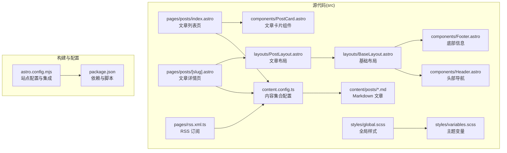
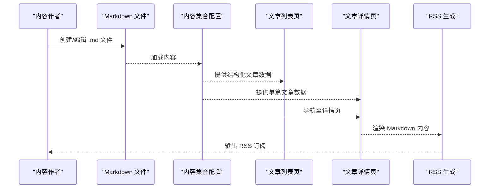
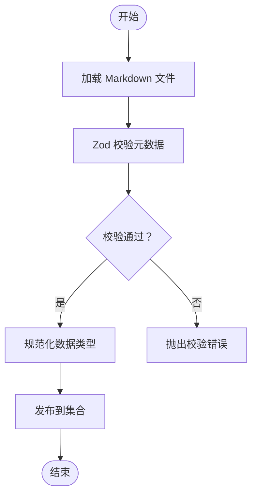
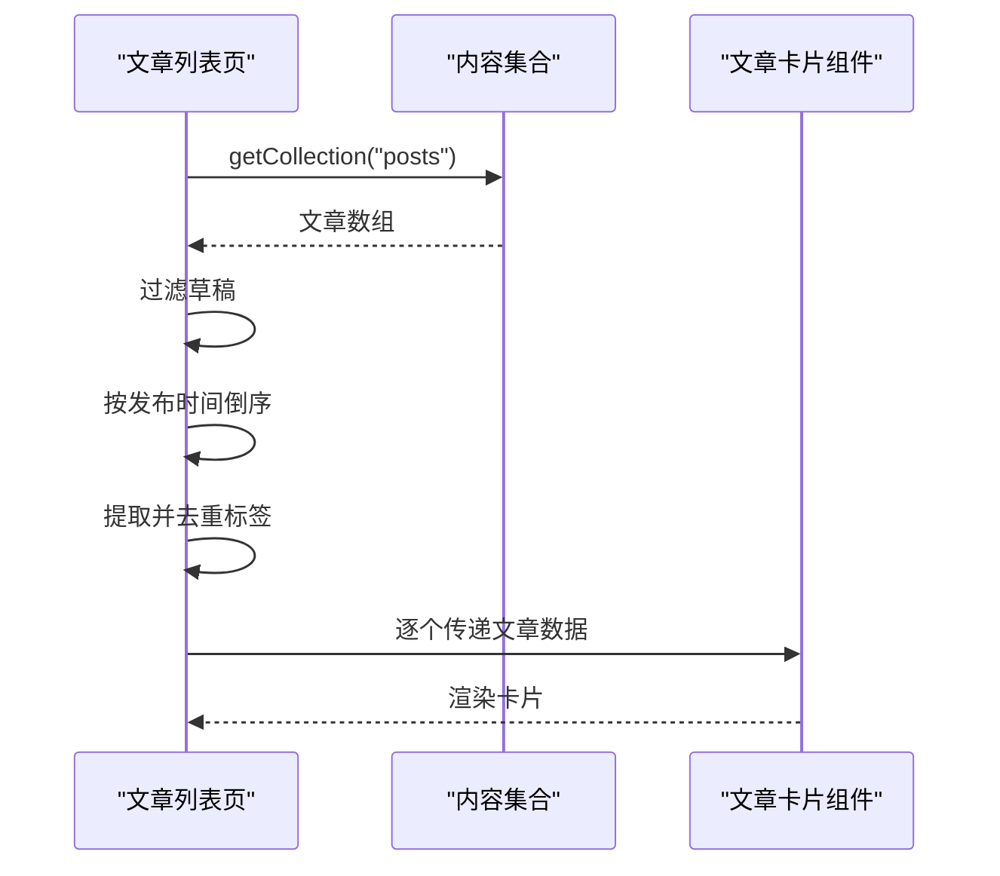
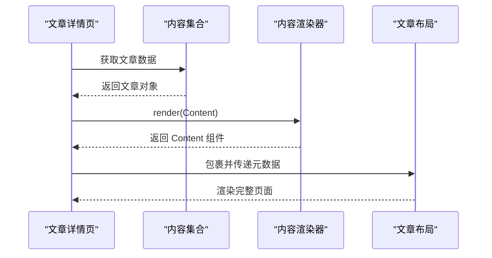
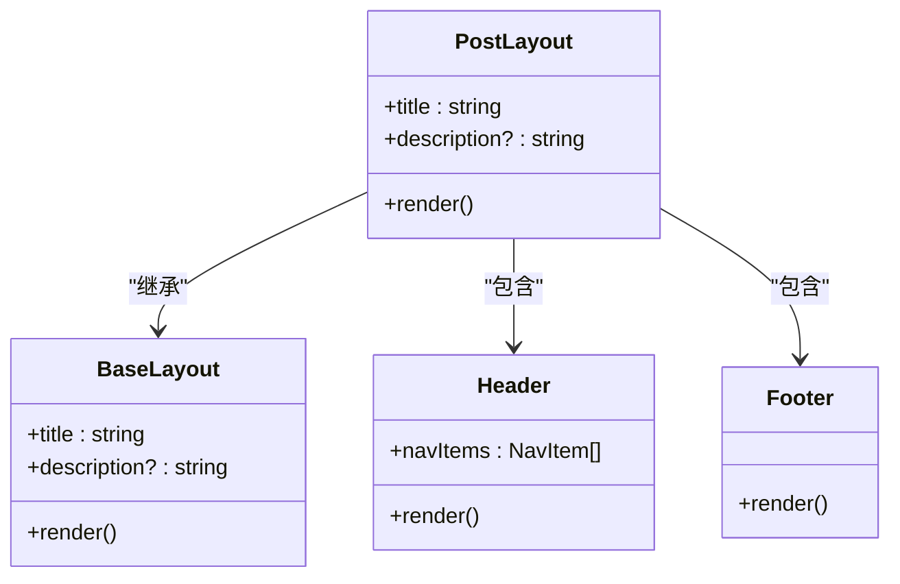
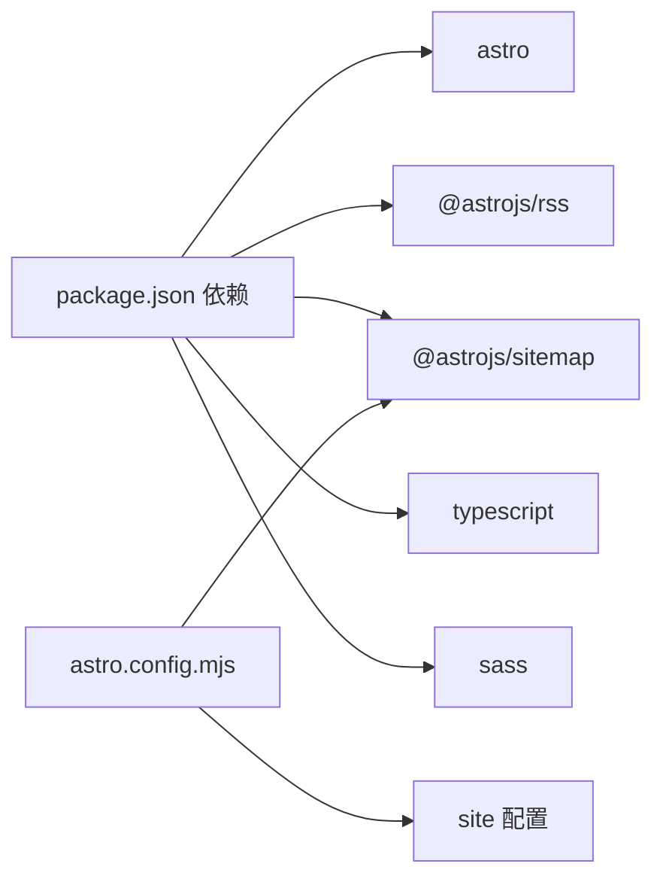

# 内容管理系统

<cite>
**本文引用的文件**
- [src/content.config.ts](file://src/content.config.ts)
- [src/content/posts/welcome.md](file://src/content/posts/welcome.md)
- [src/pages/posts/index.astro](file://src/pages/posts/index.astro)
- [src/pages/posts/[slug].astro](file://src/pages/posts/[slug].astro)
- [src/layouts/PostLayout.astro](file://src/layouts/PostLayout.astro)
- [src/layouts/BaseLayout.astro](file://src/layouts/BaseLayout.astro)
- [src/components/PostCard.astro](file://src/components/PostCard.astro)
- [src/components/Header.astro](file://src/components/Header.astro)
- [src/components/Footer.astro](file://src/components/Footer.astro)
- [src/pages/rss.xml.ts](file://src/pages/rss.xml.ts)
- [package.json](file://package.json)
- [astro.config.mjs](file://astro.config.mjs)
- [src/styles/global.scss](file://src/styles/global.scss)
- [src/styles/variables.scss](file://src/styles/variables.scss)
- [README.md](file://README.md)
</cite>

## 目录
1. [简介](#简介)
2. [项目结构](#项目结构)
3. [核心组件](#核心组件)
4. [架构总览](#架构总览)
5. [详细组件分析](#详细组件分析)
6. [依赖关系分析](#依赖关系分析)
7. [性能考量](#性能考量)
8. [故障排查指南](#故障排查指南)
9. [结论](#结论)
10. [附录](#附录)

## 简介
本项目是一个基于 Astro Content Collections 的内容管理系统，专注于博客文章的创建、编辑、组织与发布。系统通过内容集合（Content Collections）对 Markdown 文章进行统一管理，支持草稿过滤、按发布时间排序、标签系统、RSS 输出以及站点地图生成等特性。前端采用 Astro 组件化开发，结合 SCSS 变量系统与响应式布局，提供良好的阅读体验与可维护性。

## 项目结构
项目采用“按功能分层”的目录组织方式，核心内容位于 src/content/posts 下以 Markdown 形式存储；页面路由由 src/pages 提供；UI 组件与布局分别位于 src/components 与 src/layouts；样式通过 SCSS 变量与全局样式统一管理；构建与集成通过 astro.config.mjs 与 package.json 配置。

图表来源
- [src/content.config.ts:1-18](file://src/content.config.ts#L1-L18)
- [src/pages/posts/index.astro:1-94](file://src/pages/posts/index.astro#L1-L94)
- [src/pages/posts/[slug].astro:1-116](file://src/pages/posts/[slug].astro#L1-L116)
- [src/layouts/PostLayout.astro:1-36](file://src/layouts/PostLayout.astro#L1-L36)
- [src/layouts/BaseLayout.astro:1-53](file://src/layouts/BaseLayout.astro#L1-L53)
- [src/components/PostCard.astro:1-113](file://src/components/PostCard.astro#L1-L113)
- [src/components/Header.astro:1-153](file://src/components/Header.astro#L1-L153)
- [src/components/Footer.astro:1-65](file://src/components/Footer.astro#L1-L65)
- [src/pages/rss.xml.ts:1-24](file://src/pages/rss.xml.ts#L1-L24)
- [astro.config.mjs:1-12](file://astro.config.mjs#L1-L12)
- [package.json:1-22](file://package.json#L1-L22)

章节来源
- [README.md:21-32](file://README.md#L21-L32)
- [astro.config.mjs:1-12](file://astro.config.mjs#L1-L12)
- [package.json:1-22](file://package.json#L1-L22)

## 核心组件
- 内容集合配置：定义文章集合的加载模式与数据校验规则，确保文章元数据的类型安全与一致性。
- 文章列表页：读取集合、过滤草稿、按发布时间倒序排列，并渲染文章卡片与标签筛选区。
- 文章详情页：基于静态路径生成，渲染 Markdown 内容与文章元数据，提供返回列表的导航。
- 布局系统：基础布局负责 SEO 元数据与主题初始化；文章布局封装通用结构与导航。
- 组件体系：文章卡片组件复用性强，支持标题、摘要、日期与标签展示；头部与底部组件提供导航与版权信息。
- RSS 与站点地图：自动输出 RSS 订阅与站点地图，提升 SEO 与订阅体验。

章节来源
- [src/content.config.ts:4-15](file://src/content.config.ts#L4-L15)
- [src/pages/posts/index.astro:6-43](file://src/pages/posts/index.astro#L6-L43)
- [src/pages/posts/[slug].astro:5-49](file://src/pages/posts/[slug].astro#L5-L49)
- [src/layouts/PostLayout.astro:14-22](file://src/layouts/PostLayout.astro#L14-L22)
- [src/layouts/BaseLayout.astro:14-26](file://src/layouts/BaseLayout.astro#L14-L26)
- [src/components/PostCard.astro:19-38](file://src/components/PostCard.astro#L19-L38)
- [src/components/Header.astro:11-45](file://src/components/Header.astro#L11-L45)
- [src/components/Footer.astro:5-22](file://src/components/Footer.astro#L5-L22)
- [src/pages/rss.xml.ts:5-23](file://src/pages/rss.xml.ts#L5-L23)

## 架构总览
系统采用“内容即数据”的架构思想，通过 Astro Content Collections 将 Markdown 文档转换为结构化数据，再由页面组件消费这些数据进行渲染。静态路径生成确保每个文章都有独立的静态页面，RSS 与站点地图由 API 路由统一生成，整体流程清晰、可扩展性强。

图表来源
- [src/content.config.ts:4-15](file://src/content.config.ts#L4-L15)
- [src/pages/posts/index.astro:6-43](file://src/pages/posts/index.astro#L6-L43)
- [src/pages/posts/[slug].astro:13-49](file://src/pages/posts/[slug].astro#L13-L49)
- [src/pages/rss.xml.ts:5-23](file://src/pages/rss.xml.ts#L5-L23)

## 详细组件分析

### 内容集合配置与验证
- 加载策略：使用 glob 模式匹配 src/content/posts 下的所有 Markdown 文件，确保新增文章无需手动注册。
- 数据模式：通过 Zod schema 对文章元数据进行强类型校验，包括标题、描述、发布时间、可选更新时间、封面图、标签数组与草稿布尔值。
- 默认值：标签默认为空数组，草稿默认 false，便于后续过滤与展示控制。

图表来源
- [src/content.config.ts:4-15](file://src/content.config.ts#L4-L15)

章节来源
- [src/content.config.ts:4-15](file://src/content.config.ts#L4-L15)

### 文章列表页实现
- 数据获取：通过 getCollection('posts') 获取全部文章。
- 草稿过滤：使用 filter 过滤 draft 为 true 的文章。
- 排序逻辑：按 pubDate 倒序排列，确保最新文章在前。
- 标签系统：提取所有标签并去重，用于展示标签筛选区。
- 渲染组件：遍历文章列表，使用 PostCard 组件展示标题、摘要、日期与标签。

图表来源
- [src/pages/posts/index.astro:6-43](file://src/pages/posts/index.astro#L6-L43)
- [src/components/PostCard.astro:19-38](file://src/components/PostCard.astro#L19-L38)

章节来源
- [src/pages/posts/index.astro:6-43](file://src/pages/posts/index.astro#L6-L43)
- [src/components/PostCard.astro:19-38](file://src/components/PostCard.astro#L19-L38)

### 文章详情页实现
- 静态路径生成：通过 getStaticPaths 动态生成所有文章的静态路由参数。
- 内容渲染：使用 render 方法将 Markdown 内容渲染为 Astro 组件，注入到页面中。
- 元数据显示：展示标题、描述、格式化的发布时间与标签。
- 导航与样式：提供返回列表页的链接，并应用统一的文章排版样式。

图表来源
- [src/pages/posts/[slug].astro:5-49](file://src/pages/posts/[slug].astro#L5-L49)
- [src/layouts/PostLayout.astro:14-22](file://src/layouts/PostLayout.astro#L14-L22)

章节来源
- [src/pages/posts/[slug].astro:5-49](file://src/pages/posts/[slug].astro#L5-L49)
- [src/layouts/PostLayout.astro:14-22](file://src/layouts/PostLayout.astro#L14-L22)

### 布局与组件体系
- 基础布局：设置语言、SEO 元数据、Open Graph 信息与主题初始化脚本，保证页面基础体验。
- 文章布局：组合 Header、主内容区与 Footer，提供一致的页面结构。
- 头部导航：包含首页、文章、关于等导航项，并根据当前路径高亮活动状态。
- 底部信息：显示版权信息与 RSS 链接，便于订阅与归档。

图表来源
- [src/layouts/BaseLayout.astro:14-26](file://src/layouts/BaseLayout.astro#L14-L26)
- [src/layouts/PostLayout.astro:14-22](file://src/layouts/PostLayout.astro#L14-L22)
- [src/components/Header.astro:11-45](file://src/components/Header.astro#L11-L45)
- [src/components/Footer.astro:5-22](file://src/components/Footer.astro#L5-L22)

章节来源
- [src/layouts/BaseLayout.astro:14-26](file://src/layouts/BaseLayout.astro#L14-L26)
- [src/layouts/PostLayout.astro:14-22](file://src/layouts/PostLayout.astro#L14-L22)
- [src/components/Header.astro:11-45](file://src/components/Header.astro#L11-L45)
- [src/components/Footer.astro:5-22](file://src/components/Footer.astro#L5-L22)

### 样式与主题系统
- 变量系统：通过 SCSS 变量集中管理颜色、字体、间距、圆角与阴影等设计令牌，支持明暗主题切换。
- 全局排版：为文章内容提供 .prose 类，统一标题、段落、代码块、表格等元素的视觉风格。
- 主题切换：在基础布局中注入主题初始化与切换脚本，持久化用户偏好。

章节来源
- [src/styles/variables.scss:5-107](file://src/styles/variables.scss#L5-L107)
- [src/styles/global.scss:35-171](file://src/styles/global.scss#L35-L171)
- [src/layouts/BaseLayout.astro:29-50](file://src/layouts/BaseLayout.astro#L29-L50)

### RSS 与站点地图
- RSS 输出：读取已发布的文章，按发布时间倒序，生成 RSS 条目，包含标题、描述、发布时间与链接。
- 站点地图：通过 Astro 集成自动生成站点地图，提升搜索引擎收录效率。

章节来源
- [src/pages/rss.xml.ts:5-23](file://src/pages/rss.xml.ts#L5-L23)
- [astro.config.mjs:7](file://astro.config.mjs#L7)

## 依赖关系分析
- 构建与运行：使用 Astro 作为核心框架，配合 SASS 与 TypeScript 提升开发体验。
- 集成能力：启用站点地图生成，增强 SEO；RSS 生成器提供订阅能力。
- 开发脚本：提供开发、构建、预览等常用命令，简化本地与 CI 流程。

图表来源
- [package.json:12-20](file://package.json#L12-L20)
- [astro.config.mjs:5-11](file://astro.config.mjs#L5-L11)

章节来源
- [package.json:12-20](file://package.json#L12-L20)
- [astro.config.mjs:5-11](file://astro.config.mjs#L5-L11)

## 性能考量
- 静态生成：文章详情页采用静态路径生成，减少运行时开销，提升首屏性能。
- 内容内联：构建配置支持内联样式，降低网络往返次数，优化加载速度。
- 资源优化：合理使用 SCSS 变量与组件复用，避免重复样式与冗余 DOM 结构。

章节来源
- [astro.config.mjs:8-10](file://astro.config.mjs#L8-L10)
- [src/pages/posts/[slug].astro:5-11](file://src/pages/posts/[slug].astro#L5-L11)

## 故障排查指南
- 文章未出现在列表：检查文章元数据是否符合 schema 规范，确认 draft 字段为 false。
- 发布时间排序异常：确认 pubDate 格式正确且为有效日期，避免空值或非法格式。
- 标签筛选无效：确认标签数组非空且为字符串数组，确保前端正确提取与渲染。
- RSS 订阅无内容：检查 RSS 路由是否正确过滤草稿并按发布时间排序。
- 静态路径缺失：确认 getStaticPaths 是否返回正确的 slug 参数与 props。

章节来源
- [src/content.config.ts:6-14](file://src/content.config.ts#L6-L14)
- [src/pages/posts/index.astro:6-8](file://src/pages/posts/index.astro#L6-L8)
- [src/pages/posts/[slug].astro:5-11](file://src/pages/posts/[slug].astro#L5-L11)
- [src/pages/rss.xml.ts:7-9](file://src/pages/rss.xml.ts#L7-L9)

## 结论
该内容管理系统以 Astro Content Collections 为核心，实现了从内容创作到页面渲染的全链路自动化。通过严格的元数据校验、清晰的组件化结构与完善的 SEO 集成，为内容创作者提供了高效、可靠的博客发布方案。建议在实际使用中遵循本文提供的写作规范与最佳实践，持续优化内容质量与用户体验。

## 附录

### Markdown 写作规范与示例
- 文件位置：在 src/content/posts/ 目录下创建 .md 文件。
- 前置数据（Frontmatter）字段：
  - title：文章标题（必填）
  - description：文章描述（必填）
  - pubDate：发布日期（必填，日期格式）
  - updatedDate：更新日期（可选，日期格式）
  - heroImage：封面图（可选）
  - tags：标签数组（默认空数组）
  - draft：草稿标记（默认 false）
- 示例参考：欢迎文章展示了完整的 Frontmatter 与 Markdown 内容结构。

章节来源
- [src/content.config.ts:6-14](file://src/content.config.ts#L6-L14)
- [src/content/posts/welcome.md:1-53](file://src/content/posts/welcome.md#L1-L53)

### 内容集合配置与验证规则
- 加载模式：glob 匹配 src/content/posts 下的 Markdown 文件。
- 校验规则：Zod schema 对字段类型与默认值进行约束。
- 输出集合：collections.posts 供页面组件调用。

章节来源
- [src/content.config.ts:4-15](file://src/content.config.ts#L4-L15)

### 文章列表与详情页面实现要点
- 列表页：过滤草稿、按发布时间倒序、提取标签、渲染卡片组件。
- 详情页：静态路径生成、内容渲染、元数据展示、返回列表导航。

章节来源
- [src/pages/posts/index.astro:6-43](file://src/pages/posts/index.astro#L6-L43)
- [src/pages/posts/[slug].astro:5-49](file://src/pages/posts/[slug].astro#L5-L49)

### 草稿管理、排序与搜索（扩展建议）
- 草稿管理：通过 draft 字段控制是否参与公开展示，建议在列表与 RSS 中统一过滤。
- 内容排序：默认按 pubDate 倒序；如需多维排序可在前端扩展。
- 搜索功能：可在前端实现基于标题、描述与标签的轻量搜索，或引入第三方搜索服务。

章节来源
- [src/pages/posts/index.astro:6-8](file://src/pages/posts/index.astro#L6-L8)
- [src/pages/rss.xml.ts:7-9](file://src/pages/rss.xml.ts#L7-L9)

### 最佳实践
- 统一使用 ISO 日期格式，确保排序与渲染一致性。
- 标签命名保持简洁与语义化，便于筛选与归档。
- 使用 heroImage 提升文章封面体验，但注意资源体积与加载性能。
- 在文章末尾添加“返回列表”等导航，提升用户浏览连贯性。

章节来源
- [src/pages/posts/[slug].astro:46](file://src/pages/posts/[slug].astro#L46)
- [src/components/PostCard.astro:28-34](file://src/components/PostCard.astro#L28-L34)