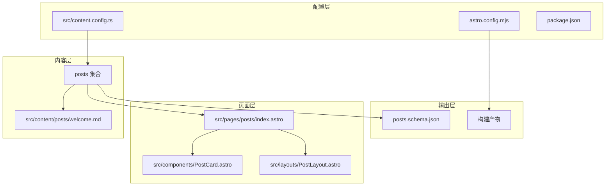
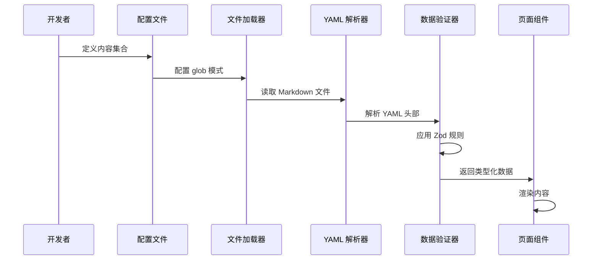
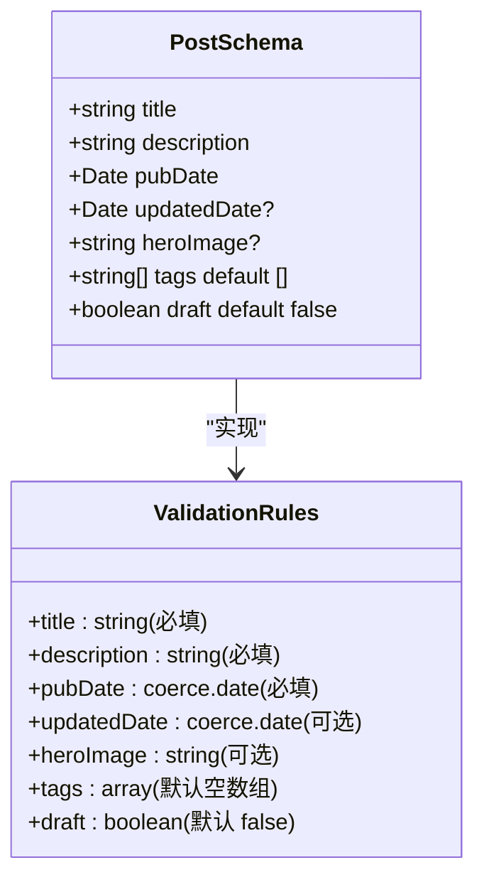
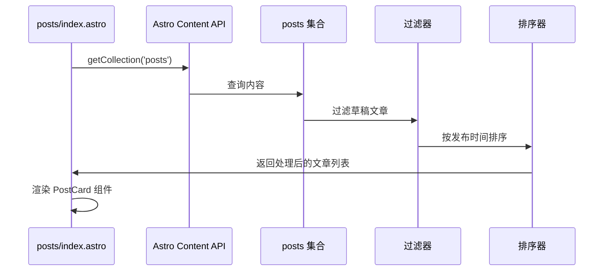
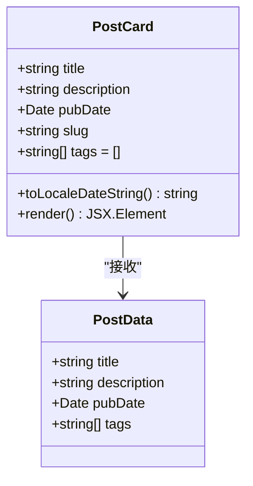

# 内容集合配置

<cite>
**本文档引用的文件**
- [src/content.config.ts](file://src/content.config.ts)
- [src/content/posts/welcome.md](file://src/content/posts/welcome.md)
- [.astro/collections/posts.schema.json](file://.astro/collections/posts.schema.json)
- [astro.config.mjs](file://astro.config.mjs)
- [package.json](file://package.json)
- [src/pages/posts/index.astro](file://src/pages/posts/index.astro)
- [src/components/PostCard.astro](file://src/components/PostCard.astro)
- [src/layouts/PostLayout.astro](file://src/layouts/PostLayout.astro)
</cite>

## 目录
1. [简介](#简介)
2. [项目结构](#项目结构)
3. [核心组件](#核心组件)
4. [架构概览](#架构概览)
5. [详细组件分析](#详细组件分析)
6. [依赖关系分析](#依赖关系分析)
7. [性能考虑](#性能考虑)
8. [故障排除指南](#故障排除指南)
9. [结论](#结论)
10. [附录](#附录)

## 简介

本项目展示了 Astro Content Collections 的完整配置和使用示例。通过定义内容集合，我们能够以类型安全的方式管理博客文章内容，包括元数据验证、数据转换和查询功能。

Astro Content Collections 提供了强大的内容管理能力，允许开发者：
- 定义内容集合的结构和验证规则
- 使用 Zod Schema 进行数据验证
- 通过 glob 模式自动发现内容文件
- 获取类型化的数据进行页面渲染

## 项目结构

项目采用标准的 Astro 项目结构，重点关注内容集合的配置和使用：



**图表来源**
- [src/content.config.ts:1-18](file://src/content.config.ts#L1-L18)
- [src/pages/posts/index.astro:1-94](file://src/pages/posts/index.astro#L1-L94)

**章节来源**
- [src/content.config.ts:1-18](file://src/content.config.ts#L1-L18)
- [astro.config.mjs:1-12](file://astro.config.mjs#L1-L12)
- [package.json:1-22](file://package.json#L1-L22)

## 核心组件

### 内容集合配置

项目的核心是 `posts` 集合的配置，它定义了内容的结构、验证规则和加载方式。

#### defineCollection 函数详解

`defineCollection` 是 Astro Content Collections 的核心 API，用于定义内容集合的配置。其主要参数包括：

- **loader**: 指定内容文件的发现方式
- **schema**: 定义内容数据的验证规则

#### posts 集合配置参数

posts 集合的配置展示了完整的配置模式：

```mermaid
flowchart TD
DefineCollection[defineCollection] --> Loader[glob 加载器]
DefineCollection --> Schema[Zod Schema]
Loader --> Pattern[glob 模式: "**/*.md"]
Loader --> Base[基础路径: "./src/content/posts"]
Schema --> Fields[字段定义]
Fields --> Title[title: string]
Fields --> Description[description: string]
Fields --> PubDate[pubDate: coerce.date]
Fields --> UpdatedDate[updatedDate: coerce.date?]
Fields --> HeroImage[heroImage: string?]
Fields --> Tags[tags: array<string> default []]
Fields --> Draft[draft: boolean default false]
```

**图表来源**
- [src/content.config.ts:4-15](file://src/content.config.ts#L4-L15)

**章节来源**
- [src/content.config.ts:1-18](file://src/content.config.ts#L1-L18)

## 架构概览

整个内容集合系统的工作流程如下：



**图表来源**
- [src/content.config.ts:4-15](file://src/content.config.ts#L4-L15)
- [src/pages/posts/index.astro:6-8](file://src/pages/posts/index.astro#L6-L8)

## 详细组件分析

### posts 集合配置分析

#### glob 模式配置

posts 集合使用 `glob` 加载器来自动发现内容文件：

- **模式**: `"**/*.md"` - 匹配所有层级的 Markdown 文件
- **基础路径**: `"./src/content/posts"` - 指定内容文件的根目录

这种配置确保了：
- 自动发现新添加的文章
- 支持嵌套目录结构
- 灵活的内容组织方式

#### Zod Schema 验证规则

Schema 定义了严格的数据验证规则：



**图表来源**
- [src/content.config.ts:6-14](file://src/content.config.ts#L6-L14)

##### 字段详细说明

| 字段名 | 类型 | 必填 | 默认值 | 说明 |
|--------|------|------|--------|------|
| title | string | ✓ | - | 文章标题 |
| description | string | ✓ | - | 文章描述 |
| pubDate | Date | ✓ | - | 发布日期（自动转换） |
| updatedDate | Date | - | - | 更新日期（自动转换） |
| heroImage | string | - | - | 头图路径 |
| tags | string[] | - | [] | 标签数组 |
| draft | boolean | - | false | 草稿状态 |

**章节来源**
- [src/content.config.ts:6-14](file://src/content.config.ts#L6-L14)
- [.astro/collections/posts.schema.json:1-42](file://.astro/collections/posts.schema.json#L1-L42)

### 内容文件示例分析

welcome.md 展示了实际的内容文件格式：

```mermaid
flowchart LR
FrontMatter[YAML Front Matter] --> Title[title: "欢迎来到我的博客"]
FrontMatter --> Description[description: "这是第一篇文章..."]
FrontMatter --> PubDate[pubDate: 2024-01-15]
FrontMatter --> Tags[tags: ["博客", "Astro"]]
Content[Markdown 内容] --> Title
Content --> Description
Content --> PubDate
Content --> Tags
```

**图表来源**
- [src/content/posts/welcome.md:1-6](file://src/content/posts/welcome.md#L1-L6)

**章节来源**
- [src/content/posts/welcome.md:1-53](file://src/content/posts/welcome.md#L1-L53)

### 页面集成分析

#### 文章列表页面

文章列表页面展示了如何使用内容集合：



**图表来源**
- [src/pages/posts/index.astro:6-8](file://src/pages/posts/index.astro#L6-L8)

##### 关键特性

- **草稿过滤**: `!post.data.draft` 过滤草稿状态
- **时间排序**: 按发布日期降序排列
- **标签聚合**: 自动生成标签列表
- **类型安全**: 所有数据都经过 Zod 验证

**章节来源**
- [src/pages/posts/index.astro:1-94](file://src/pages/posts/index.astro#L1-L94)

### 组件集成分析

#### PostCard 组件

PostCard 组件接收类型化的 props 并进行本地化处理：



**图表来源**
- [src/components/PostCard.astro:2-10](file://src/components/PostCard.astro#L2-L10)

**章节来源**
- [src/components/PostCard.astro:1-113](file://src/components/PostCard.astro#L1-L113)

## 依赖关系分析

### 项目依赖关系

```mermaid
graph TB
subgraph "运行时依赖"
Astro[astro@6.1.8]
Zod[zod (内置)]
Sitemap[@astrojs/sitemap@3.7.2]
RSS[@astrojs/rss@4.0.18]
end
subgraph "开发依赖"
TypeScript[typescript^5.9.0]
Sass[sass^1.99.0]
end
subgraph "项目模块"
ContentConfig[src/content.config.ts]
PostsCollection[posts 集合]
Pages[页面组件]
end
ContentConfig --> PostsCollection
PostsCollection --> Pages
Astro --> ContentConfig
Sitemap --> Pages
RSS --> Pages
```

**图表来源**
- [package.json:12-20](file://package.json#L12-L20)

**章节来源**
- [package.json:1-22](file://package.json#L1-22)

### 构建配置分析

项目使用 Astro 的默认配置，支持内容集合的自动发现和类型生成：

**章节来源**
- [astro.config.mjs:1-12](file://astro.config.mjs#L1-L12)

## 性能考虑

### 内容加载优化

1. **懒加载**: Astro 会按需加载内容集合
2. **类型缓存**: 编译时生成类型信息，减少运行时开销
3. **增量构建**: 只重新构建受影响的内容文件

### 数据验证性能

- Zod 验证在构建时进行，不会影响运行时性能
- 类型推导减少了运行时类型检查的需要

## 故障排除指南

### 常见问题及解决方案

#### 1. 内容文件未被发现

**症状**: 新添加的文章不显示在页面上

**解决方案**:
- 检查文件路径是否在 `./src/content/posts` 目录下
- 确认文件扩展名为 `.md`
- 验证 YAML front matter 格式正确

#### 2. 数据验证错误

**症状**: 构建时报错，提示字段类型不匹配

**解决方案**:
- 检查 `pubDate` 和 `updatedDate` 是否为有效的日期格式
- 确认 `tags` 为字符串数组
- 验证 `draft` 为布尔值

#### 3. 类型错误

**症状**: TypeScript 报告类型错误

**解决方案**:
- 确保所有必需字段都已提供
- 检查可选字段的类型注解
- 验证导入语句正确性

**章节来源**
- [src/content.config.ts:6-14](file://src/content.config.ts#L6-L14)

## 结论

Astro Content Collections 提供了一个强大而灵活的内容管理系统。通过合理的配置和类型安全的设计，开发者可以轻松地管理博客内容，同时获得完整的开发体验。

关键优势：
- **类型安全**: 编译时验证确保数据完整性
- **自动发现**: 无需手动维护内容列表
- **灵活验证**: Zod Schema 提供强大的数据验证能力
- **性能优化**: 构建时处理，运行时高效

## 附录

### 配置最佳实践

#### 1. 字段设计原则

- **必要字段**: 仅包含真正必要的字段
- **可选字段**: 使用 `optional()` 或提供默认值
- **类型明确**: 明确指定每个字段的数据类型

#### 2. 数据验证策略

- **严格验证**: 在生产环境中保持严格的验证规则
- **宽松开发**: 开发环境可以使用更宽松的规则
- **错误处理**: 实现适当的错误处理和回退机制

#### 3. 性能优化建议

- **合理分页**: 对大量内容使用分页策略
- **缓存策略**: 利用 Astro 的内置缓存机制
- **资源优化**: 优化图片和媒体资源的处理

### 扩展内容集合类型

要添加新的内容集合，遵循以下步骤：

1. 在 `src/content.config.ts` 中定义新的集合
2. 创建对应的目录结构
3. 编写内容文件的 YAML front matter
4. 在页面中使用 `getCollection()` 获取数据
5. 更新类型定义以反映新的结构