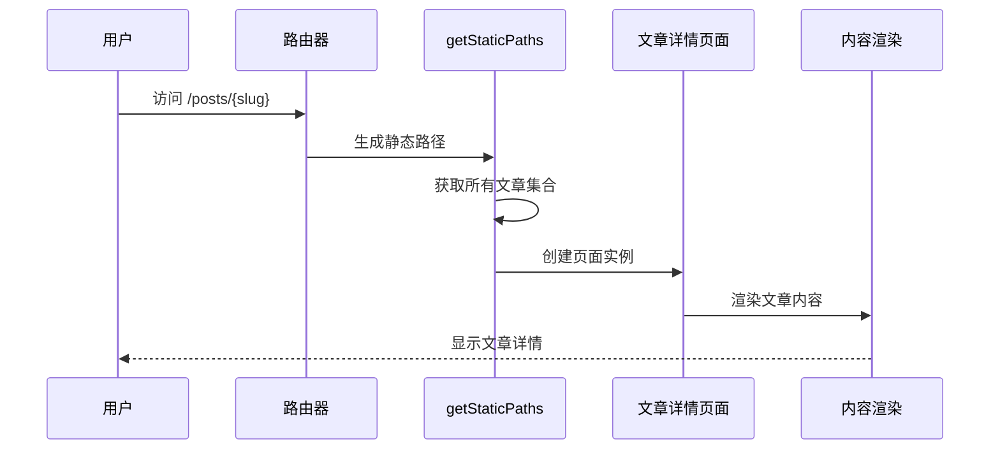
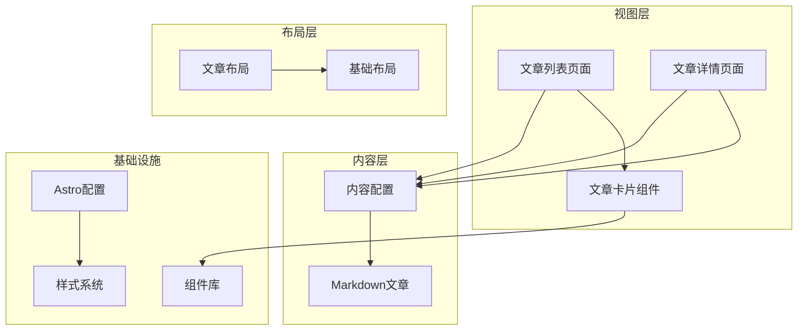
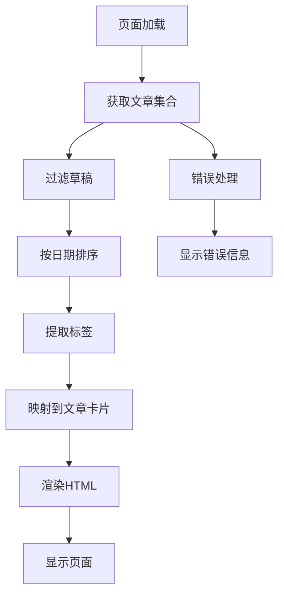
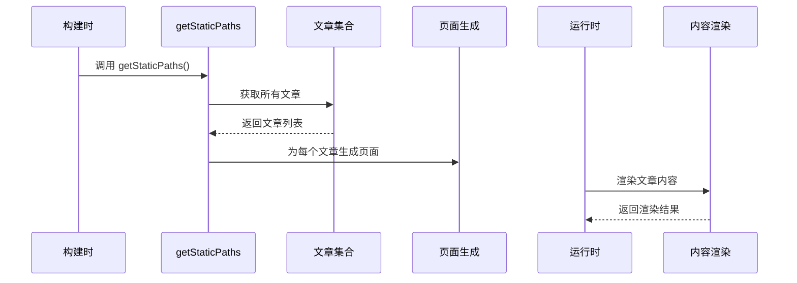
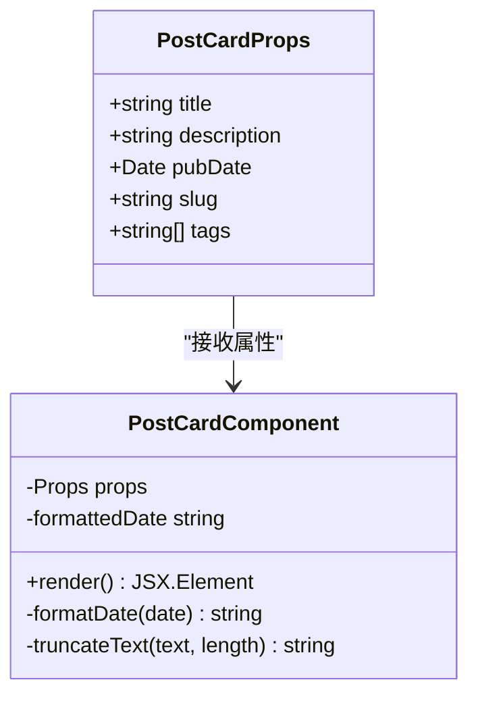
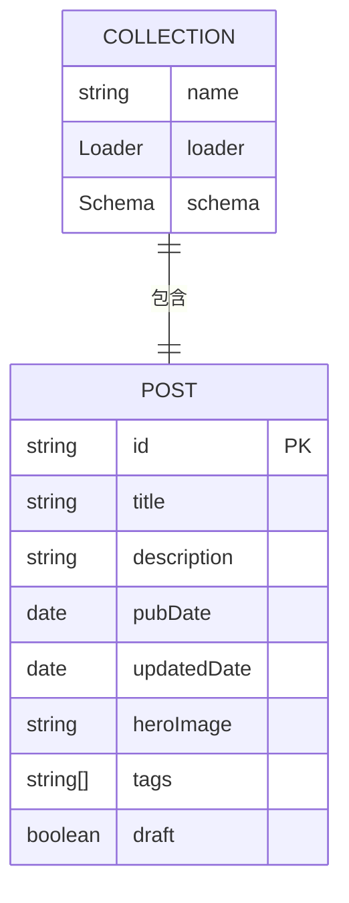
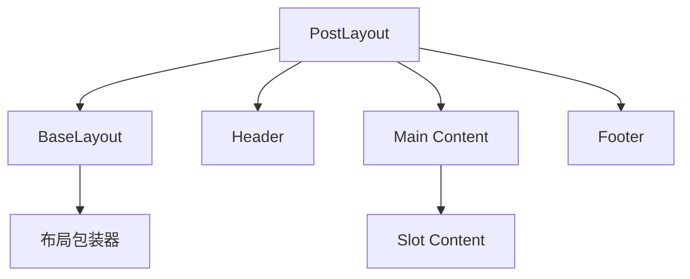
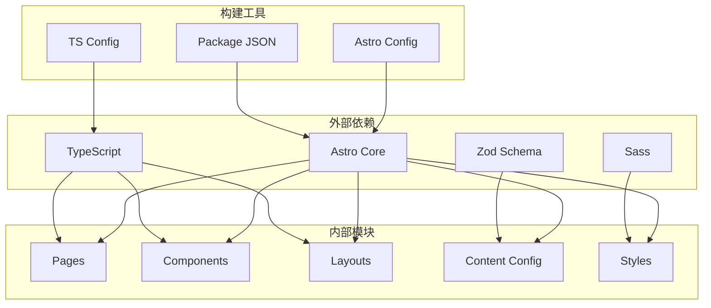

# 文章管理

<cite>
**本文档引用的文件**
- [src/pages/posts/index.astro](file://src/pages/posts/index.astro)
- [src/pages/posts/[slug].astro](file://src/pages/posts/[slug].astro)
- [src/components/PostCard.astro](file://src/components/PostCard.astro)
- [src/content.config.ts](file://src/content.config.ts)
- [src/content/posts/welcome.md](file://src/content/posts/welcome.md)
- [src/layouts/PostLayout.astro](file://src/layouts/PostLayout.astro)
- [src/layouts/BaseLayout.astro](file://src/layouts/BaseLayout.astro)
- [src/components/Header.astro](file://src/components/Header.astro)
- [src/components/Footer.astro](file://src/components/Footer.astro)
- [astro.config.mjs](file://astro.config.mjs)
- [package.json](file://package.json)
- [tsconfig.json](file://tsconfig.json)
- [src/styles/global.scss](file://src/styles/global.scss)
</cite>

## 目录
1. [简介](#简介)
2. [项目结构](#项目结构)
3. [核心组件](#核心组件)
4. [架构概览](#架构概览)
5. [详细组件分析](#详细组件分析)
6. [依赖关系分析](#依赖关系分析)
7. [性能考虑](#性能考虑)
8. [故障排除指南](#故障排除指南)
9. [最佳实践](#最佳实践)
10. [结论](#结论)

## 简介

这是一个基于 Astro 构建的静态博客系统，专注于文章管理功能。该系统提供了完整的内容管理系统，包括文章列表展示、动态路由处理、文章详情页面、文章卡片组件以及内容状态管理等功能。系统采用 Markdown 格式存储文章内容，支持草稿发布、标签分类、时间排序等特性。

## 项目结构

该项目采用模块化的文件组织方式，主要分为以下几个部分：

```mermaid
graph TB
subgraph "源代码结构"
SRC[src/] --> COMPONENTS[components/]
SRC --> CONTENT[content/]
SRC --> LAYOUTS[layouts/]
SRC --> PAGES[pages/]
SRC --> STYLES[styles/]
COMPONENTS --> POSTCARD[PostCard.astro]
COMPONENTS --> HEADER[Header.astro]
COMPONENTS --> FOOTER[Footer.astro]
CONTENT --> POSTS[posts/]
POSTS --> WELCOME[welcome.md]
LAYOUTS --> POSTLAYOUT[PostLayout.astro]
LAYOUTS --> BASELAYOUT[BaseLayout.astro]
PAGES --> POSTSPAGES[posts/]
POSTSPAGES --> INDEX[index.astro]
POSTSPAGES --> SLUG[[slug].astro]
STYLES --> GLOBAL[global.scss]
STYLES --> VARIABLES[variables.scss]
end
subgraph "配置文件"
ASTROCONFIG[astro.config.mjs]
PACKAGEJSON[package.json]
TSCONFIG[tsconfig.json]
CONTENTCONFIG[src/content.config.ts]
end
```

**图表来源**
- [src/pages/posts/index.astro:1-94](file://src/pages/posts/index.astro#L1-L94)
- [src/pages/posts/[slug].astro](file://src/pages/posts/[slug].astro#L1-L116)
- [src/content.config.ts:1-18](file://src/content.config.ts#L1-L18)

**章节来源**
- [src/pages/posts/index.astro:1-94](file://src/pages/posts/index.astro#L1-L94)
- [src/pages/posts/[slug].astro](file://src/pages/posts/[slug].astro#L1-L116)
- [src/content.config.ts:1-18](file://src/content.config.ts#L1-L18)

## 核心组件

### 文章集合管理

系统通过 `getCollection()` 函数实现文章数据的统一管理。该函数从内容目录中读取所有 Markdown 文件，并根据定义的模式进行过滤和排序。

```mermaid
flowchart TD
START[开始] --> GETCOLLECTION[调用 getCollection('posts')]
GETCOLLECTION --> FILTERDRAFT[过滤草稿文章]
FILTERDRAFT --> SORTPOSTS[按发布时间降序排序]
SORTPOSTS --> EXTRACTTAGS[提取所有标签]
EXTRACTTAGS --> RENDERPAGE[渲染文章列表页面]
RENDERPAGE --> ENDFINISH[完成]
```

**图表来源**
- [src/pages/posts/index.astro:6-8](file://src/pages/posts/index.astro#L6-L8)

### 动态路由系统

文章详情页面采用 Astro 的动态路由机制，通过 `[slug].astro` 文件实现 URL 参数处理和页面渲染。



**图表来源**
- [src/pages/posts/[slug].astro](file://src/pages/posts/[slug].astro#L5-L14)

**章节来源**
- [src/pages/posts/index.astro:6-11](file://src/pages/posts/index.astro#L6-L11)
- [src/pages/posts/[slug].astro](file://src/pages/posts/[slug].astro#L5-L14)

## 架构概览

系统采用分层架构设计，确保关注点分离和代码可维护性：



**图表来源**
- [src/pages/posts/index.astro:1-4](file://src/pages/posts/index.astro#L1-L4)
- [src/pages/posts/[slug].astro](file://src/pages/posts/[slug].astro#L1-L3)
- [src/content.config.ts:1-18](file://src/content.config.ts#L1-L18)

## 详细组件分析

### 文章列表页面 (index.astro)

文章列表页面是用户访问博客时的主要入口，负责展示所有已发布的文章。

#### 数据获取与处理流程



**图表来源**
- [src/pages/posts/index.astro:6-8](file://src/pages/posts/index.astro#L6-L8)

#### 关键功能特性

1. **草稿过滤**: 自动过滤标记为草稿的文章，确保只显示已发布内容
2. **智能排序**: 按发布日期降序排列，最新文章显示在最前面
3. **标签系统**: 自动生成标签云，支持文章分类浏览
4. **响应式设计**: 使用 CSS 变量和弹性布局适配不同屏幕尺寸

**章节来源**
- [src/pages/posts/index.astro:1-94](file://src/pages/posts/index.astro#L1-L94)

### 文章详情页面 ([slug].astro)

动态路由实现文章详情页面，支持基于 URL 参数的文章内容渲染。

#### 动态路由实现机制



**图表来源**
- [src/pages/posts/[slug].astro](file://src/pages/posts/[slug].astro#L5-L14)

#### 内容渲染流程

文章详情页面采用 Astro 的内容渲染机制，支持 Markdown 到 HTML 的转换：

1. **静态路径生成**: 构建时为所有文章生成对应的静态页面
2. **运行时渲染**: 加载文章内容并转换为 HTML
3. **元数据处理**: 格式化发布日期和标签信息
4. **布局应用**: 应用统一的文章布局模板

**章节来源**
- [src/pages/posts/[slug].astro](file://src/pages/posts/[slug].astro#L1-L116)

### PostCard 组件

PostCard 是文章卡片组件，用于在文章列表中显示文章摘要信息。

#### 组件接口设计



**图表来源**
- [src/components/PostCard.astro:2-8](file://src/components/PostCard.astro#L2-L8)

#### 显示逻辑与交互

1. **链接跳转**: 整个卡片区域作为链接，点击后导航到文章详情页面
2. **摘要展示**: 显示文章标题和描述，使用 CSS 限制显示行数
3. **元数据显示**: 展示格式化的发布日期和标签
4. **视觉反馈**: 悬停效果提供更好的用户体验

**章节来源**
- [src/components/PostCard.astro:1-113](file://src/components/PostCard.astro#L1-L113)

### 内容配置系统

内容配置定义了文章内容的数据结构和验证规则。

#### 数据模型定义



**图表来源**
- [src/content.config.ts:4-15](file://src/content.config.ts#L4-L15)

#### 字段验证机制

系统使用 Zod 库进行数据验证，确保内容的一致性和完整性：

1. **必需字段**: 标题、描述、发布日期等
2. **可选字段**: 更新日期、封面图片等
3. **默认值**: 标签数组默认为空数组
4. **类型约束**: 严格的数据类型检查

**章节来源**
- [src/content.config.ts:1-18](file://src/content.config.ts#L1-L18)

### 布局系统

系统采用多层布局架构，提供一致的用户体验。

#### 布局层次结构



**图表来源**
- [src/layouts/PostLayout.astro:14-22](file://src/layouts/PostLayout.astro#L14-L22)

**章节来源**
- [src/layouts/PostLayout.astro:1-36](file://src/layouts/PostLayout.astro#L1-L36)
- [src/layouts/BaseLayout.astro:1-53](file://src/layouts/BaseLayout.astro#L1-L53)

## 依赖关系分析

系统依赖关系清晰明确，遵循单一职责原则：



**图表来源**
- [package.json:12-20](file://package.json#L12-L20)
- [astro.config.mjs:1-12](file://astro.config.mjs#L1-L12)

**章节来源**
- [package.json:1-22](file://package.json#L1-L22)
- [astro.config.mjs:1-12](file://astro.config.mjs#L1-L12)

## 性能考虑

### 构建时优化

1. **静态生成**: 所有页面在构建时生成，提供最佳的加载性能
2. **内联样式**: 配置自动内联样式表，减少网络请求
3. **资源优化**: 使用 Sitemap 和 RSS 集成提升 SEO 性能

### 运行时性能

1. **组件复用**: PostCard 组件可在多个页面复用，减少重复代码
2. **懒加载**: 图片和媒体资源按需加载
3. **CSS 优化**: 使用 CSS 变量和原子化样式减少样式计算

### 内容管理性能

1. **增量构建**: 只重新构建受影响的页面
2. **缓存策略**: 利用浏览器缓存机制
3. **CDN 集成**: 支持静态资源 CDN 加速

## 故障排除指南

### 常见问题及解决方案

#### 文章无法显示

**症状**: 文章列表为空或草稿文章被意外显示

**排查步骤**:
1. 检查文章文件是否位于正确目录
2. 验证 YAML frontmatter 格式
3. 确认 `draft` 字段设置正确
4. 检查 `pubDate` 格式是否正确

**解决方法**:
- 确保文章文件扩展名为 `.md`
- 验证 YAML frontmatter 语法
- 检查日期格式为 ISO 8601

#### 动态路由错误

**症状**: 访问文章详情页面时出现 404 错误

**排查步骤**:
1. 检查 `getStaticPaths()` 函数是否正确返回路径
2. 验证文章 ID 是否与 URL 参数匹配
3. 确认文章文件名与 ID 一致

**解决方法**:
- 确保文章文件名与 `id` 字段匹配
- 检查 `getStaticPaths()` 返回的参数对象
- 验证文章内容中的 `id` 字段

#### 样式问题

**症状**: 页面样式异常或布局错乱

**排查步骤**:
1. 检查 SCSS 编译是否成功
2. 验证 CSS 变量定义
3. 确认组件样式是否正确导入

**解决方法**:
- 检查 SCSS 文件语法
- 验证 CSS 变量命名
- 确认样式导入顺序

**章节来源**
- [src/pages/posts/index.astro:6-8](file://src/pages/posts/index.astro#L6-L8)
- [src/pages/posts/[slug].astro](file://src/pages/posts/[slug].astro#L5-L14)

## 最佳实践

### 内容管理最佳实践

1. **文件命名规范**: 使用有意义的文件名，避免特殊字符
2. **YAML frontmatter 格式**: 保持一致的格式和字段顺序
3. **标签管理**: 合理使用标签进行内容分类
4. **草稿工作流**: 使用 `draft: true` 进行内容预览

### 性能优化建议

1. **图片优化**: 使用适当的图片格式和尺寸
2. **代码分割**: 将大型组件拆分为更小的模块
3. **缓存策略**: 合理设置浏览器缓存头
4. **构建优化**: 启用代码压缩和 Tree Shaking

### 开发工作流

1. **版本控制**: 使用 Git 进行内容版本管理
2. **测试策略**: 为关键组件编写单元测试
3. **持续集成**: 设置自动化构建和部署流程
4. **监控指标**: 添加性能监控和错误追踪

### SEO 优化

1. **元数据**: 为每篇文章设置合适的标题和描述
2. **结构化数据**: 添加 JSON-LD 结构化数据
3. **图片优化**: 添加 alt 属性和图片尺寸
4. **链接策略**: 保持内部链接的合理分布

## 结论

这个基于 Astro 的文章管理系统展现了现代静态站点生成器的强大功能。通过合理的架构设计和组件化开发，系统实现了高性能、易维护的内容管理解决方案。

### 主要优势

1. **性能卓越**: 零 JavaScript 默认配置提供最佳加载速度
2. **开发体验**: 类型安全和智能提示提升开发效率
3. **内容管理**: 灵活的内容模型支持丰富的博客功能
4. **可扩展性**: 模块化架构便于功能扩展和定制

### 技术亮点

- 基于 Astro 的静态生成和动态渲染结合
- 类型安全的内容配置和组件接口
- 响应式设计和无障碍访问支持
- 完整的 SEO 优化和社交媒体集成

该系统为个人博客和小型企业网站提供了优秀的解决方案，既满足了当前需求，又具备良好的扩展潜力。