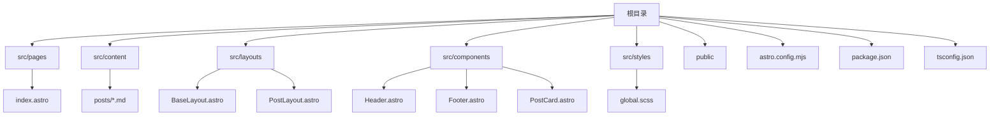
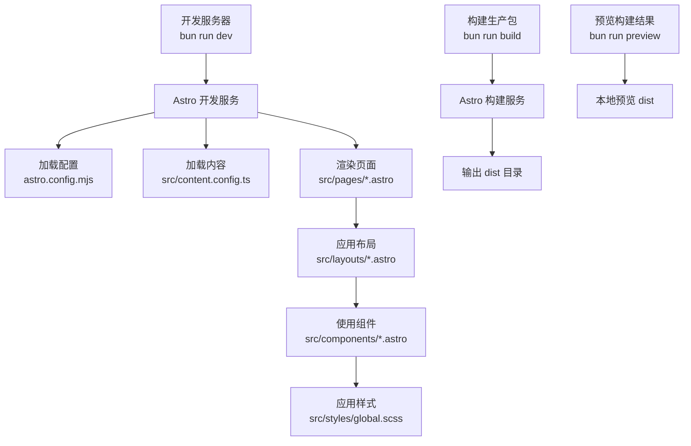
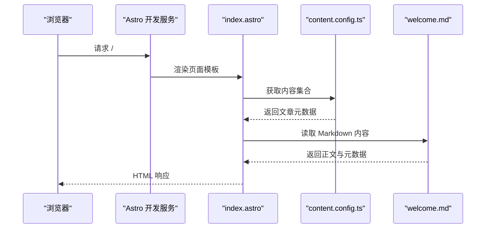
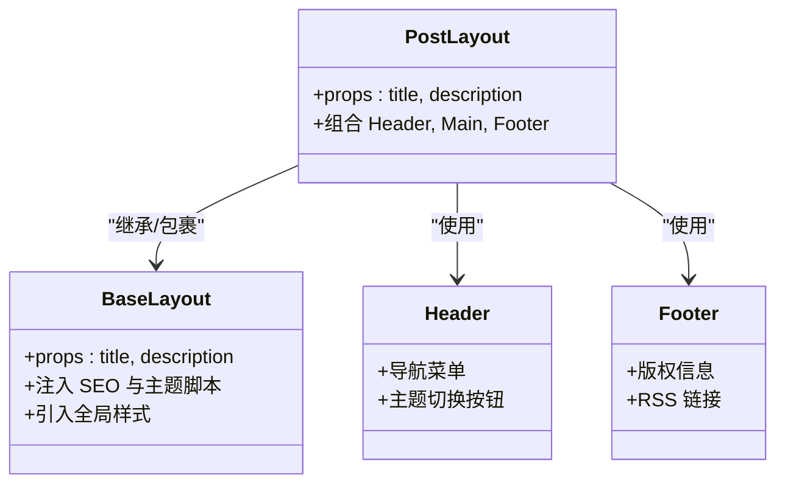
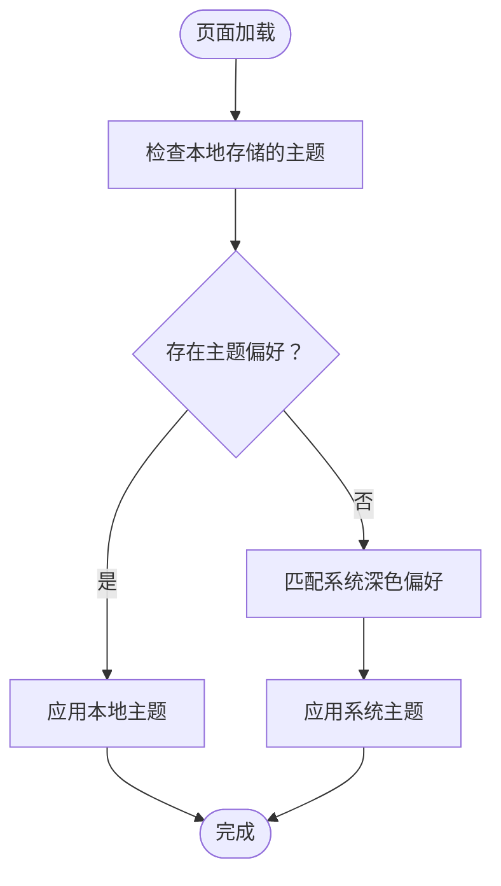
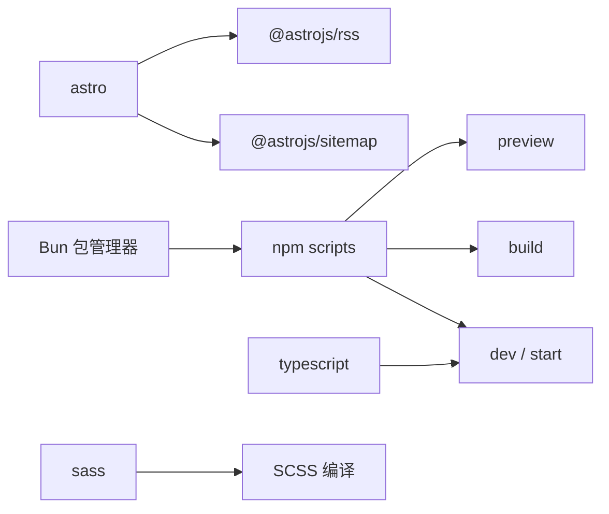

# 快速开始

<cite>
**本文引用的文件**
- [package.json](file://package.json)
- [README.md](file://README.md)
- [astro.config.mjs](file://astro.config.mjs)
- [tsconfig.json](file://tsconfig.json)
- [src/content.config.ts](file://src/content.config.ts)
- [src/content/posts/welcome.md](file://src/content/posts/welcome.md)
- [src/pages/index.astro](file://src/pages/index.astro)
- [src/layouts/BaseLayout.astro](file://src/layouts/BaseLayout.astro)
- [src/layouts/PostLayout.astro](file://src/layouts/PostLayout.astro)
- [src/components/Header.astro](file://src/components/Header.astro)
- [src/components/Footer.astro](file://src/components/Footer.astro)
- [src/components/PostCard.astro](file://src/components/PostCard.astro)
- [src/styles/global.scss](file://src/styles/global.scss)
- [public/favicon.svg](file://public/favicon.svg)
</cite>

## 目录
1. [简介](#简介)
2. [项目结构](#项目结构)
3. [核心组件](#核心组件)
4. [架构总览](#架构总览)
5. [详细组件分析](#详细组件分析)
6. [依赖分析](#依赖分析)
7. [性能考虑](#性能考虑)
8. [故障排除指南](#故障排除指南)
9. [结论](#结论)
10. [附录](#附录)

## 简介
本指南面向首次接触 chnanxu 个人博客的新用户，帮助你在 10 分钟内完成环境准备、依赖安装、本地开发与构建预览。项目基于 Astro 静态站点生成器，采用 SCSS、TypeScript 和 GitHub Pages 托管，适合快速搭建个人博客。

## 项目结构
项目采用“页面 + 内容 + 布局 + 组件 + 样式”的分层组织方式，核心目录如下：
- src/pages：页面路由与模板（例如首页）
- src/content：内容集合（Markdown 文章）
- src/layouts：页面布局（基础布局与页面布局）
- src/components：可复用 UI 组件（头部、底部、文章卡片）
- src/styles：全局样式与变量
- public：静态资源（如图标）
- astro.config.mjs：Astro 配置（站点地址、集成、构建策略）

图表来源
- [astro.config.mjs:1-12](file://astro.config.mjs#L1-L12)
- [package.json:1-22](file://package.json#L1-L22)
- [tsconfig.json:1-10](file://tsconfig.json#L1-L10)

章节来源
- [README.md:21-32](file://README.md#L21-L32)
- [astro.config.mjs:1-12](file://astro.config.mjs#L1-L12)
- [package.json:1-22](file://package.json#L1-L22)
- [tsconfig.json:1-10](file://tsconfig.json#L1-L10)

## 核心组件
- 页面与路由
  - 首页：从内容集合读取文章，过滤草稿并按发布时间排序，渲染最近文章列表。
  - RSS：生成站点订阅源。
- 内容系统
  - 使用内容集合定义文章模式（标题、描述、发布日期、标签等），支持 glob 加载 Markdown。
- 布局系统
  - BaseLayout：注入 SEO 元信息、主题初始化脚本、全局样式。
  - PostLayout：组合 Header、Main、Footer，形成页面骨架。
- 组件系统
  - Header：导航菜单与主题切换按钮。
  - Footer：版权与链接。
  - PostCard：文章卡片，展示标题、摘要、日期与标签。
- 样式系统
  - 全局样式与变量，支持主题切换与响应式排版。

章节来源
- [src/pages/index.astro:1-110](file://src/pages/index.astro#L1-L110)
- [src/content.config.ts:1-18](file://src/content.config.ts#L1-L18)
- [src/layouts/BaseLayout.astro:1-53](file://src/layouts/BaseLayout.astro#L1-L53)
- [src/layouts/PostLayout.astro:1-36](file://src/layouts/PostLayout.astro#L1-L36)
- [src/components/Header.astro:1-153](file://src/components/Header.astro#L1-L153)
- [src/components/Footer.astro:1-65](file://src/components/Footer.astro#L1-L65)
- [src/components/PostCard.astro:1-113](file://src/components/PostCard.astro#L1-L113)
- [src/styles/global.scss:1-222](file://src/styles/global.scss#L1-L222)

## 架构总览
下图展示了从开发到构建的关键流程与模块交互：

图表来源
- [package.json:5-11](file://package.json#L5-L11)
- [astro.config.mjs:1-12](file://astro.config.mjs#L1-L12)
- [src/content.config.ts:1-18](file://src/content.config.ts#L1-L18)
- [src/pages/index.astro:1-110](file://src/pages/index.astro#L1-L110)
- [src/layouts/PostLayout.astro:1-36](file://src/layouts/PostLayout.astro#L1-L36)
- [src/components/Header.astro:1-153](file://src/components/Header.astro#L1-L153)
- [src/styles/global.scss:1-222](file://src/styles/global.scss#L1-L222)

## 详细组件分析

### 页面与内容工作流
- 页面读取内容集合并进行过滤与排序，随后将数据传递给组件渲染。
- 内容集合通过 glob 模式匹配 Markdown 文件，并以统一 Schema 校验字段。

图表来源
- [src/pages/index.astro:1-110](file://src/pages/index.astro#L1-L110)
- [src/content.config.ts:1-18](file://src/content.config.ts#L1-L18)
- [src/content/posts/welcome.md:1-53](file://src/content/posts/welcome.md#L1-L53)

章节来源
- [src/pages/index.astro:1-110](file://src/pages/index.astro#L1-L110)
- [src/content.config.ts:1-18](file://src/content.config.ts#L1-L18)
- [src/content/posts/welcome.md:1-53](file://src/content/posts/welcome.md#L1-L53)

### 布局与组件协作
- PostLayout 负责组合 Header、主内容区与 Footer。
- BaseLayout 注入 SEO、主题初始化脚本与全局样式。
- Header 提供导航与主题切换；Footer 展示版权与 RSS 链接。

图表来源
- [src/layouts/BaseLayout.astro:1-53](file://src/layouts/BaseLayout.astro#L1-L53)
- [src/layouts/PostLayout.astro:1-36](file://src/layouts/PostLayout.astro#L1-L36)
- [src/components/Header.astro:1-153](file://src/components/Header.astro#L1-L153)
- [src/components/Footer.astro:1-65](file://src/components/Footer.astro#L1-L65)

章节来源
- [src/layouts/BaseLayout.astro:1-53](file://src/layouts/BaseLayout.astro#L1-L53)
- [src/layouts/PostLayout.astro:1-36](file://src/layouts/PostLayout.astro#L1-L36)
- [src/components/Header.astro:1-153](file://src/components/Header.astro#L1-L153)
- [src/components/Footer.astro:1-65](file://src/components/Footer.astro#L1-L65)

### 样式与主题机制
- 全局样式通过 SCSS 变量与工具类实现一致的排版与交互。
- 主题初始化脚本根据本地存储或系统偏好设置主题，并持久化切换状态。

图表来源
- [src/layouts/BaseLayout.astro:28-50](file://src/layouts/BaseLayout.astro#L28-L50)
- [src/styles/global.scss:1-222](file://src/styles/global.scss#L1-L222)

章节来源
- [src/layouts/BaseLayout.astro:1-53](file://src/layouts/BaseLayout.astro#L1-L53)
- [src/styles/global.scss:1-222](file://src/styles/global.scss#L1-L222)

## 依赖分析
- 包管理与脚本
  - 使用 Bun 作为首选包管理器与执行环境，提供更快的安装与运行体验。
  - npm scripts 封装了开发、构建与预览命令，便于跨平台操作。
- 核心依赖
  - Astro：静态站点生成器核心。
  - @astrojs/sitemap：自动生成站点地图。
  - @astrojs/rss：生成 RSS 订阅源。
- 开发依赖
  - TypeScript：类型安全与更好的编辑体验。
  - Sass：SCSS 编译与样式工程化。

图表来源
- [package.json:5-21](file://package.json#L5-L21)
- [astro.config.mjs:1-12](file://astro.config.mjs#L1-L12)

章节来源
- [package.json:1-22](file://package.json#L1-L22)
- [astro.config.mjs:1-12](file://astro.config.mjs#L1-L12)
- [tsconfig.json:1-10](file://tsconfig.json#L1-L10)

## 性能考虑
- 构建优化
  - 自动内联样式策略可减少请求次数，提升首屏性能。
- 内容与资源
  - Markdown 内容按需加载，避免不必要的客户端脚本。
  - 图标等静态资源放置于 public 目录，便于缓存与 CDN 加速。
- 样式与主题
  - 全局样式集中管理，主题切换通过属性控制，避免重复计算。

章节来源
- [astro.config.mjs:8-11](file://astro.config.mjs#L8-L11)
- [public/favicon.svg](file://public/favicon.svg)

## 故障排除指南
- 端口占用
  - 症状：开发服务器启动失败，提示端口被占用。
  - 解决：更换端口或释放占用端口后重试。
- 权限问题
  - 症状：安装或运行时报权限错误。
  - 解决：使用具有写权限的账户执行，或调整目录权限。
- Bun 版本不兼容
  - 症状：安装依赖报错或运行异常。
  - 解决：升级到推荐的 Bun 版本，确保与项目配置兼容。
- Node.js 替代方案
  - 症状：无法使用 Bun。
  - 解决：可改用 npm 或 pnpm 执行相同命令（脚本与配置兼容）。
- 构建产物为空
  - 症状：构建后 dist 目录无内容。
  - 解决：确认内容文件路径与命名规范，确保内容集合正确加载。
- 主题切换无效
  - 症状：切换主题后未生效。
  - 解决：检查浏览器本地存储是否被清理，刷新页面后重试。

章节来源
- [README.md:5-19](file://README.md#L5-L19)
- [package.json:5-11](file://package.json#L5-L11)

## 结论
通过本快速开始指南，你已掌握 chnanxu 博客的环境准备、依赖安装、本地开发、构建与预览全流程。建议在本地验证无误后再进行 GitHub Pages 部署，即可在 10 分钟内拥有可访问的个人博客。

## 附录

### 环境要求
- 推荐使用 Bun 作为包管理器与运行时，获得最佳性能与体验。
- 若无法使用 Bun，也可使用 npm/pnpm，命令与脚本保持一致。

章节来源
- [README.md:5-19](file://README.md#L5-L19)
- [package.json:5-11](file://package.json#L5-L11)

### 本地开发与构建步骤
- 安装依赖
  - 命令：bun install
  - 作用：安装项目所需依赖（Astro、Sass、TypeScript 等）
- 启动开发服务器
  - 命令：bun run dev
  - 作用：启动 Astro 开发服务器，自动热更新
- 构建生产版本
  - 命令：bun run build
  - 作用：生成静态站点至 dist 目录
- 预览构建结果
  - 命令：bun run preview
  - 作用：在本地预览 dist 目录中的静态站点

章节来源
- [README.md:7-19](file://README.md#L7-L19)
- [package.json:5-11](file://package.json#L5-L11)

### 写作与内容管理
- 在 src/content/posts 下新增 .md/.mdx 文件，遵循内容集合 Schema（标题、描述、发布日期、标签等）。
- 首页会自动读取并展示非草稿文章，按发布时间倒序排列。

章节来源
- [README.md:34-47](file://README.md#L34-L47)
- [src/content.config.ts:1-18](file://src/content.config.ts#L1-L18)
- [src/content/posts/welcome.md:1-53](file://src/content/posts/welcome.md#L1-L53)

### 技术栈与许可
- 技术栈：Astro、SCSS、TypeScript、GitHub Pages
- 许可证：MIT

章节来源
- [README.md:49-59](file://README.md#L49-L59)