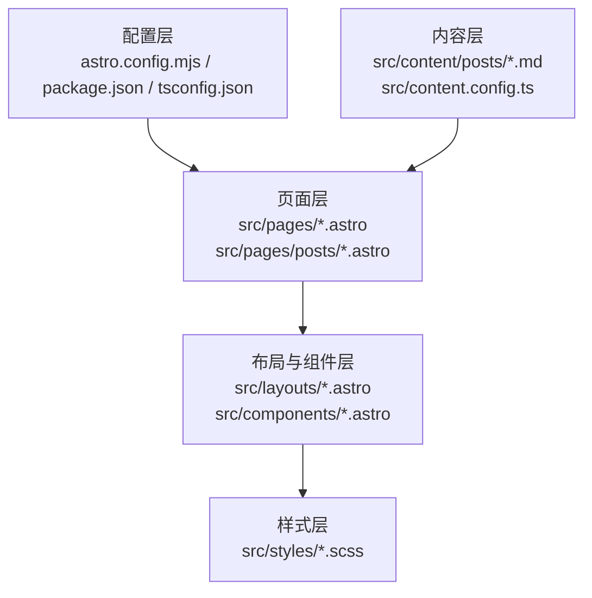
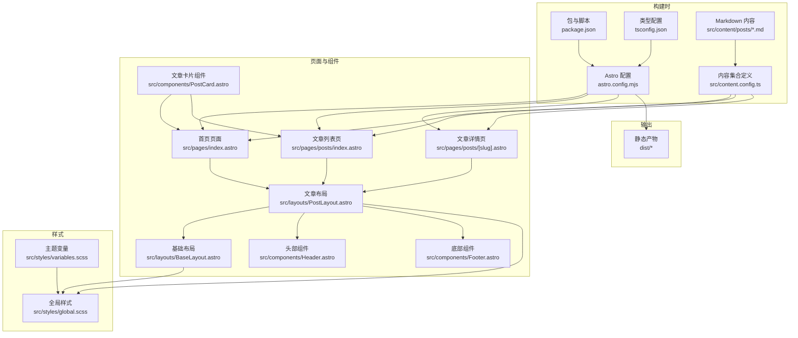
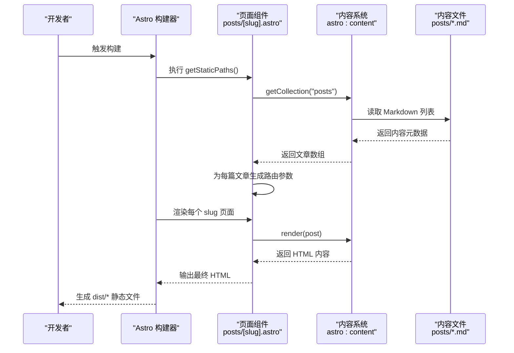
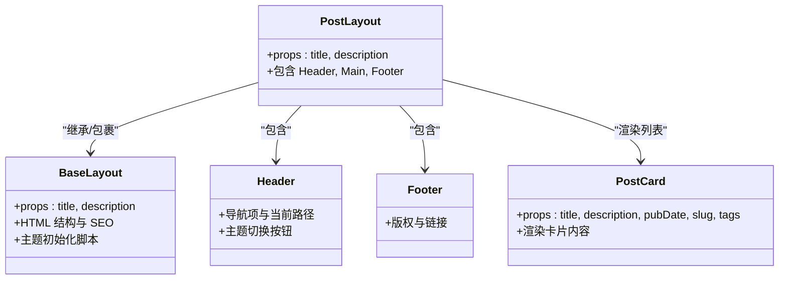
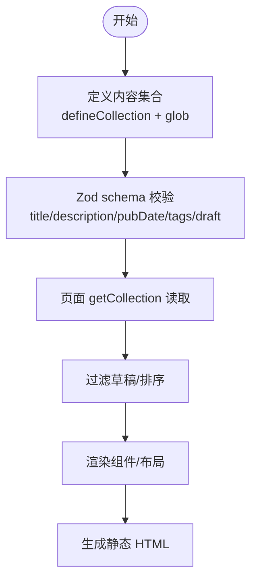
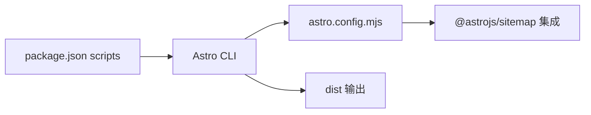

# 整体架构概览

<cite>
**本文引用的文件**
- [package.json](file://package.json)
- [astro.config.mjs](file://astro.config.mjs)
- [tsconfig.json](file://tsconfig.json)
- [src/content.config.ts](file://src/content.config.ts)
- [src/content/posts/welcome.md](file://src/content/posts/welcome.md)
- [src/pages/index.astro](file://src/pages/index.astro)
- [src/pages/about.astro](file://src/pages/about.astro)
- [src/pages/posts/index.astro](file://src/pages/posts/index.astro)
- [src/pages/posts/[slug].astro](file://src/pages/posts/[slug].astro)
- [src/pages/rss.xml.ts](file://src/pages/rss.xml.ts)
- [src/layouts/BaseLayout.astro](file://src/layouts/BaseLayout.astro)
- [src/layouts/PostLayout.astro](file://src/layouts/PostLayout.astro)
- [src/components/Header.astro](file://src/components/Header.astro)
- [src/components/Footer.astro](file://src/components/Footer.astro)
- [src/components/PostCard.astro](file://src/components/PostCard.astro)
- [src/styles/global.scss](file://src/styles/global.scss)
- [src/styles/variables.scss](file://src/styles/variables.scss)
</cite>

## 目录
1. [简介](#简介)
2. [项目结构](#项目结构)
3. [核心组件](#核心组件)
4. [架构总览](#架构总览)
5. [详细组件分析](#详细组件分析)
6. [依赖关系分析](#依赖关系分析)
7. [性能考量](#性能考量)
8. [故障排查指南](#故障排查指南)
9. [结论](#结论)
10. [附录：入门指导](#附录入门指导)

## 简介
本项目是一个基于 Astro 静态站点生成器的个人博客，采用“内容优先”的设计思路，通过文件系统路由将 Markdown 内容与 Astro 页面组件无缝结合，实现从内容到最终 HTML 的全链路自动化构建。Astro 的零 JavaScript 默认策略确保了页面加载性能与可访问性；同时，通过布局组件与可复用组件的组合，形成清晰的视图层架构。

## 项目结构
项目采用按功能分层的目录组织方式：
- 配置层：astro.config.mjs、tsconfig.json、package.json
- 内容层：src/content 下的 Markdown 文档与内容集合定义
- 页面层：src/pages 下的 Astro 页面组件（含动态路由）
- 布局与组件层：src/layouts 与 src/components
- 样式层：src/styles 下的 SCSS 变量与全局样式

图表来源
- [astro.config.mjs:1-12](file://astro.config.mjs#L1-L12)
- [package.json:1-22](file://package.json#L1-L22)
- [src/content.config.ts:1-18](file://src/content.config.ts#L1-L18)
- [src/pages/index.astro:1-110](file://src/pages/index.astro#L1-L110)
- [src/layouts/PostLayout.astro:1-36](file://src/layouts/PostLayout.astro#L1-L36)
- [src/styles/global.scss:1-222](file://src/styles/global.scss#L1-L222)

章节来源
- [astro.config.mjs:1-12](file://astro.config.mjs#L1-L12)
- [package.json:1-22](file://package.json#L1-L22)
- [tsconfig.json](file://tsconfig.json)

## 核心组件
- 内容集合与加载
  - 使用内容集合定义与 glob 加载器，将 Markdown 文件映射为可查询的内容对象，支持类型校验与默认值处理。
- 页面组件与路由
  - 通过文件系统路由将 src/pages 下的 .astro 文件映射为页面路径；动态路由通过方括号命名参数匹配 slug。
- 布局与组件
  - BaseLayout 提供基础 HTML 结构与 SEO 元信息；PostLayout 组合 Header、Main、Footer 形成统一布局；PostCard 作为内容卡片组件复用。
- 样式系统
  - SCSS 变量集中管理主题色、间距、字号等；全局样式提供排版与通用工具类，配合暗色主题切换。

章节来源
- [src/content.config.ts:1-18](file://src/content.config.ts#L1-L18)
- [src/pages/index.astro:1-110](file://src/pages/index.astro#L1-L110)
- [src/pages/posts/[slug].astro:1-116](file://src/pages/posts/[slug].astro#L1-L116)
- [src/layouts/BaseLayout.astro:1-53](file://src/layouts/BaseLayout.astro#L1-L53)
- [src/layouts/PostLayout.astro:1-36](file://src/layouts/PostLayout.astro#L1-L36)
- [src/components/PostCard.astro:1-113](file://src/components/PostCard.astro#L1-L113)
- [src/styles/variables.scss:1-108](file://src/styles/variables.scss#L1-L108)
- [src/styles/global.scss:1-222](file://src/styles/global.scss#L1-L222)

## 架构总览
下图展示了从内容文件到最终 HTML 输出的完整流程，以及各组件间的交互关系与数据流向。

图表来源
- [astro.config.mjs:1-12](file://astro.config.mjs#L1-L12)
- [package.json:1-22](file://package.json#L1-L22)
- [tsconfig.json](file://tsconfig.json)
- [src/content.config.ts:1-18](file://src/content.config.ts#L1-L18)
- [src/content/posts/welcome.md:1-53](file://src/content/posts/welcome.md#L1-L53)
- [src/pages/index.astro:1-110](file://src/pages/index.astro#L1-L110)
- [src/pages/posts/index.astro:1-94](file://src/pages/posts/index.astro#L1-L94)
- [src/pages/posts/[slug].astro:1-116](file://src/pages/posts/[slug].astro#L1-L116)
- [src/layouts/PostLayout.astro:1-36](file://src/layouts/PostLayout.astro#L1-L36)
- [src/layouts/BaseLayout.astro:1-53](file://src/layouts/BaseLayout.astro#L1-L53)
- [src/components/Header.astro:1-153](file://src/components/Header.astro#L1-L153)
- [src/components/Footer.astro:1-65](file://src/components/Footer.astro#L1-L65)
- [src/components/PostCard.astro:1-113](file://src/components/PostCard.astro#L1-L113)
- [src/styles/variables.scss:1-108](file://src/styles/variables.scss#L1-L108)
- [src/styles/global.scss:1-222](file://src/styles/global.scss#L1-L222)

## 详细组件分析

### 文件系统路由与页面生成
- 静态路由
  - src/pages/index.astro 对应根路径 /，src/pages/about.astro 对应 /about。
- 列表路由
  - src/pages/posts/index.astro 对应 /posts。
- 动态路由
  - src/pages/posts/[slug].astro 通过 getStaticPaths 读取内容集合，为每个文章生成独立页面，URL 由文章 ID（slug）决定。
- 数据流
  - 页面通过 astro:content 的 getCollection 读取内容集合，渲染时注入 props 并调用 render 渲染 Markdown 内容。

图表来源
- [src/pages/posts/[slug].astro:1-116](file://src/pages/posts/[slug].astro#L1-L116)
- [src/content.config.ts:1-18](file://src/content.config.ts#L1-L18)
- [src/content/posts/welcome.md:1-53](file://src/content/posts/welcome.md#L1-L53)

章节来源
- [src/pages/index.astro:1-110](file://src/pages/index.astro#L1-L110)
- [src/pages/about.astro:1-49](file://src/pages/about.astro#L1-L49)
- [src/pages/posts/index.astro:1-94](file://src/pages/posts/index.astro#L1-L94)
- [src/pages/posts/[slug].astro:1-116](file://src/pages/posts/[slug].astro#L1-L116)

### Astro 组件系统与布局组合
- 布局层次
  - BaseLayout 提供基础 HTML 结构、SEO 元信息与主题初始化脚本。
  - PostLayout 组合 Header、Main、Footer，形成统一的文章页布局。
- 组件复用
  - PostCard 在首页与文章列表页复用，接收标题、描述、日期、标签与 slug 等属性。
- 数据传递
  - 页面通过 Astro.props 接收内容对象，再将必要字段传递给子组件。

图表来源
- [src/layouts/BaseLayout.astro:1-53](file://src/layouts/BaseLayout.astro#L1-L53)
- [src/layouts/PostLayout.astro:1-36](file://src/layouts/PostLayout.astro#L1-L36)
- [src/components/Header.astro:1-153](file://src/components/Header.astro#L1-L153)
- [src/components/Footer.astro:1-65](file://src/components/Footer.astro#L1-L65)
- [src/components/PostCard.astro:1-113](file://src/components/PostCard.astro#L1-L113)

章节来源
- [src/layouts/BaseLayout.astro:1-53](file://src/layouts/BaseLayout.astro#L1-L53)
- [src/layouts/PostLayout.astro:1-36](file://src/layouts/PostLayout.astro#L1-L36)
- [src/components/Header.astro:1-153](file://src/components/Header.astro#L1-L153)
- [src/components/Footer.astro:1-65](file://src/components/Footer.astro#L1-L65)
- [src/components/PostCard.astro:1-113](file://src/components/PostCard.astro#L1-L113)

### 零 JavaScript 默认配置的设计理念与优势
- 设计理念
  - Astro 默认不注入运行时 JavaScript，页面以静态 HTML 为主，仅在需要时按需添加交互脚本。
- 优势
  - 更快的首屏加载速度与更好的可访问性；
  - 更低的带宽消耗与更稳定的性能表现；
  - 通过组件内联脚本与条件性加载，实现最小化交互开销。

章节来源
- [astro.config.mjs:8-10](file://astro.config.mjs#L8-L10)
- [src/layouts/BaseLayout.astro:29-33](file://src/layouts/BaseLayout.astro#L29-L33)

### 内容模型与类型安全
- 内容集合定义
  - 使用 defineCollection 与 glob 加载器扫描 Markdown 文件；
  - 通过 Zod schema 定义字段类型、默认值与可选字段。
- 页面消费
  - 页面通过 getCollection 获取内容，进行过滤与排序后渲染。

图表来源
- [src/content.config.ts:1-18](file://src/content.config.ts#L1-L18)
- [src/pages/index.astro:4-8](file://src/pages/index.astro#L4-L8)
- [src/pages/posts/index.astro:4-8](file://src/pages/posts/index.astro#L4-L8)

章节来源
- [src/content.config.ts:1-18](file://src/content.config.ts#L1-L18)
- [src/content/posts/welcome.md:1-53](file://src/content/posts/welcome.md#L1-L53)
- [src/pages/index.astro:4-8](file://src/pages/index.astro#L4-L8)
- [src/pages/posts/index.astro:4-8](file://src/pages/posts/index.astro#L4-L8)

## 依赖关系分析
- 外部依赖
  - Astro 核心、@astrojs/sitemap、@astrojs/rss；
- 构建脚本
  - dev/start/build/preview/astro 等命令通过 package.json scripts 调用 Astro CLI。
- 配置集成
  - astro.config.mjs 中启用站点地址与 sitemap 集成，控制样式内联策略。

图表来源
- [package.json:5-11](file://package.json#L5-L11)
- [astro.config.mjs:5-11](file://astro.config.mjs#L5-L11)

章节来源
- [package.json:1-22](file://package.json#L1-L22)
- [astro.config.mjs:1-12](file://astro.config.mjs#L1-L12)

## 性能考量
- 零 JavaScript 默认策略
  - 减少客户端脚本体积，提升首屏渲染性能与可访问性。
- 样式优化
  - 合理使用 SCSS 变量与全局样式，避免重复样式与过度嵌套。
- 资源内联与按需加载
  - 通过配置控制样式内联策略，减少网络往返。
- 内容渲染
  - 在构建期完成内容渲染与页面生成，避免运行时计算。

章节来源
- [astro.config.mjs:8-10](file://astro.config.mjs#L8-L10)
- [src/styles/variables.scss:1-108](file://src/styles/variables.scss#L1-L108)
- [src/styles/global.scss:1-222](file://src/styles/global.scss#L1-L222)

## 故障排查指南
- 构建失败或页面空白
  - 检查 astro.config.mjs 的 site 地址与集成插件是否正确；
  - 确认 package.json 中的构建脚本可用。
- 内容未显示
  - 确认 src/content.config.ts 中的集合定义与 glob pattern 正确；
  - 检查 Markdown 文件的前置字段与 schema 是否一致。
- 动态路由 404
  - 确认 [slug].astro 的 getStaticPaths 返回正确的 params 与 props；
  - 检查文章 ID（slug）是否与 Markdown 文件名一致。
- 样式异常
  - 检查 SCSS 变量与全局样式导入顺序；
  - 确保组件样式未被覆盖或冲突。

章节来源
- [astro.config.mjs:5-11](file://astro.config.mjs#L5-L11)
- [package.json:5-11](file://package.json#L5-L11)
- [src/content.config.ts:4-15](file://src/content.config.ts#L4-L15)
- [src/pages/posts/[slug].astro:5-11](file://src/pages/posts/[slug].astro#L5-L11)
- [src/styles/variables.scss:1-108](file://src/styles/variables.scss#L1-L108)
- [src/styles/global.scss:1-222](file://src/styles/global.scss#L1-L222)

## 结论
该博客以 Astro 为核心，围绕“内容优先”与“零 JavaScript 默认”理念，构建出清晰的文件系统路由、可复用的组件体系与统一的样式规范。通过内容集合与页面组件的解耦，实现了从 Markdown 到静态 HTML 的高效生成，兼顾性能、可维护性与可扩展性。

## 附录：入门指导
- 快速开始
  - 安装依赖后运行开发服务器，访问本地预览地址；
  - 新增 Markdown 文章至 src/content/posts，即可自动生成页面。
- 路由规则
  - 页面组件放置于 src/pages，文件名即路由路径；
  - 动态路由使用方括号命名参数，如 [slug]。
- 布局与组件
  - 将通用结构放入 PostLayout 与 BaseLayout；
  - 将可复用 UI 放入 components 目录，通过 props 传参。
- 样式管理
  - 在 variables.scss 中统一管理主题变量；
  - 在 global.scss 中编写全局样式与排版规则。

章节来源
- [package.json:5-11](file://package.json#L5-L11)
- [src/pages/index.astro:1-110](file://src/pages/index.astro#L1-L110)
- [src/pages/posts/[slug].astro:1-116](file://src/pages/posts/[slug].astro#L1-L116)
- [src/layouts/PostLayout.astro:1-36](file://src/layouts/PostLayout.astro#L1-L36)
- [src/layouts/BaseLayout.astro:1-53](file://src/layouts/BaseLayout.astro#L1-L53)
- [src/styles/variables.scss:1-108](file://src/styles/variables.scss#L1-L108)
- [src/styles/global.scss:1-222](file://src/styles/global.scss#L1-L222)