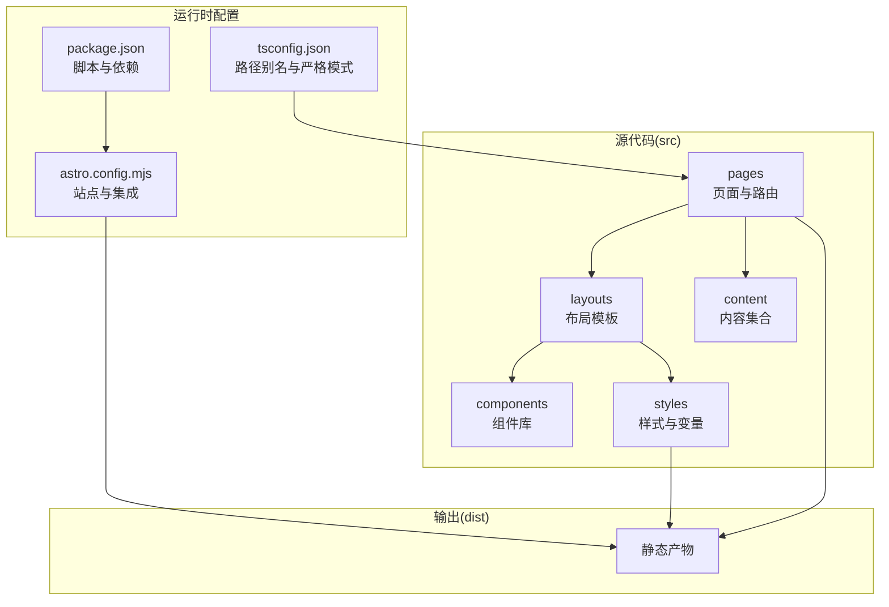
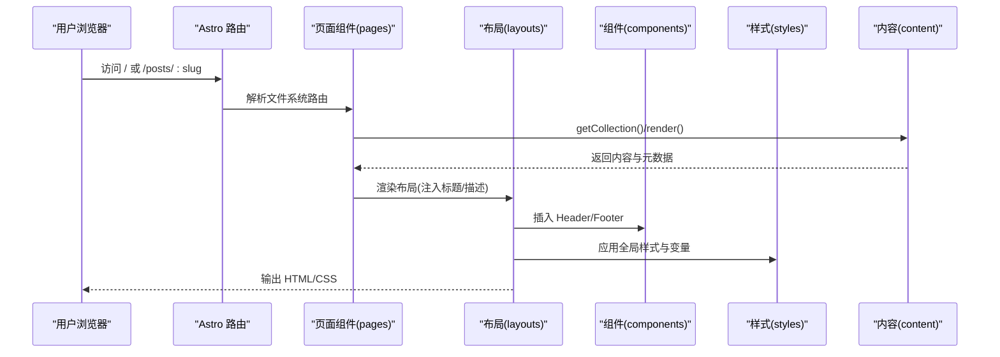
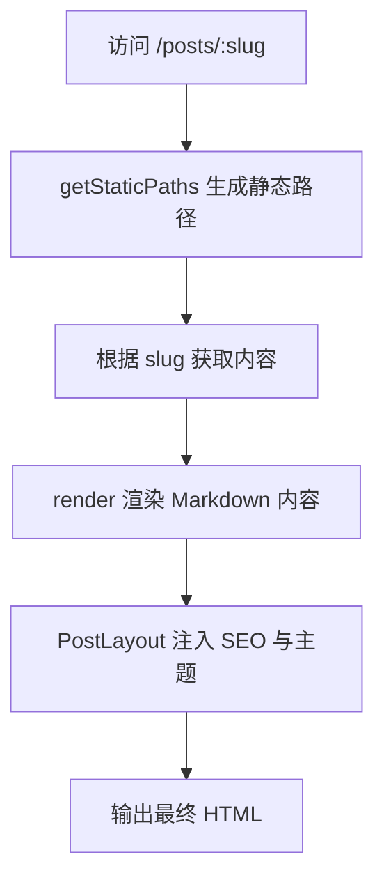
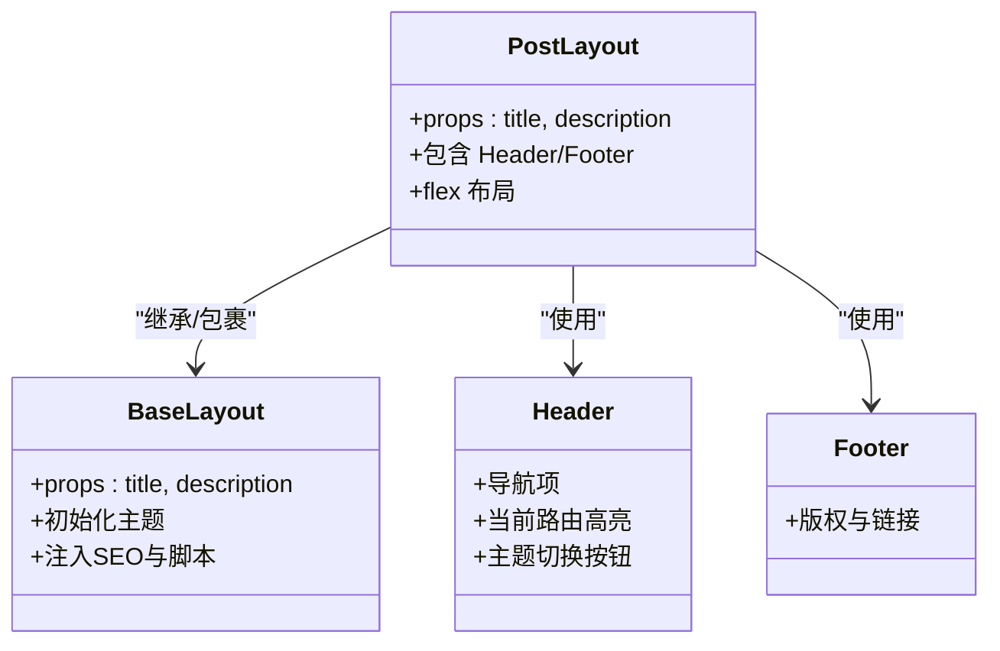
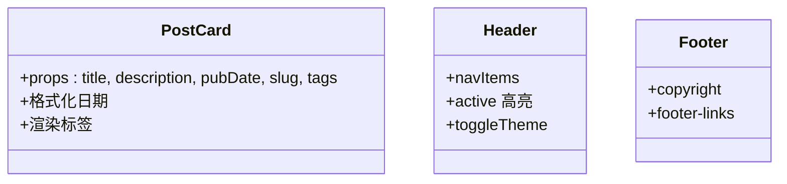
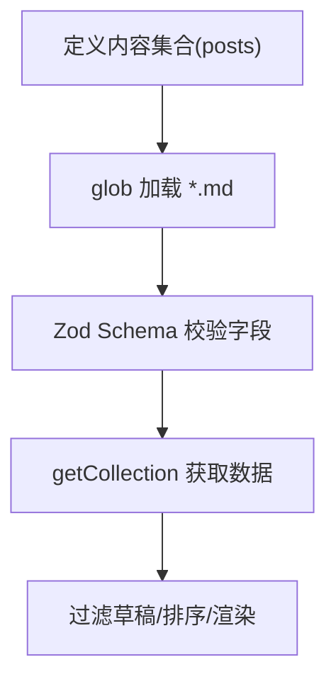
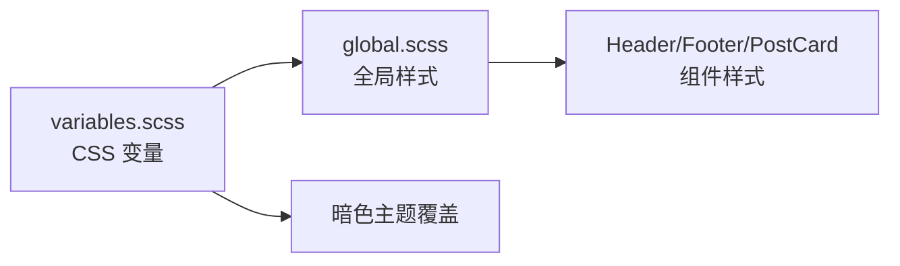
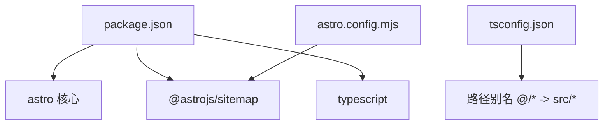

# 架构设计

<cite>
**本文引用的文件**
- [package.json](file://package.json)
- [astro.config.mjs](file://astro.config.mjs)
- [tsconfig.json](file://tsconfig.json)
- [src/content.config.ts](file://src/content.config.ts)
- [src/pages/index.astro](file://src/pages/index.astro)
- [src/pages/about.astro](file://src/pages/about.astro)
- [src/pages/posts/index.astro](file://src/pages/posts/index.astro)
- [src/pages/posts/[slug].astro](file://src/pages/posts/[slug].astro)
- [src/layouts/BaseLayout.astro](file://src/layouts/BaseLayout.astro)
- [src/layouts/PostLayout.astro](file://src/layouts/PostLayout.astro)
- [src/components/Header.astro](file://src/components/Header.astro)
- [src/components/Footer.astro](file://src/components/Footer.astro)
- [src/components/PostCard.astro](file://src/components/PostCard.astro)
- [src/styles/global.scss](file://src/styles/global.scss)
- [src/styles/variables.scss](file://src/styles/variables.scss)
</cite>

## 目录
1. [引言](#引言)
2. [项目结构](#项目结构)
3. [核心组件](#核心组件)
4. [架构总览](#架构总览)
5. [详细组件分析](#详细组件分析)
6. [依赖分析](#依赖分析)
7. [性能考量](#性能考量)
8. [故障排查指南](#故障排查指南)
9. [结论](#结论)
10. [附录](#附录)

## 引言
本项目是基于 Astro 静态站点生成器构建的个人博客，采用“内容优先”的开发范式，强调零 JavaScript 默认配置、响应式设计与主题系统分离。整体架构围绕文件系统路由、组件化布局与内容集合展开，通过 Astro 的静态生成能力实现高性能、可扩展的静态站点。

## 项目结构
项目采用按功能域划分的目录组织方式，核心目录职责如下：
- src：源代码根目录，包含页面、布局、组件、样式与内容配置
  - components：可复用 UI 组件（如 Header、Footer、PostCard）
  - layouts：页面布局模板（BaseLayout、PostLayout）
  - pages：页面级组件与动态路由（index、about、posts 列表与详情）
  - content：内容集合定义与 Markdown 内容
  - styles：全局样式与变量（SCSS）
- public：静态资源（如 favicon）
- .astro：Astro 内部类型与缓存数据（由 Astro 自动生成）
- 根目录配置：package.json、astro.config.mjs、tsconfig.json

**图表来源**
- [package.json:1-22](file://package.json#L1-L22)
- [astro.config.mjs:1-12](file://astro.config.mjs#L1-L12)
- [tsconfig.json:1-10](file://tsconfig.json#L1-L10)

**章节来源**
- [package.json:1-22](file://package.json#L1-L22)
- [astro.config.mjs:1-12](file://astro.config.mjs#L1-L12)
- [tsconfig.json:1-10](file://tsconfig.json#L1-L10)

## 核心组件
- 页面层（pages）：负责路由与数据加载，使用 Astro 的内容 API 获取集合数据，并渲染布局与组件
- 布局层（layouts）：封装通用结构与 SEO 元信息，支持主题初始化与切换
- 组件层（components）：可复用 UI 片段，如导航、页脚与文章卡片
- 样式层（styles）：以 SCSS 变量驱动的主题系统，提供暗色模式支持与全局排版
- 内容层（content）：通过内容集合定义与校验规则，统一管理 Markdown 内容

**章节来源**
- [src/pages/index.astro:1-110](file://src/pages/index.astro#L1-L110)
- [src/layouts/BaseLayout.astro:1-53](file://src/layouts/BaseLayout.astro#L1-L53)
- [src/layouts/PostLayout.astro:1-36](file://src/layouts/PostLayout.astro#L1-L36)
- [src/components/Header.astro:1-153](file://src/components/Header.astro#L1-L153)
- [src/components/Footer.astro:1-65](file://src/components/Footer.astro#L1-L65)
- [src/components/PostCard.astro:1-113](file://src/components/PostCard.astro#L1-L113)
- [src/styles/global.scss:1-222](file://src/styles/global.scss#L1-L222)
- [src/styles/variables.scss:1-108](file://src/styles/variables.scss#L1-L108)
- [src/content.config.ts:1-18](file://src/content.config.ts#L1-L18)

## 架构总览
下图展示了从请求到页面渲染的关键流程，以及各层之间的依赖关系：

**图表来源**
- [src/pages/index.astro:1-110](file://src/pages/index.astro#L1-L110)
- [src/pages/posts/[slug].astro:1-116](file://src/pages/posts/[slug].astro#L1-L116)
- [src/layouts/PostLayout.astro:1-36](file://src/layouts/PostLayout.astro#L1-L36)
- [src/components/Header.astro:1-153](file://src/components/Header.astro#L1-L153)
- [src/components/Footer.astro:1-65](file://src/components/Footer.astro#L1-L65)
- [src/styles/global.scss:1-222](file://src/styles/global.scss#L1-L222)
- [src/content.config.ts:1-18](file://src/content.config.ts#L1-L18)

## 详细组件分析

### 文件系统路由与页面渲染
- 首页与关于页：直接在页面中读取内容集合并渲染布局
- 文章列表页：聚合所有文章，过滤草稿并按发布时间排序，展示标签筛选
- 文章详情页：使用 getStaticPaths 生成静态路径，结合 render 渲染 Markdown 内容

**图表来源**
- [src/pages/posts/[slug].astro:5-21](file://src/pages/posts/[slug].astro#L5-L21)

**章节来源**
- [src/pages/index.astro:1-110](file://src/pages/index.astro#L1-L110)
- [src/pages/about.astro:1-49](file://src/pages/about.astro#L1-L49)
- [src/pages/posts/index.astro:1-94](file://src/pages/posts/index.astro#L1-L94)
- [src/pages/posts/[slug].astro:1-116](file://src/pages/posts/[slug].astro#L1-L116)

### 布局与主题系统
- BaseLayout：统一注入 meta、Open Graph、主题初始化脚本与全局样式
- PostLayout：组合 Header、Main、Footer，提供页面级容器与最小高度布局
- 主题系统：通过 data-theme 属性与 localStorage 实现明暗主题切换，避免首屏闪烁

**图表来源**
- [src/layouts/BaseLayout.astro:1-53](file://src/layouts/BaseLayout.astro#L1-L53)
- [src/layouts/PostLayout.astro:1-36](file://src/layouts/PostLayout.astro#L1-L36)
- [src/components/Header.astro:1-153](file://src/components/Header.astro#L1-L153)
- [src/components/Footer.astro:1-65](file://src/components/Footer.astro#L1-L65)

**章节来源**
- [src/layouts/BaseLayout.astro:1-53](file://src/layouts/BaseLayout.astro#L1-L53)
- [src/layouts/PostLayout.astro:1-36](file://src/layouts/PostLayout.astro#L1-L36)
- [src/components/Header.astro:1-153](file://src/components/Header.astro#L1-L153)
- [src/components/Footer.astro:1-65](file://src/components/Footer.astro#L1-L65)

### 组件化设计与复用
- PostCard：接收文章元数据，格式化日期与标签，提供悬停交互与可点击卡片
- Header：根据当前路径高亮导航项，内联主题切换函数
- Footer：展示版权与外部链接（RSS）

**图表来源**
- [src/components/PostCard.astro:1-113](file://src/components/PostCard.astro#L1-L113)
- [src/components/Header.astro:1-153](file://src/components/Header.astro#L1-L153)
- [src/components/Footer.astro:1-65](file://src/components/Footer.astro#L1-L65)

**章节来源**
- [src/components/PostCard.astro:1-113](file://src/components/PostCard.astro#L1-L113)
- [src/components/Header.astro:1-153](file://src/components/Header.astro#L1-L153)
- [src/components/Footer.astro:1-65](file://src/components/Footer.astro#L1-L65)

### 内容优先与内容集合
- 使用内容集合定义 Markdown 加载策略与字段校验
- 支持草稿过滤、日期排序与标签聚合
- 通过 render 将 Markdown 渲染为 Astro 组件内容

**图表来源**
- [src/content.config.ts:1-18](file://src/content.config.ts#L1-L18)
- [src/pages/index.astro:6-8](file://src/pages/index.astro#L6-L8)
- [src/pages/posts/index.astro:6-8](file://src/pages/posts/index.astro#L6-L8)
- [src/pages/posts/[slug].astro:3-4](file://src/pages/posts/[slug].astro#L3-L4)

**章节来源**
- [src/content.config.ts:1-18](file://src/content.config.ts#L1-L18)
- [src/pages/index.astro:1-110](file://src/pages/index.astro#L1-L110)
- [src/pages/posts/index.astro:1-94](file://src/pages/posts/index.astro#L1-L94)
- [src/pages/posts/[slug].astro:1-116](file://src/pages/posts/[slug].astro#L1-L116)

### 样式与主题系统
- 变量系统：集中定义品牌色、文字层级、背景层级、圆角、间距、字号、行高、过渡与容器尺寸
- 暗色模式：通过 data-theme 切换，覆盖关键颜色与阴影
- 全局排版：为 .prose 提供文章阅读体验的默认样式

**图表来源**
- [src/styles/variables.scss:1-108](file://src/styles/variables.scss#L1-L108)
- [src/styles/global.scss:1-222](file://src/styles/global.scss#L1-L222)
- [src/components/Header.astro:1-153](file://src/components/Header.astro#L1-L153)
- [src/components/Footer.astro:1-65](file://src/components/Footer.astro#L1-L65)
- [src/components/PostCard.astro:1-113](file://src/components/PostCard.astro#L1-L113)

**章节来源**
- [src/styles/variables.scss:1-108](file://src/styles/variables.scss#L1-L108)
- [src/styles/global.scss:1-222](file://src/styles/global.scss#L1-L222)

## 依赖分析
- 构建与运行：package.json 中定义 dev/build/preview 脚本，依赖 Astro 核心与集成
- 站点配置：astro.config.mjs 设置站点地址、启用 sitemap 集成与内联样式策略
- 类型与路径：tsconfig.json 启用 Astro 严格类型并配置路径别名，便于模块导入

**图表来源**
- [package.json:1-22](file://package.json#L1-L22)
- [astro.config.mjs:1-12](file://astro.config.mjs#L1-L12)
- [tsconfig.json:1-10](file://tsconfig.json#L1-L10)

**章节来源**
- [package.json:1-22](file://package.json#L1-L22)
- [astro.config.mjs:1-12](file://astro.config.mjs#L1-L12)
- [tsconfig.json:1-10](file://tsconfig.json#L1-L10)

## 性能考量
- 零 JavaScript 默认配置：减少客户端脚本，提升首屏性能与可访问性
- 内联样式策略：通过配置控制样式内联行为，平衡首屏渲染与缓存复用
- 静态生成：预渲染页面，降低运行时计算与服务器压力
- 响应式设计：基于 CSS 变量与媒体查询，适配多端显示

[本节为通用性能建议，不直接分析具体文件]

## 故障排查指南
- 路由 404：确认动态路由参数与 getStaticPaths 返回值一致
- 内容未显示：检查内容集合加载路径与字段校验是否匹配
- 主题切换无效：确认 data-theme 属性设置与本地存储逻辑
- 样式异常：核对变量覆盖顺序与暗色模式选择器优先级

**章节来源**
- [src/pages/posts/[slug].astro:5-21](file://src/pages/posts/[slug].astro#L5-L21)
- [src/content.config.ts:1-18](file://src/content.config.ts#L1-L18)
- [src/layouts/BaseLayout.astro:28-50](file://src/layouts/BaseLayout.astro#L28-L50)
- [src/styles/variables.scss:85-108](file://src/styles/variables.scss#L85-L108)

## 结论
本项目以 Astro 为核心，采用内容优先与组件化设计，结合文件系统路由与静态生成，实现了高性能、可维护且具备良好扩展性的个人博客架构。通过主题系统分离与 SCSS 变量体系，确保了视觉一致性与可定制性；通过严格的类型配置与内容集合校验，保障了内容质量与开发效率。

## 附录
- 技术选型与权衡
  - Astro：静态生成与组件生态，适合内容型站点
  - SCSS：变量与模块化，便于主题与样式管理
  - TypeScript：类型安全与路径别名，提升开发体验
  - Sitemap：SEO 与索引优化
- 扩展建议
  - 新增页面：在 pages 下新增文件或动态路由
  - 新增组件：在 components 下创建并复用
  - 新增内容：在 content 下添加 Markdown 并在内容集合中声明
  - 自定义主题：在 variables.scss 中扩展变量并在全局样式中应用

[本节为概念性总结，不直接分析具体文件]