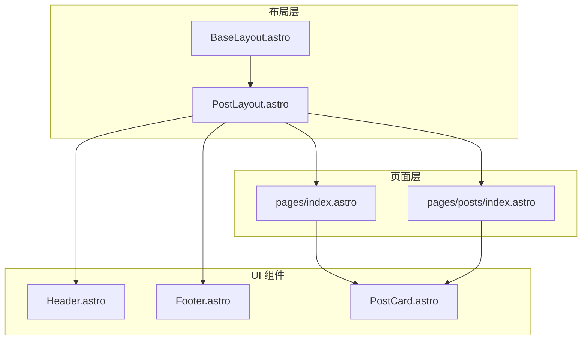
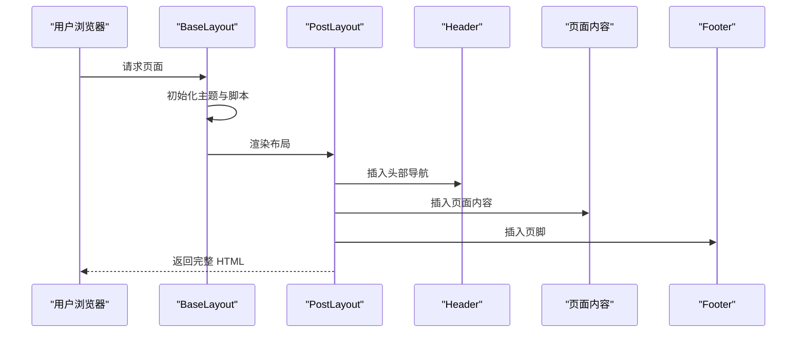
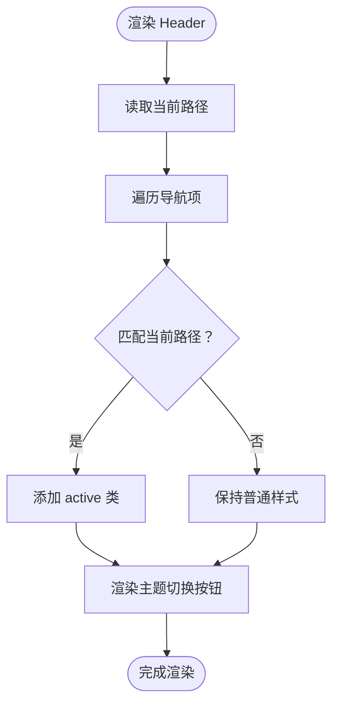
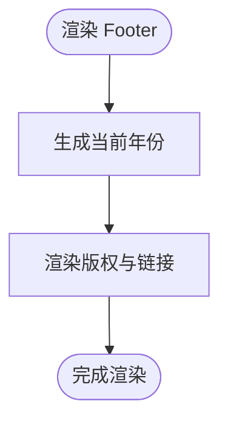
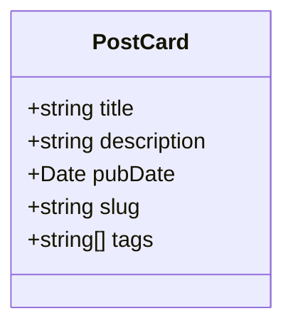
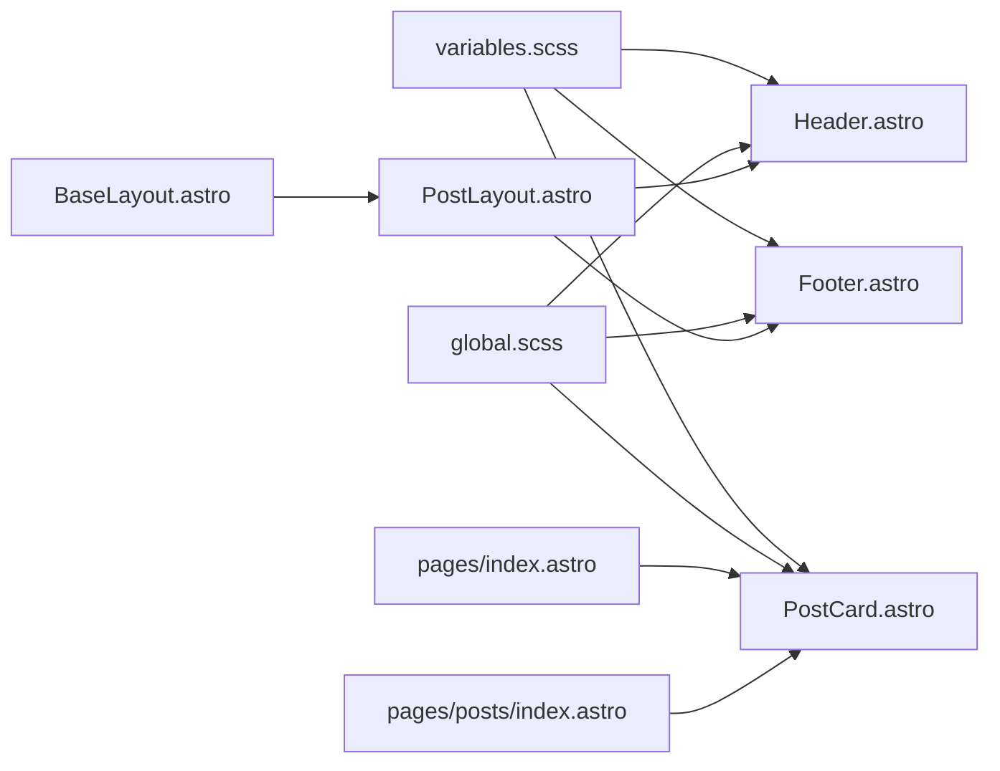

# UI 组件

<cite>
**本文引用的文件**
- [Header.astro](file://src/components/Header.astro)
- [Footer.astro](file://src/components/Footer.astro)
- [PostCard.astro](file://src/components/PostCard.astro)
- [BaseLayout.astro](file://src/layouts/BaseLayout.astro)
- [PostLayout.astro](file://src/layouts/PostLayout.astro)
- [index.astro（首页）](file://src/pages/index.astro)
- [index.astro（文章列表页）](file://src/pages/posts/index.astro)
- [global.scss](file://src/styles/global.scss)
- [variables.scss](file://src/styles/variables.scss)
- [package.json](file://package.json)
</cite>

## 目录
1. [简介](#简介)
2. [项目结构](#项目结构)
3. [核心组件](#核心组件)
4. [架构总览](#架构总览)
5. [组件详解](#组件详解)
6. [依赖关系分析](#依赖关系分析)
7. [性能与可维护性建议](#性能与可维护性建议)
8. [故障排查指南](#故障排查指南)
9. [结论](#结论)
10. [附录：最佳实践与示例路径](#附录最佳实践与示例路径)

## 简介
本文件聚焦于本项目中的可复用 UI 组件：Header、Footer、PostCard。文档从组件职责、属性接口、事件处理、样式定制、复用策略与组合模式、组件间通信与数据传递等方面进行系统化梳理，并结合实际页面使用场景给出实践建议与优化思路。

## 项目结构
本项目采用 Astro 单页应用架构，组件通过布局层统一注入到页面中：
- 布局层负责注入全局样式、SEO 元信息、主题初始化与脚本；页面层负责内容渲染与数据获取。
- Header、Footer 作为布局子组件，由 PostLayout 注入到 BaseLayout 中，最终在各页面中复用。
- PostCard 作为内容卡片组件，在首页与文章列表页中被多次复用。

图表来源
- [BaseLayout.astro:1-53](file://src/layouts/BaseLayout.astro#L1-L53)
- [PostLayout.astro:1-36](file://src/layouts/PostLayout.astro#L1-L36)
- [Header.astro:1-153](file://src/components/Header.astro#L1-L153)
- [Footer.astro:1-65](file://src/components/Footer.astro#L1-L65)
- [PostCard.astro:1-113](file://src/components/PostCard.astro#L1-L113)
- [index.astro（首页）:1-110](file://src/pages/index.astro#L1-L110)
- [index.astro（文章列表页）:1-94](file://src/pages/posts/index.astro#L1-L94)

章节来源
- [BaseLayout.astro:1-53](file://src/layouts/BaseLayout.astro#L1-L53)
- [PostLayout.astro:1-36](file://src/layouts/PostLayout.astro#L1-L36)
- [index.astro（首页）:1-110](file://src/pages/index.astro#L1-L110)
- [index.astro（文章列表页）:1-94](file://src/pages/posts/index.astro#L1-L94)

## 核心组件
- Header：站点导航栏，包含 Logo、主导航链接、当前路由高亮、主题切换按钮。
- Footer：页脚版权与外部链接，支持响应式布局。
- PostCard：文章卡片，展示标题、摘要、发布日期与标签，支持点击跳转详情页。

章节来源
- [Header.astro:1-153](file://src/components/Header.astro#L1-L153)
- [Footer.astro:1-65](file://src/components/Footer.astro#L1-L65)
- [PostCard.astro:1-113](file://src/components/PostCard.astro#L1-L113)

## 架构总览
组件在页面中的装配流程如下：
- BaseLayout 负责注入全局样式、SEO、主题初始化脚本与脚本暴露。
- PostLayout 将 Header、Main 内容区、Footer 组合为完整页面骨架。
- 页面通过 Astro Content Collection 获取文章数据，传入 PostCard 渲染列表。

图表来源
- [BaseLayout.astro:28-50](file://src/layouts/BaseLayout.astro#L28-L50)
- [PostLayout.astro:14-22](file://src/layouts/PostLayout.astro#L14-L22)

章节来源
- [BaseLayout.astro:1-53](file://src/layouts/BaseLayout.astro#L1-L53)
- [PostLayout.astro:1-36](file://src/layouts/PostLayout.astro#L1-L36)

## 组件详解

### Header 组件
- 职责
  - 提供站点导航入口与当前页高亮。
  - 提供主题切换交互入口。
- 属性接口
  - 无外部 props（内部通过 Astro.url 计算当前路径）。
- 事件处理
  - 主题切换通过内联 onclick 调用全局函数 toggleTheme，该函数在 BaseLayout 中注入。
- 样式定制
  - 使用 CSS 变量与暗色主题 data-theme 切换图标显示状态。
  - 导航链接根据当前路径动态添加 active 类。
- 复用策略与组合
  - 在 PostLayout 中直接嵌入，保证全站一致的导航体验。
- 数据传递
  - 导航项与当前路径通过组件内部逻辑计算，无需外部传参。

图表来源
- [Header.astro:1-45](file://src/components/Header.astro#L1-L45)
- [BaseLayout.astro:39-50](file://src/layouts/BaseLayout.astro#L39-L50)

章节来源
- [Header.astro:1-153](file://src/components/Header.astro#L1-L153)
- [BaseLayout.astro:28-50](file://src/layouts/BaseLayout.astro#L28-L50)

### Footer 组件
- 职责
  - 展示版权信息与外部链接（如 GitHub、RSS）。
- 属性接口
  - 无外部 props（内部生成当前年份）。
- 事件处理
  - 无交互事件（纯展示）。
- 样式定制
  - 使用 CSS 变量控制颜色与间距，支持响应式换行。
- 复用策略与组合
  - 与 Header 一样，由 PostLayout 注入，确保全站一致性。
- 数据传递
  - 年份通过组件内部逻辑生成，无需外部传参。

图表来源
- [Footer.astro:1-22](file://src/components/Footer.astro#L1-L22)

章节来源
- [Footer.astro:1-65](file://src/components/Footer.astro#L1-L65)

### PostCard 组件
- 职责
  - 展示单篇文章的卡片式信息，包括标题、摘要、日期与标签。
- 属性接口
  - title: string
  - description: string
  - pubDate: Date
  - slug: string
  - tags?: string[]
- 事件处理
  - 无交互事件（纯展示）。
- 样式定制
  - 使用 CSS 变量与悬停效果，限制摘要文本行数，标签最多展示前三个。
- 复用策略与组合
  - 在首页与文章列表页中重复使用，形成统一的内容呈现风格。
- 数据传递
  - 由页面通过 Astro Content Collection 获取的数据直接传入。

图表来源
- [PostCard.astro:2-8](file://src/components/PostCard.astro#L2-L8)

章节来源
- [PostCard.astro:1-113](file://src/components/PostCard.astro#L1-L113)
- [index.astro（首页）:29-37](file://src/pages/index.astro#L29-L37)
- [index.astro（文章列表页）:32-40](file://src/pages/posts/index.astro#L32-L40)

## 依赖关系分析
- 组件依赖
  - Header 依赖 BaseLayout 的主题切换脚本与 CSS 变量。
  - Footer 依赖全局样式变量与容器类。
  - PostCard 依赖全局样式变量与容器类。
- 页面依赖
  - PostLayout 依赖 Header、Footer、BaseLayout。
  - 首页与文章列表页依赖 PostCard。
- 样式依赖
  - 所有组件共享 variables.scss 的 CSS 变量与 global.scss 的通用样式。

图表来源
- [variables.scss:1-108](file://src/styles/variables.scss#L1-L108)
- [global.scss:1-222](file://src/styles/global.scss#L1-L222)
- [BaseLayout.astro:1-53](file://src/layouts/BaseLayout.astro#L1-L53)
- [PostLayout.astro:1-36](file://src/layouts/PostLayout.astro#L1-L36)
- [Header.astro:1-153](file://src/components/Header.astro#L1-L153)
- [Footer.astro:1-65](file://src/components/Footer.astro#L1-L65)
- [PostCard.astro:1-113](file://src/components/PostCard.astro#L1-L113)
- [index.astro（首页）:1-110](file://src/pages/index.astro#L1-L110)
- [index.astro（文章列表页）:1-94](file://src/pages/posts/index.astro#L1-L94)

章节来源
- [variables.scss:1-108](file://src/styles/variables.scss#L1-L108)
- [global.scss:1-222](file://src/styles/global.scss#L1-L222)
- [PostLayout.astro:1-36](file://src/layouts/PostLayout.astro#L1-L36)
- [index.astro（首页）:1-110](file://src/pages/index.astro#L1-L110)
- [index.astro（文章列表页）:1-94](file://src/pages/posts/index.astro#L1-L94)

## 性能与可维护性建议
- 主题切换性能
  - BaseLayout 中的主题初始化脚本避免了首屏闪烁，建议保持该策略。
  - 主题切换仅操作根节点的 data-theme 属性，开销极小。
- 组件渲染
  - PostCard 对标签数量做了截断（最多展示前三个），有助于减少 DOM 节点与重排成本。
  - 摘要文本使用行数限制，避免长段落导致的布局抖动。
- 样式组织
  - CSS 变量集中管理，便于主题切换与样式一致性维护。
  - 全局样式与工具类分离，降低样式冲突风险。
- 可扩展性
  - Header 的导航项可通过配置数组扩展，避免硬编码。
  - PostCard 可增加更多元信息（如阅读时长、作者等），保持向后兼容。

[本节为通用建议，不直接分析具体文件，故无“章节来源”]

## 故障排查指南
- 主题切换无效
  - 检查 BaseLayout 是否正确注入 toggleTheme 函数并暴露到 window。
  - 确认 Header 的按钮 onclick 是否调用该函数。
- 导航高亮异常
  - 确认 Header 中的当前路径计算是否与实际路由一致。
  - 检查导航项的 href 与当前路径匹配规则。
- 样式不生效
  - 确认 variables.scss 与 global.scss 已在 BaseLayout 中导入。
  - 检查组件内是否使用了正确的 CSS 变量名与类名。
- PostCard 标签过多导致布局拥挤
  - 可在组件中继续限制展示数量或调整标签样式宽度。

章节来源
- [BaseLayout.astro:28-50](file://src/layouts/BaseLayout.astro#L28-L50)
- [Header.astro:1-45](file://src/components/Header.astro#L1-L45)
- [variables.scss:1-108](file://src/styles/variables.scss#L1-L108)
- [global.scss:1-222](file://src/styles/global.scss#L1-L222)
- [PostCard.astro:1-113](file://src/components/PostCard.astro#L1-L113)

## 结论
本项目通过简洁的组件划分与统一的布局层，实现了 Header、Footer、PostCard 的高复用与一致性。组件以最小的外部依赖与清晰的职责边界，配合 CSS 变量与布局容器，构建出良好的可维护性与可扩展性。建议在后续迭代中继续沿用现有模式，按需扩展组件能力并保持样式体系的一致。

[本节为总结性内容，不直接分析具体文件，故无“章节来源”]

## 附录：最佳实践与示例路径
- 最佳实践
  - 使用 CSS 变量统一管理主题与间距，便于主题切换与样式维护。
  - 控制组件内部复杂度，将数据准备放在页面层，组件只负责渲染。
  - 对可能过长的内容进行截断与限制，提升渲染性能与视觉稳定性。
- 示例路径
  - 主题初始化与切换脚本：[BaseLayout.astro:28-50](file://src/layouts/BaseLayout.astro#L28-L50)
  - Header 导航与高亮逻辑：[Header.astro:1-45](file://src/components/Header.astro#L1-L45)
  - Footer 版权与链接：[Footer.astro:1-22](file://src/components/Footer.astro#L1-L22)
  - PostCard 属性与渲染：[PostCard.astro:1-38](file://src/components/PostCard.astro#L1-L38)
  - 首页使用 PostCard 的示例：[index.astro（首页）:29-37](file://src/pages/index.astro#L29-L37)
  - 文章列表页使用 PostCard 的示例：[index.astro（文章列表页）:32-40](file://src/pages/posts/index.astro#L32-L40)

章节来源
- [BaseLayout.astro:28-50](file://src/layouts/BaseLayout.astro#L28-L50)
- [Header.astro:1-45](file://src/components/Header.astro#L1-L45)
- [Footer.astro:1-22](file://src/components/Footer.astro#L1-L22)
- [PostCard.astro:1-38](file://src/components/PostCard.astro#L1-L38)
- [index.astro（首页）:29-37](file://src/pages/index.astro#L29-L37)
- [index.astro（文章列表页）:32-40](file://src/pages/posts/index.astro#L32-L40)