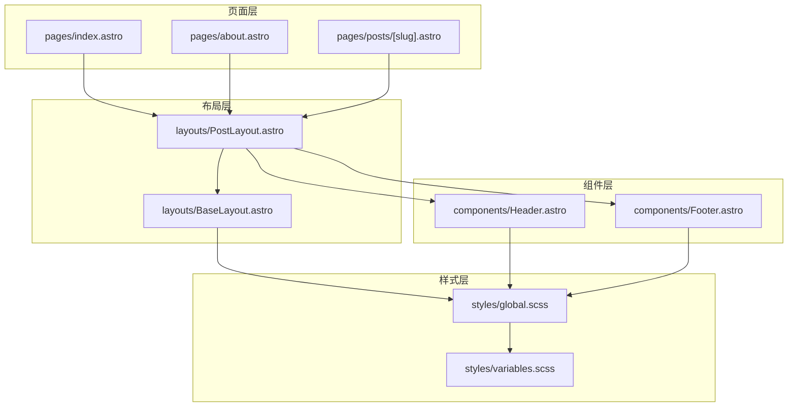
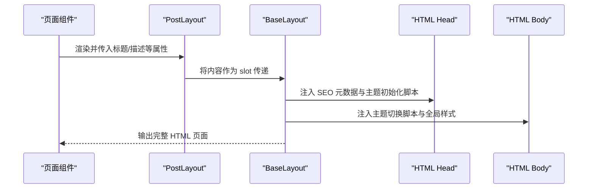
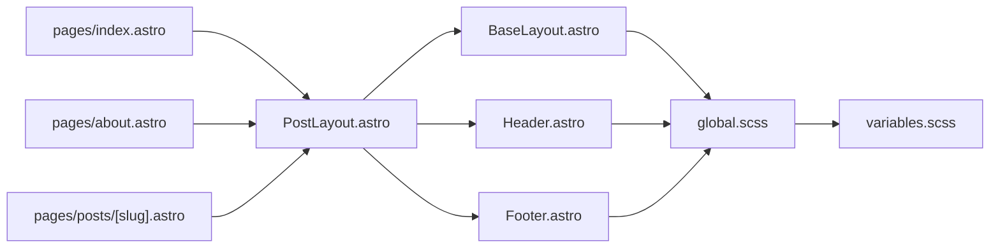

# 布局组件

<cite>
**本文引用的文件**
- [BaseLayout.astro](file://src/layouts/BaseLayout.astro)
- [PostLayout.astro](file://src/layouts/PostLayout.astro)
- [Header.astro](file://src/components/Header.astro)
- [Footer.astro](file://src/components/Footer.astro)
- [global.scss](file://src/styles/global.scss)
- [variables.scss](file://src/styles/variables.scss)
- [index.astro](file://src/pages/index.astro)
- [about.astro](file://src/pages/about.astro)
- [posts/[slug].astro](file://src/pages/posts/[slug].astro)
- [astro.config.mjs](file://astro.config.mjs)
- [package.json](file://package.json)
</cite>

## 目录
1. [简介](#简介)
2. [项目结构](#项目结构)
3. [核心组件](#核心组件)
4. [架构总览](#架构总览)
5. [详细组件分析](#详细组件分析)
6. [依赖分析](#依赖分析)
7. [性能考虑](#性能考虑)
8. [故障排除指南](#故障排除指南)
9. [结论](#结论)
10. [附录](#附录)

## 简介
本文件系统性解析本项目的布局组件体系，重点阐述 BaseLayout 与 PostLayout 的设计原理、职责分工、嵌套关系与继承机制，并说明其与内容系统、主题系统及样式系统的协作方式。同时提供定制方法、响应式设计实现与性能优化策略，以及扩展与修改的指导原则，帮助读者快速理解并高效维护该布局体系。

## 项目结构
本项目采用 Astro 的页面级布局模式，布局组件位于 src/layouts，页面组件位于 src/pages，通用组件位于 src/components，样式资源位于 src/styles。页面通过导入布局组件并在模板中嵌入内容，形成“页面 -> 布局 -> 组件”的层次化结构。

图表来源
- [BaseLayout.astro:1-53](file://src/layouts/BaseLayout.astro#L1-L53)
- [PostLayout.astro:1-36](file://src/layouts/PostLayout.astro#L1-L36)
- [Header.astro:1-153](file://src/components/Header.astro#L1-L153)
- [Footer.astro:1-65](file://src/components/Footer.astro#L1-L65)
- [global.scss:1-222](file://src/styles/global.scss#L1-L222)
- [variables.scss:1-108](file://src/styles/variables.scss#L1-L108)
- [index.astro:1-110](file://src/pages/index.astro#L1-L110)
- [about.astro:1-49](file://src/pages/about.astro#L1-L49)
- [posts/[slug].astro](file://src/pages/posts/[slug].astro#L1-L116)

章节来源
- [BaseLayout.astro:1-53](file://src/layouts/BaseLayout.astro#L1-L53)
- [PostLayout.astro:1-36](file://src/layouts/PostLayout.astro#L1-L36)
- [Header.astro:1-153](file://src/components/Header.astro#L1-L153)
- [Footer.astro:1-65](file://src/components/Footer.astro#L1-L65)
- [global.scss:1-222](file://src/styles/global.scss#L1-L222)
- [variables.scss:1-108](file://src/styles/variables.scss#L1-L108)
- [index.astro:1-110](file://src/pages/index.astro#L1-L110)
- [about.astro:1-49](file://src/pages/about.astro#L1-L49)
- [posts/[slug].astro:1-L116](file://src/pages/posts/[slug].astro#L1-L116)

## 核心组件
- BaseLayout：负责全局 HTML 结构、SEO 元数据、主题初始化与切换脚本注入，作为最外层布局，为整个站点提供一致的头部与基础行为。
- PostLayout：负责内容区域的整体布局，内含 Header、Footer 与主内容区，提供 Flex 布局容器与响应式样式，适配文章页与静态页。

章节来源
- [BaseLayout.astro:1-53](file://src/layouts/BaseLayout.astro#L1-L53)
- [PostLayout.astro:1-36](file://src/layouts/PostLayout.astro#L1-L36)

## 架构总览
布局组件通过 Astro 的 slot 机制实现嵌套渲染，页面组件将自身内容作为插槽传递给 PostLayout，PostLayout 再将内容传递给 BaseLayout。BaseLayout 注入主题初始化脚本与切换函数，确保无闪烁的主题体验；PostLayout 提供统一的导航、页脚与主内容区结构。

图表来源
- [BaseLayout.astro:1-53](file://src/layouts/BaseLayout.astro#L1-L53)
- [PostLayout.astro:1-36](file://src/layouts/PostLayout.astro#L1-L36)
- [posts/[slug].astro:1-L116](file://src/pages/posts/[slug].astro#L1-L116)
- [index.astro:1-110](file://src/pages/index.astro#L1-L110)
- [about.astro:1-49](file://src/pages/about.astro#L1-L49)

## 详细组件分析

### BaseLayout 组件
- 职责与功能
  - 引入全局样式，确保主题变量与通用样式生效。
  - 设置语言、视口、描述、Open Graph 等 SEO 元数据。
  - 在页面加载时根据本地存储或系统偏好初始化主题，避免闪烁。
  - 注入主题切换函数，暴露至全局以供 Header 中的按钮调用。
  - 通过 slot 接收子组件内容并渲染到 body 中。

- 关键实现点
  - 主题初始化脚本：优先读取本地存储，否则根据系统深色模式偏好设置默认主题，并写入到根元素的 data-theme 属性。
  - 主题切换脚本：切换 data-theme 值并同步到本地存储，配合样式系统实现主题切换。
  - SEO 与元信息：动态注入 title、description、Open Graph 等，提升社交分享与搜索引擎可见性。

- 与主题系统协作
  - 通过 data-theme 属性驱动 CSS 变量切换，暗色主题变量在全局样式中定义，实现全站主题一致性。

- 与内容系统协作
  - 作为最外层布局，不直接处理内容数据，仅负责输出结构与行为，内容由 PostLayout 与页面组件提供。

章节来源
- [BaseLayout.astro:1-53](file://src/layouts/BaseLayout.astro#L1-L53)
- [variables.scss:85-107](file://src/styles/variables.scss#L85-L107)
- [global.scss:205-222](file://src/styles/global.scss#L205-L222)

### PostLayout 组件
- 职责与功能
  - 作为内容区域的布局容器，引入 Header 与 Footer，提供统一的导航与页脚。
  - 使用 Flex 布局实现“头部 -> 主内容 -> 页脚”的垂直排列，主内容区域自动填充剩余空间。
  - 通过 slot 接收页面内容，形成“页面 -> 布局 -> 组件”的组合。

- 关键实现点
  - 嵌套关系：在模板中直接包含 Header、Footer，并将页面内容作为 slot 插入到 main 区域。
  - 响应式样式：使用 CSS 变量与媒体查询，保证在小屏设备上的可读性与可用性。
  - 与 Header 协作：Header 中的切换按钮通过全局函数触发主题切换，实现跨组件联动。

- 与内容系统协作
  - 页面组件（如文章页、静态页）通过导入 PostLayout 并传入标题与描述，实现统一的页面骨架。

- 与主题系统协作
  - 依赖 BaseLayout 初始化的主题状态，Header 的图标根据当前主题显示不同 SVG，实现视觉反馈。

章节来源
- [PostLayout.astro:1-36](file://src/layouts/PostLayout.astro#L1-L36)
- [Header.astro:28-44](file://src/components/Header.astro#L28-L44)
- [Footer.astro:1-65](file://src/components/Footer.astro#L1-L65)

### Header 组件
- 职责与功能
  - 提供导航栏，包含 Logo、主导航链接与主题切换按钮。
  - 根据当前路径高亮对应导航项，增强用户定位感。
  - 主题切换按钮绑定全局切换函数，实现即时主题切换。

- 关键实现点
  - 导航高亮：通过比较当前路径与导航项 href 判断 active 状态。
  - 图标切换：基于 data-theme 属性显示太阳/月亮图标，实现明暗主题的视觉差异。
  - 样式系统：使用 CSS 变量与过渡动画，保证主题切换时的平滑体验。

章节来源
- [Header.astro:1-153](file://src/components/Header.astro#L1-L153)

### Footer 组件
- 职责与功能
  - 提供版权信息与外部链接（如 GitHub、RSS）。
  - 使用容器与弹性布局，适配多列与换行场景。

- 关键实现点
  - 响应式布局：在小屏设备上自动换行，保持良好的可读性。
  - 链接样式：悬停时颜色变化，提升交互反馈。

章节来源
- [Footer.astro:1-65](file://src/components/Footer.astro#L1-L65)

### 页面组件与布局的关系
- 首页与关于页：均使用 PostLayout 作为外层布局，传入标题与描述，内部渲染各自内容。
- 文章详情页：使用 PostLayout 包裹文章内容，结合 Astro 内容模块渲染 Markdown 内容，实现文章页的统一骨架。

章节来源
- [index.astro:1-110](file://src/pages/index.astro#L1-L110)
- [about.astro:1-49](file://src/pages/about.astro#L1-L49)
- [posts/[slug].astro:1-L116](file://src/pages/posts/[slug].astro#L1-L116)

## 依赖分析
- 组件耦合
  - PostLayout 依赖 BaseLayout、Header、Footer，形成“布局 -> 组件”的单向依赖。
  - Header 依赖全局样式与主题变量，实现图标与样式的动态切换。
  - BaseLayout 依赖全局样式与变量，负责主题初始化与切换脚本注入。

- 外部依赖
  - Astro 内容模块用于文章渲染与静态路径生成。
  - 构建配置启用站点与 Sitemap 集成，支持 SEO 优化。

图表来源
- [PostLayout.astro:1-36](file://src/layouts/PostLayout.astro#L1-L36)
- [BaseLayout.astro:1-53](file://src/layouts/BaseLayout.astro#L1-L53)
- [Header.astro:1-153](file://src/components/Header.astro#L1-L153)
- [Footer.astro:1-65](file://src/components/Footer.astro#L1-L65)
- [global.scss:1-222](file://src/styles/global.scss#L1-L222)
- [variables.scss:1-108](file://src/styles/variables.scss#L1-L108)
- [index.astro:1-110](file://src/pages/index.astro#L1-L110)
- [about.astro:1-49](file://src/pages/about.astro#L1-L49)
- [posts/[slug].astro:1-L116](file://src/pages/posts/[slug].astro#L1-L116)

章节来源
- [package.json:1-22](file://package.json#L1-L22)
- [astro.config.mjs:1-12](file://astro.config.mjs#L1-L12)

## 性能考虑
- 主题初始化防闪烁
  - BaseLayout 在 head 中注入初始化脚本，优先读取本地存储或系统偏好，避免页面先显示默认主题再切换的问题。
- 构建优化
  - 构建配置开启内联样式策略，减少网络往返，提升首屏渲染性能。
- 样式组织
  - 全局样式集中管理，变量与主题分离，便于缓存与复用，降低重复计算成本。
- 响应式设计
  - 使用 CSS 变量与媒体查询，避免大量重复样式规则，提升维护效率与运行时性能。

章节来源
- [BaseLayout.astro:28-33](file://src/layouts/BaseLayout.astro#L28-L33)
- [astro.config.mjs:8-10](file://astro.config.mjs#L8-L10)
- [global.scss:1-222](file://src/styles/global.scss#L1-L222)
- [variables.scss:1-108](file://src/styles/variables.scss#L1-L108)

## 故障排除指南
- 主题切换无效
  - 检查 BaseLayout 是否正确注入主题切换函数并暴露到全局作用域。
  - 确认 Header 中的按钮是否正确绑定全局函数。
  - 验证 data-theme 属性是否被正确设置与读取。
- 样式未生效
  - 确认 BaseLayout 是否正确引入全局样式文件。
  - 检查 CSS 变量是否在全局与主题块中正确声明与覆盖。
- SEO 元信息缺失
  - 确认页面向 PostLayout 传入了标题与描述。
  - 检查 BaseLayout 的 head 部分是否包含相应 meta 标签。

章节来源
- [BaseLayout.astro:14-33](file://src/layouts/BaseLayout.astro#L14-L33)
- [Header.astro:28-44](file://src/components/Header.astro#L28-L44)
- [global.scss:1-222](file://src/styles/global.scss#L1-L222)
- [variables.scss:85-107](file://src/styles/variables.scss#L85-L107)

## 结论
本项目的布局体系以 BaseLayout 与 PostLayout 为核心，通过 Astro 的嵌套渲染机制实现了清晰的职责划分：BaseLayout 负责全局结构与主题初始化，PostLayout 负责内容区域布局与组件集成。配合统一的样式变量与主题系统，实现了良好的可维护性、可扩展性与用户体验。遵循本文提供的定制方法、响应式实现与性能优化策略，可进一步提升布局系统的稳定性与可演进性。

## 附录
- 定制方法
  - 新增页面：在 pages 下创建新页面，导入 PostLayout 并传入标题与描述，即可获得统一布局。
  - 自定义主题：在变量文件中调整品牌色、文字色与背景色，BaseLayout 的主题初始化逻辑会自动应用。
  - 扩展导航：在 Header 中添加新的导航项，利用当前路径高亮逻辑实现导航联动。
- 响应式设计
  - 使用 CSS 变量与媒体查询，确保在小屏设备上的可读性与可用性。
  - 利用容器类与弹性布局，简化复杂布局的响应式实现。
- 性能优化
  - 合理使用内联样式与构建配置，减少网络请求。
  - 避免在布局中进行重型计算，将逻辑下沉到页面或组件层。
- 修改指导原则
  - 保持 BaseLayout 的最小职责，仅处理全局结构与主题初始化。
  - PostLayout 专注于内容区域布局与组件集成，避免混入业务逻辑。
  - 样式与变量集中管理，避免重复与冲突。