# 组件交互机制

<cite>
**本文档引用的文件**
- [src/components/Header.astro](file://src/components/Header.astro)
- [src/components/Footer.astro](file://src/components/Footer.astro)
- [src/components/PostCard.astro](file://src/components/PostCard.astro)
- [src/layouts/BaseLayout.astro](file://src/layouts/BaseLayout.astro)
- [src/layouts/PostLayout.astro](file://src/layouts/PostLayout.astro)
- [src/pages/index.astro](file://src/pages/index.astro)
- [src/pages/posts/index.astro](file://src/pages/posts/index.astro)
- [src/pages/posts/[slug].astro](file://src/pages/posts/[slug].astro)
- [src/styles/global.scss](file://src/styles/global.scss)
- [src/styles/variables.scss](file://src/styles/variables.scss)
- [src/content.config.ts](file://src/content.config.ts)
- [astro.config.mjs](file://astro.config.mjs)
- [package.json](file://package.json)
</cite>

## 目录
1. [简介](#简介)
2. [项目结构](#项目结构)
3. [核心组件](#核心组件)
4. [架构概览](#架构概览)
5. [详细组件分析](#详细组件分析)
6. [依赖关系分析](#依赖关系分析)
7. [性能考虑](#性能考虑)
8. [故障排除指南](#故障排除指南)
9. [最佳实践](#最佳实践)
10. [结论](#结论)

## 简介

本项目是一个基于 Astro 构建的静态博客网站，展示了现代前端组件系统的交互机制。该系统通过组件化架构实现了清晰的父子组件通信、数据传递和事件处理，同时提供了主题切换、导航状态管理等跨组件功能。

项目采用分层架构设计，包括布局组件、页面组件和内容组件三个层次，每个层次都有明确的职责分工和交互模式。

## 项目结构

项目采用模块化的文件组织方式，按照功能和层次进行分类：

```mermaid
graph TB
subgraph "项目根目录"
Root[项目根目录]
subgraph "源代码(src)"
Src[源代码目录]
subgraph "组件(src/components)"
Header[Header.astro]
Footer[Footer.astro]
PostCard[PostCard.astro]
end
subgraph "布局(src/layouts)"
BaseLayout[BaseLayout.astro]
PostLayout[PostLayout.astro]
end
subgraph "页面(src/pages)"
Index[index.astro]
PostsIndex[posts/index.astro]
PostSlug[posts/[slug].astro]
end
subgraph "样式(src/styles)"
Global[global.scss]
Variables[variables.scss]
end
subgraph "内容(src/content)"
ContentConfig[content.config.ts]
Posts[posts/]
end
end
subgraph "配置文件"
AstroConfig[astro.config.mjs]
PackageJson[package.json]
end
end
```

**图表来源**
- [src/components/Header.astro:1-153](file://src/components/Header.astro#L1-L153)
- [src/layouts/BaseLayout.astro:1-53](file://src/layouts/BaseLayout.astro#L1-L53)
- [src/pages/index.astro:1-110](file://src/pages/index.astro#L1-L110)

**章节来源**
- [src/components/Header.astro:1-153](file://src/components/Header.astro#L1-L153)
- [src/layouts/PostLayout.astro:1-36](file://src/layouts/PostLayout.astro#L1-L36)
- [src/styles/global.scss:1-222](file://src/styles/global.scss#L1-L222)

## 核心组件

### 组件层次结构

项目的核心组件分为三个层次，每层都有特定的职责和交互模式：

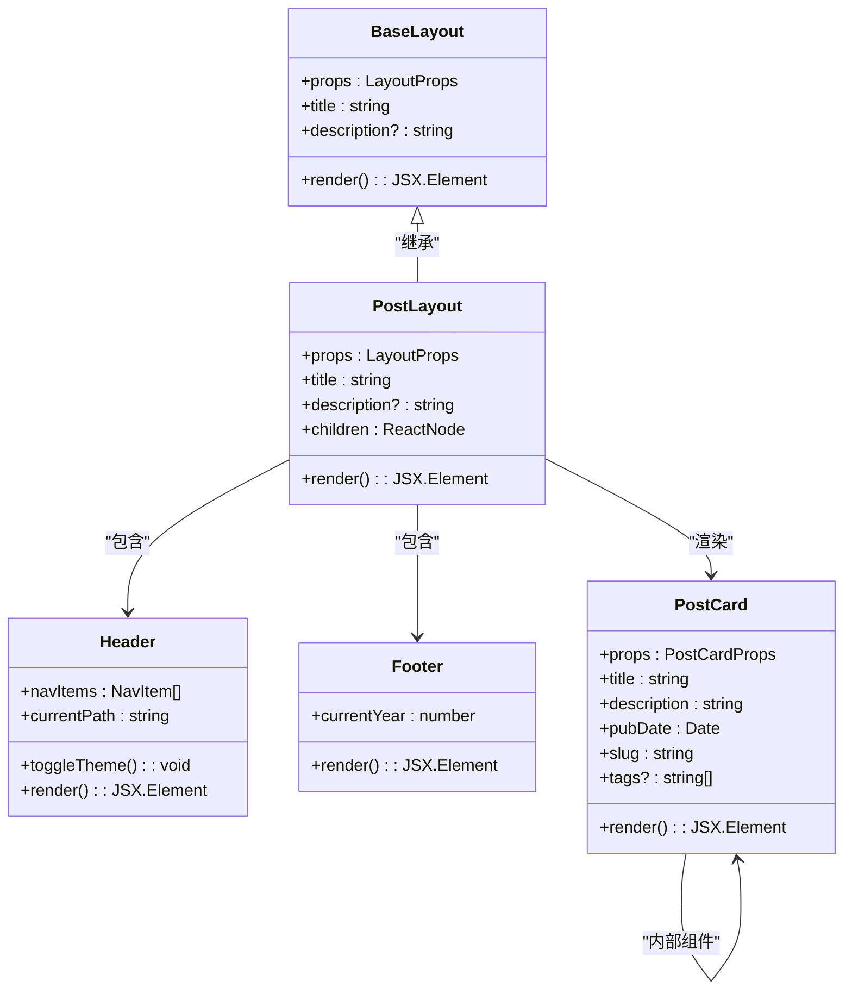

**图表来源**
- [src/layouts/BaseLayout.astro:4-10](file://src/layouts/BaseLayout.astro#L4-L10)
- [src/layouts/PostLayout.astro:6-12](file://src/layouts/PostLayout.astro#L6-L12)
- [src/components/Header.astro:2-8](file://src/components/Header.astro#L2-L8)
- [src/components/PostCard.astro:2-8](file://src/components/PostCard.astro#L2-L8)

### 组件接口定义

每个组件都定义了清晰的接口规范，确保类型安全和良好的开发体验：

**BaseLayout 接口**
- `title`: 页面标题（必需）
- `description`: 页面描述（可选，默认值）

**PostCard 接口**
- `title`: 文章标题（必需）
- `description`: 文章描述（必需）
- `pubDate`: 发布日期（必需）
- `slug`: 文章标识符（必需）
- `tags`: 标签数组（可选，默认空数组）

**章节来源**
- [src/layouts/BaseLayout.astro:4-10](file://src/layouts/BaseLayout.astro#L4-L10)
- [src/components/PostCard.astro:2-8](file://src/components/PostCard.astro#L2-L8)

## 架构概览

### 整体架构设计

项目采用分层架构，通过布局组件统一管理页面结构，子组件负责具体功能实现：

```mermaid
graph TB
subgraph "页面层"
HomePage[index.astro]
PostsPage[posts/index.astro]
PostDetailPage[posts/[slug].astro]
end
subgraph "布局层"
PostLayout[PostLayout.astro]
BaseLayout[BaseLayout.astro]
end
subgraph "组件层"
Header[Header.astro]
Footer[Footer.astro]
PostCard[PostCard.astro]
end
subgraph "数据层"
ContentConfig[content.config.ts]
MarkdownPosts[Markdown 内容]
end
subgraph "样式层"
Variables[variables.scss]
Global[global.scss]
end
HomePage --> PostLayout
PostsPage --> PostLayout
PostDetailPage --> PostLayout
PostLayout --> Header
PostLayout --> Footer
PostLayout --> PostCard
PostCard --> ContentConfig
ContentConfig --> MarkdownPosts
PostLayout --> Variables
Header --> Variables
Footer --> Variables
PostCard --> Variables
Variables --> Global
```

**图表来源**
- [src/pages/index.astro:1-110](file://src/pages/index.astro#L1-L110)
- [src/layouts/PostLayout.astro:1-36](file://src/layouts/PostLayout.astro#L1-L36)
- [src/layouts/BaseLayout.astro:1-53](file://src/layouts/BaseLayout.astro#L1-L53)
- [src/content.config.ts:1-18](file://src/content.config.ts#L1-L18)

### 数据流控制

系统实现了单向数据流控制，确保数据在组件间的正确传递：

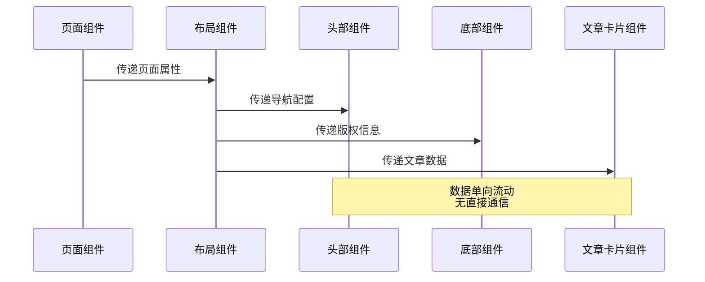

**图表来源**
- [src/pages/index.astro:11-46](file://src/pages/index.astro#L11-L46)
- [src/layouts/PostLayout.astro:14-22](file://src/layouts/PostLayout.astro#L14-L22)

**章节来源**
- [src/pages/index.astro:1-110](file://src/pages/index.astro#L1-L110)
- [src/layouts/PostLayout.astro:1-36](file://src/layouts/PostLayout.astro#L1-L36)

## 详细组件分析

### Header 组件分析

Header 组件是导航和主题切换的核心组件，实现了复杂的用户交互功能：

#### 组件结构与职责

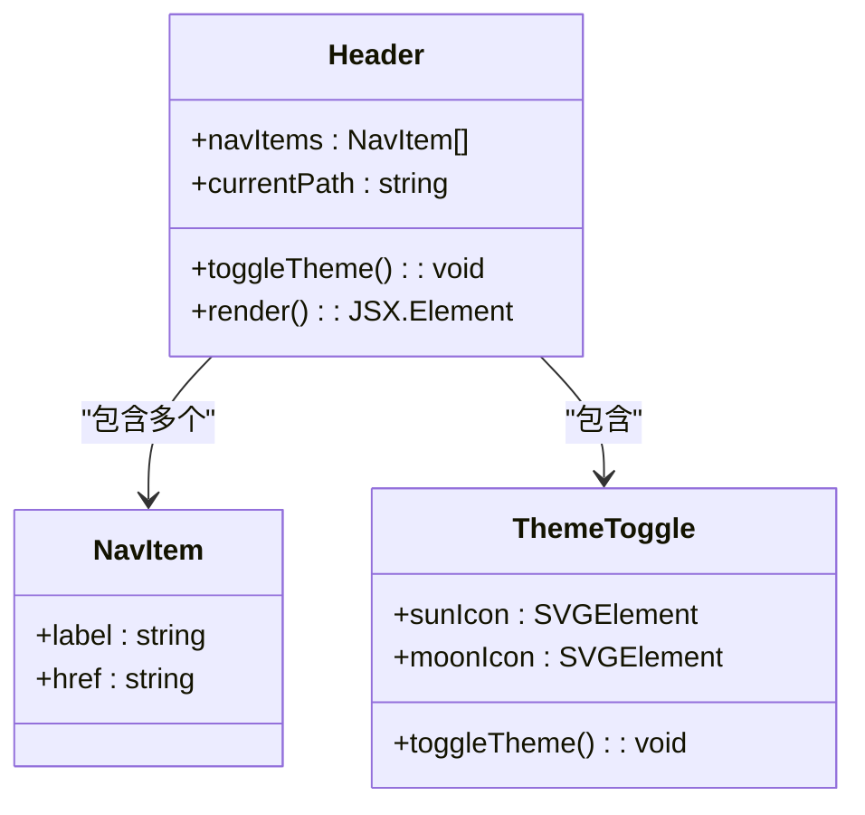

**图表来源**
- [src/components/Header.astro:2-6](file://src/components/Header.astro#L2-L6)
- [src/components/Header.astro:28-43](file://src/components/Header.astro#L28-L43)

#### 导航状态管理

Header 组件通过计算当前路径来管理导航状态：

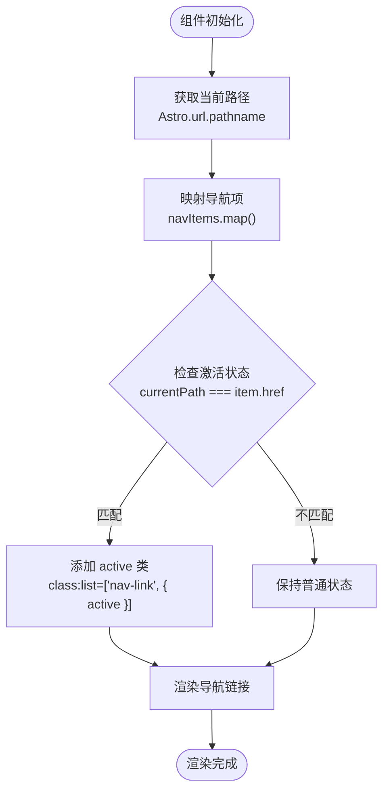

**图表来源**
- [src/components/Header.astro:8-25](file://src/components/Header.astro#L8-L25)

#### 主题切换机制

Header 组件实现了完整的主题切换功能，支持本地存储和系统偏好检测：

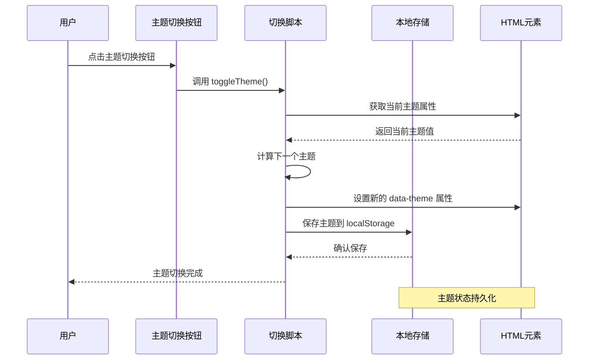

**图表来源**
- [src/layouts/BaseLayout.astro:39-50](file://src/layouts/BaseLayout.astro#L39-L50)
- [src/components/Header.astro:28-43](file://src/components/Header.astro#L28-L43)

**章节来源**
- [src/components/Header.astro:1-153](file://src/components/Header.astro#L1-L153)
- [src/layouts/BaseLayout.astro:28-50](file://src/layouts/BaseLayout.astro#L28-L50)

### PostCard 组件分析

PostCard 组件是内容展示的核心组件，负责文章信息的格式化和展示：

#### 组件数据处理

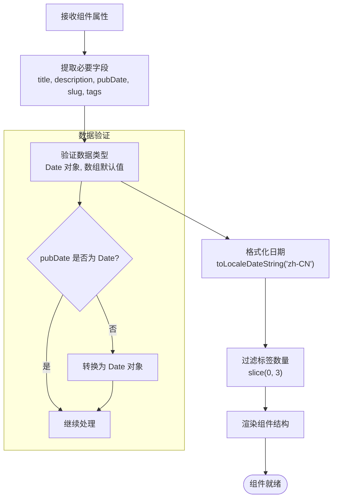

**图表来源**
- [src/components/PostCard.astro:10-16](file://src/components/PostCard.astro#L10-L16)
- [src/components/PostCard.astro:28-34](file://src/components/PostCard.astro#L28-L34)

#### 组件渲染逻辑

PostCard 组件实现了响应式的设计，能够根据不同的数据状态动态调整显示内容：

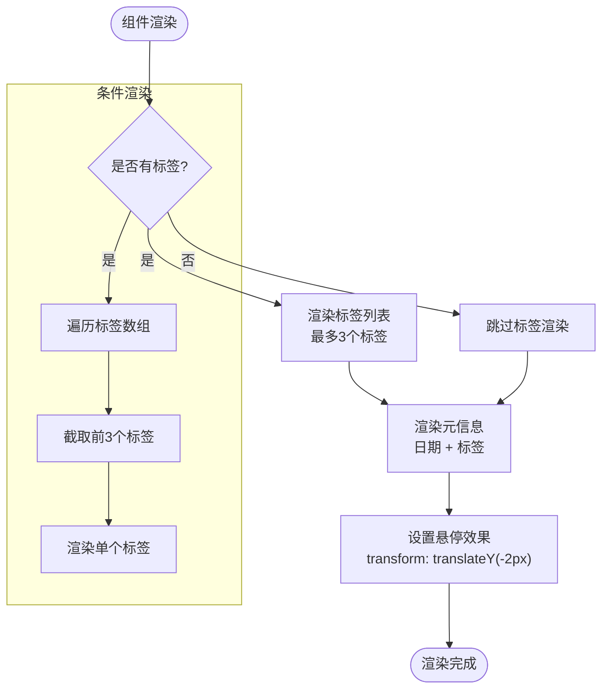

**图表来源**
- [src/components/PostCard.astro:28-35](file://src/components/PostCard.astro#L28-L35)
- [src/components/PostCard.astro:72-74](file://src/components/PostCard.astro#L72-L74)

**章节来源**
- [src/components/PostCard.astro:1-113](file://src/components/PostCard.astro#L1-L113)

### 布局组件分析

布局组件系统实现了页面的整体结构管理，通过组合模式实现组件复用：

#### 组件继承关系

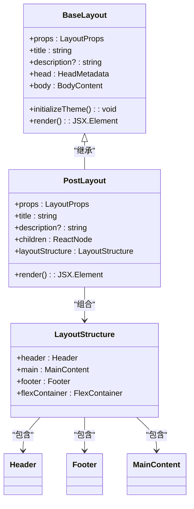

**图表来源**
- [src/layouts/BaseLayout.astro:4-10](file://src/layouts/BaseLayout.astro#L4-L10)
- [src/layouts/PostLayout.astro:6-12](file://src/layouts/PostLayout.astro#L6-L12)

#### 主题初始化流程

BaseLayout 组件实现了无闪烁的主题初始化机制：

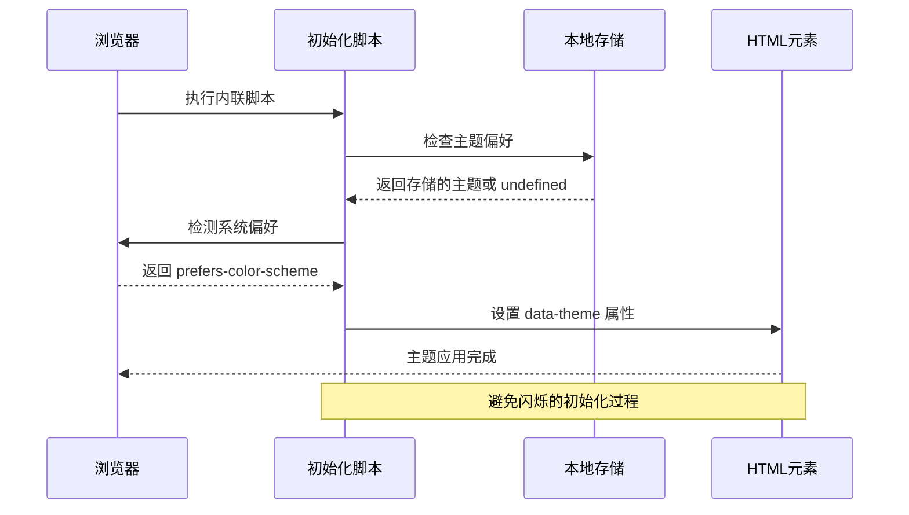

**图表来源**
- [src/layouts/BaseLayout.astro:28-33](file://src/layouts/BaseLayout.astro#L28-L33)

**章节来源**
- [src/layouts/BaseLayout.astro:1-53](file://src/layouts/BaseLayout.astro#L1-L53)
- [src/layouts/PostLayout.astro:1-36](file://src/layouts/PostLayout.astro#L1-L36)

## 依赖关系分析

### 组件依赖图

项目中的组件依赖关系清晰明确，遵循单一职责原则：

```mermaid
graph TD
subgraph "页面组件"
Index[index.astro]
PostsIndex[posts/index.astro]
PostSlug[posts/[slug].astro]
end
subgraph "布局组件"
PostLayout[PostLayout.astro]
BaseLayout[BaseLayout.astro]
end
subgraph "内容组件"
Header[Header.astro]
Footer[Footer.astro]
PostCard[PostCard.astro]
end
subgraph "样式依赖"
Variables[variables.scss]
Global[global.scss]
end
subgraph "数据依赖"
ContentConfig[content.config.ts]
Markdown[Markdown 文件]
end
Index --> PostLayout
PostsIndex --> PostLayout
PostSlug --> PostLayout
PostLayout --> Header
PostLayout --> Footer
PostLayout --> PostCard
PostLayout --> BaseLayout
Header --> Variables
Footer --> Variables
PostCard --> Variables
PostLayout --> Variables
PostCard --> ContentConfig
ContentConfig --> Markdown
Variables --> Global
```

**图表来源**
- [src/pages/index.astro:1-4](file://src/pages/index.astro#L1-L4)
- [src/layouts/PostLayout.astro:1-5](file://src/layouts/PostLayout.astro#L1-L5)
- [src/styles/variables.scss:1-108](file://src/styles/variables.scss#L1-L108)

### 数据依赖链

系统实现了清晰的数据依赖链，确保数据的一致性和完整性：

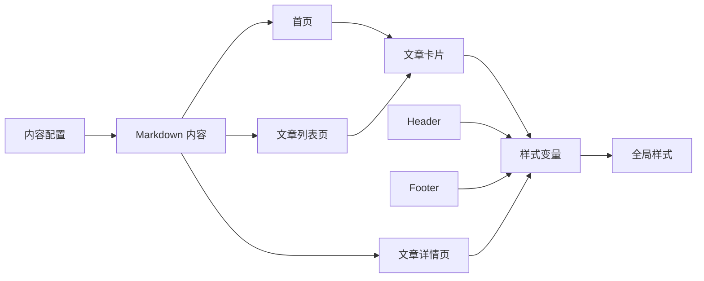

**图表来源**
- [src/content.config.ts:1-18](file://src/content.config.ts#L1-L18)
- [src/pages/index.astro:6-8](file://src/pages/index.astro#L6-L8)
- [src/pages/posts/index.astro:6-8](file://src/pages/posts/index.astro#L6-L8)

**章节来源**
- [src/pages/index.astro:1-110](file://src/pages/index.astro#L1-L110)
- [src/pages/posts/index.astro:1-94](file://src/pages/posts/index.astro#L1-L94)
- [src/content.config.ts:1-18](file://src/content.config.ts#L1-L18)

## 性能考虑

### 渲染优化策略

项目采用了多种性能优化策略来提升用户体验：

#### 零 JavaScript 默认配置

Astro 提供了零 JavaScript 的默认配置，减少了客户端脚本的加载和执行开销：

- **静态生成**: 所有页面在构建时预渲染
- **无运行时框架**: 减少客户端 JavaScript 体积
- **原生 HTML**: 直接输出优化的 HTML 结构

#### 样式优化

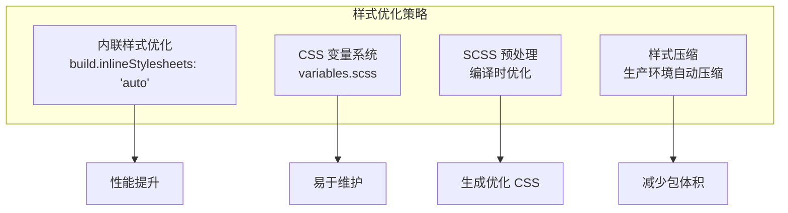

**图表来源**
- [astro.config.mjs:8-10](file://astro.config.mjs#L8-L10)
- [src/styles/variables.scss:1-108](file://src/styles/variables.scss#L1-L108)

#### 组件懒加载

虽然项目采用静态生成，但可以通过 Astro 的懒加载机制进一步优化：

- **按需渲染**: 只渲染当前页面需要的组件
- **资源优化**: 减少不必要的资源加载
- **内存管理**: 合理的组件生命周期管理

**章节来源**
- [astro.config.mjs:1-12](file://astro.config.mjs#L1-L12)
- [src/styles/global.scss:1-222](file://src/styles/global.scss#L1-L222)

## 故障排除指南

### 常见问题及解决方案

#### 主题切换失效

**问题症状**: 点击主题切换按钮后页面没有变化

**可能原因**:
1. JavaScript 脚本未正确加载
2. localStorage 权限问题
3. CSS 变量未正确更新

**解决方案**:
1. 检查浏览器控制台是否有 JavaScript 错误
2. 确认 localStorage 功能正常
3. 验证 CSS 变量是否正确应用

#### 导航状态异常

**问题症状**: 导航链接的激活状态不正确

**可能原因**:
1. 路径比较逻辑错误
2. Astro.url.pathname 获取失败
3. 动态路由参数处理问题

**解决方案**:
1. 检查 navItems 数组的 href 配置
2. 验证 currentPath 的计算逻辑
3. 确认路由参数的正确传递

#### 文章数据渲染问题

**问题症状**: 文章列表显示为空或数据格式错误

**可能原因**:
1. 内容集合查询失败
2. 数据类型转换错误
3. 标签数据格式不正确

**解决方案**:
1. 检查 content.config.ts 中的 schema 定义
2. 验证 Markdown 文件的 frontmatter 格式
3. 确认数据处理函数的正确性

**章节来源**
- [src/components/Header.astro:8-25](file://src/components/Header.astro#L8-L25)
- [src/components/PostCard.astro:10-16](file://src/components/PostCard.astro#L10-L16)
- [src/content.config.ts:6-15](file://src/content.config.ts#L6-L15)

## 最佳实践

### 组件设计原则

#### 单一职责原则

每个组件应该专注于单一功能，避免过度复杂化：

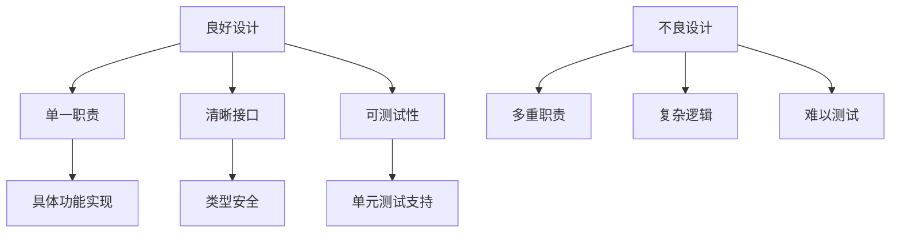

#### 组件复用策略

通过抽象通用功能实现组件复用：

1. **布局组件复用**: BaseLayout 和 PostLayout 的继承关系
2. **内容组件复用**: PostCard 在多个页面中的使用
3. **样式变量复用**: variables.scss 中的统一变量管理

#### 数据传递模式

采用 props 向下传递数据，事件向上传递的方式：

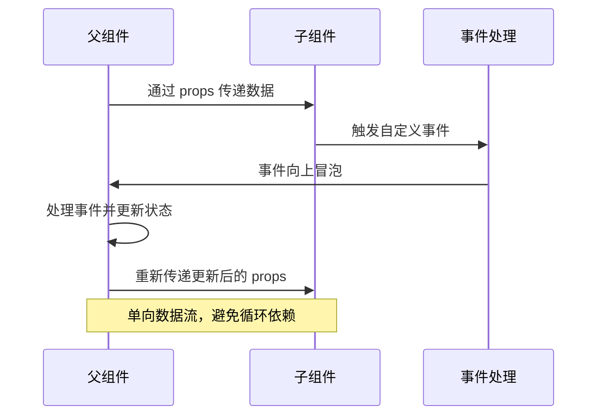

### 性能优化技巧

#### 渲染优化

1. **条件渲染**: 使用三元运算符和逻辑运算符进行条件渲染
2. **列表渲染**: 使用 map 方法高效渲染列表
3. **样式优化**: 利用 CSS 变量减少重复样式定义

#### 资源优化

1. **图片优化**: 使用适当的图片格式和尺寸
2. **字体优化**: 采用系统字体和字体回退机制
3. **缓存策略**: 利用浏览器缓存和 CDN 加速

### 调试技巧

#### 开发工具使用

1. **浏览器开发者工具**: 检查 DOM 结构和样式应用
2. **Astro DevTools**: 利用 Astro 提供的开发工具
3. **日志记录**: 在关键位置添加日志输出

#### 错误处理

1. **类型检查**: 使用 TypeScript 进行编译时类型检查
2. **边界情况**: 处理空数据和异常输入
3. **降级方案**: 为不同场景提供合理的降级方案

**章节来源**
- [src/components/PostCard.astro:28-35](file://src/components/PostCard.astro#L28-L35)
- [src/layouts/BaseLayout.astro:28-33](file://src/layouts/BaseLayout.astro#L28-L33)

## 结论

本项目展示了 Astro 组件系统的强大功能和优雅设计。通过清晰的组件层次结构、严格的接口定义和高效的渲染机制，实现了优秀的用户体验和开发体验。

### 主要成就

1. **组件化架构**: 实现了清晰的组件分离和职责划分
2. **数据流控制**: 采用单向数据流确保数据一致性
3. **主题系统**: 提供了完整的主题切换和持久化机制
4. **性能优化**: 利用 Astro 的静态生成特性实现高性能
5. **样式管理**: 通过 CSS 变量实现了灵活的主题定制

### 技术亮点

- **零 JavaScript 默认配置**: 提供了最佳的性能表现
- **类型安全**: 完整的 TypeScript 支持确保代码质量
- **响应式设计**: 适配多种设备和屏幕尺寸
- **SEO 友好**: 自动生成 SEO 优化的页面结构

### 未来改进方向

1. **状态管理**: 考虑引入更复杂的状态管理方案
2. **组件库**: 将通用组件抽象为可复用的组件库
3. **国际化**: 添加多语言支持功能
4. **测试覆盖**: 增加自动化测试覆盖率

该项目为 Astro 组件系统的实际应用提供了优秀的参考案例，展示了如何在实际项目中运用组件交互机制来构建高质量的 Web 应用。