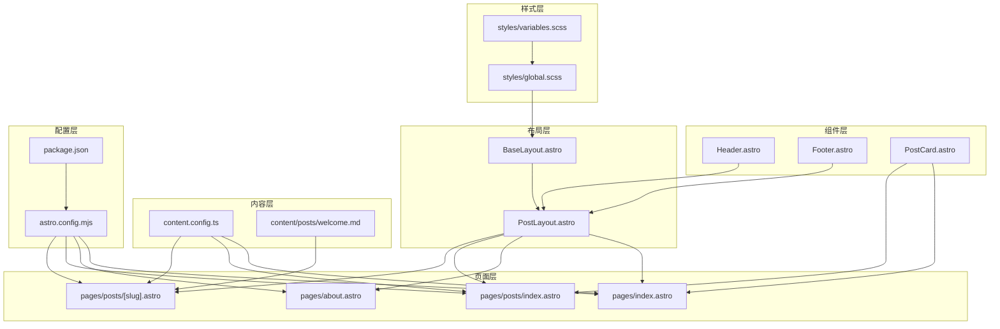
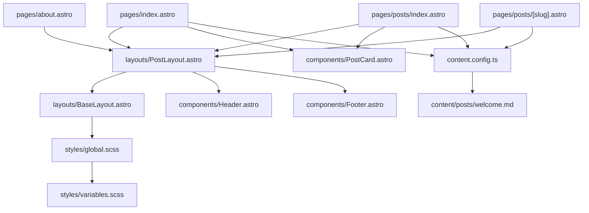
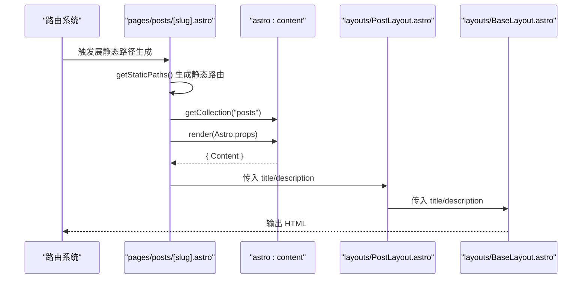
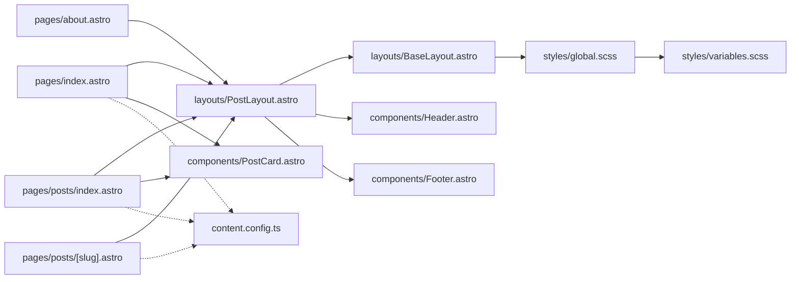

# 组件系统架构

<cite>
**本文引用的文件**
- [src/components/Header.astro](file://src/components/Header.astro)
- [src/components/Footer.astro](file://src/components/Footer.astro)
- [src/components/PostCard.astro](file://src/components/PostCard.astro)
- [src/layouts/BaseLayout.astro](file://src/layouts/BaseLayout.astro)
- [src/layouts/PostLayout.astro](file://src/layouts/PostLayout.astro)
- [src/pages/index.astro](file://src/pages/index.astro)
- [src/pages/about.astro](file://src/pages/about.astro)
- [src/pages/posts/index.astro](file://src/pages/posts/index.astro)
- [src/pages/posts/[slug].astro](file://src/pages/posts/[slug].astro)
- [src/styles/global.scss](file://src/styles/global.scss)
- [src/styles/variables.scss](file://src/styles/variables.scss)
- [src/content.config.ts](file://src/content.config.ts)
- [src/content/posts/welcome.md](file://src/content/posts/welcome.md)
- [astro.config.mjs](file://astro.config.mjs)
- [package.json](file://package.json)
</cite>

## 目录
1. [引言](#引言)
2. [项目结构](#项目结构)
3. [核心组件](#核心组件)
4. [架构总览](#架构总览)
5. [详细组件分析](#详细组件分析)
6. [依赖分析](#依赖分析)
7. [性能考虑](#性能考虑)
8. [故障排查指南](#故障排查指南)
9. [结论](#结论)
10. [附录](#附录)

## 引言
本文件系统性梳理该 Astro 项目的组件系统架构与组织方式，重点覆盖：
- 组件分类体系：UI 组件、布局组件、页面组件的职责与设计原则
- 组件间依赖关系与通信机制
- Astro 文件的特殊语法与生命周期管理
- 复用策略与扩展机制
- 最佳实践与性能优化建议
- 开发指导原则与常见问题解决方案

## 项目结构
该项目采用按功能域分层的目录组织方式：
- src/components：可复用 UI 组件库（Header、Footer、PostCard）
- src/layouts：页面布局组件（BaseLayout、PostLayout）
- src/pages：页面级组件（index、about、posts/*）
- src/styles：全局样式与变量（global.scss、variables.scss）
- src/content：内容集合定义与 Markdown 内容
- 根目录配置：astro.config.mjs、package.json

图表来源
- [src/components/Header.astro:1-153](file://src/components/Header.astro#L1-L153)
- [src/components/Footer.astro:1-65](file://src/components/Footer.astro#L1-L65)
- [src/components/PostCard.astro:1-113](file://src/components/PostCard.astro#L1-L113)
- [src/layouts/BaseLayout.astro:1-53](file://src/layouts/BaseLayout.astro#L1-L53)
- [src/layouts/PostLayout.astro:1-36](file://src/layouts/PostLayout.astro#L1-L36)
- [src/pages/index.astro:1-110](file://src/pages/index.astro#L1-L110)
- [src/pages/about.astro:1-49](file://src/pages/about.astro#L1-L49)
- [src/pages/posts/index.astro:1-94](file://src/pages/posts/index.astro#L1-L94)
- [src/pages/posts/[slug].astro](file://src/pages/posts/[slug].astro#L1-L116)
- [src/styles/global.scss:1-222](file://src/styles/global.scss#L1-L222)
- [src/styles/variables.scss:1-108](file://src/styles/variables.scss#L1-L108)
- [src/content.config.ts:1-18](file://src/content.config.ts#L1-L18)
- [src/content/posts/welcome.md:1-53](file://src/content/posts/welcome.md#L1-L53)
- [astro.config.mjs:1-12](file://astro.config.mjs#L1-L12)
- [package.json:1-22](file://package.json#L1-L22)

章节来源
- [astro.config.mjs:1-12](file://astro.config.mjs#L1-L12)
- [package.json:1-22](file://package.json#L1-L22)

## 核心组件
- UI 组件（可复用、无状态或轻状态）
  - Header：导航栏与主题切换入口，负责当前路径高亮与主题图标切换
  - Footer：页脚版权与链接
  - PostCard：文章卡片，接收标题、摘要、日期、标签等属性
- 布局组件（页面骨架与上下文注入）
  - BaseLayout：HTML 文档骨架、SEO 元信息、主题初始化脚本、全局样式引入
  - PostLayout：组合 Header、Footer 与 slot，形成统一页面结构
- 页面组件（数据加载与业务渲染）
  - index：聚合最新文章并渲染卡片
  - about：静态介绍页面
  - posts/index：文章列表与标签过滤
  - posts/[slug]：动态路由详情页，渲染 Markdown 内容

章节来源
- [src/components/Header.astro:1-153](file://src/components/Header.astro#L1-L153)
- [src/components/Footer.astro:1-65](file://src/components/Footer.astro#L1-L65)
- [src/components/PostCard.astro:1-113](file://src/components/PostCard.astro#L1-L113)
- [src/layouts/BaseLayout.astro:1-53](file://src/layouts/BaseLayout.astro#L1-L53)
- [src/layouts/PostLayout.astro:1-36](file://src/layouts/PostLayout.astro#L1-L36)
- [src/pages/index.astro:1-110](file://src/pages/index.astro#L1-L110)
- [src/pages/about.astro:1-49](file://src/pages/about.astro#L1-L49)
- [src/pages/posts/index.astro:1-94](file://src/pages/posts/index.astro#L1-L94)
- [src/pages/posts/[slug].astro](file://src/pages/posts/[slug].astro#L1-L116)

## 架构总览
该系统遵循“页面即组件”的理念，页面组件通过导入布局与 UI 组件实现复用；内容通过 Astro 内容集合进行类型化管理，动态路由与静态路径生成结合，实现高性能的静态输出。

图表来源
- [src/pages/index.astro:1-110](file://src/pages/index.astro#L1-L110)
- [src/pages/about.astro:1-49](file://src/pages/about.astro#L1-L49)
- [src/pages/posts/index.astro:1-94](file://src/pages/posts/index.astro#L1-L94)
- [src/pages/posts/[slug].astro](file://src/pages/posts/[slug].astro#L1-L116)
- [src/layouts/PostLayout.astro:1-36](file://src/layouts/PostLayout.astro#L1-L36)
- [src/layouts/BaseLayout.astro:1-53](file://src/layouts/BaseLayout.astro#L1-L53)
- [src/components/Header.astro:1-153](file://src/components/Header.astro#L1-L153)
- [src/components/Footer.astro:1-65](file://src/components/Footer.astro#L1-L65)
- [src/components/PostCard.astro:1-113](file://src/components/PostCard.astro#L1-L113)
- [src/styles/global.scss:1-222](file://src/styles/global.scss#L1-L222)
- [src/styles/variables.scss:1-108](file://src/styles/variables.scss#L1-L108)
- [src/content.config.ts:1-18](file://src/content.config.ts#L1-L18)
- [src/content/posts/welcome.md:1-53](file://src/content/posts/welcome.md#L1-L53)

## 详细组件分析

### 页面组件工作流（以 posts/[slug] 为例）
该页面展示了 Astro 的典型工作流：声明式静态路径生成、内容渲染与页面布局组合。

图表来源
- [src/pages/posts/[slug].astro](file://src/pages/posts/[slug].astro#L1-L116)
- [src/layouts/PostLayout.astro:1-36](file://src/layouts/PostLayout.astro#L1-L36)
- [src/layouts/BaseLayout.astro:1-53](file://src/layouts/BaseLayout.astro#L1-L53)

章节来源
- [src/pages/posts/[slug].astro](file://src/pages/posts/[slug].astro#L5-L21)

### 组件间依赖与通信
- 依赖方向
  - 页面组件依赖布局组件与 UI 组件
  - 布局组件依赖基础布局与全局样式
  - 页面组件通过 Astro 内容 API 获取数据
- 通信机制
  - 属性传递：页面向布局与 UI 传递 title、description、文章数据
  - 插槽（slot）：布局通过 slot 注入页面内容
  - 全局状态：主题通过 data-theme 属性与本地存储同步

章节来源
- [src/layouts/PostLayout.astro:14-22](file://src/layouts/PostLayout.astro#L14-L22)
- [src/layouts/BaseLayout.astro:28-50](file://src/layouts/BaseLayout.astro#L28-L50)
- [src/components/Header.astro:28-44](file://src/components/Header.astro#L28-L44)

### Astro 文件的特殊语法与生命周期
- 前言区（frontmatter）
  - 用于声明 props、导入模块、异步数据与静态路径生成
  - 示例：页面组件中的 getStaticPaths、getCollection、render
- 渲染区
  - JSX/HTML 模板区域，支持表达式与条件渲染
- 样式区
  - 支持内联样式与作用域样式，配合全局 SCSS 使用
- 生命周期
  - 构建期：执行前言区逻辑，生成静态页面与路径
  - 运行期：在浏览器中注入必要的脚本（如主题切换）

章节来源
- [src/pages/posts/[slug].astro](file://src/pages/posts/[slug].astro#L1-L116)
- [src/pages/index.astro:1-110](file://src/pages/index.astro#L1-L110)
- [src/layouts/BaseLayout.astro:28-50](file://src/layouts/BaseLayout.astro#L28-L50)

### 组件复用策略与扩展机制
- 复用策略
  - UI 组件：抽象通用交互与展示（Header、Footer、PostCard）
  - 布局组件：抽象页面骨架与上下文（BaseLayout、PostLayout）
  - 内容驱动：通过内容集合与 Markdown 实现内容复用
- 扩展机制
  - 新增 UI 组件时，保持接口稳定（Props），便于在多个页面复用
  - 新增页面时，优先复用现有布局与 UI 组件，减少重复逻辑
  - 利用 Astro 集合与渲染 API，扩展内容类型与页面渲染能力

章节来源
- [src/components/PostCard.astro:1-113](file://src/components/PostCard.astro#L1-L113)
- [src/layouts/PostLayout.astro:1-36](file://src/layouts/PostLayout.astro#L1-L36)
- [src/content.config.ts:1-18](file://src/content.config.ts#L1-L18)

## 依赖分析
- 组件耦合
  - 页面组件对布局与 UI 组件存在直接依赖，耦合度低、内聚性强
  - 布局组件对基础布局与 UI 组件存在直接依赖
- 外部依赖
  - Astro 核心与集成（sitemap）
  - 内容集合与渲染 API
  - 构建配置与脚本

图表来源
- [src/pages/index.astro:1-110](file://src/pages/index.astro#L1-L110)
- [src/pages/about.astro:1-49](file://src/pages/about.astro#L1-L49)
- [src/pages/posts/index.astro:1-94](file://src/pages/posts/index.astro#L1-L94)
- [src/pages/posts/[slug].astro](file://src/pages/posts/[slug].astro#L1-L116)
- [src/layouts/PostLayout.astro:1-36](file://src/layouts/PostLayout.astro#L1-L36)
- [src/layouts/BaseLayout.astro:1-53](file://src/layouts/BaseLayout.astro#L1-L53)
- [src/components/Header.astro:1-153](file://src/components/Header.astro#L1-L153)
- [src/components/Footer.astro:1-65](file://src/components/Footer.astro#L1-L65)
- [src/components/PostCard.astro:1-113](file://src/components/PostCard.astro#L1-L113)
- [src/styles/global.scss:1-222](file://src/styles/global.scss#L1-L222)
- [src/styles/variables.scss:1-108](file://src/styles/variables.scss#L1-L108)
- [src/content.config.ts:1-18](file://src/content.config.ts#L1-L18)

章节来源
- [astro.config.mjs:1-12](file://astro.config.mjs#L1-L12)
- [package.json:1-22](file://package.json#L1-L22)

## 性能考虑
- 零运行时 JavaScript
  - BaseLayout 中的主题初始化脚本采用 is:inline，避免额外请求
  - Header 的主题切换脚本在运行时注入，仅在交互时触发
- 样式优化
  - 全局样式集中管理，变量系统统一主题色与间距
  - 构建配置开启内联样式策略，减少网络往返
- 内容渲染
  - 使用 Astro 内容集合与渲染 API，按需生成静态页面
  - 动态路由通过 getStaticPaths 预渲染，提升首屏性能

章节来源
- [src/layouts/BaseLayout.astro:28-50](file://src/layouts/BaseLayout.astro#L28-L50)
- [src/components/Header.astro:28-44](file://src/components/Header.astro#L28-L44)
- [src/styles/global.scss:1-222](file://src/styles/global.scss#L1-L222)
- [src/styles/variables.scss:1-108](file://src/styles/variables.scss#L1-L108)
- [astro.config.mjs:8-10](file://astro.config.mjs#L8-L10)

## 故障排查指南
- 主题切换无效
  - 检查 BaseLayout 是否正确设置 data-theme 并注入切换脚本
  - 确认 Header 中的 toggleTheme 是否暴露到全局
- 页面未显示内容
  - 检查页面是否正确调用 astro:content 的 getCollection/render
  - 确认内容集合 schema 与 Markdown frontmatter 一致
- 样式不生效
  - 确认 BaseLayout 引入了全局样式
  - 检查变量系统是否正确加载与覆盖

章节来源
- [src/layouts/BaseLayout.astro:28-50](file://src/layouts/BaseLayout.astro#L28-L50)
- [src/components/Header.astro:28-44](file://src/components/Header.astro#L28-L44)
- [src/pages/posts/[slug].astro](file://src/pages/posts/[slug].astro#L13-L14)
- [src/content.config.ts:1-18](file://src/content.config.ts#L1-L18)
- [src/styles/global.scss:1-222](file://src/styles/global.scss#L1-L222)

## 结论
该 Astro 项目通过清晰的组件分层与内容驱动的方式，实现了高内聚、低耦合的组件系统。页面组件专注于业务渲染，布局与 UI 组件承担通用职责，配合 Astro 的内容集合与静态生成能力，达到性能与可维护性的平衡。建议在后续扩展中持续遵循“先复用后新增”的原则，并利用 Astro 的类型化内容系统与静态路径生成能力，进一步提升开发效率与用户体验。

## 附录
- 组件设计最佳实践
  - 明确职责边界：UI 组件只处理展示与交互，布局组件只处理结构与上下文
  - 接口稳定：UI 组件的 Props 应尽量稳定，便于跨页面复用
  - 数据下沉：页面组件负责数据获取与组装，子组件只消费数据
- 开发指导原则
  - 优先使用 Astro 内置内容 API 与渲染能力
  - 将样式与变量集中管理，确保主题一致性
  - 合理使用插槽与 props，避免过度耦合
- 常见问题
  - 动态路由未预渲染：检查 getStaticPaths 的返回值与 props 传递
  - 样式覆盖顺序：注意全局样式与组件内联样式的优先级