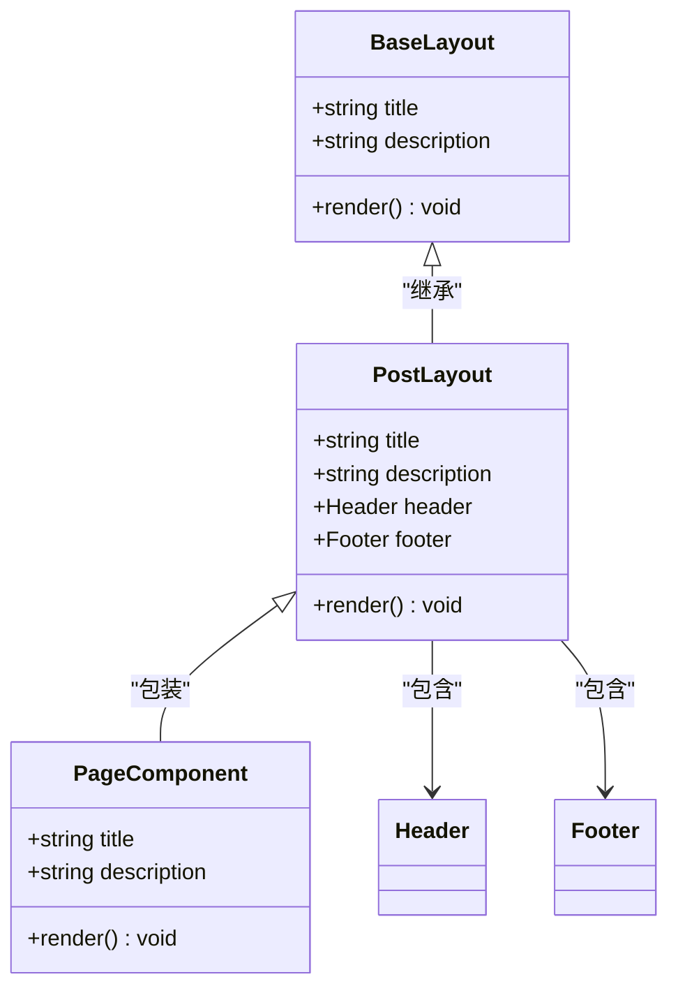
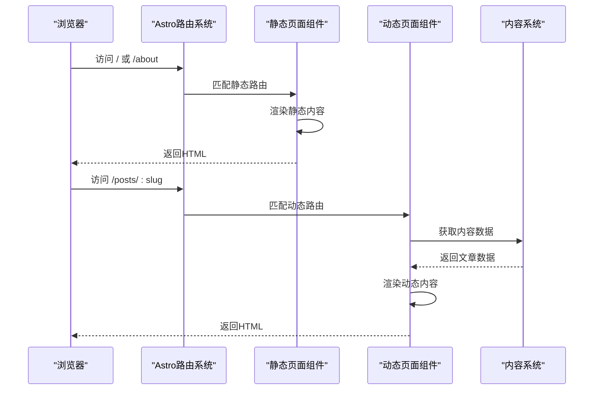
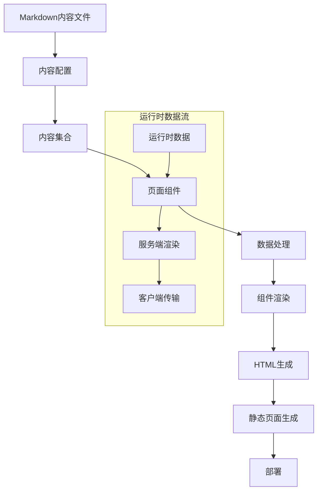
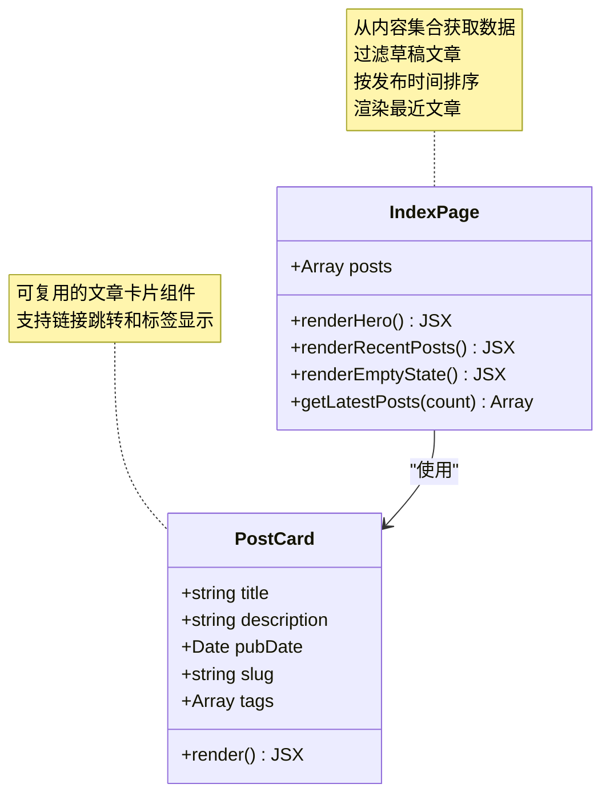
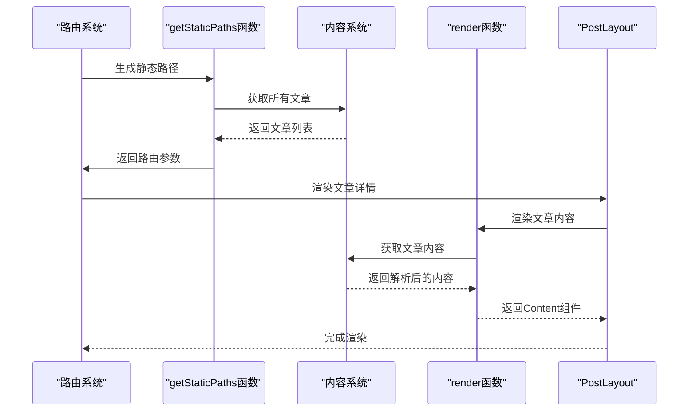
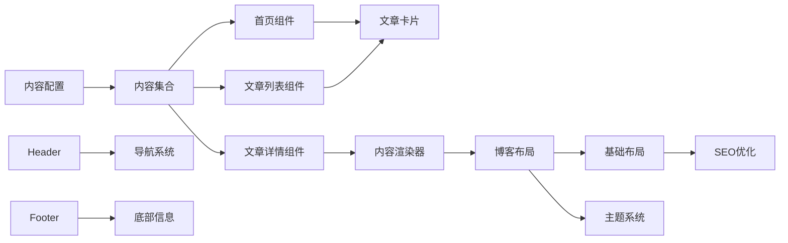
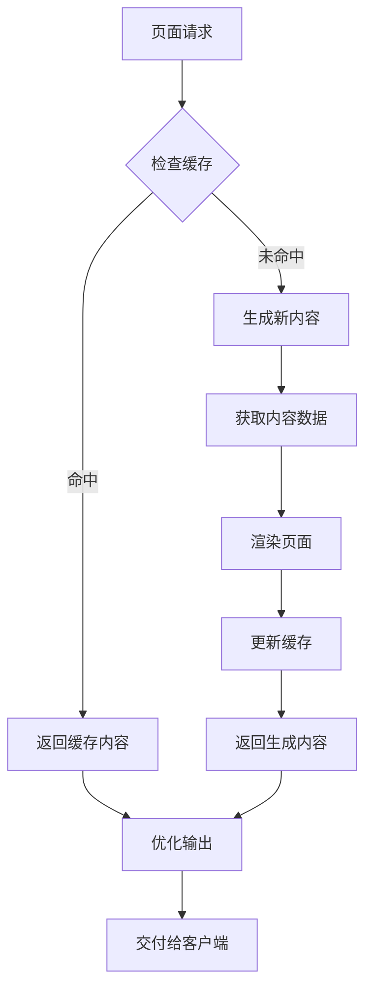

# 页面组件

<cite>
**本文档引用的文件**
- [src/pages/index.astro](file://src/pages/index.astro)
- [src/pages/about.astro](file://src/pages/about.astro)
- [src/pages/posts/[slug].astro](file://src/pages/posts/[slug].astro)
- [src/pages/posts/index.astro](file://src/pages/posts/index.astro)
- [src/layouts/BaseLayout.astro](file://src/layouts/BaseLayout.astro)
- [src/layouts/PostLayout.astro](file://src/layouts/PostLayout.astro)
- [src/components/PostCard.astro](file://src/components/PostCard.astro)
- [src/components/Header.astro](file://src/components/Header.astro)
- [src/components/Footer.astro](file://src/components/Footer.astro)
- [src/content.config.ts](file://src/content.config.ts)
- [src/content/posts/welcome.md](file://src/content/posts/welcome.md)
- [astro.config.mjs](file://astro.config.mjs)
- [package.json](file://package.json)
- [src/styles/global.scss](file://src/styles/global.scss)
</cite>

## 目录
1. [简介](#简介)
2. [项目结构](#项目结构)
3. [核心组件](#核心组件)
4. [架构概览](#架构概览)
5. [详细组件分析](#详细组件分析)
6. [依赖关系分析](#依赖关系分析)
7. [性能考虑](#性能考虑)
8. [故障排除指南](#故障排除指南)
9. [结论](#结论)
10. [附录](#附录)

## 简介

本项目是一个基于 Astro 的静态网站，采用内容驱动的方式构建页面组件。项目实现了完整的博客功能，包括静态页面和动态页面两种不同的路由机制。通过 Astro 的内容集合系统，页面组件能够从 Markdown 文件中提取数据，实现内容驱动的页面生成。

该系统的核心特点包括：
- **静态页面生成**：首页、关于页面等固定路由的预渲染
- **动态页面生成**：基于内容集合的动态路由，支持 slug 参数
- **内容驱动架构**：通过 Markdown 文件和内容配置实现数据管理
- **SEO 优化**：自动化的元数据管理和结构化标记
- **响应式设计**：完整的移动端适配和主题切换功能

## 项目结构

项目采用模块化的文件组织结构，按照功能和用途进行分类：

```mermaid
graph TB
subgraph "页面层"
Index[index.astro - 首页]
About[about.astro - 关于页面]
PostsIndex[posts/index.astro - 文章列表]
PostDetail[posts/[slug].astro - 文章详情]
end
subgraph "布局层"
BaseLayout[BaseLayout.astro - 基础布局]
PostLayout[PostLayout.astro - 博客布局]
end
subgraph "组件层"
Header[Header.astro - 头部导航]
Footer[Footer.astro - 底部信息]
PostCard[PostCard.astro - 文章卡片]
end
subgraph "内容层"
ContentConfig[content.config.ts - 内容配置]
Posts[posts/*.md - 文章内容]
end
subgraph "配置层"
AstroConfig[astro.config.mjs - Astro配置]
PackageJson[package.json - 依赖管理]
GlobalSCSS[global.scss - 全局样式]
end
Index --> PostLayout
About --> PostLayout
PostsIndex --> PostLayout
PostDetail --> PostLayout
PostLayout --> BaseLayout
PostLayout --> Header
PostLayout --> Footer
PostCard --> PostLayout
ContentConfig --> Posts
AstroConfig --> PackageJson
BaseLayout --> GlobalSCSS
```

**图表来源**
- [src/pages/index.astro:1-110](file://src/pages/index.astro#L1-L110)
- [src/layouts/PostLayout.astro:1-36](file://src/layouts/PostLayout.astro#L1-L36)
- [src/content.config.ts:1-18](file://src/content.config.ts#L1-L18)

**章节来源**
- [src/pages/index.astro:1-110](file://src/pages/index.astro#L1-L110)
- [src/pages/about.astro:1-49](file://src/pages/about.astro#L1-L49)
- [src/pages/posts/index.astro:1-94](file://src/pages/posts/index.astro#L1-L94)
- [src/pages/posts/[slug].astro:1-116](file://src/pages/posts/[slug].astro#L1-L116)

## 核心组件

### 页面组件类型

项目中的页面组件主要分为两大类：

#### 静态页面组件
- **首页** (`index.astro`)：展示最新的文章列表和欢迎信息
- **关于页面** (`about.astro`)：展示个人信息和网站介绍
- **文章列表** (`posts/index.astro`)：展示所有已发布文章的完整列表

#### 动态页面组件
- **文章详情** (`posts/[slug].astro`)：根据 slug 参数动态生成文章详情页面

### 布局系统

页面组件通过布局系统实现统一的外观和行为：



**图表来源**
- [src/layouts/BaseLayout.astro:1-53](file://src/layouts/BaseLayout.astro#L1-L53)
- [src/layouts/PostLayout.astro:1-36](file://src/layouts/PostLayout.astro#L1-L36)

**章节来源**
- [src/layouts/BaseLayout.astro:1-53](file://src/layouts/BaseLayout.astro#L1-L53)
- [src/layouts/PostLayout.astro:1-36](file://src/layouts/PostLayout.astro#L1-L36)

## 架构概览

### 路由机制

Astro 采用基于文件系统的路由机制，页面组件的路径直接映射到 URL：



**图表来源**
- [src/pages/index.astro:1-110](file://src/pages/index.astro#L1-L110)
- [src/pages/posts/[slug].astro:1-116](file://src/pages/posts/[slug].astro#L1-L116)

### 数据流架构

页面组件通过 Astro 的内容系统实现数据驱动的渲染：



**图表来源**
- [src/content.config.ts:1-18](file://src/content.config.ts#L1-L18)
- [src/pages/index.astro:1-110](file://src/pages/index.astro#L1-L110)

**章节来源**
- [src/content.config.ts:1-18](file://src/content.config.ts#L1-L18)
- [src/pages/index.astro:1-110](file://src/pages/index.astro#L1-L110)

## 详细组件分析

### 静态页面组件

#### 首页组件 (index.astro)

首页组件展示了内容驱动页面的核心实现方式：



**图表来源**
- [src/pages/index.astro:1-110](file://src/pages/index.astro#L1-L110)
- [src/components/PostCard.astro:1-113](file://src/components/PostCard.astro#L1-L113)

**章节来源**
- [src/pages/index.astro:1-110](file://src/pages/index.astro#L1-L110)
- [src/components/PostCard.astro:1-113](file://src/components/PostCard.astro#L1-L113)

#### 关于页面组件 (about.astro)

关于页面组件展示了静态内容的最佳实践：

**章节来源**
- [src/pages/about.astro:1-49](file://src/pages/about.astro#L1-L49)

### 动态页面组件

#### 文章详情组件 ([slug].astro)

动态页面组件实现了基于参数的路由处理：



**图表来源**
- [src/pages/posts/[slug].astro:1-116](file://src/pages/posts/[slug].astro#L1-L116)

**章节来源**
- [src/pages/posts/[slug].astro:1-116](file://src/pages/posts/[slug].astro#L1-L116)

### 布局组件

#### 基础布局 (BaseLayout.astro)

基础布局组件提供了网站的核心结构和 SEO 支持：

**章节来源**
- [src/layouts/BaseLayout.astro:1-53](file://src/layouts/BaseLayout.astro#L1-L53)

#### 博客布局 (PostLayout.astro)

博客布局组件整合了头部导航、主要内容区域和底部信息：

**章节来源**
- [src/layouts/PostLayout.astro:1-36](file://src/layouts/PostLayout.astro#L1-L36)

### 可复用组件

#### 文章卡片组件 (PostCard.astro)

文章卡片组件实现了可复用的内容展示模式：

**章节来源**
- [src/components/PostCard.astro:1-113](file://src/components/PostCard.astro#L1-L113)

#### 导航组件 (Header.astro)

导航组件提供了响应式的菜单和活动状态管理：

**章节来源**
- [src/components/Header.astro:1-153](file://src/components/Header.astro#L1-L153)

#### 底部组件 (Footer.astro)

底部组件包含了版权信息和社交链接：

**章节来源**
- [src/components/Footer.astro:1-65](file://src/components/Footer.astro#L1-L65)

## 依赖关系分析

### 组件依赖图

```mermaid
graph TB
subgraph "页面组件"
IndexPage[index.astro]
AboutPage[about.astro]
PostsIndex[posts/index.astro]
PostDetail[posts/[slug].astro]
end
subgraph "布局组件"
BaseLayout[BaseLayout.astro]
PostLayout[PostLayout.astro]
end
subgraph "可复用组件"
Header[Header.astro]
Footer[Footer.astro]
PostCard[PostCard.astro]
end
subgraph "内容系统"
ContentConfig[content.config.ts]
ContentFiles[*.md文件]
end
subgraph "配置系统"
AstroConfig[astro.config.mjs]
PackageJson[package.json]
end
IndexPage --> PostLayout
AboutPage --> PostLayout
PostsIndex --> PostLayout
PostDetail --> PostLayout
PostLayout --> BaseLayout
PostLayout --> Header
PostLayout --> Footer
PostCard --> PostLayout
PostLayout --> PostCard
ContentConfig --> ContentFiles
AstroConfig --> PackageJson
```

**图表来源**
- [src/pages/index.astro:1-110](file://src/pages/index.astro#L1-L110)
- [src/pages/about.astro:1-49](file://src/pages/about.astro#L1-L49)
- [src/pages/posts/index.astro:1-94](file://src/pages/posts/index.astro#L1-L94)
- [src/pages/posts/[slug].astro:1-116](file://src/pages/posts/[slug].astro#L1-L116)

### 数据依赖关系

页面组件之间的数据流向体现了 Astro 的内容驱动架构：



**图表来源**
- [src/content.config.ts:1-18](file://src/content.config.ts#L1-L18)
- [src/pages/index.astro:1-110](file://src/pages/index.astro#L1-L110)
- [src/pages/posts/index.astro:1-94](file://src/pages/posts/index.astro#L1-L94)
- [src/pages/posts/[slug].astro:1-116](file://src/pages/posts/[slug].astro#L1-L116)

**章节来源**
- [src/content.config.ts:1-18](file://src/content.config.ts#L1-L18)
- [src/pages/index.astro:1-110](file://src/pages/index.astro#L1-L110)

## 性能考虑

### 静态生成优化

项目采用了 Astro 的静态生成特性，通过以下方式优化性能：

#### 内容预渲染
- 所有页面在构建时预渲染为静态 HTML
- 减少服务器端渲染开销
- 提升首屏加载速度

#### 资源优化
- 自动内联样式以减少 HTTP 请求
- 响应式图片和懒加载支持
- CSS 和 JavaScript 的最小化处理

#### 缓存策略
- 浏览器缓存友好的资源版本控制
- CDN 友好的静态资源分发
- 适当的缓存头设置

### 动态内容优化

对于动态页面组件，项目实现了智能的缓存和渲染策略：



**图表来源**
- [src/pages/posts/[slug].astro:1-116](file://src/pages/posts/[slug].astro#L1-L116)

### SEO 优化策略

项目实现了全面的 SEO 优化措施：

#### 结构化数据
- 自动化的 Open Graph 元数据
- Schema.org 结构化标记
- 社交媒体友好的内容分享

#### 内容优化
- 自动生成的 sitemap.xml
- RSS 订阅支持
- 语义化的 HTML 结构

#### 性能监控
- Core Web Vitals 指标监控
- 页面加载时间优化
- 移动端性能优化

**章节来源**
- [src/layouts/BaseLayout.astro:1-53](file://src/layouts/BaseLayout.astro#L1-L53)
- [astro.config.mjs:1-12](file://astro.config.mjs#L1-L12)

## 故障排除指南

### 常见问题及解决方案

#### 页面无法渲染

**症状**：页面显示空白或出现错误

**可能原因**：
- 内容文件格式错误
- 组件导入路径不正确
- 缺少必要的依赖包

**解决步骤**：
1. 检查内容文件的 YAML frontmatter 格式
2. 验证组件导入路径的有效性
3. 运行 `npm run build` 查看构建错误

#### 动态路由失效

**症状**：`/posts/:slug` 页面无法访问

**可能原因**：
- `getStaticPaths` 函数未正确实现
- 内容集合名称不匹配
- slug 参数处理错误

**解决步骤**：
1. 确认 `getStaticPaths` 函数返回正确的参数对象
2. 验证内容集合配置中的模式匹配
3. 检查 slug 参数的类型转换

#### 样式问题

**症状**：页面样式显示异常

**可能原因**：
- SCSS 变量定义缺失
- 组件样式冲突
- 响应式断点设置不当

**解决步骤**：
1. 检查全局样式变量的定义
2. 验证组件样式的作用域隔离
3. 调整响应式断点的媒体查询

### 开发调试技巧

#### 内容系统调试
- 使用 `console.log` 输出内容数据
- 检查内容集合的返回结果
- 验证数据验证规则

#### 组件调试
- 在组件中添加条件渲染用于调试
- 使用 React DevTools 或 Vue DevTools
- 检查组件的 props 传递

#### 性能调试
- 使用 Lighthouse 分析页面性能
- 监控页面加载时间指标
- 检查网络请求的优化效果

**章节来源**
- [src/pages/posts/[slug].astro:1-116](file://src/pages/posts/[slug].astro#L1-L116)
- [src/content.config.ts:1-18](file://src/content.config.ts#L1-L18)

## 结论

本项目成功展示了 Astro 静态站点生成器的强大功能，通过内容驱动的方式实现了灵活且高性能的页面组件架构。项目的主要优势包括：

### 技术优势
- **内容优先**：通过 Markdown 文件和内容配置实现内容管理
- **性能卓越**：静态生成确保了最佳的加载性能
- **SEO 友好**：自动化的元数据管理和结构化标记
- **开发体验**：TypeScript 支持和热重载功能

### 架构优势
- **模块化设计**：清晰的组件层次结构
- **可扩展性**：易于添加新的页面类型和功能
- **维护性**：统一的样式系统和组件规范
- **国际化**：支持多语言内容的扩展

### 最佳实践总结
1. **内容驱动开发**：将内容作为单一事实来源
2. **组件复用**：通过可复用组件提高开发效率
3. **性能优先**：在设计阶段就考虑性能优化
4. **SEO 优化**：从项目初期就集成 SEO 策略
5. **测试覆盖**：建立完善的测试和调试流程

该项目为使用 Astro 构建静态网站提供了完整的参考实现，展示了现代静态站点生成器的最佳实践。

## 附录

### 开发环境设置

#### 本地开发
```bash
# 安装依赖
npm install

# 启动开发服务器
npm run dev

# 构建生产版本
npm run build

# 预览生产构建
npm run preview
```

#### 项目配置
- **Astro 版本**：6.1.8
- **内容管理**：Astro Content Collections
- **样式预处理**：Sass/SCSS
- **类型安全**：TypeScript
- **SEO 插件**：@astrojs/sitemap

### 部署指南

#### GitHub Pages 部署
1. 配置仓库设置中的 GitHub Pages
2. 选择正确的分支和目录
3. 设置自定义域名（可选）
4. 验证部署状态

#### CI/CD 集成
- 自动化测试和构建
- 版本发布管理
- 性能监控和报告

### 扩展建议

#### 功能扩展
- 添加评论系统集成
- 实现搜索功能
- 集成社交媒体分享
- 添加多语言支持

#### 性能优化
- 图片优化和懒加载
- 代码分割和按需加载
- 缓存策略优化
- CDN 配置

#### 监控和分析
- 用户行为分析
- 性能指标监控
- 错误追踪系统
- SEO 表现分析