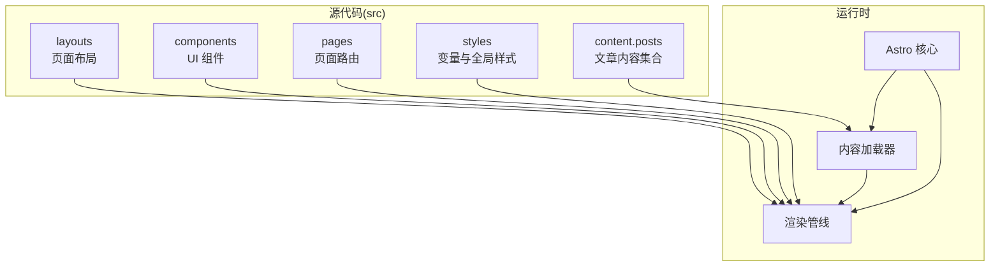
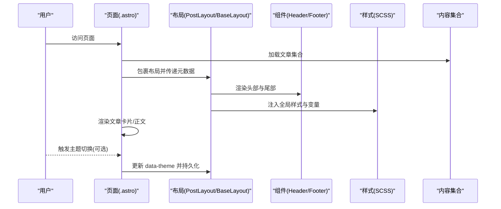
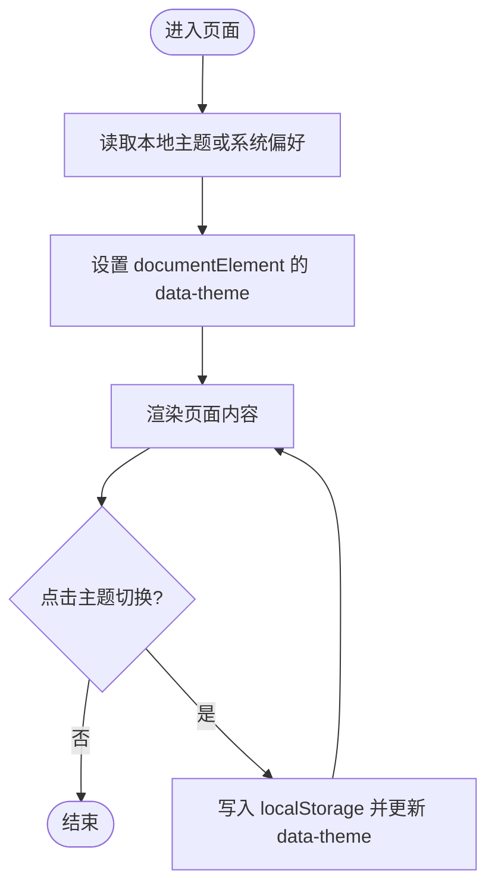
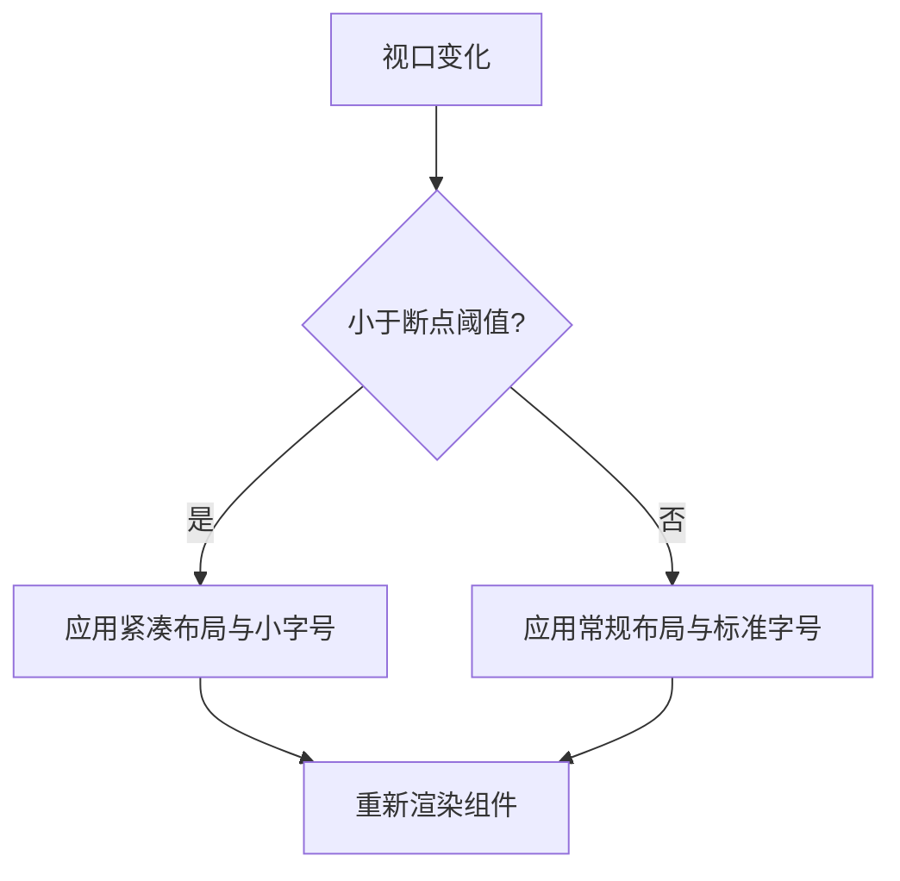
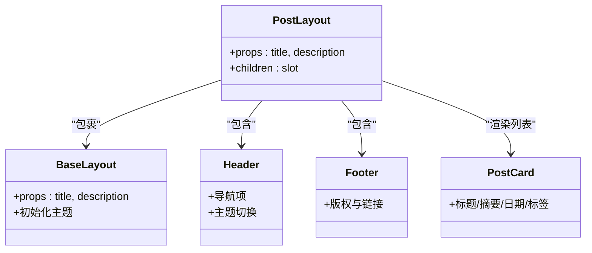
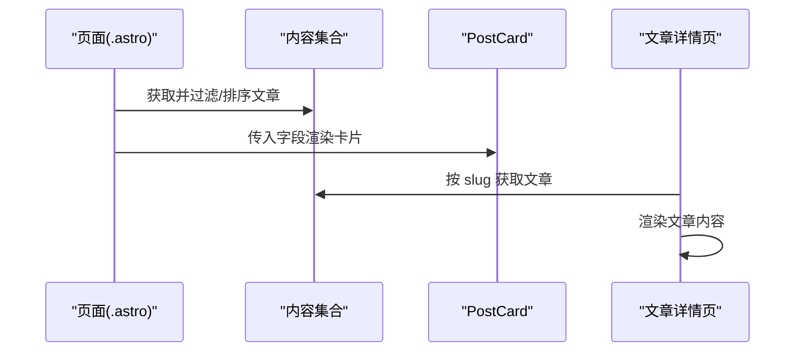
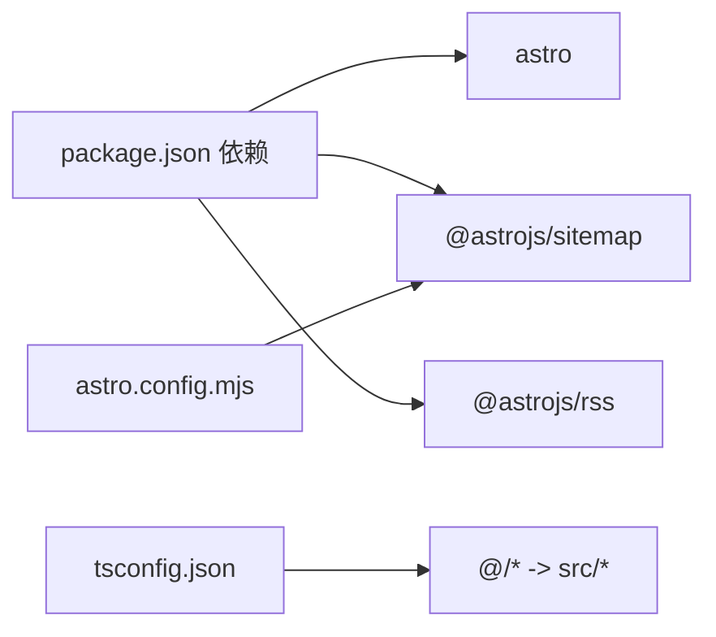

# 设计理念

<cite>
**本文引用的文件**
- [README.md](file://README.md)
- [package.json](file://package.json)
- [astro.config.mjs](file://astro.config.mjs)
- [tsconfig.json](file://tsconfig.json)
- [src/content.config.ts](file://src/content.config.ts)
- [src/layouts/BaseLayout.astro](file://src/layouts/BaseLayout.astro)
- [src/layouts/PostLayout.astro](file://src/layouts/PostLayout.astro)
- [src/components/Header.astro](file://src/components/Header.astro)
- [src/components/Footer.astro](file://src/components/Footer.astro)
- [src/components/PostCard.astro](file://src/components/PostCard.astro)
- [src/styles/variables.scss](file://src/styles/variables.scss)
- [src/styles/global.scss](file://src/styles/global.scss)
- [src/pages/index.astro](file://src/pages/index.astro)
- [src/pages/about.astro](file://src/pages/about.astro)
- [src/pages/posts/index.astro](file://src/pages/posts/index.astro)
- [src/pages/posts/[slug].astro](file://src/pages/posts/[slug].astro)
- [src/content/posts/welcome.md](file://src/content/posts/welcome.md)
</cite>

## 目录
1. [引言](#引言)
2. [项目结构](#项目结构)
3. [核心组件](#核心组件)
4. [架构总览](#架构总览)
5. [详细组件分析](#详细组件分析)
6. [依赖关系分析](#依赖关系分析)
7. [性能考量](#性能考量)
8. [故障排查指南](#故障排查指南)
9. [结论](#结论)
10. [附录](#附录)

## 引言
本设计理念文档围绕 chnanxu 博客的架构与实现展开，重点阐释“内容优先”的设计哲学如何在代码结构中落地；主题系统与响应式设计的分离与实现；零 JavaScript 默认配置下的性能与体验权衡；以及组件化设计如何提升复用性与可维护性。文档同时提供可视化图示与路径级引用，帮助读者快速定位实现细节。

## 项目结构
该项目采用 Astro 的内容驱动型单页应用结构：以内容集合（Markdown）为核心，页面通过 Astro 组件与布局组合渲染，样式通过 SCSS 变量与全局样式统一管理，整体遵循“内容优先、组件复用、主题解耦、样式内聚”的组织原则。

图表来源
- [src/content.config.ts:1-18](file://src/content.config.ts#L1-L18)
- [src/pages/index.astro:1-110](file://src/pages/index.astro#L1-L110)
- [src/layouts/PostLayout.astro:1-36](file://src/layouts/PostLayout.astro#L1-L36)
- [src/components/Header.astro:1-153](file://src/components/Header.astro#L1-L153)
- [src/styles/global.scss:1-222](file://src/styles/global.scss#L1-L222)

章节来源
- [README.md:21-32](file://README.md#L21-L32)
- [package.json:1-22](file://package.json#L1-L22)
- [astro.config.mjs:1-12](file://astro.config.mjs#L1-L12)

## 核心组件
- 内容优先：通过内容集合定义与加载，页面仅负责编排与展示，避免逻辑上移导致的复杂度上升。
- 主题系统：以 CSS 变量与 data-theme 属性解耦，支持暗/亮双态与用户偏好同步。
- 响应式设计：以 SCSS 变量与媒体查询为基线，确保在不同设备上的稳定表现。
- 组件化：Header/Footer/PostCard 等组件职责单一、样式内聚，便于复用与替换。
- 零 JS 默认：默认不注入运行时脚本，仅在必要处保留最小化交互脚本，保障首屏性能与可访问性。

章节来源
- [src/content.config.ts:1-18](file://src/content.config.ts#L1-L18)
- [src/layouts/BaseLayout.astro:1-53](file://src/layouts/BaseLayout.astro#L1-L53)
- [src/styles/variables.scss:1-108](file://src/styles/variables.scss#L1-L108)
- [src/styles/global.scss:1-222](file://src/styles/global.scss#L1-L222)
- [src/components/Header.astro:1-153](file://src/components/Header.astro#L1-L153)
- [src/components/Footer.astro:1-65](file://src/components/Footer.astro#L1-L65)
- [src/components/PostCard.astro:1-113](file://src/components/PostCard.astro#L1-L113)

## 架构总览
下图展示了页面渲染的端到端流程：内容集合加载、页面编排、布局包装、主题初始化与样式注入。

图表来源
- [src/pages/index.astro:1-110](file://src/pages/index.astro#L1-L110)
- [src/pages/posts/index.astro:1-94](file://src/pages/posts/index.astro#L1-L94)
- [src/pages/posts/[slug].astro:1-116](file://src/pages/posts/[slug].astro#L1-L116)
- [src/layouts/PostLayout.astro:1-36](file://src/layouts/PostLayout.astro#L1-L36)
- [src/layouts/BaseLayout.astro:1-53](file://src/layouts/BaseLayout.astro#L1-L53)
- [src/components/Header.astro:1-153](file://src/components/Header.astro#L1-L153)
- [src/styles/global.scss:1-222](file://src/styles/global.scss#L1-L222)

## 详细组件分析

### 主题系统：分离与实现
- 分离策略
  - 主题变量集中于 SCSS 变量文件，通过 data-theme 属性在根节点生效，避免在组件内重复声明。
  - 初始化脚本在<head>中执行，读取本地存储或系统偏好，避免 FOUC（无样式闪烁）。
- 实现要点
  - 布局层注入主题初始化与切换函数，组件层通过类名或全局选择器适配明/暗两套视觉。
  - 头部主题切换按钮通过全局函数触发切换，并持久化到 localStorage。

图表来源
- [src/layouts/BaseLayout.astro:28-50](file://src/layouts/BaseLayout.astro#L28-L50)
- [src/styles/variables.scss:85-108](file://src/styles/variables.scss#L85-L108)
- [src/components/Header.astro:28-44](file://src/components/Header.astro#L28-L44)

章节来源
- [src/layouts/BaseLayout.astro:1-53](file://src/layouts/BaseLayout.astro#L1-L53)
- [src/styles/variables.scss:1-108](file://src/styles/variables.scss#L1-L108)
- [src/components/Header.astro:1-153](file://src/components/Header.astro#L1-L153)

### 响应式设计：策略与适配
- 策略
  - 使用 SCSS 变量统一控制断点与容器宽度，页面与组件在不同尺寸下保持一致的视觉节奏。
  - 头部导航在小屏下减少间距与文字大小，保证信息密度与可读性。
- 实现
  - 全局样式为文章排版与通用容器提供自适应能力。
  - 组件内部通过媒体查询微调交互与布局细节。

图表来源
- [src/styles/variables.scss:77-83](file://src/styles/variables.scss#L77-L83)
- [src/styles/global.scss:177-187](file://src/styles/global.scss#L177-L187)
- [src/components/Header.astro:147-152](file://src/components/Header.astro#L147-L152)

章节来源
- [src/styles/variables.scss:1-108](file://src/styles/variables.scss#L1-L108)
- [src/styles/global.scss:1-222](file://src/styles/global.scss#L1-L222)
- [src/components/Header.astro:1-153](file://src/components/Header.astro#L1-L153)

### 零 JavaScript 默认配置：性能与体验
- 性能考量
  - 默认不注入运行时脚本，减少首包体积与解析时间，提升 TTFB 与 FCP。
  - 构建配置开启样式内联策略，降低网络往返。
- 体验优势
  - 关键内容与样式在首屏即可呈现，交互脚本按需加载。
  - 通过最小化脚本实现主题切换，兼顾可用性与性能。
- 权衡
  - 对需要复杂交互的场景，可在局部引入脚本，但需评估对首屏的影响。

章节来源
- [astro.config.mjs:8-11](file://astro.config.mjs#L8-L11)
- [src/layouts/BaseLayout.astro:28-50](file://src/layouts/BaseLayout.astro#L28-L50)
- [src/pages/posts/welcome.md:25-28](file://src/content/posts/welcome.md#L25-L28)

### 组件化设计：复用与维护
- 复用性
  - Header/Footer/PostCard 作为独立组件，职责清晰，可在多个页面复用。
  - PostLayout 作为页面骨架，统一承载头部、主体与尾部，降低重复代码。
- 维护性
  - 样式内聚于组件内部，避免全局污染；变量集中管理，便于主题统一调整。
  - 页面仅负责数据编排与展示，降低逻辑耦合。

图表来源
- [src/layouts/PostLayout.astro:1-36](file://src/layouts/PostLayout.astro#L1-L36)
- [src/layouts/BaseLayout.astro:1-53](file://src/layouts/BaseLayout.astro#L1-L53)
- [src/components/Header.astro:1-153](file://src/components/Header.astro#L1-L153)
- [src/components/Footer.astro:1-65](file://src/components/Footer.astro#L1-L65)
- [src/components/PostCard.astro:1-113](file://src/components/PostCard.astro#L1-L113)

章节来源
- [src/layouts/PostLayout.astro:1-36](file://src/layouts/PostLayout.astro#L1-L36)
- [src/components/Header.astro:1-153](file://src/components/Header.astro#L1-L153)
- [src/components/Footer.astro:1-65](file://src/components/Footer.astro#L1-L65)
- [src/components/PostCard.astro:1-113](file://src/components/PostCard.astro#L1-L113)

### 内容优先：数据模型与页面编排
- 数据模型
  - 内容集合定义了文章字段（标题、描述、发布时间、标签等），并支持草稿过滤与排序。
- 页面编排
  - 首页与文章列表页均通过内容集合进行筛选与排序，再交由 PostCard 组件渲染。
  - 文章详情页通过动态路径参数加载对应内容并渲染 Markdown。

图表来源
- [src/content.config.ts:1-18](file://src/content.config.ts#L1-L18)
- [src/pages/index.astro:1-110](file://src/pages/index.astro#L1-L110)
- [src/pages/posts/index.astro:1-94](file://src/pages/posts/index.astro#L1-L94)
- [src/pages/posts/[slug].astro:1-116](file://src/pages/posts/[slug].astro#L1-L116)

章节来源
- [src/content.config.ts:1-18](file://src/content.config.ts#L1-L18)
- [src/pages/index.astro:1-110](file://src/pages/index.astro#L1-L110)
- [src/pages/posts/index.astro:1-94](file://src/pages/posts/index.astro#L1-L94)
- [src/pages/posts/[slug].astro:1-116](file://src/pages/posts/[slug].astro#L1-L116)

## 依赖关系分析
- 技术栈与集成
  - Astro 作为静态站点生成器，结合内容集合与组件化页面。
  - Sitemap 插件用于 SEO 优化。
  - TypeScript 提供类型安全，SCSS 提供样式工程化。
- 路径别名
  - tsconfig 中配置 @/* 映射至 src/*，提升导入一致性与可维护性。

图表来源
- [package.json:12-21](file://package.json#L12-L21)
- [astro.config.mjs:2-11](file://astro.config.mjs#L2-L11)
- [tsconfig.json:1-10](file://tsconfig.json#L1-L10)

章节来源
- [package.json:1-22](file://package.json#L1-L22)
- [astro.config.mjs:1-12](file://astro.config.mjs#L1-L12)
- [tsconfig.json:1-10](file://tsconfig.json#L1-L10)

## 性能考量
- 首屏性能
  - 零 JS 默认配置显著降低首包体积，配合样式内联策略进一步缩短关键渲染路径。
- 交互性能
  - 主题切换脚本极简且只在需要时触发，避免阻塞主线程。
- 可访问性
  - 语义化 HTML 与全局样式提供基础可读性；为屏幕阅读器提供辅助类（如 sr-only）。
- 扩展建议
  - 对需要复杂交互的页面，可按需引入轻量脚本，并延迟加载非关键资源。
  - 使用图片懒加载与合适的占位符，进一步优化媒体资源的加载体验。

## 故障排查指南
- 主题未生效
  - 检查根元素是否正确设置 data-theme，确认初始化脚本是否在<head>中执行。
  - 确认暗色主题变量覆盖是否完整。
- 样式异常
  - 检查 SCSS 变量是否被正确导入与覆盖；确认媒体查询断点是否符合预期。
- 内容未显示
  - 检查内容集合定义与文件命名规范；确认草稿过滤逻辑是否影响显示。
- 构建失败
  - 检查 Astro 配置与插件版本；确认 tsconfig 别名与导入路径一致。

章节来源
- [src/layouts/BaseLayout.astro:28-50](file://src/layouts/BaseLayout.astro#L28-L50)
- [src/styles/variables.scss:85-108](file://src/styles/variables.scss#L85-L108)
- [src/styles/global.scss:1-222](file://src/styles/global.scss#L1-L222)
- [src/content.config.ts:1-18](file://src/content.config.ts#L1-L18)
- [astro.config.mjs:1-12](file://astro.config.mjs#L1-L12)
- [tsconfig.json:1-10](file://tsconfig.json#L1-L10)

## 结论
本项目以“内容优先”为核心，通过 Astro 的内容集合与组件化页面实现高内聚、低耦合的结构；以 SCSS 变量与 data-theme 解耦主题系统，使样式与行为分离；以最小化脚本与样式内联策略达成零 JS 默认配置下的高性能与良好体验。组件化设计提升了复用性与可维护性，响应式策略确保在多设备上的一致表现。未来可在交互页面按需引入轻量脚本与图片优化，持续提升性能与体验。

## 附录
- 快速开始与写作指南参见项目自述文件与内容示例。
- 项目结构与技术栈概览参见 README 与 package.json。

章节来源
- [README.md:1-59](file://README.md#L1-L59)
- [src/content/posts/welcome.md:1-53](file://src/content/posts/welcome.md#L1-L53)