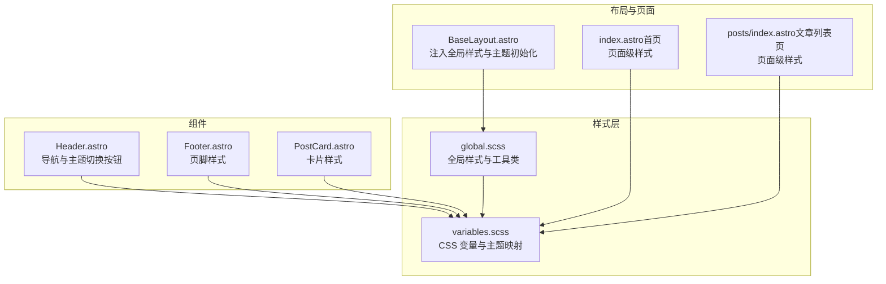
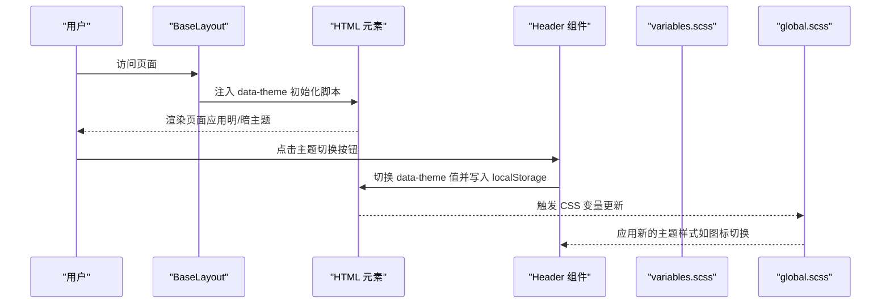
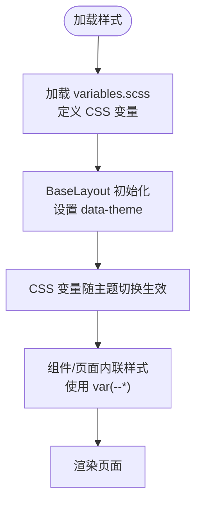
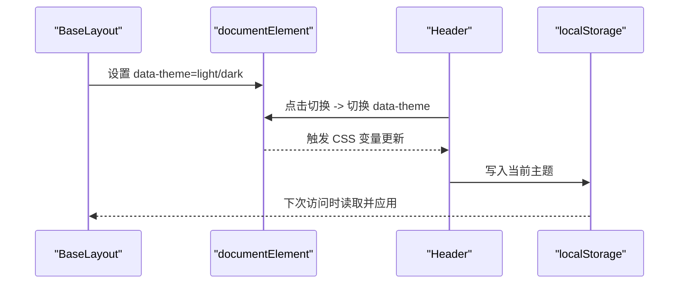
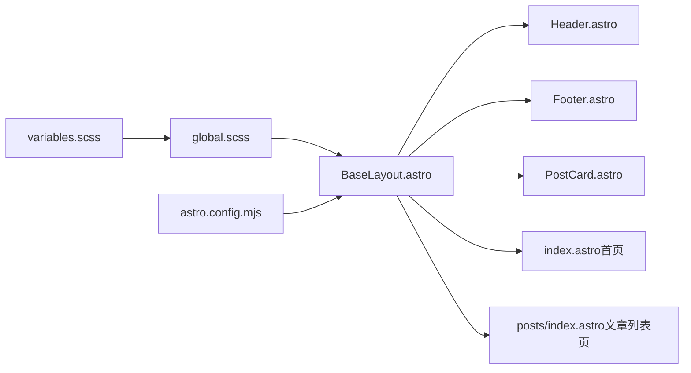

# 样式系统

<cite>
**本文引用的文件**
- [variables.scss](file://src/styles/variables.scss)
- [global.scss](file://src/styles/global.scss)
- [Header.astro](file://src/components/Header.astro)
- [Footer.astro](file://src/components/Footer.astro)
- [PostCard.astro](file://src/components/PostCard.astro)
- [BaseLayout.astro](file://src/layouts/BaseLayout.astro)
- [index.astro（首页）](file://src/pages/index.astro)
- [posts/index.astro（文章列表页）](file://src/pages/posts/index.astro)
- [astro.config.mjs](file://astro.config.mjs)
- [package.json](file://package.json)
- [README.md](file://README.md)
</cite>

## 目录
1. [简介](#简介)
2. [项目结构](#项目结构)
3. [核心组件](#核心组件)
4. [架构总览](#架构总览)
5. [详细组件分析](#详细组件分析)
6. [依赖关系分析](#依赖关系分析)
7. [性能考量](#性能考量)
8. [故障排查指南](#故障排查指南)
9. [结论](#结论)
10. [附录](#附录)

## 简介
本文件系统性梳理 chnanxu 博客的样式体系，重点覆盖以下方面：
- SCSS 变量与 CSS 自定义属性的定义与使用
- 颜色系统、字体系统、间距系统、圆角与阴影等设计令牌
- 全局样式组织与命名规范
- 响应式设计与断点策略
- 样式模块化与可维护性建议
- 与主题系统的集成（明/暗主题）
- 浏览器兼容性与性能优化
- 扩展与定制指导

## 项目结构
样式相关的核心文件集中在 src/styles 与各组件/页面的内联样式中，采用“变量集中 + 全局样式 + 组件内联”的组合模式，便于主题切换与复用。

图表来源
- [variables.scss:1-108](file://src/styles/variables.scss#L1-L108)
- [global.scss:1-222](file://src/styles/global.scss#L1-L222)
- [BaseLayout.astro:1-53](file://src/layouts/BaseLayout.astro#L1-L53)
- [Header.astro:1-153](file://src/components/Header.astro#L1-L153)
- [Footer.astro:1-65](file://src/components/Footer.astro#L1-L65)
- [PostCard.astro:1-113](file://src/components/PostCard.astro#L1-L113)
- [index.astro（首页）:1-110](file://src/pages/index.astro#L1-L110)
- [posts/index.astro（文章列表页）:1-94](file://src/pages/posts/index.astro#L1-L94)

章节来源
- [README.md:21-32](file://README.md#L21-L32)

## 核心组件
- CSS 变量与主题系统：通过 :root 与 [data-theme="dark"] 两套映射，统一管理品牌色、文本、背景、边框、功能色、阴影、圆角、间距、字号、行高、过渡与容器宽度等设计令牌。
- 全局样式与工具类：重置基础盒模型、设置基础排版、提供 prose 排版容器、容器与内容区容器、sr-only 等通用工具类，并内置主题切换按钮的基础样式。
- 主题切换与初始化：在 BaseLayout 中通过脚本读取本地存储或系统偏好，设置 data-theme 属性，避免 FOIT/FOUC；组件内通过 :global(...) 选择器在暗色主题下切换图标显示。

章节来源
- [variables.scss:5-107](file://src/styles/variables.scss#L5-L107)
- [global.scss:1-222](file://src/styles/global.scss#L1-L222)
- [BaseLayout.astro:28-50](file://src/layouts/BaseLayout.astro#L28-L50)
- [Header.astro:138-145](file://src/components/Header.astro#L138-L145)

## 架构总览
样式系统采用“变量驱动 + 全局样式 + 组件内联”的分层架构：
- 变量层：集中定义 CSS 变量，支持明/暗两套主题映射，便于主题切换与一致性。
- 全局层：提供全局重置、基础排版、工具类与主题切换按钮样式，作为页面与组件的样式基线。
- 组件层：在组件内联样式中直接消费变量，实现局部样式隔离与主题感知。
- 页面层：在页面内联样式中使用变量，控制页面级布局与间距。

图表来源
- [BaseLayout.astro:28-50](file://src/layouts/BaseLayout.astro#L28-L50)
- [Header.astro:28-46](file://src/components/Header.astro#L28-L46)
- [variables.scss:85-107](file://src/styles/variables.scss#L85-L107)
- [global.scss:205-222](file://src/styles/global.scss#L205-L222)

## 详细组件分析

### CSS 变量与主题系统
- 设计令牌分类
  - 品牌与功能色：primary、primary-hover、primary-soft 与 success/warning/danger/info 等。
  - 文本层级：text、text-secondary、text-tertiary、text-inverse。
  - 背景层级：bg、bg-elevated、bg-muted、bg-subtle。
  - 边框：border、border-muted。
  - 阴影：shadow-sm、shadow-md、shadow-lg。
  - 圆角：radius-sm、radius-md、radius-lg、radius-xl、radius-full。
  - 间距：space-1 到 space-16。
  - 字号：font-xs 到 font-4xl。
  - 行高：leading-tight、leading-normal、leading-relaxed。
  - 过渡：transition-fast、transition-normal、transition-slow。
  - 容器：container-sm/med/large/xl 与 content-width。
- 主题映射
  - :root 提供默认明色主题。
  - [data-theme="dark"] 提供暗色主题映射，覆盖主色、文本、背景、边框与阴影等。

图表来源
- [variables.scss:5-107](file://src/styles/variables.scss#L5-L107)
- [BaseLayout.astro:28-50](file://src/layouts/BaseLayout.astro#L28-L50)
- [Header.astro:47-152](file://src/components/Header.astro#L47-L152)

章节来源
- [variables.scss:5-107](file://src/styles/variables.scss#L5-L107)

### 全局样式与工具类
- 全局重置与基础排版：统一 box-sizing、margin/padding，设置 html/body 的基础字体、行高、颜色与背景，并添加平滑滚动与字体抗锯齿。
- prose 排版容器：为 Markdown 内容提供统一的标题、段落、链接、代码块、表格、引用、列表、分割线与图片的样式，均使用变量驱动。
- 工具类：container/content-container 控制页面宽度与居中；sr-only 用于无障碍隐藏。
- 主题切换按钮：提供基础尺寸、圆角、背景、过渡与悬停交互。

章节来源
- [global.scss:1-222](file://src/styles/global.scss#L1-L222)

### 主题系统集成
- 初始化：BaseLayout 在 head 中注入脚本，优先读取 localStorage，其次匹配系统 prefers-color-scheme，设置 documentElement 的 data-theme。
- 切换逻辑：Header 组件的按钮调用全局函数 toggleTheme，切换 data-theme 并持久化到 localStorage。
- 组件内主题感知：Header 使用 :global([data-theme="dark"]) 切换太阳/月亮图标显示。

图表来源
- [BaseLayout.astro:28-50](file://src/layouts/BaseLayout.astro#L28-L50)
- [Header.astro:28-46](file://src/components/Header.astro#L28-L46)
- [Header.astro:138-145](file://src/components/Header.astro#L138-L145)

章节来源
- [BaseLayout.astro:28-50](file://src/layouts/BaseLayout.astro#L28-L50)
- [Header.astro:28-46](file://src/components/Header.astro#L28-L46)
- [Header.astro:138-145](file://src/components/Header.astro#L138-L145)

### 组件样式使用示例
- Header：使用 var(--bg)、var(--border)、var(--text)、var(--primary) 等变量，配合过渡与圆角；在暗色主题下切换图标。
- Footer：使用 var(--border)、var(--text-tertiary)、var(--bg-muted) 等变量，实现简洁的页脚样式。
- PostCard：使用 var(--bg-elevated)、var(--border)、var(--shadow-md)、var(--radius-lg)、var(--primary-soft) 等变量，实现卡片悬停效果与标签样式。

章节来源
- [Header.astro:47-152](file://src/components/Header.astro#L47-L152)
- [Footer.astro:24-64](file://src/components/Footer.astro#L24-L64)
- [PostCard.astro:40-112](file://src/components/PostCard.astro#L40-L112)

### 页面样式使用示例
- 首页：使用 var(--font-4xl、--font-lg、--space-16、--space-6、--space-8、--space-2、--space-12) 等变量控制标题、段落与网格间距。
- 文章列表页：使用 var(--font-3xl、--font-base、--font-xs、--space-8、--space-4、--space-2、--bg-muted、--primary-soft) 等变量控制标题、描述、标签过滤与卡片间距。

章节来源
- [index.astro（首页）:48-109](file://src/pages/index.astro#L48-L109)
- [posts/index.astro（文章列表页）:45-93](file://src/pages/posts/index.astro#L45-L93)

## 依赖关系分析
- 变量依赖：global.scss 通过 @use 引入 variables.scss，确保全局样式与组件内联样式共享同一套变量。
- 主题依赖：BaseLayout 初始化主题，Header/组件/页面样式依赖 data-theme 的变化触发 CSS 变量切换。
- 构建依赖：astro.config.mjs 开启 inlineStylesheets 自动内联策略，有助于减少网络往返与首屏样式闪烁。

图表来源
- [variables.scss:1](file://src/styles/variables.scss#L1)
- [global.scss:1](file://src/styles/global.scss#L1)
- [BaseLayout.astro:2](file://src/layouts/BaseLayout.astro#L2)
- [astro.config.mjs:8-10](file://astro.config.mjs#L8-L10)

章节来源
- [variables.scss:1](file://src/styles/variables.scss#L1)
- [global.scss:1](file://src/styles/global.scss#L1)
- [BaseLayout.astro:2](file://src/layouts/BaseLayout.astro#L2)
- [astro.config.mjs:8-10](file://astro.config.mjs#L8-L10)

## 性能考量
- 内联样式：astro.config.mjs 启用 inlineStylesheets 自动内联，有利于减少额外请求，提升首屏渲染性能。
- 变量驱动：通过 CSS 变量与 @use 组织样式，避免重复定义，降低打包体积与维护成本。
- 主题切换：使用 data-theme 与 CSS 变量，无需重载页面即可切换，体验流畅且无闪烁。
- 图片与排版：prose 容器对图片、代码块、表格等进行统一处理，减少冗余样式与布局抖动。

章节来源
- [astro.config.mjs:8-10](file://astro.config.mjs#L8-L10)
- [global.scss:35-171](file://src/styles/global.scss#L35-L171)

## 故障排查指南
- 主题切换无效
  - 检查 BaseLayout 是否正确设置 data-theme。
  - 确认 Header 的 toggleTheme 函数是否暴露到全局作用域。
  - 验证 [data-theme="dark"] 的变量映射是否完整。
- 样式不生效或闪烁
  - 确保 BaseLayout 在 head 中执行初始化脚本。
  - 检查组件内联样式是否正确使用 var(--*)。
  - 确认 global.scss 已被 BaseLayout 正确导入。
- 响应式异常
  - 检查组件内媒体查询断点是否与变量一致。
  - 确认容器类（container/content-container）是否正确使用。

章节来源
- [BaseLayout.astro:28-50](file://src/layouts/BaseLayout.astro#L28-L50)
- [Header.astro:28-46](file://src/components/Header.astro#L28-L46)
- [variables.scss:85-107](file://src/styles/variables.scss#L85-L107)
- [global.scss:177-187](file://src/styles/global.scss#L177-L187)

## 结论
该样式系统以 CSS 变量为核心，结合全局样式与组件内联样式，实现了清晰的主题切换、一致的设计令牌与良好的可维护性。通过合理的命名规范与模块化组织，开发者可以快速扩展与定制样式，同时保持跨设备与跨主题的一致体验。

## 附录

### 响应式设计与断点
- 断点策略
  - 移动优先：在组件内联样式中使用@media (max-width: ...)，例如 Header 对 640px 以下的断点处理。
  - 容器宽度：通过变量控制容器最大宽度与内容宽度，保证在不同屏幕下的阅读体验。
- 布局适配
  - Grid 与 Flex：首页与文章列表页使用 CSS Grid/Flex 实现自适应布局，配合变量控制间距与对齐。
  - 文章排版：prose 容器提供统一的标题、段落、代码块、表格等排版，适配不同屏幕尺寸。

章节来源
- [Header.astro:147-151](file://src/components/Header.astro#L147-L151)
- [variables.scss:77-82](file://src/styles/variables.scss#L77-L82)
- [index.astro（首页）:98-102](file://src/pages/index.astro#L98-L102)
- [posts/index.astro（文章列表页）:86-92](file://src/pages/posts/index.astro#L86-L92)
- [global.scss:35-171](file://src/styles/global.scss#L35-L171)

### 样式模块化与维护策略
- 变量集中：将所有设计令牌集中于 variables.scss，便于统一管理与主题切换。
- 全局基线：global.scss 提供重置、排版与工具类，作为页面与组件的样式基线。
- 组件内联：组件内联样式直接消费变量，实现局部样式隔离与主题感知。
- 页面级样式：页面内联样式负责页面级布局与间距，避免污染组件样式。
- 命名规范：采用语义化类名（如 container、prose、theme-toggle），提高可读性与可维护性。

章节来源
- [variables.scss:1-108](file://src/styles/variables.scss#L1-L108)
- [global.scss:1-222](file://src/styles/global.scss#L1-L222)
- [Header.astro:11-45](file://src/components/Header.astro#L11-L45)
- [Footer.astro:5-22](file://src/components/Footer.astro#L5-L22)
- [PostCard.astro:19-38](file://src/components/PostCard.astro#L19-L38)
- [index.astro（首页）:11-46](file://src/pages/index.astro#L11-L46)
- [posts/index.astro（文章列表页）:14-43](file://src/pages/posts/index.astro#L14-L43)

### 与主题系统的集成
- 明/暗主题映射：variables.scss 中通过 :root 与 [data-theme="dark"] 两套映射，确保主题切换时变量值正确更新。
- 初始化与切换：BaseLayout 初始化主题，Header 提供切换按钮，组件内通过 :global(...) 选择器在暗色主题下切换图标。
- 无障碍与兼容：使用 sr-only 工具类隐藏辅助文本；字体与过渡使用现代浏览器特性，兼顾兼容性。

章节来源
- [variables.scss:5-107](file://src/styles/variables.scss#L5-L107)
- [BaseLayout.astro:28-50](file://src/layouts/BaseLayout.astro#L28-L50)
- [Header.astro:28-46](file://src/components/Header.astro#L28-L46)
- [Header.astro:138-145](file://src/components/Header.astro#L138-L145)
- [global.scss:189-199](file://src/styles/global.scss#L189-L199)

### 扩展与定制指导
- 新增设计令牌：在 variables.scss 中新增变量，遵循现有命名与分组，确保明/暗主题映射完整。
- 组件样式扩展：在组件内联样式中使用变量，避免硬编码颜色与尺寸；必要时新增工具类。
- 页面样式扩展：在页面内联样式中使用变量，控制页面级布局与间距；注意移动优先与断点策略。
- 主题扩展：如需新增主题，可在 variables.scss 中新增映射，并在 BaseLayout 中完善初始化逻辑。

章节来源
- [variables.scss:5-107](file://src/styles/variables.scss#L5-L107)
- [BaseLayout.astro:28-50](file://src/layouts/BaseLayout.astro#L28-L50)
- [Header.astro:28-46](file://src/components/Header.astro#L28-L46)