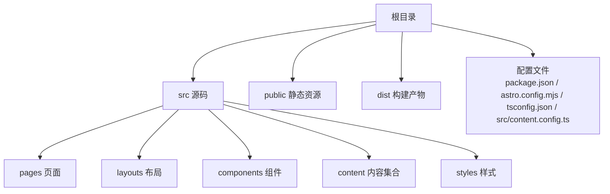
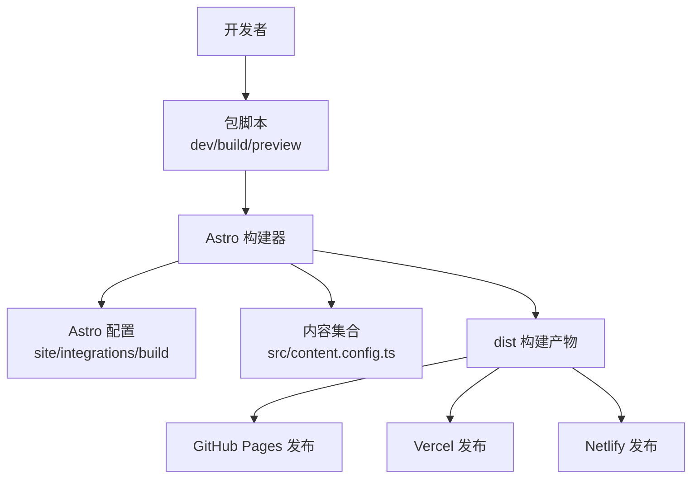
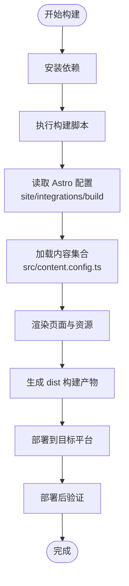
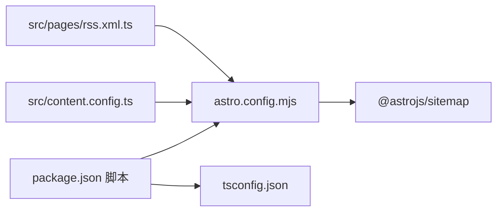

# 部署指南

<cite>
**本文引用的文件**
- [package.json](file://package.json)
- [astro.config.mjs](file://astro.config.mjs)
- [README.md](file://README.md)
- [src/content.config.ts](file://src/content.config.ts)
- [src/pages/rss.xml.ts](file://src/pages/rss.xml.ts)
- [tsconfig.json](file://tsconfig.json)
</cite>

## 目录
1. [简介](#简介)
2. [项目结构](#项目结构)
3. [核心组件](#核心组件)
4. [架构总览](#架构总览)
5. [详细组件分析](#详细组件分析)
6. [依赖分析](#依赖分析)
7. [性能考虑](#性能考虑)
8. [故障排除指南](#故障排除指南)
9. [结论](#结论)
10. [附录](#附录)

## 简介
本指南面向运维与开发团队，提供 chnanxu 博客在生产环境的完整部署方案。项目基于 Astro 静态站点生成器，采用 GitHub Pages 作为默认托管平台；同时给出 Vercel、Netlify 等平台的配置思路与差异点。文档涵盖构建流程、优化配置、CI/CD 集成、域名绑定、部署后测试与验证、故障排除以及性能监控与维护建议。

## 项目结构
项目采用 Astro 的标准目录组织方式，核心目录与职责如下：
- src：页面、布局、组件、内容集合与样式
- public：静态资源（如 robots.txt、图标等）
- dist：构建产物输出目录
- 根目录配置：包脚本、Astro 配置、TypeScript 配置、内容集合定义

**章节来源**
- [README.md:21-32](file://README.md#L21-L32)
- [package.json:5-11](file://package.json#L5-L11)
- [astro.config.mjs:5-11](file://astro.config.mjs#L5-L11)
- [tsconfig.json:1-10](file://tsconfig.json#L1-L10)
- [src/content.config.ts:1-18](file://src/content.config.ts#L1-L18)

## 核心组件
- 构建与预览脚本：通过包脚本统一入口，支持本地开发、构建与预览。
- Astro 配置：站点基础 URL、集成插件（如站点地图）、构建优化策略。
- 内容集合：定义文章内容的数据模型与加载规则。
- RSS 服务端路由：按文章集合生成 RSS 输出。
- TypeScript 路径映射：便于模块路径别名使用。

**章节来源**
- [package.json:5-11](file://package.json#L5-L11)
- [astro.config.mjs:5-11](file://astro.config.mjs#L5-L11)
- [src/content.config.ts:1-18](file://src/content.config.ts#L1-L18)
- [src/pages/rss.xml.ts:1-24](file://src/pages/rss.xml.ts#L1-L24)
- [tsconfig.json:1-10](file://tsconfig.json#L1-L10)

## 架构总览
下图展示从源码到构建产物的关键流程，以及与托管平台的关系：

**图表来源**
- [package.json:5-11](file://package.json#L5-L11)
- [astro.config.mjs:5-11](file://astro.config.mjs#L5-L11)
- [src/content.config.ts:1-18](file://src/content.config.ts#L1-L18)

## 详细组件分析

### GitHub Pages 部署（推荐）
- 基础配置
  - 站点基础 URL：在 Astro 配置中设置正确的站点地址，确保链接与资源路径正确。
  - 构建产物：使用构建脚本生成 dist 目录。
- 分支与发布源
  - 推荐使用 gh-pages 分支或使用仓库根目录发布（取决于平台要求）。
  - 若使用 Actions 自动化，可将构建产物推送到指定分支或使用平台提供的发布命令。
- 域名绑定
  - 在仓库 Settings 中配置自定义域名与 CNAME。
  - 确保 DNS 记录已生效，且 HTTPS 可用。
- CI/CD 集成（示例思路）
  - 触发条件：主分支推送或标签推送。
  - 步骤：安装依赖、运行构建、上传 dist 到发布目标。
  - 缓存策略：缓存包管理器目录以加速安装。
  - 安全性：避免在工作流中暴露敏感信息。
- 验证清单
  - 访问首页与文章页，确认资源路径与导航正常。
  - 校验 RSS 地址与站点地图是否可用。
  - 测试移动端与关键浏览器兼容性。

**章节来源**
- [astro.config.mjs:5-11](file://astro.config.mjs#L5-L11)
- [package.json:5-11](file://package.json#L5-L11)
- [src/pages/rss.xml.ts:1-24](file://src/pages/rss.xml.ts#L1-L24)

### Vercel 部署
- 平台适配要点
  - 构建命令与输出目录：根据平台要求设置构建脚本与 dist 输出目录。
  - 环境变量：如需要，可在平台控制台配置站点地址等环境变量。
  - 预设与重写：若使用 Astro 的路由或服务端逻辑，需确认平台对 ISR/SSR 的支持情况。
- 与 GitHub Pages 的差异
  - Vercel 更偏向应用型托管，支持更丰富的边缘网络与缓存策略。
  - Pages 默认静态直出，Vercel 可能需要额外配置以实现相同效果。

**章节来源**
- [astro.config.mjs:5-11](file://astro.config.mjs#L5-L11)
- [package.json:5-11](file://package.json#L5-L11)

### Netlify 部署
- 平台适配要点
  - 构建命令与发布目录：与 Vercel 类似，需匹配 Netlify 的构建参数。
  - 净化与重写：Netlify 的重写规则与 Astro 的路由可能存在差异，需在 netlify.toml 或控制台中进行调整。
- 与 GitHub Pages 的差异
  - Netlify 提供更灵活的重写与函数能力，适合需要动态行为的场景。
  - 对于纯静态站点，Pages 与 Netlify 差异主要体现在构建参数与缓存策略上。

**章节来源**
- [astro.config.mjs:5-11](file://astro.config.mjs#L5-L11)
- [package.json:5-11](file://package.json#L5-L11)

### 构建流程与优化配置
- 构建命令
  - 使用包脚本触发 Astro 构建，生成 dist 目录。
- 优化策略
  - 站点地址：确保配置中的站点地址与实际部署域名一致。
  - 内联样式：根据性能需求选择内联策略，平衡首屏与缓存。
  - 插件集成：启用站点地图等插件，提升 SEO 与可发现性。
- 资源与路径
  - 使用相对路径或基于站点地址的绝对路径，避免硬编码。
  - TypeScript 路径映射有助于模块化组织与别名导入。

**图表来源**
- [package.json:5-11](file://package.json#L5-L11)
- [astro.config.mjs:5-11](file://astro.config.mjs#L5-L11)
- [src/content.config.ts:1-18](file://src/content.config.ts#L1-L18)

**章节来源**
- [package.json:5-11](file://package.json#L5-L11)
- [astro.config.mjs:5-11](file://astro.config.mjs#L5-L11)
- [tsconfig.json:1-10](file://tsconfig.json#L1-L10)

### RSS 与站点地图
- RSS
  - 通过服务端路由聚合文章集合，生成符合规范的 RSS 输出。
  - 确保站点地址与语言信息正确，便于订阅与解析。
- 站点地图
  - 在 Astro 配置中启用站点地图插件，自动输出 sitemap.xml。

**章节来源**
- [src/pages/rss.xml.ts:1-24](file://src/pages/rss.xml.ts#L1-L24)
- [astro.config.mjs:5-11](file://astro.config.mjs#L5-L11)

## 依赖分析
- 包脚本与工具链
  - 开发、构建、预览与 Astro CLI 命令由包脚本统一管理。
- Astro 配置依赖
  - 站点地址与构建优化策略直接影响最终产物与部署表现。
- 内容集合依赖
  - 内容加载与校验规则影响渲染与构建时间。
- 类型系统依赖
  - TypeScript 配置与路径映射提升开发体验与可维护性。

**图表来源**
- [package.json:5-11](file://package.json#L5-L11)
- [astro.config.mjs:5-11](file://astro.config.mjs#L5-L11)
- [src/content.config.ts:1-18](file://src/content.config.ts#L1-L18)
- [src/pages/rss.xml.ts:1-24](file://src/pages/rss.xml.ts#L1-L24)
- [tsconfig.json:1-10](file://tsconfig.json#L1-L10)

**章节来源**
- [package.json:5-11](file://package.json#L5-L11)
- [astro.config.mjs:5-11](file://astro.config.mjs#L5-L11)
- [src/content.config.ts:1-18](file://src/content.config.ts#L1-L18)
- [src/pages/rss.xml.ts:1-24](file://src/pages/rss.xml.ts#L1-L24)
- [tsconfig.json:1-10](file://tsconfig.json#L1-L10)

## 性能考虑
- 构建优化
  - 合理设置站点地址，避免重复请求与错误跳转。
  - 根据流量特征选择内联样式策略，兼顾首屏与缓存复用。
- 资源与缓存
  - 利用 CDN 与浏览器缓存策略，减少回源压力。
  - 对图片与字体进行压缩与格式优化。
- 监控与观测
  - 结合平台自带指标或第三方监控，关注页面加载时长、错误率与回源率。
  - 定期评估构建时间与产物体积，持续优化。

## 故障排除指南
- 构建失败
  - 检查包脚本与依赖安装是否成功。
  - 确认 Astro 配置中的站点地址与实际域名一致。
- 资源 404
  - 核对静态资源路径与站点地址前缀。
  - 确认 dist 目录包含所有必要文件。
- RSS 无法访问
  - 检查服务端路由是否正确注册与访问。
  - 确认站点地址与语言信息配置无误。
- 域名不生效
  - 检查 DNS 解析与 CNAME 设置。
  - 确认平台控制台的自定义域名配置已启用。

**章节来源**
- [astro.config.mjs:5-11](file://astro.config.mjs#L5-L11)
- [src/pages/rss.xml.ts:1-24](file://src/pages/rss.xml.ts#L1-L24)

## 结论
本指南提供了 chnanxu 博客在 GitHub Pages、Vercel、Netlify 等平台的部署路径与优化建议。通过规范的构建流程、合理的配置与完善的验证机制，可稳定地将博客上线并持续维护。建议结合平台指标与用户反馈，持续迭代构建与缓存策略，确保性能与可靠性。

## 附录
- 快速参考
  - 本地开发：使用包脚本启动开发服务器。
  - 构建与预览：使用包脚本生成并本地预览构建产物。
  - 部署：将 dist 目录发布至目标平台，或通过 CI/CD 自动化发布。
- 建议的 CI/CD 最小工作流步骤
  - 触发：主分支推送。
  - 步骤：安装依赖、运行构建、上传 dist 至发布目标。
  - 缓存：缓存包管理器目录以提升速度。
  - 安全：避免在日志中输出敏感信息。

**章节来源**
- [README.md:5-19](file://README.md#L5-L19)
- [package.json:5-11](file://package.json#L5-L11)
- [astro.config.mjs:5-11](file://astro.config.mjs#L5-L11)