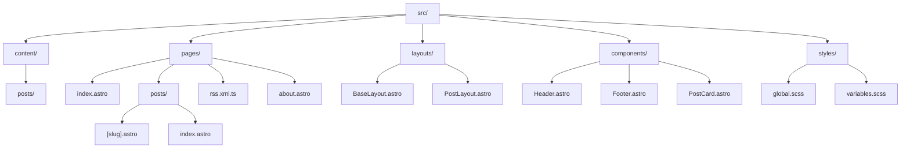
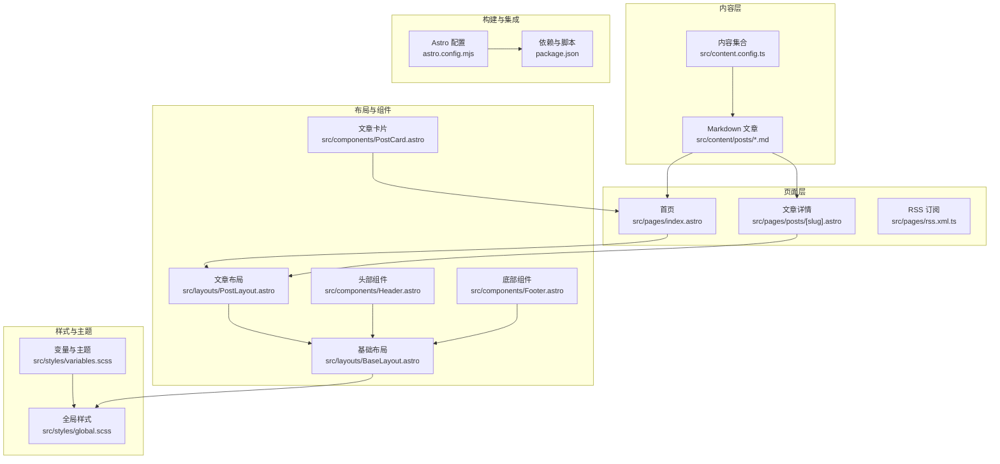
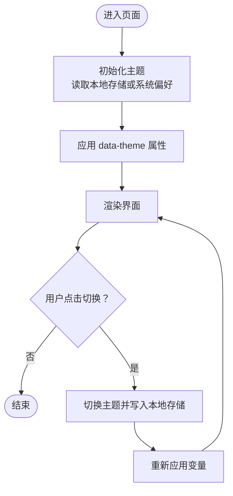
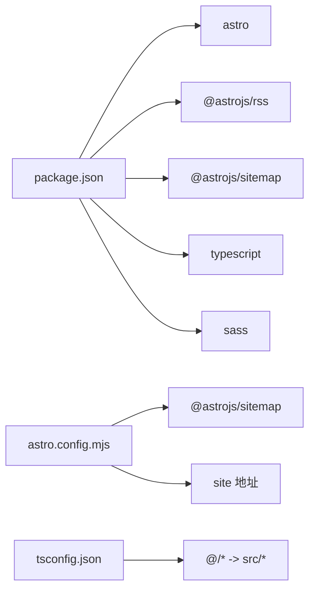

# 项目概述

<cite>
**本文引用的文件**
- [README.md](file://README.md)
- [package.json](file://package.json)
- [astro.config.mjs](file://astro.config.mjs)
- [tsconfig.json](file://tsconfig.json)
- [src/content.config.ts](file://src/content.config.ts)
- [src/pages/index.astro](file://src/pages/index.astro)
- [src/layouts/BaseLayout.astro](file://src/layouts/BaseLayout.astro)
- [src/layouts/PostLayout.astro](file://src/layouts/PostLayout.astro)
- [src/components/Header.astro](file://src/components/Header.astro)
- [src/components/Footer.astro](file://src/components/Footer.astro)
- [src/components/PostCard.astro](file://src/components/PostCard.astro)
- [src/pages/posts/[slug].astro](file://src/pages/posts/[slug].astro)
- [src/pages/rss.xml.ts](file://src/pages/rss.xml.ts)
- [src/styles/global.scss](file://src/styles/global.scss)
- [src/styles/variables.scss](file://src/styles/variables.scss)
- [src/content/posts/welcome.md](file://src/content/posts/welcome.md)
</cite>

## 目录
1. [简介](#简介)
2. [项目结构](#项目结构)
3. [核心组件](#核心组件)
4. [架构总览](#架构总览)
5. [详细组件分析](#详细组件分析)
6. [依赖关系分析](#依赖关系分析)
7. [性能考量](#性能考量)
8. [故障排查指南](#故障排查指南)
9. [结论](#结论)
10. [附录](#附录)

## 简介
本项目是基于 Astro 静态站点生成器构建的个人技术博客，部署于 GitHub Pages。项目遵循“零 JavaScript 默认”理念，通过 Astro 的 Islands 架构按需注入交互，兼顾性能与可维护性；同时提供响应式设计与主题切换能力，支持暗色模式，满足不同用户的阅读偏好。

项目目标：
- 提供简洁、快速、可 SEO 的个人博客站点
- 以 Markdown 内容为中心，降低写作门槛
- 通过主题切换提升用户体验，适配明/暗两种视觉风格
- 提供 RSS 订阅与站点地图，便于内容分发与搜索引擎收录

适用人群：
- 初学者：快速上手写作与发布，无需复杂配置
- 有经验开发者：可扩展集成更多 Astro 集成、自定义主题与功能模块

## 项目结构
项目采用 Astro 推荐的目录组织方式，内容、页面、布局、组件与样式分离清晰，便于维护与扩展。

图表来源
- [src/pages/index.astro:1-110](file://src/pages/index.astro#L1-L110)
- [src/pages/posts/[slug].astro](file://src/pages/posts/[slug].astro#L1-L116)
- [src/layouts/BaseLayout.astro:1-53](file://src/layouts/BaseLayout.astro#L1-L53)
- [src/layouts/PostLayout.astro:1-36](file://src/layouts/PostLayout.astro#L1-L36)
- [src/components/Header.astro:1-153](file://src/components/Header.astro#L1-L153)
- [src/components/Footer.astro:1-65](file://src/components/Footer.astro#L1-L65)
- [src/components/PostCard.astro:1-113](file://src/components/PostCard.astro#L1-L113)
- [src/styles/global.scss:1-222](file://src/styles/global.scss#L1-L222)
- [src/styles/variables.scss:1-108](file://src/styles/variables.scss#L1-L108)

章节来源
- [README.md:21-32](file://README.md#L21-L32)
- [package.json:1-22](file://package.json#L1-L22)

## 核心组件
- 内容模型与集合
  - 使用内容集合定义文章集合，约束 frontmatter 字段类型（标题、描述、发布时间、标签、草稿等），确保内容一致性与可查询性。
- 页面与路由
  - 首页展示最新文章列表，支持分页入口与卡片式展示。
  - 文章详情页采用静态路径生成，渲染 Markdown 内容并输出结构化元数据。
  - RSS 订阅页动态生成 XML，包含站点信息与文章条目。
- 布局与通用组件
  - 基础布局负责 SEO 元信息、主题初始化脚本与全局样式引入。
  - 文章布局组合头部导航、主体内容与底部信息。
  - 头部组件提供导航链接与主题切换按钮；底部组件包含版权与 RSS 链接。
- 主题系统
  - 通过 data-theme 属性与本地存储实现明/暗主题切换，避免首屏闪烁。
- 样式体系
  - 基于 SCSS 变量系统统一管理色彩、间距、字体与阴影，支持主题变量覆盖。
  - 提供文章排版样式类，保证 Markdown 渲染内容的可读性与一致性。

章节来源
- [src/content.config.ts:1-18](file://src/content.config.ts#L1-L18)
- [src/pages/index.astro:1-110](file://src/pages/index.astro#L1-L110)
- [src/pages/posts/[slug].astro:1-116](file://src/pages/posts/[slug].astro#L1-L116)
- [src/pages/rss.xml.ts:1-24](file://src/pages/rss.xml.ts#L1-L24)
- [src/layouts/BaseLayout.astro:1-53](file://src/layouts/BaseLayout.astro#L1-L53)
- [src/layouts/PostLayout.astro:1-36](file://src/layouts/PostLayout.astro#L1-L36)
- [src/components/Header.astro:1-153](file://src/components/Header.astro#L1-L153)
- [src/components/Footer.astro:1-65](file://src/components/Footer.astro#L1-L65)
- [src/styles/variables.scss:1-108](file://src/styles/variables.scss#L1-L108)
- [src/styles/global.scss:1-222](file://src/styles/global.scss#L1-L222)

## 架构总览
整体架构围绕 Astro 的静态生成与按需交互展开：内容由 Astro 内容引擎解析，页面通过 Astro 组件渲染，样式与主题通过 SCSS 变量与 data-theme 控制，RSS 与站点地图通过 Astro 集成生成。

图表来源
- [src/content.config.ts:1-18](file://src/content.config.ts#L1-L18)
- [src/pages/index.astro:1-110](file://src/pages/index.astro#L1-L110)
- [src/pages/posts/[slug].astro:1-116](file://src/pages/posts/[slug].astro#L1-L116)
- [src/pages/rss.xml.ts:1-24](file://src/pages/rss.xml.ts#L1-L24)
- [src/layouts/BaseLayout.astro:1-53](file://src/layouts/BaseLayout.astro#L1-L53)
- [src/layouts/PostLayout.astro:1-36](file://src/layouts/PostLayout.astro#L1-L36)
- [src/components/Header.astro:1-153](file://src/components/Header.astro#L1-L153)
- [src/components/Footer.astro:1-65](file://src/components/Footer.astro#L1-L65)
- [src/components/PostCard.astro:1-113](file://src/components/PostCard.astro#L1-L113)
- [src/styles/variables.scss:1-108](file://src/styles/variables.scss#L1-L108)
- [src/styles/global.scss:1-222](file://src/styles/global.scss#L1-L222)
- [astro.config.mjs:1-12](file://astro.config.mjs#L1-L12)
- [package.json:1-22](file://package.json#L1-L22)

## 详细组件分析

### 内容模型与集合
- 作用：定义文章集合的数据结构与校验规则，确保 frontmatter 字段类型正确、默认值合理。
- 关键点：
  - 使用内容加载器匹配 Markdown 文件，限定目录范围。
  - 使用 Zod schema 对字段进行强类型约束，如日期转换、可选字段与默认数组。
- 复杂度：O(n) 遍历与过滤，n 为文章数量。
- 性能影响：内容解析发生在构建阶段，运行时无额外开销。

章节来源
- [src/content.config.ts:1-18](file://src/content.config.ts#L1-L18)

### 首页与文章列表
- 作用：展示最新文章摘要与分页入口，支持空状态提示。
- 关键点：
  - 通过内容 API 获取集合，过滤草稿并按发布时间倒序排序。
  - 使用卡片组件批量渲染，支持标签截取与日期格式化。
- 复杂度：O(n log n) 排序，O(n) 渲染。
- 性能影响：静态生成，首屏无需 JS。

章节来源
- [src/pages/index.astro:1-110](file://src/pages/index.astro#L1-L110)
- [src/components/PostCard.astro:1-113](file://src/components/PostCard.astro#L1-L113)

### 文章详情页
- 作用：为每篇文章生成静态路径，渲染 Markdown 内容并输出结构化元数据。
- 关键点：
  - 使用静态路径生成函数为所有文章生成路由参数。
  - 渲染 Markdown 内容并通过布局包装，输出标题、描述与标签。
- 复杂度：O(n) 路径生成，单页渲染 O(1)。
- 性能影响：纯静态输出，交互按需注入。

章节来源
- [src/pages/posts/[slug].astro:1-116](file://src/pages/posts/[slug].astro#L1-L116)

### RSS 订阅
- 作用：动态生成符合标准的 RSS 2.0 输出，包含站点信息与文章条目。
- 关键点：
  - 读取已发布文章，按时间倒序，映射为 RSS 条目。
  - 设置语言与站点地址，确保订阅客户端正确识别。
- 复杂度：O(n log n) 排序，O(n) 映射。
- 性能影响：构建时生成，运行时直接返回。

章节来源
- [src/pages/rss.xml.ts:1-24](file://src/pages/rss.xml.ts#L1-L24)

### 布局与通用组件
- 基础布局（BaseLayout）
  - 引入全局样式，设置语言、描述与 Open Graph 元信息。
  - 内联脚本初始化主题，避免闪烁；外联脚本暴露切换函数。
- 文章布局（PostLayout）
  - 组合头部、主体与底部，提供统一的页面骨架。
- 头部组件（Header）
  - 导航项与当前路径高亮，主题切换按钮通过内联事件触发。
- 底部组件（Footer）
  - 版权信息与 RSS 链接，便于订阅与归档。

章节来源
- [src/layouts/BaseLayout.astro:1-53](file://src/layouts/BaseLayout.astro#L1-L53)
- [src/layouts/PostLayout.astro:1-36](file://src/layouts/PostLayout.astro#L1-L36)
- [src/components/Header.astro:1-153](file://src/components/Header.astro#L1-L153)
- [src/components/Footer.astro:1-65](file://src/components/Footer.astro#L1-L65)

### 主题切换系统
- 机制：
  - 初始化：优先读取本地存储，否则根据系统偏好自动选择明/暗主题。
  - 切换：点击按钮切换 data-theme 属性，并持久化到本地存储。
  - 样式：SCSS 变量在根与暗色选择器下分别定义，实现无缝切换。
- 流程图：

图表来源
- [src/layouts/BaseLayout.astro:28-50](file://src/layouts/BaseLayout.astro#L28-L50)
- [src/styles/variables.scss:85-108](file://src/styles/variables.scss#L85-L108)

章节来源
- [src/layouts/BaseLayout.astro:1-53](file://src/layouts/BaseLayout.astro#L1-L53)
- [src/styles/variables.scss:1-108](file://src/styles/variables.scss#L1-L108)

### 样式与排版
- 变量系统：集中定义品牌色、文字层级、背景层级、边框、阴影、圆角、间距、字号与行高，支持明/暗主题覆盖。
- 全局样式：重置基础样式、设置滚动行为与字体平滑，提供文章排版类（prose）与工具类（容器、可访问性等）。
- 组件样式：卡片、导航、按钮等均使用变量系统，保持视觉一致性。

章节来源
- [src/styles/variables.scss:1-108](file://src/styles/variables.scss#L1-L108)
- [src/styles/global.scss:1-222](file://src/styles/global.scss#L1-L222)

## 依赖关系分析
- 构建与运行
  - 包管理脚本统一通过 Astro CLI 管理开发、构建与预览。
  - TypeScript 严格模式配置，路径别名简化导入。
- Astro 配置
  - 站点地址与集成配置，启用站点地图生成。
- 依赖集成
  - RSS 与站点地图集成，提升 SEO 与分发能力。

图表来源
- [package.json:1-22](file://package.json#L1-L22)
- [astro.config.mjs:1-12](file://astro.config.mjs#L1-L12)
- [tsconfig.json:1-10](file://tsconfig.json#L1-L10)

章节来源
- [package.json:1-22](file://package.json#L1-L22)
- [astro.config.mjs:1-12](file://astro.config.mjs#L1-L12)
- [tsconfig.json:1-10](file://tsconfig.json#L1-L10)

## 性能考量
- 零 JavaScript 默认：页面在未交互时不加载任何 JS，显著降低首包体积与 TTI。
- 静态生成：所有页面在构建期生成，运行时仅传输最小化 HTML/CSS。
- 按需交互：交互组件通过 Astro Islands 注入，仅在需要时加载。
- 样式内联策略：配置允许自动内联样式，减少请求数并提升首屏渲染速度。
- 图片与排版：提供图片尺寸与排版样式，避免布局抖动与渲染阻塞。

章节来源
- [astro.config.mjs:8-11](file://astro.config.mjs#L8-L11)
- [src/styles/global.scss:1-222](file://src/styles/global.scss#L1-L222)

## 故障排查指南
- 构建失败
  - 检查内容 frontmatter 是否符合 schema 定义（如日期、布尔值）。
  - 确认路径别名与 TypeScript 配置一致。
- 主题切换无效
  - 确认 data-theme 属性是否正确写入与读取。
  - 检查本地存储权限与浏览器隐私设置。
- RSS 订阅为空
  - 确认文章未标记为草稿且发布时间有效。
  - 检查 RSS 生成逻辑中的排序与映射。
- SEO 元信息缺失
  - 确认基础布局中描述与 Open Graph 元标签是否正确传入。

章节来源
- [src/content.config.ts:1-18](file://src/content.config.ts#L1-L18)
- [tsconfig.json:1-10](file://tsconfig.json#L1-L10)
- [src/layouts/BaseLayout.astro:14-26](file://src/layouts/BaseLayout.astro#L14-L26)
- [src/pages/rss.xml.ts:5-23](file://src/pages/rss.xml.ts#L5-L23)

## 结论
本项目以 Astro 为核心，结合 SCSS 变量系统与主题切换机制，实现了高性能、可维护、易扩展的个人博客。通过内容优先的设计与零 JS 默认策略，既降低了写作门槛，又提升了用户体验。配合 RSS 与站点地图集成，进一步增强了内容分发与 SEO 能力。对于初学者而言，可直接上手写作；对于有经验的开发者，可在现有基础上扩展更多功能与主题。

## 附录
- 快速开始
  - 安装依赖、启动开发服务器、构建生产版本与预览。
- 写作指南
  - 在指定目录创建 Markdown 文件，按规范填写 frontmatter。
- 技术栈
  - Astro、SCSS、TypeScript、GitHub Pages。

章节来源
- [README.md:5-19](file://README.md#L5-L19)
- [README.md:34-47](file://README.md#L34-L47)
- [README.md:49-54](file://README.md#L49-L54)
- [src/content/posts/welcome.md:1-53](file://src/content/posts/welcome.md#L1-L53)